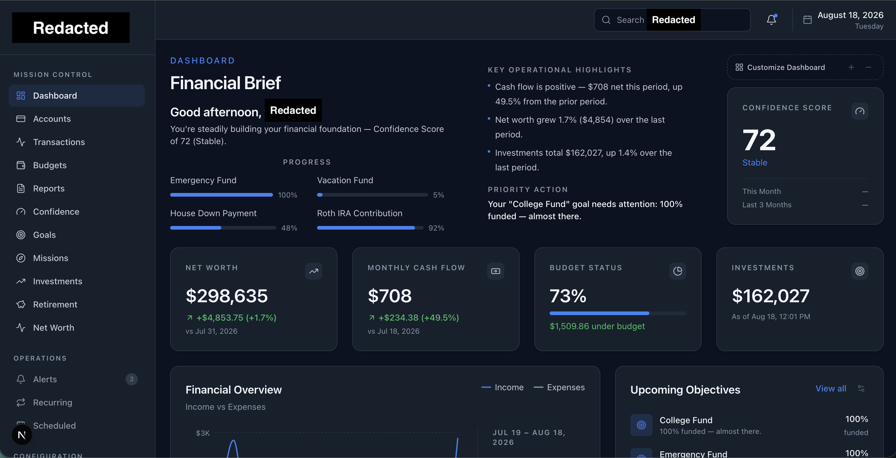
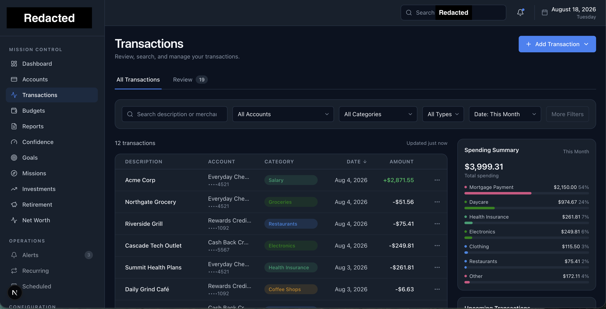
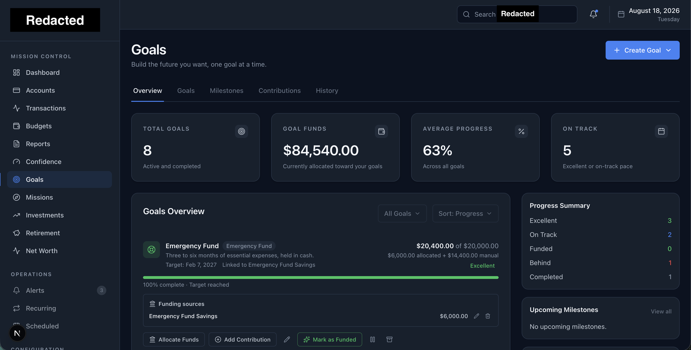
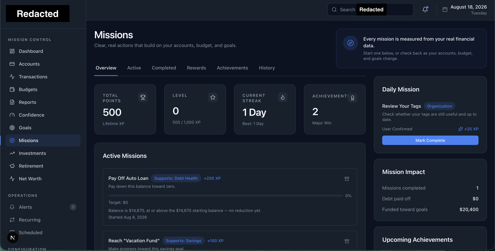
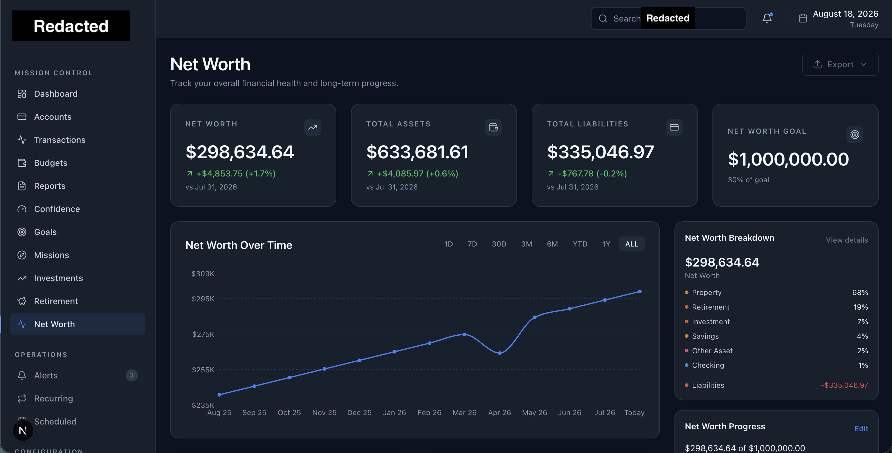

# Financial Operating System

> A security-first, full-stack financial platform designed to transform fragmented financial information into a clear, actionable view of a user's financial life.


## Overview

The Financial Operating System is an independently designed and developed full-stack application that brings financial accounts, transactions, budgets, goals, investments, reporting, and behavioral financial tools into a unified platform.

The project began with a simple question:

**What would personal finance look like if it were designed as an operating system rather than a collection of disconnected tools?**

Instead of focusing exclusively on balances and spending, the platform is designed around financial awareness, measurable progress, habit formation, and actionable decision-making.

This repository is a **sanitized engineering portfolio and project case study**. The production application, detailed security architecture, operational documentation, and security-sensitive implementation remain private.

---

## Project Scope

The platform currently includes or is actively developing:

- Unified financial dashboard
- Account and balance management
- Transaction management and categorization
- Budgeting
- Financial goals
- Net worth tracking
- Investment and retirement views
- Financial reporting and trend analysis
- Financial confidence scoring
- Mission-based financial habit system
- Progression and rewards
- Secure user authentication and account management
- Responsive web application architecture
- Automated testing and CI quality gates

The application is being built from architecture through implementation as an independent engineering project.

---

## Technology

### Application

- **Next.js**
- **React**
- **TypeScript**
- **PostgreSQL**
- **Supabase**
- Server-rendered and server-controlled application boundaries

### Engineering

- Git and GitHub
- Feature-branch development
- Pull-request-based workflow
- Architecture Decision Records
- Automated unit and integration testing
- Static type checking
- Linting
- Production build verification
- Continuous integration

### Testing

The application maintains a substantial automated test suite covering financial logic, authentication behavior, security boundaries, application services, and regression protection.

Current verified unit-test milestone:

**897 passing tests · 0 failures**

---

## Security Engineering

Security is treated as a system requirement rather than a feature added after implementation.

The application follows a defense-in-depth approach across authentication, authorization, data access, application boundaries, and testing.

Selected controls and engineering practices include:

- Server-controlled authentication boundaries
- Secure session handling
- Multi-factor authentication
- Authentication assurance-level enforcement
- Row Level Security
- User ownership enforcement
- Server-side authorization
- Input validation
- Security-focused HTTP headers
- Content Security Policy
- Safe error handling
- Abuse and automated-request protection
- Rate-limit-aware authentication behavior
- Protected database operations
- Environment and secret separation
- Regression testing for security boundaries
- Secure-by-default architecture decisions

Detailed threat models, security implementation details, infrastructure configuration, incident documentation, credentials, and operational procedures are intentionally excluded from this public repository.

For a public overview of the project's security engineering methodology, see [`SECURITY.md`](SECURITY.md).

---

## Architecture

The system was designed architecture-first rather than beginning directly with UI implementation.

The private engineering documentation includes dedicated architecture specifications covering areas such as:

- System architecture
- Application architecture
- Frontend architecture
- Backend architecture
- Database architecture
- Security architecture
- Deployment architecture
- Data flow architecture
- API architecture
- Domain modeling
- Authentication and authorization
- Error handling
- Engineering principles
- Architecture Decision Records

A sanitized high-level architecture overview is available in [`docs/architecture-overview.md`](docs/architecture-overview.md).

---

## Financial Domain Engineering

Financial applications require more than displaying database values.

The project includes domain-specific engineering for concepts such as:

- Assets and liabilities
- Net worth
- Income and expenses
- Cash flow
- Savings behavior
- Budget utilization
- Goal progress
- Financial trends
- Investment and retirement balances
- Financial progress indicators

Financial calculations are designed to be deterministic, testable, and explainable.

---

## Behavioral Finance

A major design objective is to make financial progress more understandable and motivating.

The platform experiments with behavioral mechanisms including:

### Financial Confidence

A structured indicator intended to help users understand their overall financial position and the factors contributing to it.

### Missions

Action-oriented financial objectives designed to turn larger financial goals into achievable behaviors.

### Progression & Rewards

Progress mechanics that recognize consistent financial behaviors and completed objectives rather than simply rewarding wealth or account balances.

The broader goal is to shift personal finance from passive monitoring toward active financial progress.

---

## Engineering Process

Development follows a structured software-engineering workflow:

**Architecture → Branch → Implementation → Testing → Review → Pull Request → Verification → Merge**

Changes are developed in scoped branches and merged through pull requests after verification.

Quality gates include combinations of:

```text
TypeScript compilation
Linting
Automated tests
Security regression tests
Production build verification
Manual browser verification
```

The project has progressed through more than **100 pull requests**, covering architecture, infrastructure, security, financial-domain logic, application features, testing, and UI development.

---

## Product Showcase

The following screenshots demonstrate selected interfaces from the working application. They are included to showcase the project's frontend implementation, financial-domain modeling, data visualization, and mission-based financial engagement system.

> **Portfolio Note:** All financial information shown below—including account names, institutions, balances, transactions, account identifiers, goals, and financial history—is synthetic demo data created for development and testing. No real customer or personal financial data is displayed.

### Financial Dashboard

A centralized financial command center combining net worth, cash flow, budget performance, investments, goals, account activity, and operational financial insights.



### Transaction Management

Transaction review and categorization with account, category, type, and date filtering alongside contextual spending analysis.



### Goal Management

Goal tracking with linked funding sources, fund allocation, progress measurement, milestones, and contribution management.



### Mission System

A mission-based engagement system that converts financial behaviors and measurable progress into actionable objectives, XP, streaks, achievements, and rewards.



### Net Worth Analytics

Asset and liability modeling with historical net-worth tracking, category breakdowns, change analysis, and long-term goal progression.



---

## Security & Privacy Boundary

This repository intentionally does **not** contain:

- Production source code
- Credentials or API secrets
- Environment configuration
- Database identifiers
- User information
- Production infrastructure details
- Detailed threat models
- Security incident reports
- Internal operational procedures
- Private product strategy or roadmap

The complete application is maintained separately in a private repository.

This public repository exists to document selected engineering work, architectural decisions, security practices, and project progress without exposing security-sensitive implementation details.

---

## Project Status

**Active Development**

Current development is focused on strengthening the platform for controlled testing while continuing application refinement, security validation, and automated test coverage.

This project is not currently distributed as a public financial service.

---

## About This Project

This project was independently conceived, architected, designed, and developed as both a serious software product and a hands-on engineering challenge.

It demonstrates practical work across:

- Full-stack software engineering
- Cybersecurity
- Secure application architecture
- Authentication and authorization
- PostgreSQL database design
- Financial-domain modeling
- Automated testing
- CI/CD practices
- Product architecture
- Technical documentation
- UI/UX implementation

The project is particularly focused on the intersection of **software engineering, cybersecurity, and financial technology**.

---

## Repository Notice

This repository is provided as a portfolio and technical case study.

The underlying application is not currently published as open-source software. No license to copy, modify, distribute, or commercially use the private application or its proprietary implementation is granted by this repository.
