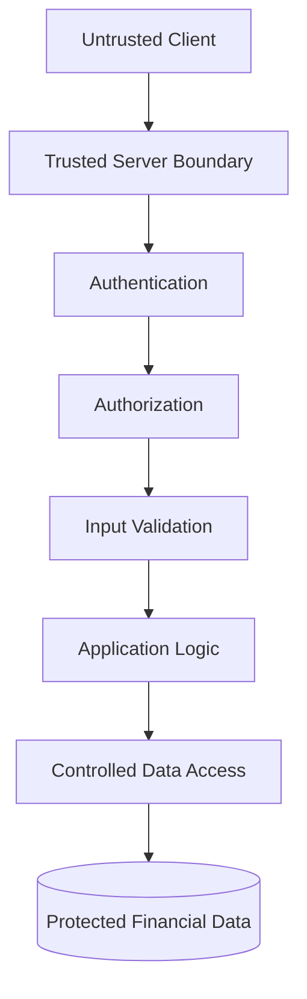
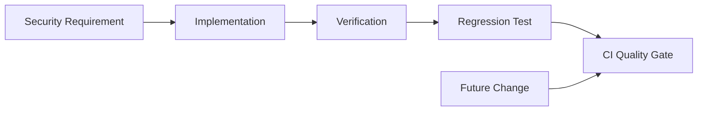

# Security Policy

## Security Philosophy

The Financial Operating System is a security-first financial application.

Financial platforms process data that is inherently sensitive. Security therefore cannot be treated as a feature added after application development; it must influence architecture, authentication, authorization, data modeling, testing, deployment decisions, and the software development lifecycle itself.

The project follows a defense-in-depth philosophy built around several principles:

- Never trust the client as an authoritative security boundary
- Authenticate identity before granting access to protected resources
- Authorize every sensitive operation independently
- Enforce explicit ownership of user-controlled financial data
- Apply least privilege wherever practical
- Validate data at trust boundaries
- Prefer secure defaults and fail-safe behavior
- Protect security invariants with automated regression testing
- Separate public engineering documentation from operational security information
- Treat security controls as continuously verifiable system requirements

Security decisions are documented and tested as part of the engineering process rather than maintained solely as informal implementation knowledge.

---

## Security Engineering Approach

The underlying application uses multiple independent security layers.

At a high level:



No individual layer is assumed to provide complete protection.

Instead, controls are intentionally distributed across application and data boundaries so that failure or bypass of one control does not automatically result in unauthorized access to financial information.

---

## Threat-Informed Design

Security architecture is informed by the types of threats expected in a multi-user financial application.

Relevant threat categories include:

- Account takeover
- Broken authentication
- Broken access control
- Cross-user data access
- Identifier manipulation
- Injection attacks
- Cross-site scripting
- Cross-site request forgery
- Automated authentication abuse
- Session misuse
- Malicious or malformed input
- Unauthorized state changes
- Sensitive-data exposure
- Misconfiguration
- Dependency vulnerabilities
- Accidental destructive operations
- Security regressions introduced during development

Detailed threat models, attack scenarios, abuse cases, control mappings, and mitigation implementations are maintained privately.

The public repository intentionally documents **security methodology without publishing an operational attack map of the application**.

---

## Authentication

Authentication establishes the identity associated with a protected request.

The application architecture incorporates controls including:

- Server-validated authentication state
- Secure session handling
- Multi-factor authentication support
- Authentication assurance requirements for protected application surfaces
- Password-policy enforcement
- Automated-request and abuse protections
- Rate-limit-aware authentication behavior
- Secure account recovery flows

Authentication state originating solely from client-controlled application state is not considered sufficient authorization for protected operations.

---

## Authorization

Authentication and authorization are deliberately treated as separate security concerns.

A valid authenticated session establishes **who** is making a request.

Authorization establishes **what that identity is permitted to do**.

Protected application operations are designed around:

- Server-side authorization
- Explicit resource ownership
- User-scoped data access
- Database-level access controls
- Protected mutation boundaries
- Deny-by-default reasoning where appropriate

UI visibility is never treated as an authorization mechanism.

Removing a button from a page does not constitute access control.

---

## Data Isolation

One of the application's core security invariants is:

> An authenticated user must not be able to access or modify another user's financial information through normal interfaces, manipulated requests, or user-controlled identifiers.

Data isolation is reinforced through multiple layers rather than relying on a single application check.

These include combinations of:

- Explicit ownership relationships
- Server-side authorization
- Scoped data access
- Relational constraints
- Database-level access controls
- Automated ownership and isolation tests

This provides defense in depth against broken object-level authorization and cross-user data exposure.

---

## Trust Boundaries

Client environments are considered untrusted.

Information supplied by a browser may be modified independently of the intended user interface.

As a result, sensitive decisions are moved toward trusted application and database boundaries.

```text
Untrusted Client
       │
       │ User-controlled input
       ▼
Trusted Server Boundary
       │
       │ Authentication
       │ Authorization
       │ Validation
       ▼
Application / Domain Logic
       │
       │ Controlled operations
       ▼
Data Security Boundary
       │
       ▼
Financial Data
```

Every transition across a trust boundary represents an opportunity to validate assumptions rather than inherit trust from the preceding layer.

---

## Input Validation

Input validation is treated as a security and data-integrity requirement.

Validation is applied at appropriate trusted boundaries to help prevent:

- Malformed input
- Unexpected application state
- Invalid financial values
- Unsafe identifiers
- Unauthorized field manipulation
- Injection-style attacks
- Corruption of domain assumptions

Client-side validation may improve user experience, but trusted validation occurs independently of client behavior.

---

## Financial Integrity

Security in a financial system includes more than confidentiality.

Incorrect financial calculations can be harmful even when no unauthorized access occurs.

The project therefore treats financial integrity as part of the application's security posture.

Financial-domain logic is designed to favor:

- Deterministic calculations
- Explicit business rules
- Traceable inputs
- Repeatable outputs
- Independent unit testing
- Regression protection
- Clear separation between financial logic and presentation

This helps protect against both malicious manipulation and accidental calculation regressions.

---

## Secure Error Handling

Errors crossing user-facing boundaries are designed to avoid unnecessary disclosure of internal system information.

Security-sensitive implementation details should not be exposed through application error messages.

The architecture distinguishes between:

- Internal diagnostic information
- Application/domain failures
- User-safe responses

This reduces the risk of errors becoming an unintended source of infrastructure or security information.

---

## Browser & Application Security

The application incorporates browser and application-layer security controls as part of its defense-in-depth strategy.

Areas addressed include:

- Content Security Policy
- Security-focused HTTP response headers
- Secure authentication boundaries
- Controlled server-side mutations
- Input handling
- Session protection
- Cross-origin and request-boundary considerations
- Safe rendering practices

Specific production configuration values are intentionally not published.

---

## Secrets & Environment Separation

Credentials and secrets are not intended to be stored in source control.

The project separates application source from environment-specific configuration and sensitive credentials.

Examples of information intentionally excluded from this public repository include:

- Database credentials
- API secrets
- Authentication secrets
- Provider credentials
- Private keys
- Production environment values
- Infrastructure identifiers
- Internal user identifiers

Example configuration, when appropriate, uses non-functional placeholder values rather than operational credentials.

---

## Security Testing

Security controls are protected through automated testing wherever practical.

Security-focused regression coverage includes categories such as:

- Authentication behavior
- Authorization enforcement
- Data ownership
- Cross-user isolation
- Input validation
- Protected application boundaries
- Security-sensitive error handling
- Authentication assurance behavior
- Abuse-protection behavior
- Architectural boundary enforcement

The broader application currently maintains:

**897 passing unit tests with 0 failures**

Security testing is treated as part of normal application development rather than a separate activity performed only before release.

---

## Security Regression Philosophy

A security fix that exists only as developer knowledge can disappear during future refactoring.

For that reason, security-sensitive behavior is converted into automated regression protection wherever practical.

The intended lifecycle is:



This approach helps turn security assumptions into continuously tested engineering requirements.

---

## Secure Development Lifecycle

Security considerations are incorporated throughout development.

The project follows a workflow broadly modeled as:

```text
Architecture
    ↓
Threat Consideration
    ↓
Scoped Implementation
    ↓
Static Analysis
    ↓
Automated Testing
    ↓
Security Regression Testing
    ↓
Production Build Verification
    ↓
Manual Verification
    ↓
Pull Request
    ↓
Merge
```

Development uses scoped branches and pull requests to preserve reviewability and traceability.

Security-related changes are expected to include appropriate verification rather than relying solely on successful compilation.

---

## Security Documentation

The private engineering documentation includes dedicated material covering areas such as:

- Security architecture
- Authentication architecture
- Authorization strategy
- Data ownership
- Trust boundaries
- Threat modeling
- Security testing
- Incident analysis
- Operational safeguards
- Architecture Decision Records
- Environment separation
- Deployment security considerations

This documentation exists to support engineering rigor while remaining separate from the sanitized public portfolio.

---

## Public Disclosure Boundary

Transparency is valuable, but publishing every security implementation detail is not a security requirement.

This public repository intentionally demonstrates:

- Security principles
- Architectural reasoning
- Defense-in-depth methodology
- Secure development practices
- Testing philosophy
- Trust-boundary awareness

It intentionally does **not** disclose:

- Credentials or secrets
- Internal infrastructure identifiers
- Detailed access-control policies
- Production topology
- Exact security-provider configuration
- Internal endpoints
- Detailed threat models
- Exploit scenarios
- Security incident reports
- Operational runbooks
- Recovery procedures
- Key-rotation procedures
- Administrative procedures
- Internal monitoring configuration

Those materials remain private because they are unnecessary for evaluating the project's engineering methodology and could provide inappropriate operational detail.

---

## Supported Versions

This repository is a sanitized engineering portfolio for an application under active development.

It does not contain a publicly distributed production version of the application.

As a result, traditional version-based security support is not currently applicable.

| Version                   | Supported              |
| ------------------------- | ---------------------- |
| Public production release | Not currently released |
| Development application   | Private                |

This section will be revised if the application is publicly distributed in the future.

---

## Reporting a Security Concern

If you identify a potential security issue related to material published in this repository, please **do not create a public GitHub issue containing vulnerability details**.

Security concerns should be reported privately through GitHub's private vulnerability reporting mechanism if enabled for this repository.

Reports should include, where possible:

- A clear description of the issue
- The affected public material
- Steps required to reproduce the issue
- Potential security impact
- Any relevant supporting information

Please avoid including sensitive personal information or unrelated data in reports.

---

## Scope of This Repository

This repository contains selected, sanitized documentation intended to demonstrate the engineering work behind the Financial Operating System.

It is **not the production source repository**.

The underlying application, detailed security architecture, operational documentation, security-sensitive configuration, and production implementation are maintained privately.

This separation is itself part of the project's security strategy:

> Public documentation should demonstrate engineering capability without unnecessarily increasing operational attack surface.

---

## Security Objectives

The project's security engineering ultimately works toward five objectives:

1. **Confidentiality** — financial information should only be accessible to authorized users.
2. **Integrity** — financial information and calculations should remain accurate and protected from unauthorized modification.
3. **Availability** — security controls should support reliable access without creating unnecessary fragility.
4. **Isolation** — one user's authenticated access must not imply access to another user's resources.
5. **Accountability** — security-relevant behavior should be designed for traceability, testing, and verification.

These objectives guide architecture and implementation decisions throughout the project.

---

## Final Principle

The project's security philosophy can be summarized simply:

**Do not rely on trust where verification is possible.**

Security is treated as an architectural property of the Financial Operating System—not a layer applied after the application is built.
