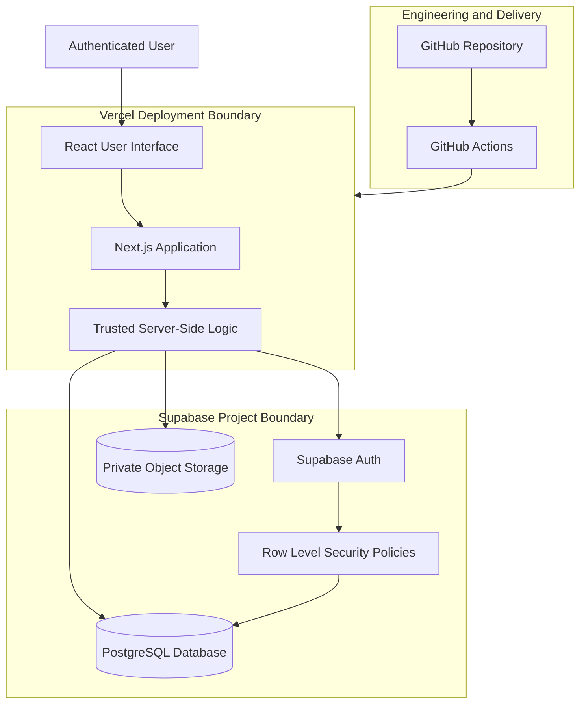

# ADR-0002 — Select the Initial Technology Stack

**Project:** Financial Operating System

**Internal Codename:** Athena

**Document Version:** 1.1.0

**Status:** Accepted

**Owner:** Caitlin Gillum

**Primary Architect:** Caitlin Gillum

**Technical Advisor:** OpenAI ChatGPT

**Last Updated:** July 26, 2026

---

## Table of Contents

- [Purpose](#purpose)
- [Status](#status)
- [Context](#context)
- [Decision Drivers](#decision-drivers)
- [Decision](#decision)
- [Selected Technologies](#selected-technologies)
  - [Application Framework](#application-framework)
  - [Programming Language](#programming-language)
  - [Database](#database)
  - [Authentication](#authentication)
  - [Object Storage](#object-storage)
  - [Hosting and Deployment](#hosting-and-deployment)
  - [Version Control and Continuous Integration](#version-control-and-continuous-integration)
- [Architecture Overview](#architecture-overview)
- [Security Requirements](#security-requirements)
- [Alternatives Considered](#alternatives-considered)
  - [React with a Separate Backend API](#react-with-a-separate-backend-api)
  - [Firebase](#firebase)
  - [MongoDB-Based Architecture](#mongodb-based-architecture)
  - [Django and PostgreSQL](#django-and-postgresql)
  - [Self-Hosted Infrastructure](#self-hosted-infrastructure)
  - [Google Sheets and Apps Script](#google-sheets-and-apps-script)
- [Consequences](#consequences)
- [Deferred Decisions](#deferred-decisions)
- [Requirement Traceability](#requirement-traceability)
- [Related Documents](#related-documents)
- [Revision History](#revision-history)

---

## Purpose

This Architecture Decision Record selects the initial technology stack for Project Athena.

The decision establishes the primary application framework, programming language, database platform, authentication provider, object-storage provider, hosting platform, source-control platform, and continuous-integration foundation for Version 1.

The selected stack must support Athena's requirements for:

- Financial correctness
- Secure authentication and authorization
- Relational data integrity
- Row-level data isolation
- Private file storage
- Automated testing
- Continuous integration
- Security scanning
- Responsive web access
- Maintainable full-stack development
- Future extensibility

---

## Status

**Accepted**

---

## Context

Athena requires a production-minded technology stack suitable for a secure personal financial platform.

The platform will manage highly sensitive data, including:

- Financial transactions
- Income records
- Debt balances
- Asset balances
- Legal expenses
- Medical expenses
- Child support records
- Imported financial files
- Audit history

The architecture must provide strong relational integrity, secure identity management, controlled file storage, server-side business logic, automated deployment, and a responsive web experience.

The selected technologies should also support Athena's role as a long-term engineering project by providing meaningful experience in:

- Full-stack software development
- Type-safe application design
- Relational database engineering
- Secure authentication
- Authorization policy design
- Cloud deployment
- CI/CD
- Testing
- Security automation

The stack must remain achievable for a single primary engineer without sacrificing sound architectural practices.

---

## Decision Drivers

The following criteria guided the decision:

1. Security support appropriate for sensitive financial data
2. Strong relational database capabilities
3. Transactional consistency
4. Row-level authorization support
5. Type safety
6. Maintainable full-stack development
7. Responsive web delivery
8. Automated deployment
9. Local development support
10. Database migration support
11. Private object storage
12. Automated testing compatibility
13. CI/CD compatibility
14. Security-scanning compatibility
15. Broad industry relevance
16. Low initial operational overhead
17. Reasonable cost for private personal use
18. Ability to export and migrate data
19. Support for future application growth
20. Clear separation between client and trusted server responsibilities

---

## Decision

Athena Version 1 shall use the following initial technology stack:

| Architectural Area | Selected Technology |
|---|---|
| Application Framework | Next.js |
| Programming Language | TypeScript |
| User Interface | React through Next.js |
| Database | PostgreSQL |
| Managed Backend Platform | Supabase |
| Authentication | Supabase Auth |
| Authorization | PostgreSQL Row Level Security and server-side authorization |
| Object Storage | Supabase Storage |
| Hosting and Deployment | Vercel |
| Version Control | Git and GitHub |
| Continuous Integration | GitHub Actions |
| Database Development | Supabase CLI and versioned SQL migrations |

This decision establishes the initial platform direction.

Specific library versions, package-management choices, styling systems, testing frameworks, monitoring tools, database-access patterns, and artificial-intelligence providers remain deferred until separately evaluated.

---

## Selected Technologies

### Application Framework

Athena shall use **Next.js** as the primary application framework.

Next.js was selected because it supports:

- React-based user interfaces
- Server-side application logic
- Server-rendered and client-rendered experiences
- Route-based application organization
- Secure server-only execution paths
- API and server-action capabilities
- Responsive web delivery
- Deployment integration
- TypeScript development
- Progressive Web App expansion in future versions

Athena shall use Next.js as a full-stack web framework rather than exposing unrestricted database operations directly to the browser.

Trusted financial logic shall execute in server-controlled contexts.

---

### Programming Language

Athena shall use **TypeScript** for application development.

TypeScript was selected because it provides:

- Static type checking
- Improved refactoring safety
- Explicit interfaces
- Better editor support
- Reduced runtime errors
- Shared types between application layers
- Strong compatibility with Next.js and React
- Broad industry adoption

TypeScript types shall improve development safety but shall not replace runtime input validation.

All external, uploaded, or user-controlled data must still be validated at runtime.

---

### Database

Athena shall use **PostgreSQL** as its authoritative relational database.

PostgreSQL was selected because Athena's data model requires:

- Relational integrity
- Foreign-key constraints
- Transactional updates
- ACID behavior
- Complex reporting
- Aggregations
- Historical records
- Database constraints
- Indexing
- Row Level Security
- Versioned schema migrations
- Reliable export and backup capabilities

The database shall be the authoritative source for structured financial records after successful import.

Google Sheets, source CSV files, browser state, and generated reports shall not serve as the authoritative financial database.

---

### Authentication

Athena shall use **Supabase Auth** for Version 1 authentication.

Supabase Auth was selected because it integrates with:

- PostgreSQL
- Row Level Security
- User identity claims
- Session management
- Multi-factor authentication capabilities
- Server-side authorization workflows
- Local development tooling

Authentication shall confirm identity.

Authorization shall be enforced separately through server-side checks and database policies.

Possession of a valid session shall not automatically grant unrestricted access to all records or operations.

---

### Object Storage

Athena shall use **Supabase Storage** for private file storage where file retention is required.

Potential stored files may include:

- Imported CSV files
- Receipts
- Supporting financial documents
- Generated exports
- Legal invoices
- Medical invoices

Storage buckets containing sensitive information shall be private by default.

Access shall require authenticated and authorized requests.

Public object URLs shall not be used for protected financial documents.

---

### Hosting and Deployment

Athena shall use **Vercel** for initial application hosting and deployment.

Vercel was selected because it provides:

- Strong Next.js integration
- Preview deployments
- Environment separation
- Automated deployments from GitHub
- Server-side execution support
- Managed HTTPS
- Deployment history
- Low operational overhead

Production deployment shall remain separated from development and preview environments.

Sensitive production data and secrets shall not be copied into preview environments.

---

### Version Control and Continuous Integration

Athena shall use:

- Git for version control
- GitHub for repository hosting
- GitHub pull requests for review
- GitHub Actions for continuous integration

The initial CI foundation shall eventually include:

- Dependency installation
- Formatting checks
- Linting
- Type checking
- Unit tests
- Integration tests
- Build validation
- Secret scanning
- Static security analysis
- Dependency vulnerability checks

Changes shall be reviewed through pull requests before being merged into the default branch after repository initialization is complete.

---

## Architecture Overview

The browser shall interact with Athena through authenticated application interfaces.

Trusted financial processing shall occur in server-controlled application or database contexts.

The browser shall not receive privileged database credentials or unrestricted storage access.

---

## Security Requirements

The selected stack shall be implemented according to the following requirements:

- Supabase service-role credentials must remain server-only.
- Service-role credentials must never be exposed to browser code.
- Secrets must never be committed to Git.
- Production and development environments must use separate credentials.
- Row Level Security must be enabled on protected user-owned tables.
- Storage policies must enforce user ownership.
- Client-side validation must not replace server-side validation.
- Uploaded files must be treated as untrusted.
- Financial data must not be written to ordinary application logs.
- Error-reporting tools must redact sensitive data.
- Preview deployments must not connect to the production database by default.
- Database schema changes must use versioned migrations.
- Privileged operations must be auditable.
- Authentication and authorization controls must receive automated testing.
- Database policies must be tested against unauthorized access attempts.
- Public repository examples must use sanitized synthetic data only.
- Environment-variable files containing secrets must remain excluded from source control.

---

## Alternatives Considered

### React with a Separate Backend API

A standalone React frontend with a separately deployed backend service was considered.

Potential backend options included:

- Express
- Fastify
- NestJS
- Python-based APIs

**Advantages:**

- Strong separation between frontend and backend
- Independent scaling
- Explicit API boundaries
- Flexibility in backend language and hosting

**Reasons not selected for Version 1:**

- Increased deployment complexity
- Additional repository or service coordination
- More authentication integration work
- Higher operational overhead for a single-engineer project
- Next.js can provide sufficient server-side boundaries for the initial version

A separately deployed backend may be reconsidered if Athena's scale, integration requirements, or background processing needs justify it.

### Firebase

Firebase was considered because it provides authentication, hosting, storage, and managed application services.

**Advantages:**

- Rapid application development
- Strong client tooling
- Managed authentication
- Managed storage
- Low initial infrastructure burden

**Reasons not selected:**

- Athena's domain is highly relational
- Financial reporting requires joins and aggregations
- Relational constraints are important for data integrity
- PostgreSQL provides stronger alignment with Athena's authoritative data model
- Row-level relational policy enforcement is a better fit for the project

### MongoDB-Based Architecture

MongoDB and related managed platforms were considered.

**Advantages:**

- Flexible document model
- Rapid schema evolution
- Broad ecosystem
- Managed hosting options

**Reasons not selected:**

- Athena's data contains strong relationships
- Financial integrity benefits from relational constraints
- Transactions, categories, budgets, debts, assets, imports, and audits require consistent relationships
- Complex reporting is better aligned with PostgreSQL
- Flexible schemas could increase the risk of inconsistent financial records

### Django and PostgreSQL

Django with PostgreSQL was considered as a mature full-stack alternative.

**Advantages:**

- Strong security defaults
- Mature ORM
- Administrative tooling
- Excellent PostgreSQL compatibility
- Clear backend architecture
- Python ecosystem

**Reasons not selected for the initial version:**

- Athena's planned user interface is strongly aligned with React
- A separate frontend would likely still be required
- Next.js and TypeScript provide a unified language across the application
- The selected stack better supports the project's current full-stack learning objectives

Django remains a credible alternative and was not rejected for lack of technical quality.

### Self-Hosted Infrastructure

Self-hosting the database, authentication, storage, and application infrastructure was considered.

**Advantages:**

- Maximum infrastructure control
- Reduced platform dependency
- Greater customization
- Valuable infrastructure experience

**Reasons not selected for Version 1:**

- Increased security responsibility
- Increased backup and recovery burden
- Increased patching and maintenance work
- Higher risk of configuration errors
- Greater operational overhead
- Managed services allow the project to focus first on application correctness and secure design

Self-hosting may be evaluated later as a separate infrastructure-learning exercise.

### Google Sheets and Apps Script

Google Sheets and Apps Script were considered as the permanent platform because the original prototype was created in Google Sheets.

**Advantages:**

- Rapid prototyping
- Familiar interface
- Easy manual inspection
- Built-in charts
- Low initial development effort

**Reasons not selected as the final platform:**

- Weak fit for normalized relational data
- Limited access-control flexibility
- Difficult long-term schema management
- Brittle automation at scale
- Limited testing and deployment workflows
- Increased risk of formula and manual-edit errors
- Poor separation between presentation, logic, and data
- Limited auditability
- Insufficient foundation for the intended security architecture

Google Sheets remains an approved prototype, migration source, and optional export format.

---

## Consequences

### Positive Consequences

- Provides a modern full-stack TypeScript development environment.
- Uses PostgreSQL for relational integrity and financial reporting.
- Supports authentication, storage, and Row Level Security through one managed platform.
- Reduces initial infrastructure-management burden.
- Supports responsive web access.
- Supports preview deployments and pull-request workflows.
- Provides strong portfolio value across software, cloud, database, and security engineering.
- Preserves the ability to export PostgreSQL data.
- Supports future migration away from individual managed providers if necessary.
- Supports a modular, server-first dashboard architecture that can evolve from a curated default layout to user-configurable widget-based dashboards without significant architectural redesign.

### Negative Consequences

- Athena will depend initially on Supabase and Vercel.
- Incorrect Row Level Security configuration could expose sensitive data.
- Next.js server and client boundaries require disciplined implementation.
- Managed-service behavior and pricing may change over time.
- Full-stack framework conventions may create coupling to Next.js.
- Preview-deployment configuration requires careful isolation.
- TypeScript cannot prevent invalid runtime data without additional validation.

### Mitigations

- Use versioned SQL migrations.
- Maintain database exports and documented recovery procedures.
- Test Row Level Security policies.
- Keep financial business logic modular.
- Avoid provider-specific logic in core domain calculations where practical.
- Use runtime schema validation.
- Keep privileged credentials server-only.
- Document migration paths.
- Record future platform changes through ADRs.

---

## Deferred Decisions

The following decisions remain open:

- Package manager
- Styling framework
- Component library
- Form-management library
- Runtime validation library
- Charting library
- Testing framework
- End-to-end testing framework
- Database-access pattern
- ORM selection
- Background-job platform
- Monitoring provider
- Error-reporting provider
- Email provider
- Notification architecture
- Caching strategy
- Rate-limiting implementation
- Data-retention period
- Backup frequency
- Production region
- Domain name
- Progressive Web App implementation
- Artificial-intelligence provider
- Direct bank-integration provider

These decisions shall be documented separately when they become necessary.

---

## Requirement Traceability

| Decision Area | Related Requirements |
|---|---|
| Next.js application | FR-014, NFR-008, NFR-015, NFR-016 |
| TypeScript | NFR-010, NFR-011, NFR-012 |
| PostgreSQL | FR-001 through FR-030, NFR-005, NFR-007, NFR-013 |
| Supabase Auth | FR-025, FR-026, NFR-001 through NFR-004 |
| Row Level Security | FR-026, NFR-001, NFR-002 |
| Supabase Storage | FR-030, NFR-001, NFR-017 |
| Vercel | NFR-008, NFR-013, NFR-016, NFR-019 |
| GitHub Actions | NFR-010 through NFR-012, NFR-019, NFR-020 |
| Versioned migrations | NFR-005, NFR-007, NFR-010, NFR-011 |
| Runtime validation | FR-002, NFR-005, NFR-006 |
| Managed deployment | NFR-007 through NFR-009, NFR-013 |

---

## Related Documents

- docs/product-requirements.md
- docs/architecture/README.md
- docs/architecture/engineering-principles.md
- docs/architecture/system-architecture.md
- docs/adr/README.md
- docs/adr/0001-athena-codename.md

---

## Revision History

| Version | Date | Author | Summary |
|---|---|---|---|
| 1.0.0 | 2026-07-26 | Caitlin Gillum | Selected Next.js, TypeScript, PostgreSQL, Supabase, Vercel, GitHub, and GitHub Actions as Athena's initial technology stack. |
| 1.1.0 | 2026-07-26 | Caitlin Gillum | Expanded the rationale for the selected technology stack to document support for Athena's modular dashboard architecture. |