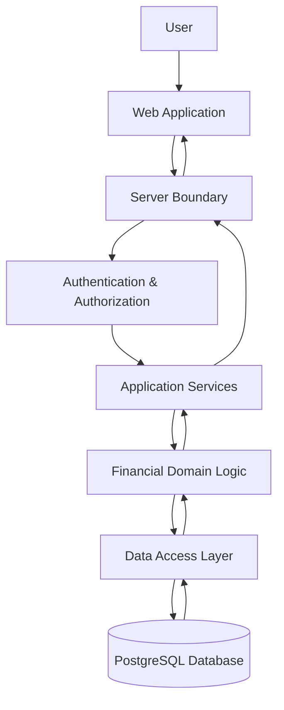
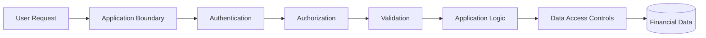
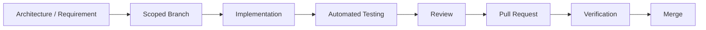

# Architecture Overview

## Purpose

The Financial Operating System is designed as a security-first, full-stack financial platform that consolidates financial information and transforms it into structured, actionable insights.

The system was developed using an **architecture-first approach**. Application boundaries, domain responsibilities, data ownership, security requirements, and engineering standards were defined before and alongside feature implementation.

This document provides a sanitized, high-level overview of the architecture used by the project.

Detailed implementation specifications, security configurations, infrastructure identifiers, threat models, operational procedures, and production architecture are intentionally maintained outside this public repository.

---

## Architectural Principles

The system is guided by several core engineering principles:

- **Security by design**
- **Server-controlled trust boundaries**
- **Least privilege**
- **Explicit authorization**
- **Strong data ownership**
- **Defense in depth**
- **Deterministic financial calculations**
- **Separation of concerns**
- **Type safety**
- **Testability**
- **Explainability**
- **Fail-safe behavior**

Financial data is treated as sensitive throughout the application lifecycle.

---

## High-Level Architecture



At a high level, the architecture separates:

1. User interaction
2. Server-controlled application boundaries
3. Authentication and authorization
4. Application services
5. Financial-domain logic
6. Data access
7. Persistent storage

This separation helps prevent UI behavior from becoming an implicit security or financial-integrity boundary.

---

## Application Architecture

The application uses a modern React and Next.js architecture with TypeScript used throughout the project.

Responsibilities are separated between:

### Presentation Layer

Responsible for:

- Rendering application interfaces
- Displaying financial information
- Collecting user input
- Providing responsive interaction
- Communicating user intent to trusted server boundaries

The client interface is not treated as an authoritative source for security-sensitive decisions.

### Server Layer

Responsible for trusted operations including:

- Authentication validation
- Authorization enforcement
- Input validation
- Application orchestration
- Protected data access
- Security-sensitive operations

Sensitive operations are designed to pass through server-controlled boundaries.

### Domain Layer

Responsible for financial concepts and business rules.

Examples include:

- Net worth
- Cash flow
- Budget utilization
- Goal progress
- Savings behavior
- Financial trends
- Progress indicators

Domain calculations are designed to be deterministic and independently testable.

### Data Layer

Responsible for controlled interaction with persistent financial data.

The data model emphasizes:

- Explicit ownership
- Referential integrity
- Strong relational modeling
- Database-level constraints
- Controlled access paths

---

## Security Architecture

Security is implemented across multiple layers rather than relying on any single control.



Selected security principles include:

- Authentication before access to protected resources
- Explicit authorization for protected operations
- Server-side enforcement of trusted decisions
- User-level data ownership
- Database-level access controls
- Multi-factor authentication support
- Secure session handling
- Input validation
- Safe error handling
- Security-focused HTTP response controls
- Automated regression testing around security boundaries
- Separation of secrets and application source

Security controls are intentionally redundant where appropriate so that failure of a single layer does not automatically expose financial data.

Detailed security architecture and threat modeling remain private.

---

## Authentication & Authorization

Authentication and authorization are treated as separate concerns.

**Authentication** establishes the identity associated with a request.

**Authorization** determines whether that identity may perform a specific operation or access specific data.

The architecture does not rely solely on:

- Hidden UI elements
- Client-side state
- Route visibility
- User-supplied identifiers

Protected operations require trusted server-side verification.

Additional database-level protections provide another enforcement layer for user-owned financial data.

---

## Data Ownership

Financial records are designed around explicit ownership.

A fundamental security invariant is:

> A user must not be able to access or modify another user's financial information through normal application interfaces or manipulated requests.

Ownership enforcement occurs across multiple architectural layers.

This principle influences:

- Database design
- Authorization
- Queries
- Mutations
- Testing
- Error handling

---

## Financial Domain Architecture

Financial calculations are separated from presentation logic wherever practical.

This provides several advantages:

- Calculations can be independently tested
- UI changes do not redefine financial meaning
- Business rules remain consistent across application surfaces
- Financial results can be traced to deterministic inputs
- Regression testing can protect financial integrity

Representative domain concepts include:

```text
Assets
Liabilities
Net Worth
Income
Expenses
Cash Flow
Savings
Budgets
Goals
Investments
Retirement
Financial Trends
Progress Indicators
```

The system favors deterministic calculations over opaque or non-repeatable financial outputs.

---

## Database Architecture

PostgreSQL provides the relational persistence layer.

The database architecture emphasizes:

- Relational integrity
- Explicit ownership
- Foreign-key relationships
- Database constraints
- Controlled schema evolution
- Access restrictions
- Consistent financial data structures

Application-level validation is not considered a substitute for appropriate database integrity controls.

---

## Trust Boundaries

Trust boundaries are explicitly considered during application design.

The architecture assumes that information originating from a client environment may be manipulated.

Therefore, security-sensitive decisions are moved toward trusted server and database boundaries.

Conceptually:

```text
Browser
   │
   │ Untrusted input
   ▼
Server Boundary
   │
   │ Authenticated + validated operations
   ▼
Application / Domain Logic
   │
   │ Controlled data operations
   ▼
Database Security Boundary
```

Each transition represents an opportunity to validate assumptions rather than implicitly trust upstream state.

---

## Testing Architecture

Automated testing is a major engineering component of the project.

Testing covers areas including:

- Financial-domain calculations
- Application services
- Authentication behavior
- Authorization boundaries
- Input validation
- Data ownership
- Security regressions
- UI behavior
- Error handling
- Application regressions

Current verified milestone:

**897 passing unit tests with 0 failures**

Tests are used not only to validate expected functionality but also to protect architectural and security invariants from regression.

---

## Engineering Quality Gates

Changes are verified through combinations of:

```text
TypeScript compilation
Linting
Unit testing
Integration testing
Security regression testing
Production build verification
Manual browser verification
```

Development follows a scoped branch and pull-request workflow.



This workflow creates traceability between requirements, implementation, testing, and repository history.

---

## Architecture Documentation

The private engineering repository maintains a broader architecture suite covering areas such as:

- System Architecture
- Application Architecture
- Frontend Architecture
- Backend Architecture
- Database Architecture
- Security Architecture
- Deployment Architecture
- Data Flow Architecture
- API Architecture
- Domain Model
- Error Handling
- Engineering Principles
- Architecture Decision Records

These documents provide implementation-level guidance for development but are intentionally not replicated in the public portfolio repository.

---

## Public / Private Boundary

This document intentionally describes architecture at the **system-design level** rather than the operational level.

The public repository does not disclose:

- Credentials
- Environment values
- Infrastructure identifiers
- Database identifiers
- Detailed access-control policies
- Internal endpoints
- Production topology
- Detailed threat models
- Attack scenarios
- Security incident documentation
- Operational runbooks
- Key-management procedures
- Internal security configuration
- Private product strategy

This separation allows the project to demonstrate architecture and security-engineering practices without unnecessarily exposing implementation details that could weaken the security posture of the underlying application.

---

## Summary

The Financial Operating System is designed around three fundamental requirements:

**Financial integrity. Security. Explainability.**

The architecture separates presentation, trusted application boundaries, domain logic, data access, and persistent storage while applying security controls across multiple layers.

The result is a system intended not merely to display financial information, but to handle that information through deliberate engineering boundaries appropriate for a security-sensitive financial application.
