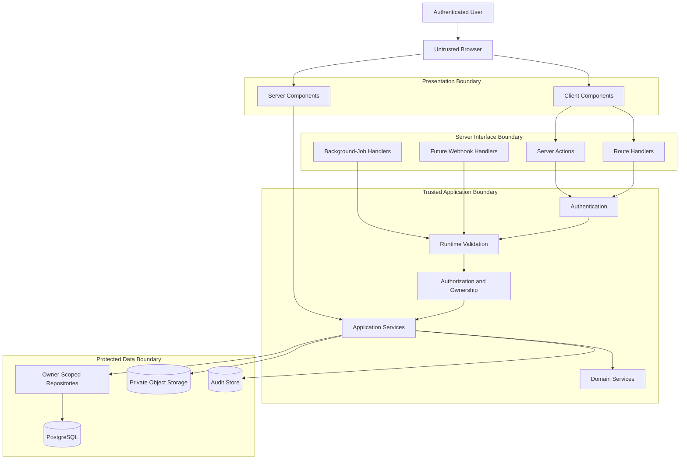
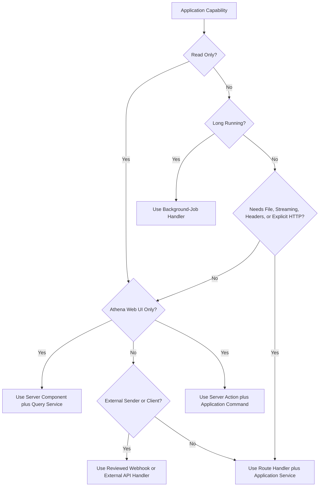
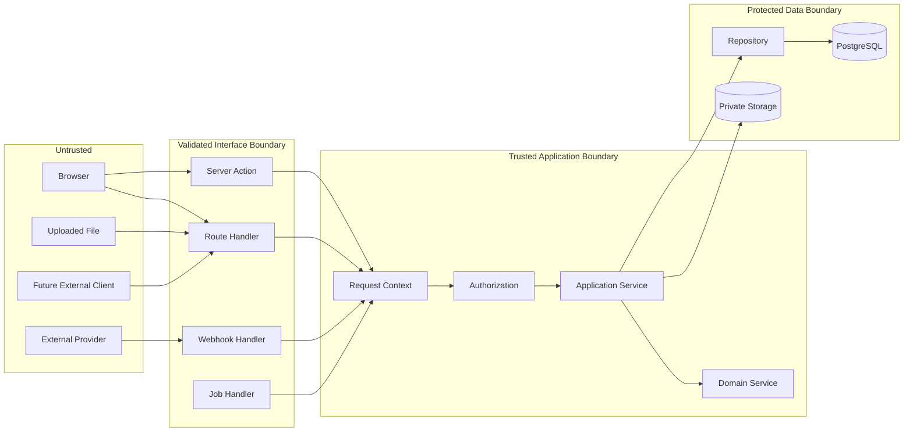
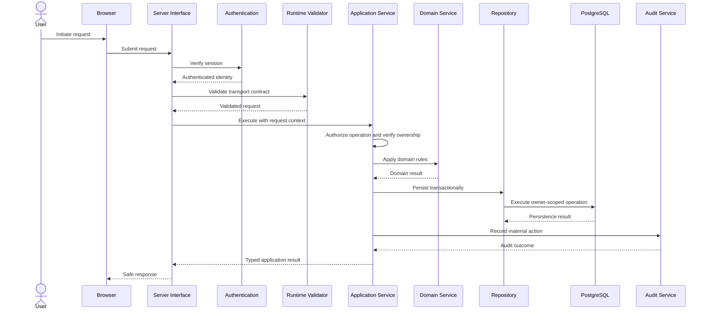
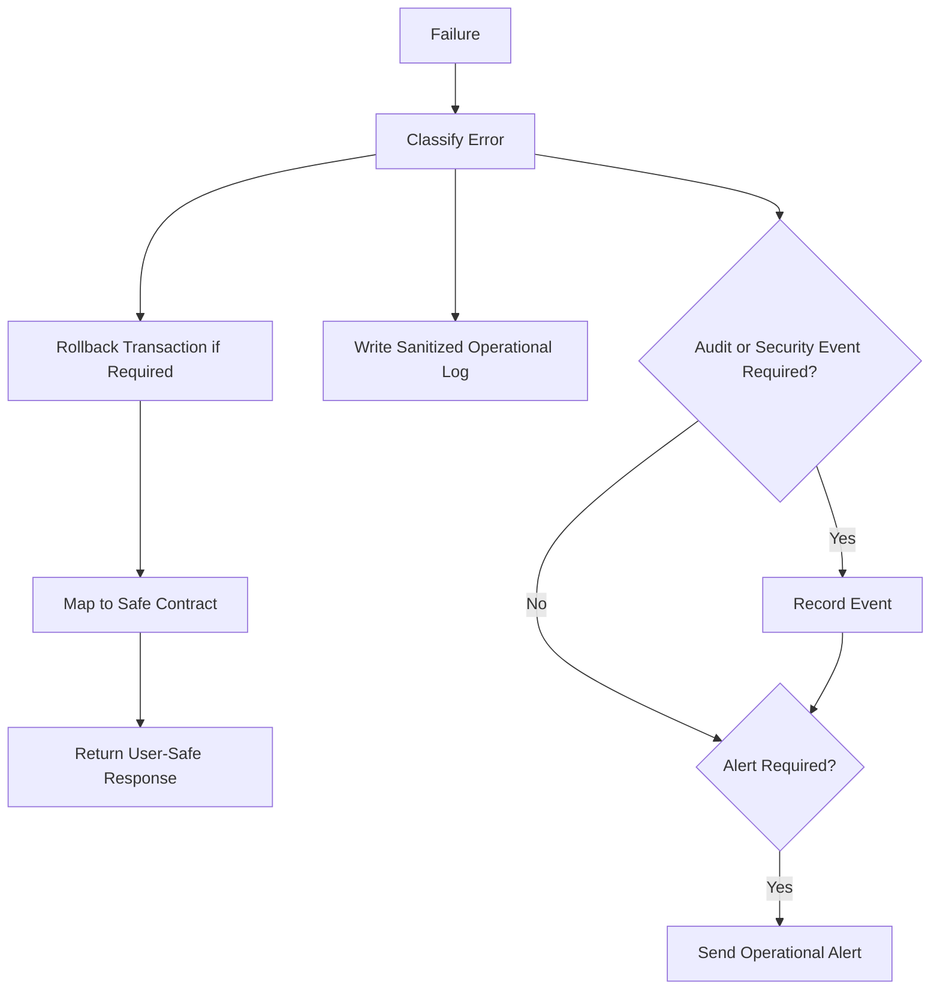
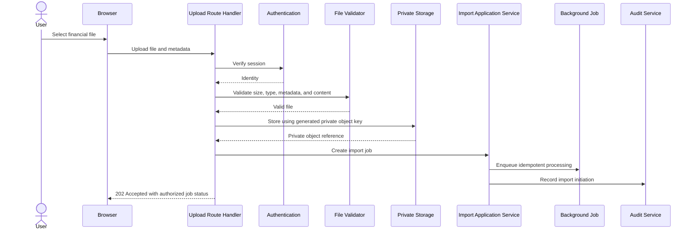
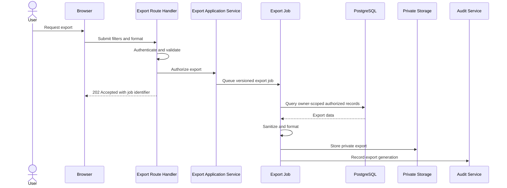
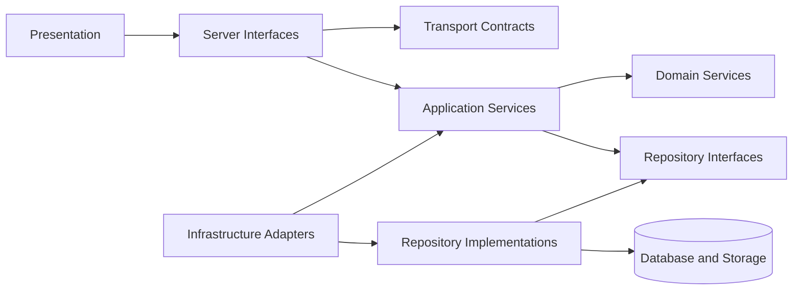

# API Architecture

**Project:** Financial Operating System

**Internal Codename:** Athena

**Document Version:** 1.0.0

**Status:** Draft

**Owner:** Caitlin Gillum

**Primary Architect:** Caitlin Gillum

**Technical Advisor:** OpenAI ChatGPT

**Last Updated:** July 29, 2026

---

## Table of Contents

- [Purpose](#purpose)
- [Scope](#scope)
- [API Philosophy](#api-philosophy)
- [API Objectives](#api-objectives)
- [Core API Principles](#core-api-principles)
- [Architecture Overview](#architecture-overview)
- [API Boundary Definition](#api-boundary-definition)
- [Interface Types](#interface-types)
  - [Server Components](#server-components)
  - [Server Actions](#server-actions)
  - [Route Handlers](#route-handlers)
  - [Internal Service Interfaces](#internal-service-interfaces)
  - [Background-Job Handlers](#background-job-handlers)
  - [Future Webhook Handlers](#future-webhook-handlers)
  - [Future External APIs](#future-external-apis)
- [Interface Selection Strategy](#interface-selection-strategy)
- [Trust Boundaries](#trust-boundaries)
- [Common Request Lifecycle](#common-request-lifecycle)
- [Request Context](#request-context)
- [Authentication](#authentication)
- [Authorization](#authorization)
- [Ownership Enforcement](#ownership-enforcement)
- [Runtime Validation](#runtime-validation)
- [Request Contracts](#request-contracts)
- [Response Contracts](#response-contracts)
- [Contract Schema Standards](#contract-schema-standards)
- [Contract Naming Conventions](#contract-naming-conventions)
- [Resource and Operation Naming](#resource-and-operation-naming)
- [HTTP Method Semantics](#http-method-semantics)
- [Content Types](#content-types)
- [Identifiers](#identifiers)
- [Money Representation](#money-representation)
- [Date and Time Representation](#date-and-time-representation)
- [Enumerations and Status Values](#enumerations-and-status-values)
- [Nullability and Optionality](#nullability-and-optionality)
- [Collection Responses](#collection-responses)
- [Pagination](#pagination)
- [Filtering](#filtering)
- [Sorting](#sorting)
- [Search](#search)
- [Field Selection and Data Minimization](#field-selection-and-data-minimization)
- [Command Responses](#command-responses)
- [Asynchronous Operation Responses](#asynchronous-operation-responses)
- [HTTP Status Codes](#http-status-codes)
- [Error Architecture](#error-architecture)
- [Error Taxonomy](#error-taxonomy)
- [Error Response Contract](#error-response-contract)
- [Validation Error Responses](#validation-error-responses)
- [Authentication and Authorization Errors](#authentication-and-authorization-errors)
- [Not-Found Behavior](#not-found-behavior)
- [Conflict Errors](#conflict-errors)
- [Domain Errors](#domain-errors)
- [Infrastructure Errors](#infrastructure-errors)
- [Correlation Identifiers](#correlation-identifiers)
- [Idempotency](#idempotency)
- [Idempotency Keys](#idempotency-keys)
- [Retry Behavior](#retry-behavior)
- [Concurrency Control](#concurrency-control)
- [Request Timeouts](#request-timeouts)
- [Rate Limiting](#rate-limiting)
- [Request and Payload Limits](#request-and-payload-limits)
- [File Upload Interfaces](#file-upload-interfaces)
- [File Download and Export Interfaces](#file-download-and-export-interfaces)
- [Background Processing Interfaces](#background-processing-interfaces)
- [Job Status Contracts](#job-status-contracts)
- [Notifications and Event-Driven Interfaces](#notifications-and-event-driven-interfaces)
- [Caching](#caching)
- [API Versioning](#api-versioning)
- [Backward Compatibility](#backward-compatibility)
- [Deprecation](#deprecation)
- [Security Controls](#security-controls)
- [Cross-Site Request Forgery](#cross-site-request-forgery)
- [Cross-Origin Resource Sharing](#cross-origin-resource-sharing)
- [Output Encoding](#output-encoding)
- [Sensitive Data Handling](#sensitive-data-handling)
- [Audit Requirements](#audit-requirements)
- [Operational Logging](#operational-logging)
- [Metrics and Tracing](#metrics-and-tracing)
- [Performance Considerations](#performance-considerations)
- [API Documentation](#api-documentation)
- [Provisional Interface Catalog](#provisional-interface-catalog)
- [Sequence Diagram Catalog](#sequence-diagram-catalog)
- [Testing Strategy](#testing-strategy)
- [Provisional Repository Structure](#provisional-repository-structure)
- [Dependency Rules](#dependency-rules)
- [Requirement Traceability](#requirement-traceability)
- [Deferred Decisions](#deferred-decisions)
- [Related Documents](#related-documents)
- [Revision History](#revision-history)

---

## Purpose

This document defines the API Architecture for Project Athena.

It establishes how Athena exposes trusted application capabilities through server interfaces while preserving:

- Authentication
- Authorization
- Ownership
- Runtime validation
- Financial correctness
- Transactional integrity
- Idempotency
- Auditability
- Privacy
- Observability
- Backward compatibility
- Maintainability

In Athena, the term API includes more than publicly addressable HTTP endpoints.

It includes all formal server boundaries through which presentation components, background processes, approved integrations, or future external clients request application behavior.

These boundaries include:

- Server Components
- Server Actions
- Route Handlers
- Internal application-service interfaces
- Background-job handlers
- Future webhook handlers
- Future externally documented APIs

The API Architecture translates Athena's Backend Architecture and Data Flow Architecture into consistent interface rules.

It answers questions such as:

- Which server interface should handle a given workflow?
- When should a Server Action be used instead of a Route Handler?
- How are requests authenticated and authorized?
- How is ownership enforced?
- What must request and response contracts contain?
- How are validation failures represented?
- How are retries prevented from creating duplicate financial effects?
- How are collections paginated, filtered, and sorted?
- How are long-running imports and exports represented?
- How are interfaces versioned without unnecessary complexity?
- How are errors logged without exposing private financial information?
- Which API behaviors require audit events?
- How will future integrations remain compatible with Athena's domain model?

---

## Scope

This document covers:

- Server interface architecture
- Interface selection
- Server Components
- Server Actions
- Route Handlers
- Internal service interfaces
- Background-job handlers
- Future webhook and external API boundaries
- Authentication
- Authorization
- Ownership verification
- Runtime validation
- Request contracts
- Response contracts
- Error contracts
- Status codes
- Pagination
- Filtering
- Sorting
- Search
- Idempotency
- Retry behavior
- Concurrency
- Rate limiting
- File upload interfaces
- Export and download interfaces
- Asynchronous workflows
- Job-status contracts
- Versioning
- Compatibility
- Deprecation
- API security
- Auditability
- Observability
- Performance
- Testing
- Repository organization
- Requirement traceability

This document does not define:

- Final endpoint paths
- Final Server Action function names
- Final request-schema library
- Final response-schema library
- Final API documentation generator
- Final OpenAPI tooling
- Final public API offering
- Final third-party integration contracts
- Final webhook signatures
- Final rate-limit values
- Final request-size limits
- Final pagination limits
- Final timeout values
- Final API gateway provider
- Final background-job provider
- Final monitoring provider
- Final external developer-authentication model
- Final error-code catalog
- Final physical database schema

Those decisions will be completed during implementation, the API Contract Catalog, or separate Architecture Decision Records.

---

## API Philosophy

Athena's APIs shall expose business capabilities rather than unrestricted database operations.

An API request is not permission to manipulate records directly.

Every protected operation must pass through the appropriate:

- Interface boundary
- Authentication check
- Runtime validation
- Authorization check
- Ownership verification
- Application workflow
- Domain rules
- Transactional persistence
- Audit coordination
- Safe response mapping

Athena shall avoid generic interfaces that expose arbitrary table names, columns, filters, or mutations to the browser.

The API layer exists to protect the domain, not merely to transport JSON.

Interfaces shall express user and system intent through operations such as:

- Create a transaction
- Resolve a review item
- Start an import
- Generate an export
- Activate a budget
- Record a debt payment
- Update an asset valuation
- Create a net worth snapshot
- Save dashboard preferences

They shall not expose unrestricted commands such as:

- Update any table
- Execute arbitrary query
- Set arbitrary owner
- Patch any field
- Download any storage object
- Invoke privileged database logic

---

## API Objectives

Athena's API Architecture has the following objectives.

### Security

Every protected interface must verify identity, permission, ownership, request validity, and operation scope.

### Financial Correctness

Interfaces must preserve deterministic domain rules, fixed-precision monetary behavior, transactional consistency, and duplicate prevention.

### Consistency

Server Actions, Route Handlers, jobs, and future integrations should follow the same validation, authorization, error, audit, and observability conventions.

### Explainability

Material outcomes should remain traceable to:

- Request source
- Actor
- Operation
- Applied rule
- Resource
- Result
- Correlation identifier
- Audit event where required

### Maintainability

Interfaces should remain narrow, typed, documented, and aligned with application-service boundaries.

### Evolvability

Contracts should support additive evolution without premature public-API complexity.

### Privacy

Responses must expose only data required by the authorized operation.

### Reliability

Retryable operations must be idempotent, conflicts must be visible, and partial financial mutations must not be returned as successful.

### Testability

Every contract and interface boundary must be testable independently from visual components.

---

## Core API Principles

Athena shall follow these API principles:

1. The browser is untrusted.
2. Authentication and authorization are separate.
3. Resource ownership is verified server-side.
4. APIs expose capabilities, not unrestricted persistence.
5. Every external input receives runtime validation.
6. TypeScript types do not replace runtime validation.
7. Client-supplied ownership is never authoritative.
8. Responses contain the minimum required data.
9. Financial mutations execute in trusted server contexts.
10. Multi-record financial operations are transactional.
11. Retryable operations are idempotent.
12. Ambiguous financial data enters review.
13. Errors are stable, typed, and safe for users.
14. Internal diagnostics are not exposed to clients.
15. Audit records remain separate from operational logs.
16. Correlation identifiers contain no sensitive information.
17. Collection interfaces are bounded.
18. Expensive operations may become asynchronous.
19. API versioning is introduced only where compatibility requires it.
20. Breaking changes require explicit review.
21. Server Actions are not shortcuts around application services.
22. Route Handlers are not unrestricted database controllers.
23. Background jobs preserve authorization and owner context.
24. AI output remains untrusted advisory input.
25. Public examples and tests use synthetic data.

---

## Architecture Overview



Server interfaces coordinate access to trusted application services.

They do not replace application services or domain services.

---

## API Boundary Definition

Athena recognizes several API boundaries.

### User Interface Boundary

The browser requests data or initiates actions.

The browser may supply:

- Form data
- Query parameters
- Identifiers
- Filters
- Sorting
- Pagination
- Uploads
- Idempotency keys
- Version metadata

All browser-supplied values are untrusted.

### Server Interface Boundary

Server interfaces:

- Parse transport input
- Verify authentication where applicable
- Validate request contracts
- Establish request context
- Call application services
- Map results into safe responses

They should not implement complex domain rules.

### Application Boundary

Application Services:

- Enforce use-case authorization
- Verify ownership
- Coordinate domain services
- Manage transactions
- Create audit events
- Schedule background work
- Return typed outcomes

### Persistence Boundary

Repositories and infrastructure adapters:

- Apply owner-scoped data access
- Enforce parameterized persistence
- Map database failures
- Preserve transaction and lineage rules
- Interact with private storage

### External Boundary

Future third-party providers, webhook senders, and API clients remain separate trust domains.

Their identities, signatures, permissions, payloads, and retries require independent verification.

---

## Interface Types

Athena uses multiple server interface types because different workflows have different transport, security, and lifecycle requirements.

### Server Components

Server Components are the preferred interface for server-rendered protected reads that directly support Athena's web interface.

Appropriate uses include:

- Loading the dashboard
- Loading transaction lists
- Loading account summaries
- Loading budget views
- Loading debt progress
- Loading net worth history
- Loading reports
- Loading review items
- Loading settings

Server Components shall:

- Verify the authenticated session
- Request data through application queries or approved read services
- Enforce owner scope
- Retrieve only required fields
- Avoid exposing privileged clients
- Return presentation-ready data
- Avoid financially significant side effects

Server Components shall not:

- Perform hidden mutations during rendering
- Access unrestricted persistence interfaces
- Trust route parameters as authorization
- Send service-role credentials to the browser
- Become the only location for reusable query logic

### Server Actions

Server Actions are appropriate for authenticated first-party mutations initiated by Athena's own user interface.

Potential uses include:

- Create or edit a transaction
- Resolve a review item
- Update a budget
- Record a debt payment
- Update an asset valuation
- Create or update a goal
- Save dashboard preferences
- Archive a user-owned configuration record

Server Actions shall:

- Verify authentication
- Validate input at runtime
- Enforce authorization
- Verify ownership
- Call an Application Service
- Return a typed action result
- Map errors into safe form or workflow feedback
- Prevent duplicate submissions where required
- Create audit events for material actions
- Trigger approved cache or route revalidation only after success

Server Actions shall not:

- Contain authoritative financial calculations
- Bypass Application Services
- Accept an owner identifier as proof of ownership
- Return raw database errors
- Expose internal stack traces
- Perform unrestricted table updates
- Use GET-like semantics for mutations

### Route Handlers

Route Handlers are appropriate when explicit HTTP behavior is required.

Potential uses include:

- File upload
- File download
- Export generation
- Export download authorization
- Asynchronous job status
- Future webhooks
- Future third-party integrations
- Future externally documented APIs
- Health or operational endpoints with restricted output
- Responses requiring custom headers or streaming

Route Handlers shall define:

- Allowed HTTP methods
- Authentication requirements
- Authorization requirements
- Request content type
- Runtime request schema
- Response schema
- Request-size limit
- Rate-limit policy
- Idempotency behavior
- Error behavior
- Audit requirements
- Cache behavior

Route Handlers shall reject unsupported methods and content types.

### Internal Service Interfaces

Internal service interfaces connect:

- Server Components to queries
- Server Actions to commands
- Route Handlers to workflows
- Background jobs to application services

They are not network APIs but shall still use explicit typed contracts.

Internal service interfaces shall:

- Represent business capabilities
- Remain transport-independent where practical
- Accept authenticated or system execution context explicitly
- Return typed success or error outcomes
- Avoid relying on ambient browser state
- Avoid returning persistence-specific records directly
- Preserve domain and ownership boundaries

### Background-Job Handlers

Background-job handlers process asynchronous work such as:

- Large imports
- Export generation
- Snapshot creation
- Notification generation
- Retention cleanup
- Future synchronization
- Scheduled reporting

Background-job handlers shall:

- Validate the job payload
- Validate the job version
- Establish authorized system context
- Preserve owner context
- Verify idempotency
- Enforce attempt limits
- Call application workflows
- Record status transitions
- Record safe failure details
- Avoid duplicate financial effects
- Emit operational telemetry
- Create audit records where required

A job identifier alone does not authorize access to the job or its owner data.

### Future Webhook Handlers

Future webhook handlers may receive events from approved external systems.

Webhook handlers shall require:

- Approved sender
- Signature verification
- Timestamp or replay-window validation
- Runtime payload validation
- Event identifier
- Idempotency
- Rate limiting
- Safe acknowledgement
- Deferred processing where appropriate
- Provider-specific adapter isolation
- Audit or operational records as required

Webhook payloads shall not be trusted merely because they arrived at the correct route.

### Future External APIs

Athena does not require a public external API for Version 1.

A future external API would require additional design for:

- Client registration
- Authentication
- Authorization scopes
- Tenant or owner boundaries
- Quotas
- Public documentation
- Stable semantic versioning
- Deprecation periods
- Support expectations
- Abuse prevention
- Developer auditing
- Legal and privacy review

Internal first-party interfaces must not be described as public commitments unless explicitly approved.

---

## Interface Selection Strategy



### Selection Matrix

| Requirement | Preferred Interface |
|---|---|
| Server-rendered protected read | Server Component and Query Service |
| First-party form mutation | Server Action and Application Service |
| Upload or download | Route Handler |
| Custom status code or response header | Route Handler |
| Streaming response | Route Handler |
| Long-running processing | Background Job |
| Job-status polling | Route Handler or server-rendered query |
| External provider callback | Webhook Handler |
| Future external client access | Versioned External API |
| Reusable business workflow | Internal Application Service |
| Deterministic financial calculation | Domain Service |

Interface selection must not duplicate business logic.

The same application workflow may be called from more than one transport when justified, but authorization and contract behavior must remain consistent.

---

## Trust Boundaries



Every crossing into a more trusted boundary requires controls appropriate to the source.

---

## Common Request Lifecycle

A protected synchronous request should follow this sequence:



The exact ordering of validation and authentication may vary by interface, but protected domain execution requires both.

For example, a route may reject an oversized body before session-dependent processing to protect system resources.

---

## Request Context

Every protected application operation should receive an explicit request or execution context.

A provisional context may include:

```
RequestContext
- actorId
- ownerId
- authenticationMethod
- sessionId or session reference
- correlationId
- requestSource
- interfaceType
- clientVersion where applicable
- idempotencyKey where applicable
- requestTimestamp
- environment
```

Request context must not include:

- Plaintext credentials
- Raw authentication tokens
- Full account identifiers
- Financial descriptions
- Sensitive legal or medical details

### Context Rules

- The server derives actor identity.
- The server derives or verifies owner context.
- The browser does not assign privileged context.
- Background jobs use explicit system identity and owner context.
- Correlation identifiers are generated or validated at the server boundary.
- Context is propagated to audit and operational telemetry where appropriate.
- Context must not become a generic unvalidated metadata bag.

---

## Authentication

Protected interfaces must verify authentication in a trusted server context.

### Authentication Requirements

- Validate the active session.
- Reject expired or revoked sessions.
- Avoid assuming authentication from page state.
- Avoid exposing authentication tokens.
- Return safe authentication failures.
- Support reauthentication for future high-risk actions.
- Preserve separation between authentication and authorization.

### First-Party Web Interfaces

Server Components, Server Actions, and protected Route Handlers may use Supabase Auth session verification.

The authenticated identity shall be resolved on the server.

### Background Jobs

Background jobs do not inherit an end-user browser session.

They require:

- Approved worker identity
- Restricted credentials
- Explicit owner context
- Validated job scope
- Job authorization policy
- Auditability where required

### Future External Clients

Future external API clients would require separately approved authentication, potentially including:

- OAuth
- Personal access tokens
- Service credentials
- Signed requests

No external client-authentication mechanism is accepted by this document.

---

## Authorization

Authorization determines whether the authenticated actor may perform the requested operation.

Authorization must consider:

- Actor identity
- Owner identity
- Resource ownership
- Requested action
- Resource state
- Aggregate invariants
- Required privilege
- Workflow source
- Security-sensitive conditions

### Authorization Rules

- Authentication does not imply access to every record.
- Resource identifiers do not prove permission.
- Hidden controls do not enforce authorization.
- Client-supplied roles are ignored.
- Client-supplied owner identifiers are ignored or verified.
- Authorization occurs before protected data is returned or mutated.
- Privileged service access does not remove application authorization requirements.
- Cross-owner relationships are rejected.
- Destructive operations may require stronger authorization.

---

## Ownership Enforcement

Athena's protected resources must include or derive explicit ownership.

Ownership shall be enforced through:

- Authenticated request context
- Application-service checks
- Owner-scoped repositories
- PostgreSQL Row Level Security
- Relational constraints
- Storage access policies

### Owner-Scoped Resource Loading

A protected resource should be loaded using both:

- Resource identifier
- Authenticated owner scope

Conceptually:

```
getTransactionByIdForOwner(transactionId, ownerId)
```

rather than:

```
getTransactionById(transactionId)
```

followed by a fragile optional check.

### Cross-Owner Response Behavior

Athena should avoid revealing whether another owner's protected resource exists.

A cross-owner request may therefore return the same safe not-found behavior as an absent resource.

Security telemetry may still distinguish the internal reason.

---

## Runtime Validation

All untrusted input must be validated at runtime.

Validation applies to:

- Form data
- JSON
- Query strings
- Route parameters
- Headers
- Cookies
- Uploaded files
- File contents
- External provider responses
- Webhook payloads
- Background-job payloads
- Environment configuration
- AI-generated suggestions

### Validation Layers

#### Transport Validation

Validates:

- Shape
- Type
- Length
- Format
- Required fields
- Content type
- File size
- Allowed values
- Pagination bounds

#### Application Validation

Validates:

- Authenticated context
- Resource existence
- Ownership
- Workflow eligibility
- Idempotency context
- Operation scope

#### Domain Validation

Validates:

- Financial invariants
- State transitions
- Relationships
- Amount rules
- Date rules
- Classification precedence
- Historical restrictions

#### Database Validation

Enforces:

- Foreign keys
- Unique constraints
- Check constraints
- Not-null constraints
- Row Level Security

No validation layer replaces another.

---

## Request Contracts

Every interface must define an explicit request contract.

A request contract should identify:

- Operation name
- Interface type
- Authentication requirement
- Authorization requirement
- Request fields
- Required fields
- Optional fields
- Allowed values
- Maximum lengths
- Monetary representation
- Date representation
- File constraints
- Pagination constraints
- Idempotency behavior
- Concurrency metadata
- Audit requirement
- Rate-limit class

### Command Contract Example

```
CreateTransactionCommand
- accountId: Identifier
- amount: MoneyInput
- transactionDate: DateInput
- postingDate?: DateInput
- description: string
- transactionType: TransactionType
- categoryId?: Identifier
- subcategoryId?: Identifier
- note?: string
- idempotencyKey?: string
```

This example is conceptual.

Final contracts will be defined in the API Contract Catalog.

### Query Contract Example

```
ListTransactionsQuery
- cursor?: string
- limit?: integer
- accountId?: Identifier
- startDate?: DateInput
- endDate?: DateInput
- categoryId?: Identifier
- reviewStatus?: ReviewStatus
- sort?: TransactionSort
```

Query contracts must remain bounded and owner-scoped.

---

## Response Contracts

Responses shall be intentional rather than raw persistence objects.

A response contract should define:

- Operation outcome
- Returned resource or projection
- Safe metadata
- Pagination metadata where applicable
- Correlation identifier where useful
- Asynchronous job information where applicable
- Warning information where appropriate

Responses must not expose:

- Database credentials
- Service-role behavior
- Internal stack traces
- SQL statements
- Private storage paths
- Raw authentication tokens
- Unnecessary owner identifiers
- Internal-only columns
- Sensitive audit payloads
- Other owners' data

### Resource Response Example

```
TransactionResponse
- id
- account
- amount
- currency
- transactionDate
- postingDate
- description
- merchant
- classification
- reviewStatus
- sourceType
- version
- createdAt
- updatedAt
```

The response should include only fields required by the consuming workflow.

### Presentation Projections

Dashboard and reporting responses should use dedicated projections rather than expose complete transaction collections when only aggregates are required.

---

## Contract Schema Standards

Contracts shall be:

- Explicit
- Runtime validated
- TypeScript-compatible
- Transport-aware
- Domain-aligned
- Versionable
- Testable
- Free from persistence leakage

### Schema Organization

Schemas may be grouped by:

- Domain
- Command
- Query
- Response
- Error
- Job
- External provider

### Input and Output Separation

Input schemas and output schemas should remain distinct.

A database record type shall not automatically serve as:

- Input contract
- Output contract
- Domain entity
- Audit payload

This separation prevents accidental over-posting and overexposure.

### Schema Reuse

Shared schema fragments may be used for:

- Identifiers
- Money
- Dates
- Pagination
- Error metadata
- Correlation identifiers

Reuse must not create one giant schema that permits fields irrelevant to a specific operation.

---

## Contract Naming Conventions

Provisional naming patterns include:

### Commands

- CreateTransactionCommand
- ResolveReviewItemCommand
- StartImportCommand
- GenerateExportCommand
- RecordDebtPaymentCommand

### Queries

- GetDashboardQuery
- ListTransactionsQuery
- GetImportStatusQuery
- GetBudgetSummaryQuery
- GetNetWorthHistoryQuery

### Responses

- TransactionResponse
- ReviewResolutionResponse
- ImportJobResponse
- ExportJobResponse
- DashboardResponse

### Errors

- ValidationErrorResponse
- ConflictErrorResponse
- DomainErrorResponse

### Jobs

- ProcessImportJob
- GenerateExportJob
- CreateSnapshotJob

Final TypeScript naming conventions will be governed by the Coding Standards document.

---

## Resource and Operation Naming

Athena should use business language consistent with the Domain Model.

Preferred resource terminology includes:

- accounts
- imports
- transactions
- merchants
- classifications
- review items
- budgets
- bills
- debts
- assets
- liabilities
- net worth snapshots
- goals
- reports
- exports
- dashboard layouts
- audit events

Avoid vague operation names such as:

- process
- handle
- execute
- update data
- manage item

Prefer intent-revealing names such as:

- resolve review item
- activate budget
- archive account
- generate export
- record debt payment
- link transfer
- approve classification

Routes, functions, logs, and audit actions should use consistent terminology.

---

## HTTP Method Semantics

Where Route Handlers expose HTTP interfaces, methods shall follow standard semantics.

### GET

Use for safe reads.

GET must not:

- Create financial records
- Resolve review items
- Start destructive operations
- Modify authoritative state

### POST

Use for:

- Creating resources
- Starting commands
- Uploading files
- Generating exports
- Starting asynchronous operations
- Operations that do not map cleanly to PUT or PATCH

### PUT

May be used for full replacement where the client supplies a complete replaceable representation.

Athena should use PUT sparingly because many financial resources are not safely replaceable as a whole.

### PATCH

Use for narrowly defined partial updates where supported.

PATCH contracts must explicitly allow fields that may change.

Generic arbitrary patch objects are prohibited.

### DELETE

Use only for resources whose deletion semantics are explicitly defined.

Authoritative financial records should not ordinarily be hard-deleted through a generic DELETE route.

Archival, cancellation, or reversal may be more appropriate.

### OPTIONS and HEAD

These methods may be supported where framework behavior or future cross-origin APIs require them.

Unexpected methods shall receive a safe method-not-allowed response.

---

## Content Types

Supported content types shall be explicit.

Potential content types include:

- application/json
- multipart/form-data
- text/csv for approved import or export workflows
- application/octet-stream for controlled downloads
- Approved spreadsheet formats in future versions

Route Handlers shall:

- Validate content type
- Reject unsupported types
- Apply size limits
- Avoid automatic parsing of unbounded bodies
- Prevent content-type confusion
- Return appropriate response content types

Server Actions may accept framework-managed form data but must still validate every field.

---

## Identifiers

Identifiers shall be:

- Opaque
- Stable
- Non-semantic
- Difficult to enumerate
- Validated at runtime
- Scoped through authorization

Identifiers must not contain:

- Names
- Email addresses
- Financial amounts
- Account numbers
- Legal context
- Medical context
- Ownership claims

Possession of an identifier does not grant access.

Identifiers should remain strings in transport contracts even when backed by a specific database identifier type.

---

## Money Representation

Authoritative monetary values shall not use binary floating-point representation.

### Request Representation

Money may be represented as:

- A decimal string, or
- An integer count of the smallest supported unit where domain requirements permit

A provisional decimal-string format is:

```json
{
  "amount": "-125.40",
  "currency": "USD"
}
```

### Response Representation

Responses should preserve exact decimal representation.

They should not rely on locale-formatted display strings as the only value.

A response may include:

```json
{
  "amount": "-125.40",
  "currency": "USD"
}
```

The frontend may format this value for presentation.

### Money Rules

- Currency is explicit where required.
- Version 1 uses USD.
- Inputs reject unsupported precision.
- Rounding is deterministic.
- Negative and positive conventions remain documented.
- Financial calculations occur in trusted domain logic.
- API clients do not define authoritative rounding rules.

---

## Date and Time Representation

Athena shall distinguish calendar dates from timestamps.

### Calendar Dates

Use ISO 8601 date format:

```
YYYY-MM-DD
```

Examples include:

- Transaction date
- Posting date
- Due date
- Budget period
- Valuation date
- Snapshot date

### Timestamps

Use ISO 8601 timestamps with timezone information.

Example:

```
2026-07-29T19:45:00Z
```

### Date Rules

- Calendar dates must not shift because of display timezone conversion.
- Server timestamps are stored and transmitted consistently.
- Ambiguous local timestamps should be avoided.
- Date ranges define inclusive or exclusive behavior explicitly.
- Clients may format dates for display but do not redefine their meaning.

---

## Enumerations and Status Values

Controlled statuses must use documented values.

Examples include:

- Import status
- Review status
- Budget status
- Job status
- Export status
- Transaction type
- Classification source

### Enumeration Rules

- Values use stable machine-readable identifiers.
- Display labels remain separate.
- Unknown values fail safely.
- New values should be additive where possible.
- Removed values require migration and compatibility review.
- Clients should not infer authorization solely from status labels.
- State transitions remain enforced by application and domain logic.

---

## Nullability and Optionality

Athena shall distinguish:

- Field omitted
- Field explicitly null
- Empty string
- Zero
- False
- Unknown
- Not applicable
- Not yet processed

### Input Rules

- Omitted optional fields mean no value was supplied.
- Explicit null is accepted only where the operation supports clearing a value.
- Empty strings should be normalized or rejected according to the field.
- Zero must not represent missing monetary data.
- Unknown status must use an explicit controlled value where required.

### Response Rules

Response schemas should document which fields may be null and why.

Nullability must not be inherited accidentally from loose database records.

---

## Collection Responses

Collection responses should use a consistent envelope where explicit HTTP APIs are used.

Conceptual example:

```json
{
  "data": [],
  "page": {
    "nextCursor": null,
    "hasMore": false,
    "limit": 50
  }
}
```

Collection responses may also include safe summary metadata when required.

They must not include unrestricted totals that require expensive full-dataset scans unless specifically designed.

---

## Pagination

All potentially large collections must be bounded.

Potential collections include:

- Transactions
- Imports
- Import records
- Review items
- Audit events
- Bills
- Debt payments
- Asset valuations
- Goal history
- Exports
- Background jobs

### Cursor Pagination

Cursor pagination is preferred for:

- Large or frequently changing collections
- Transaction timelines
- Audit events
- Review queues
- Job histories

Benefits include:

- Stable progression
- Better behavior under inserts
- Efficient indexed queries
- Reduced offset cost

### Offset Pagination

Offset pagination may be acceptable for:

- Small reference collections
- Administrative lists with bounded size
- Simple reports where stable ordering is guaranteed

### Pagination Rules

- Default limit is bounded.
- Maximum limit is enforced server-side.
- Cursor values are opaque.
- Cursor values do not grant authorization.
- Ordering is deterministic.
- The same owner scope applies to every page.
- Invalid cursors receive safe validation errors.
- Clients must not request unbounded results through a special limit.

Final default and maximum limits are deferred.

---

## Filtering

Filters must be allowlisted.

Potential transaction filters include:

- Account
- Date range
- Merchant
- Category
- Subcategory
- Transaction type
- Review status
- Import
- Specialized context
- Exclusion status

### Filter Rules

- Each filter has a defined type.
- Date ranges are bounded where appropriate.
- Identifiers are validated.
- Cross-owner filter identifiers are rejected or return no authorized result.
- Unknown filter fields are rejected.
- Arbitrary SQL-like expressions are prohibited.
- Filters must not bypass Row Level Security.
- Filter behavior should remain consistent across dashboard, reports, and exports.

---

## Sorting

Sort fields must be allowlisted.

Potential transaction sort options include:

- Transaction date
- Posting date
- Amount
- Created timestamp
- Updated timestamp

### Sorting Rules

- Sort direction is controlled.
- A stable tie-breaker is included.
- Arbitrary column names are rejected.
- Sorting does not override owner scope.
- Expensive unindexed sorts may be restricted.
- Server and client labels remain separate from machine values.

Conceptual sort values may include:

- `transaction_date_desc`
- `transaction_date_asc`
- `amount_desc`
- `amount_asc`

---

## Search

Search may support:

- Transaction descriptions
- Normalized merchants
- Account display names
- Categories
- User-defined notes where privacy rules permit

### Search Rules

- Search input is bounded.
- Search is parameterized.
- Search results remain owner-scoped.
- Search indexes must not create cross-owner exposure.
- Sensitive notes may require restricted search behavior.
- Search telemetry must not record raw sensitive queries.
- Search does not substitute for structured filters.
- Public full-text indexing is prohibited.

---

## Field Selection and Data Minimization

Athena shall return only fields required by the consuming workflow.

Examples:

- A dashboard widget receives an aggregate read model.
- A transaction table receives summary rows.
- A transaction detail view may receive additional source and classification data.
- An export job receives authorized full records within the requested scope.
- A notification receives minimal status information.

Athena should not expose a generic client-controlled `select=*` capability.

Future external APIs may support documented field expansion, but only through allowlisted projections.

---

## Command Responses

Mutation responses should communicate the confirmed server outcome.

A command response may include:

- Resulting resource
- Resulting resource identifier
- Resulting version
- Workflow status
- Warning
- Correlation identifier

A command response must not imply success before required persistence completes.

### Server Action Result

A conceptual Server Action result may use a discriminated shape:

```
ActionResult<T>
- success: true
- data: T
```

or:

```
ActionResult
- success: false
- error:
  - code
  - message
  - fields?
  - correlationId?
```

The final result-pattern implementation is deferred.

### Post-Mutation Refresh

After a successful command, the interface may:

- Revalidate a route
- Revalidate a cache tag
- Redirect
- Return updated data
- Trigger a client refresh

Refresh behavior must occur only after the authoritative operation succeeds.

---

## Asynchronous Operation Responses

Long-running operations should return a job or operation resource rather than holding a request open indefinitely.

Conceptual response:

```json
{
  "data": {
    "jobId": "opaque-id",
    "status": "queued",
    "submittedAt": "2026-07-29T19:45:00Z"
  }
}
```

The client may then:

- Poll authorized job status
- Receive a future notification
- Reload a server-rendered status page

The initial response does not claim the underlying financial work completed.

---

## HTTP Status Codes

Route Handlers should use HTTP status codes consistently.

| Status | Intended Use |
|---|---|
| 200 | Successful read or completed command with response |
| 201 | Resource created |
| 202 | Asynchronous operation accepted |
| 204 | Successful operation with no response body |
| 400 | Malformed request or unsupported request structure |
| 401 | Authentication required or invalid |
| 403 | Authenticated but operation not permitted |
| 404 | Authorized resource unavailable or safely concealed |
| 405 | HTTP method not allowed |
| 409 | Conflict, duplicate, state conflict, or version conflict |
| 413 | Request or upload too large |
| 415 | Unsupported media type |
| 422 | Structurally valid request that violates validation or domain rules |
| 429 | Rate limit exceeded |
| 500 | Unexpected internal failure |
| 502 | Upstream dependency failure |
| 503 | Temporarily unavailable |
| 504 | Upstream or processing timeout |

Exact use of 400 versus 422 must remain consistent once selected.

Server Actions may not expose HTTP status codes directly to the caller, but their typed error mapping should preserve equivalent categories.

---

## Error Architecture

Athena shall use structured errors from domain execution through transport mapping.



Errors shall preserve enough internal context for investigation without exposing private information to the client.

---

## Error Taxonomy

Athena's provisional error categories are:

- Validation
- Authentication
- Authorization
- Not found
- Conflict
- Duplicate
- Domain rule violation
- Invalid state transition
- Idempotency conflict
- Concurrency conflict
- Rate limit
- Request too large
- Unsupported content type
- Import processing
- Storage
- Dependency
- Retryable infrastructure
- Permanent processing
- Unexpected internal

### Stable Error Codes

Errors should use stable machine-readable codes.

Potential examples include:

- `VALIDATION_FAILED`
- `AUTHENTICATION_REQUIRED`
- `OPERATION_NOT_AUTHORIZED`
- `RESOURCE_NOT_FOUND`
- `RESOURCE_CONFLICT`
- `DUPLICATE_OPERATION`
- `INVALID_STATE_TRANSITION`
- `IDEMPOTENCY_KEY_REUSED`
- `VERSION_CONFLICT`
- `IMPORT_FILE_INVALID`
- `IMPORT_PROCESSING_FAILED`
- `RATE_LIMITED`
- `DEPENDENCY_UNAVAILABLE`
- `INTERNAL_ERROR`

The final error-code catalog will be documented separately.

---

## Error Response Contract

A conceptual error response is:

```json
{
  "error": {
    "code": "VALIDATION_FAILED",
    "message": "Some information could not be accepted.",
    "fields": [
      {
        "field": "transactionDate",
        "code": "INVALID_DATE",
        "message": "Enter a valid transaction date."
      }
    ],
    "correlationId": "opaque-correlation-id"
  }
}
```

### Error Contract Rules

- `code` is stable and machine-readable.
- `message` is safe for the user.
- `fields` appears only for field-level problems.
- `correlationId` may appear for investigation.
- Internal stack traces are excluded.
- SQL errors are excluded.
- Provider credentials are excluded.
- Full sensitive values are excluded.
- Authorization policy internals are excluded.

---

## Validation Error Responses

Validation errors should identify fields without echoing unnecessary sensitive values.

A field error may include:

- Field path
- Error code
- Safe message

Validation responses should support:

- Forms
- File metadata
- Query parameters
- Nested request structures

### Validation Security

Athena shall not echo:

- Raw uploaded rows
- Full financial descriptions
- Authentication headers
- Private file paths
- Untrusted HTML
- Full rejected payloads

Detailed diagnostics remain server-side and sanitized.

---

## Authentication and Authorization Errors

Authentication failures should communicate that a valid session is required without exposing account details.

Authorization failures should avoid revealing:

- Whether another owner's record exists
- Which policy blocked the request
- Other users' identifiers
- Internal role structure
- Privileged workflow details

Repeated or suspicious authorization failures may generate security telemetry.

---

## Not-Found Behavior

Not-found responses may represent:

- Resource does not exist
- Resource is archived and unavailable to the operation
- Resource is outside the authenticated owner's scope
- Resource is intentionally concealed

The external response should remain safe and consistent.

Internal telemetry may distinguish the cause.

---

## Conflict Errors

Conflicts include:

- Duplicate transaction
- Duplicate import
- Duplicate idempotency key with different payload
- Stale resource version
- Review item already resolved
- Budget already active
- Snapshot already created
- Invalid concurrent update
- Resource state changed before submission

Conflict responses should explain the next safe action, such as:

- Refresh the resource
- Review the existing import
- Use the prior operation result
- Reconcile the duplicate
- Retry with the current version

---

## Domain Errors

Domain errors represent validly structured requests that violate Athena's financial or workflow rules.

Examples include:

- Transfer pair is invalid
- Debt payment exceeds allowed allocation
- Closed budget cannot be edited
- Review item cannot be resolved twice
- Historical snapshot cannot be modified
- Unsupported state transition
- Reimbursement relationship is inconsistent

Domain errors must:

- Use stable codes
- Be understandable
- Avoid leaking internals
- Preserve the failed workflow state
- Avoid partial persistence

---

## Infrastructure Errors

Infrastructure errors may include:

- Database unavailable
- Storage unavailable
- Authentication provider unavailable
- Background-job provider unavailable
- Monitoring provider unavailable
- External dependency timeout

Infrastructure failures should be classified as:

- Retryable
- Non-retryable
- Degraded but recoverable
- Critical

Clients should receive safe temporary-failure guidance where appropriate.

The API must not automatically retry non-idempotent financial mutations without protection.

---

## Correlation Identifiers

Athena should assign a correlation identifier to material requests and workflows.

Correlation identifiers may connect:

- Incoming request
- Server Action
- Route Handler
- Application Service
- Database transaction
- Background job
- Audit event
- Operational logs
- Export
- Import

### Correlation Rules

- The identifier contains no financial or personal information.
- Client-supplied identifiers are validated or replaced.
- Internal correlation is not authorization.
- Correlation identifiers may appear in safe unexpected-error responses.
- Correlation metadata is access controlled.
- One user-facing request may create child correlation spans for background work.

---

## Idempotency

Idempotency prevents repeated requests from creating repeated financial effects.

Idempotency is required or strongly considered for:

- File imports
- Transaction creation from unstable networks
- Review resolution
- Debt-payment recording
- Export generation
- Snapshot creation
- Notification delivery
- Background jobs
- Future webhook processing
- Future financial-institution synchronization

### Idempotency Scope

An idempotency record should be scoped by:

- Owner
- Operation
- Idempotency key
- Request fingerprint
- Relevant resource scope

A key used for one owner or operation must not affect another.

### Idempotent Outcomes

A repeated identical request should:

- Return the original successful outcome, or
- Return the existing job or resource, or
- Report that processing remains in progress

A repeated request with the same key but a materially different payload should return a conflict.

---

## Idempotency Keys

Idempotency keys may be:

- Generated by the client
- Generated by the server for controlled workflows
- Derived from provider event identifiers
- Derived from file fingerprints for imports
- Derived from scheduled operation scope

### Key Rules

- Keys are opaque.
- Keys are bounded in length.
- Keys are not reused across unrelated operations.
- Keys do not contain sensitive data.
- Keys are stored with request fingerprint and result metadata.
- Keys have a documented retention period.
- Keys do not replace duplicate detection at the domain level.

File fingerprints and transaction fingerprints are complementary controls, not universal substitutes for explicit idempotency.

---

## Retry Behavior

Retries must be deliberate.

### Client Retries

Clients may retry:

- Safe reads
- Idempotent commands
- Explicitly retryable asynchronous requests

Clients should not blindly retry:

- Unknown-outcome mutations without an idempotency key
- Authorization failures
- Validation failures
- Permanent domain failures
- Rate-limited requests without delay

### Server Retries

Server-side retries may apply to transient:

- Database connectivity failures
- Storage failures
- Provider timeouts
- Job-delivery failures

Retries require:

- Idempotency
- Attempt limits
- Backoff
- Safe timeout behavior
- Observable failure
- Final failed state

### Retry Responses

Where explicit HTTP interfaces are used, retryable responses may include safe retry guidance.

Final Retry-After usage is deferred.

---

## Concurrency Control

Financially significant resources must not rely on silent last-write-wins behavior.

Potential controls include:

- Version field
- Updated-at precondition
- Database transaction
- Unique constraint
- Row lock
- Atomic update
- Conditional update
- Idempotency record

### Versioned Mutation

A request may include an expected version:

```json
{
  "resourceVersion": 4
}
```

The server updates only if the current version remains 4.

If another operation already changed the resource, Athena returns a conflict requiring refresh.

### Concurrency-Sensitive Workflows

Examples include:

- Transaction edits
- Review resolution
- Budget activation
- Debt balance changes
- Snapshot creation
- Default dashboard selection
- Import completion
- Transfer linking

---

## Request Timeouts

Interfaces shall define bounded execution time.

### Synchronous Operations

Synchronous interfaces should complete within a reasonable user-interaction window.

Operations that exceed safe runtime expectations should transition to asynchronous processing.

### External Calls

External calls require:

- Connection timeout
- Response timeout
- Maximum response size
- Retry policy
- Failure classification
- Circuit or degradation consideration where justified

### Database Transactions

Database transactions should remain as short as practical.

External network calls should generally not occur while a financial database transaction remains open.

Final timeout values are deferred.

---

## Rate Limiting

Rate limiting may protect:

- Authentication
- Password recovery
- File uploads
- Import creation
- Export generation
- Expensive reports
- Search
- Future AI requests
- Future webhooks
- Future external APIs

Rate limits may be scoped by:

- IP address
- Authenticated user
- Session
- Owner
- Route
- Operation
- Provider
- API client

### Rate-Limit Rules

- Normal personal use should not be disrupted.
- Expensive operations may use stricter limits.
- Authentication abuse requires specialized controls.
- Rate-limit responses must not expose infrastructure details.
- Rate-limit telemetry must avoid sensitive payloads.
- Limits do not replace authorization or request-size controls.

Final provider and thresholds are deferred.

---

## Request and Payload Limits

All interfaces shall use bounded inputs.

Potential limits include:

- JSON body size
- Form field length
- Note length
- Search length
- Filter count
- Date-range duration
- Collection page size
- File size
- Import row count
- Export date range
- Concurrent jobs
- Nested-object depth
- Batch item count

Oversized requests shall be rejected before expensive processing where practical.

Limits must be documented in the relevant contract.

---

## File Upload Interfaces

File uploads require Route Handlers or another explicit server-controlled upload interface.



### Upload Requirements

- Authentication
- Owner verification
- Approved file type
- File-size limit
- Content-type validation
- Extension validation
- Content inspection
- Filename normalization
- Generated storage path
- Private storage
- File fingerprint
- Idempotency
- Parser selection
- Safe failure
- Audit linkage
- Retention policy

Original filenames may be preserved as metadata but shall not determine storage paths.

### Upload Success

Upload success does not mean import success.

The response must distinguish:

- File accepted
- Import queued
- Import processing
- Import requires review
- Import completed
- Import failed

---

## File Download and Export Interfaces

Protected file access requires explicit authorization.

Potential downloadable objects include:

- Generated exports
- Approved source-file copies
- Future reports
- Supporting documents

### Download Requirements

- Verify authentication.
- Verify owner scope.
- Verify object status.
- Verify retention state.
- Avoid exposing private storage paths.
- Use time-limited signed access where appropriate.
- Set safe content disposition.
- Set safe filenames.
- Prevent MIME confusion.
- Record export access where required.

### Export Generation

Exports may be asynchronous.



Exports must protect against spreadsheet formula injection where applicable.

---

## Background Processing Interfaces

Background work must use explicit versioned job contracts.

A job contract may include:

```
JobEnvelope<T>
- jobId
- jobType
- jobVersion
- ownerId
- actorContext
- correlationId
- idempotencyKey
- attempt
- submittedAt
- payload: T
```

### Job Rules

- Payloads are runtime validated.
- Job versions are explicit.
- Owner context is mandatory for user-owned work.
- Worker credentials remain restricted.
- Jobs call Application Services.
- Jobs do not bypass domain rules.
- Jobs are idempotent.
- Retry limits are explicit.
- Failures produce safe status.
- Dead-letter behavior is documented.
- Deployment compatibility is preserved.

Sensitive source content should not be embedded in queue payloads when a protected object reference is sufficient.

---

## Job Status Contracts

A job-status response may include:

```
JobStatusResponse
- id
- type
- status
- submittedAt
- startedAt?
- completedAt?
- progress?
- summary?
- failure?
- resultReference?
```

Potential statuses include:

- queued
- running
- requires_review
- completed
- failed
- cancelled
- retrying

### Status Rules

- Status is owner-scoped.
- Progress is approximate unless explicitly guaranteed.
- Failure details remain safe.
- Result references require independent authorization.
- Completed status is set only after required persistence and audit behavior succeeds.
- Jobs may expose record counts without exposing raw financial data.
- Internal stack traces are never included.

---

## Notifications and Event-Driven Interfaces

Notifications may be triggered by domain or operational events.

Potential events include:

- Import completed
- Import failed
- Review required
- Export completed
- Bill due
- Goal milestone
- Security-sensitive account event

Notification generation should consume approved event contracts rather than scrape database state without context.

### Event Contract Requirements

- Event type
- Event version
- Owner context
- Resource reference
- Timestamp
- Correlation identifier
- Minimal event metadata
- Idempotency identifier

Events must not contain unnecessary financial descriptions, account identifiers, legal details, or medical details.

A future event-bus architecture is not required for Version 1.

Events may initially be handled synchronously or through controlled background jobs.

---

## Caching

Caching may be used for safe derived reads.

Potential cache targets include:

- Dashboard summaries
- Report aggregates
- Category reference data
- Merchant reference data
- Widget definitions
- Non-sensitive configuration

### Cache Rules

- Cache keys include owner scope where user data is involved.
- Cache entries do not authorize access.
- Cached data remains derived.
- Cache freshness is documented.
- Mutations invalidate or revalidate affected entries.
- Cross-owner cache sharing is prohibited for protected data.
- Sensitive payloads are minimized.
- Cache failures fall back safely.
- Financial mutations are never considered complete because a cache changed.

### HTTP Caching

Protected responses should default to private or non-cacheable behavior unless explicitly reviewed.

Public caching of protected financial responses is prohibited.

---

## API Versioning

Athena shall avoid premature versioning complexity while preserving future compatibility.

### Internal First-Party Interfaces

Server Actions and internal service interfaces may evolve with the application because the producer and consumer are deployed together.

They still require:

- Typed contracts
- Tests
- Coordinated changes
- Migration awareness
- Job-version compatibility

### Route Handlers

Internal first-party Route Handlers may initially remain unversioned when:

- They are consumed only by the same deployed application.
- Compatibility is controlled.
- No external contract has been promised.

### Background Jobs and Stored Payloads

Job payloads must be versioned when they may outlive a deployment.

### Future External APIs

Future external APIs should use an explicit versioning strategy.

Potential approaches include:

- Path versioning
- Header versioning
- Media-type versioning

No external API versioning mechanism is accepted yet.

---

## Backward Compatibility

Athena should prefer additive contract changes.

Compatible changes may include:

- Adding optional response fields
- Adding optional request fields
- Adding new enum values where clients handle them safely
- Adding new routes
- Adding new error codes within documented categories
- Adding new job versions while supporting existing queued jobs

Potentially breaking changes include:

- Removing fields
- Renaming fields
- Changing field meaning
- Changing amount representation
- Changing date semantics
- Making optional input required
- Changing status meaning
- Changing pagination strategy
- Changing authorization behavior
- Reusing an error code for another meaning

Breaking changes require explicit review, migration planning, and potentially an ADR.

---

## Deprecation

Deprecated interfaces should remain documented until removal.

A deprecation plan should define:

- Deprecated contract or operation
- Replacement
- Reason
- Affected consumers
- Migration instructions
- Last supported version
- Removal date where applicable
- Monitoring of remaining usage

Internal interfaces deployed atomically may use shorter migrations than future external APIs.

Queued jobs, stored exports, and persisted contract versions require special compatibility consideration.

---

## Security Controls

Every server interface shall apply controls appropriate to its risk.

### Required Controls

- Authentication where protected
- Authorization
- Ownership verification
- Runtime validation
- Method restriction
- Content-type validation
- Request-size limits
- Rate limiting where appropriate
- Parameterized persistence
- Private storage
- Safe output encoding
- Idempotency where required
- Concurrency protection where required
- Audit logging where required
- Sensitive-data redaction
- Safe error mapping
- Security testing

### Security Review Triggers

API security review is required before:

- Adding a new protected Route Handler
- Adding a new upload
- Adding a new download
- Adding an export
- Adding a webhook
- Adding an external integration
- Adding privileged credentials
- Changing authorization
- Changing ownership behavior
- Changing Row Level Security
- Adding AI functionality
- Adding a destructive operation
- Adding a public or cross-origin interface

---

## Cross-Site Request Forgery

State-changing first-party browser interfaces must be protected against Cross-Site Request Forgery.

Potential protections include:

- Framework-provided Server Action protections
- SameSite cookies
- Origin validation
- CSRF tokens where required
- Reauthentication for high-risk operations
- Rejection of unexpected content types
- No state-changing GET requests

The final CSRF pattern depends on the selected authentication and framework behavior and must be tested rather than assumed.

---

## Cross-Origin Resource Sharing

Athena Version 1 does not require broad cross-origin access.

Route Handlers should default to same-origin access unless a documented integration requires otherwise.

CORS configuration shall:

- Use explicit allowed origins
- Avoid wildcard credentials
- Restrict methods
- Restrict headers
- Avoid exposing unnecessary response headers
- Remain environment-specific
- Receive security review

CORS does not provide authentication or authorization.

---

## Output Encoding

Responses must be encoded safely for their destination.

Controls include:

- Safe JSON serialization
- React output escaping
- Safe HTTP headers
- Safe filenames
- Safe CSV generation
- Spreadsheet formula-injection protection
- No raw untrusted HTML
- No header values constructed from unvalidated input

Imported descriptions, merchant names, notes, and filenames remain untrusted when returned for display.

---

## Sensitive Data Handling

API contracts shall minimize sensitive data.

Sensitive data includes:

- Transactions
- Balances
- Account references
- Uploaded files
- Exports
- Legal classifications
- Medical classifications
- Financial support information
- Audit history
- Authentication context

### Sensitive Data Rules

- Do not place sensitive values in URLs where avoidable.
- Do not include full data in error responses.
- Do not log raw request or response bodies.
- Do not expose service-role behavior.
- Do not expose private storage object keys unnecessarily.
- Do not return complete records when summaries suffice.
- Do not use real private data in examples.
- Do not send sensitive values to third parties without approval.
- Do not include sensitive content in correlation identifiers.
- Do not return another owner's data under any error condition.

---

## Audit Requirements

Material API operations should create audit events.

Potential auditable operations include:

- Transaction created
- Transaction updated
- Classification changed
- Review resolved
- Import started
- Import completed
- Import failed
- Budget activated
- Budget reopened
- Debt payment recorded
- Asset valuation updated
- Net worth snapshot created
- Export generated
- Protected record archived or deleted
- Privileged operation performed
- Security-sensitive setting changed

Audit metadata may include:

- Actor
- Owner context
- Operation
- Resource
- Timestamp
- Correlation identifier
- Interface source
- Outcome
- Minimal safe change metadata

Audit behavior must be coordinated with transactional persistence.

The final audit failure strategy remains deferred.

---

## Operational Logging

Operational logs support troubleshooting and performance analysis.

Logs may include:

- Correlation identifier
- Route or Server Action identifier
- Operation
- Environment
- Deployment version
- Duration
- Status category
- Error category
- Job identifier
- Attempt count
- Record counts
- Provider failure category

Logs must exclude or redact:

- Authentication tokens
- Passwords
- Service-role keys
- Database credentials
- Full request bodies
- Full response bodies
- Full transaction descriptions
- Full account identifiers
- Uploaded file contents
- Export contents
- Private storage URLs
- Sensitive legal or medical notes

Operational logs remain separate from audit records.

---

## Metrics and Tracing

Potential API metrics include:

- Request count
- Success rate
- Error rate
- Response duration
- Validation-failure rate
- Authentication-failure rate
- Authorization-failure rate
- Conflict rate
- Rate-limit events
- Upload size
- Import duration
- Export duration
- Job queue time
- Job failure rate
- Retry count
- Dependency latency

Tracing may connect:

- Transport
- Authentication
- Application Service
- Repository
- Database
- Storage
- Background job
- External provider

Tracing must use safe metadata and must not capture sensitive payloads by default.

---

## Performance Considerations

API performance concerns include:

- Dashboard aggregation
- Large transaction lists
- Search
- Import uploads
- Import parsing
- Duplicate detection
- Export generation
- Review queues
- Audit history
- Background-job polling
- Database connection limits

Performance strategies may include:

- Bounded requests
- Pagination
- Indexed filters
- Cursor pagination
- Batch operations
- Background jobs
- Dedicated read models
- Controlled caching
- Selective fields
- Streaming for approved downloads
- Query-plan review
- Compression where appropriate

Performance improvements must not weaken:

- Authorization
- Financial correctness
- Idempotency
- Auditability
- Data minimization
- Transactional integrity

---

## API Documentation

Athena shall document interfaces at the level appropriate to their consumers.

### Internal Documentation

Internal contracts should document:

- Operation purpose
- Request schema
- Response schema
- Error codes
- Authentication
- Authorization
- Ownership
- Idempotency
- Audit behavior
- Examples using synthetic data

### OpenAPI

OpenAPI may be appropriate for:

- Explicit Route Handlers
- Future external APIs
- Future provider integrations
- Contract testing
- Generated developer documentation

OpenAPI is not required for every Server Action or internal service function.

### API Contract Catalog

A separate API Contract Catalog should eventually define concrete:

- Server Actions
- Route paths
- HTTP methods
- Request schemas
- Response schemas
- Error codes
- Rate-limit classes
- Idempotency requirements
- Authorization rules

This architecture document establishes the conventions that catalog must follow.

---

## Provisional Interface Catalog

The following catalog is architectural and does not finalize route names.

### Identity and Session

| Capability | Likely Interface | Notes |
|---|---|---|
| Load authenticated profile | Server Component or query | Minimal profile data |
| Sign out | Server Action | Session mutation |
| Update security preference | Server Action | Reauthentication may be required |
| View active security state | Server Component | Protected read |

### Financial Accounts

| Capability | Likely Interface | Notes |
|---|---|---|
| List accounts | Server Component or query | Owner-scoped |
| Create account | Server Action | Validated command |
| Update account metadata | Server Action | Version-aware |
| Archive account | Server Action | Preserve history |
| Load account activity | Server Component or query | Paginated |

### Transactions

| Capability | Likely Interface | Notes |
|---|---|---|
| List transactions | Server Component or Route Handler | Paginated and filtered |
| Load transaction detail | Server Component or query | Owner-scoped |
| Create manual transaction | Server Action | Idempotency considered |
| Edit transaction metadata | Server Action | Optimistic concurrency |
| Archive or exclude transaction | Server Action | Domain-specific behavior |
| Link transfer | Server Action | Transactional |
| Link reimbursement | Server Action | Transactional |

### Imports

| Capability | Likely Interface | Notes |
|---|---|---|
| Upload financial file | Route Handler | Multipart and size limits |
| Start import | Route Handler or Application Service | Often combined with upload |
| Get import status | Server Component or Route Handler | Owner-scoped |
| List imports | Server Component or query | Paginated |
| Retry failed import | Server Action or Route Handler | Idempotent |
| Cancel eligible import | Server Action | State controlled |
| Review import results | Server Component | Safe source projection |

### Classification and Review

| Capability | Likely Interface | Notes |
|---|---|---|
| List review items | Server Component or query | Cursor pagination |
| Resolve review item | Server Action | Transactional and idempotent |
| Defer review item | Server Action | State transition |
| Create classification rule | Server Action | Explicit approval |
| Update classification | Server Action | Audited |
| Preview rule impact | Server Action or query | No authoritative mutation |

### Budgets and Bills

| Capability | Likely Interface | Notes |
|---|---|---|
| Load budget period | Server Component | Trusted calculation |
| Create budget | Server Action | Transactional |
| Activate budget | Server Action | Domain validation |
| Reopen budget | Server Action | Stronger safeguards |
| List bills | Server Component | Owner-scoped |
| Create or edit bill | Server Action | Historical occurrences preserved |
| Reconcile bill occurrence | Server Action | Transaction relationship |

### Debts, Assets, and Net Worth

| Capability | Likely Interface | Notes |
|---|---|---|
| Load debt summary | Server Component | Derived read |
| Record debt payment | Server Action | Transactional and idempotent |
| Generate payoff scenario | Server Action or query | Non-authoritative projection |
| Update asset valuation | Server Action | Append historical value |
| Load net worth history | Server Component | Paginated or bounded |
| Create snapshot | Server Action or background job | Unique and versioned |

### Goals and Dashboard

| Capability | Likely Interface | Notes |
|---|---|---|
| List goals | Server Component | Owner-scoped |
| Create or update goal | Server Action | Validated |
| Load dashboard | Server Component | Dedicated read model |
| Save widget preferences | Server Action | Presentation metadata |
| Restore default layout | Server Action | No financial mutation |

### Reporting and Exports

| Capability | Likely Interface | Notes |
|---|---|---|
| Load report | Server Component or Route Handler | Bounded filters |
| Generate export | Route Handler | Often asynchronous |
| Get export status | Route Handler or Server Component | Owner-scoped |
| Download export | Route Handler | Private authorized access |
| Delete expired export | Server Action or job | Retention controlled |

### Audit and Operations

| Capability | Likely Interface | Notes |
|---|---|---|
| View permitted audit history | Server Component | Paginated and minimized |
| Health status | Route Handler | Restricted safe output |
| Job status | Route Handler | Owner-scoped |
| Future webhook receipt | Route Handler | Signed and idempotent |

Final contracts will be documented separately.

---

## Sequence Diagram Catalog

The following API sequence diagrams are defined in this document:

| Diagram | Purpose |
|---|---|
| Common Request Lifecycle | Protected synchronous request |
| File Upload Interface | Secure upload and import initiation |
| Export Generation | Authorized asynchronous export |
| Interface Selection Strategy | Selecting the correct server boundary |
| Error Architecture | Safe failure mapping |
| Trust Boundaries | Interface and data trust transitions |

Additional concrete diagrams should be included in the future Sequence Diagram Catalog.

---

## Testing Strategy

### Contract Unit Tests

Verify:

- Request schemas accept valid input.
- Request schemas reject invalid input.
- Response schemas match application outputs.
- Money representation preserves precision.
- Date representation remains valid.
- Optional and nullable behavior is correct.
- Enumeration values are controlled.
- Error mapping uses stable codes.

### Server Action Tests

Verify:

- Authentication is required.
- Input is runtime validated.
- Owner identifiers are not trusted.
- Authorization is enforced.
- Application Services are called correctly.
- Domain errors map to safe action results.
- Duplicate submissions do not create duplicate effects.
- Cache or route refresh occurs only after success.
- Material actions create audit events.

### Route Handler Tests

Verify:

- Supported methods succeed.
- Unsupported methods fail.
- Content types are enforced.
- Request-size limits are enforced.
- Authentication is enforced.
- Authorization is enforced.
- Owner scope is enforced.
- Status codes are consistent.
- Error bodies match contracts.
- Response headers are safe.
- Downloads remain private.
- Uploads remain bounded.

### Authentication Tests

Verify:

- Unauthenticated requests fail.
- Expired sessions fail.
- Revoked sessions fail.
- Protected data is not returned.
- Authentication failures do not reveal sensitive account information.

### Authorization Tests

Verify:

- Owners may perform permitted actions.
- Cross-owner reads fail.
- Cross-owner mutations fail.
- Cross-owner downloads fail.
- Client-supplied owner identifiers are ignored.
- Privileged workflows still validate owner scope.
- Resource identifiers alone do not grant access.

### Validation Tests

Verify:

- Invalid identifiers
- Invalid dates
- Excessive money precision
- Oversized text
- Unknown enumeration values
- Unsupported filters
- Unsupported sorting
- Invalid cursors
- Oversized requests
- Unsupported content types
- Malformed files
- Excessive file rows

### Pagination Tests

Verify:

- Default limits
- Maximum limits
- Stable ordering
- Cursor progression
- Invalid cursor behavior
- Owner scope across pages
- Concurrent insert behavior
- No duplicate or missing records under expected use

### Idempotency Tests

Verify repeated requests do not duplicate:

- Transactions
- Imports
- Review resolutions
- Debt payments
- Snapshots
- Exports
- Jobs
- Notifications

Verify that reusing a key with a different payload returns a conflict.

### Concurrency Tests

Verify:

- Stale versions are rejected.
- Review items cannot be resolved twice.
- Budgets cannot be activated concurrently in conflict.
- Duplicate snapshots are prevented.
- Concurrent imports remain safe.
- Conflicting transaction edits return a visible conflict.

### File Interface Tests

Verify:

- Unsupported file types fail.
- Oversized files fail.
- Mismatched content types fail.
- Malformed files fail safely.
- Storage remains private.
- Cross-owner object access fails.
- Duplicate uploads are detected.
- Failed upload workflows do not appear complete.
- Filenames cannot manipulate storage paths.

### Error Contract Tests

Verify:

- Stable error codes
- Safe messages
- Field errors
- Correlation identifiers
- No stack traces
- No SQL
- No credentials
- No sensitive payload reflection
- Consistent not-found behavior

### Rate-Limit Tests

Verify:

- Limits apply to intended scope.
- Normal use remains functional.
- Exceeded limits return safe responses.
- Rate-limit metadata reveals no sensitive details.
- Retry behavior does not create duplicate effects.

### Background-Job Tests

Verify:

- Job payload validation
- Job version handling
- Owner context
- Idempotency
- Retry limits
- Failure status
- Deployment compatibility
- Result authorization
- Dead-letter behavior when implemented

### Security Tests

Verify:

- CSRF protections
- CORS restrictions
- IDOR prevention
- Injection prevention
- Path traversal prevention
- Header injection prevention
- CSV formula-injection protection
- Sensitive-log redaction
- Private export access
- RLS defense in depth

### End-to-End Tests

Verify:

- Authenticated dashboard load
- Manual transaction creation
- File upload
- Import status
- Review resolution
- Budget creation
- Debt-payment recording
- Asset valuation
- Net worth snapshot
- Export generation
- Export download
- Session expiration
- Unauthorized access
- Conflict recovery

All tests shall use synthetic or sanitized data.

---

## Provisional Repository Structure

### Documentation Change

```
financial-operating-system/
└── docs/
    └── architecture/
        ├── README.md
        ├── engineering-principles.md
        ├── system-architecture.md
        ├── application-architecture.md
        ├── frontend-architecture.md
        ├── domain-model.md
        ├── backend-architecture.md
        ├── database-architecture.md
        ├── security-architecture.md
        ├── deployment-architecture.md
        ├── data-flow.md
        └── api-architecture.md
```

### Provisional Implementation Structure

```
src/
├── app/
│   ├── (public)/
│   ├── (authenticated)/
│   └── api/
│       ├── imports/
│       ├── exports/
│       ├── jobs/
│       ├── health/
│       └── webhooks/
├── server/
│   ├── actions/
│   │   ├── accounts/
│   │   ├── transactions/
│   │   ├── review/
│   │   ├── budgets/
│   │   ├── bills/
│   │   ├── debts/
│   │   ├── assets/
│   │   ├── goals/
│   │   └── dashboard/
│   ├── context/
│   ├── middleware/
│   └── responses/
├── application/
│   ├── commands/
│   ├── queries/
│   ├── workflows/
│   └── authorization/
├── contracts/
│   ├── common/
│   │   ├── identifiers/
│   │   ├── money/
│   │   ├── dates/
│   │   ├── pagination/
│   │   └── errors/
│   ├── accounts/
│   ├── imports/
│   ├── transactions/
│   ├── classification/
│   ├── review/
│   ├── budgets/
│   ├── bills/
│   ├── debts/
│   ├── assets/
│   ├── net-worth/
│   ├── goals/
│   ├── reports/
│   ├── exports/
│   ├── dashboard/
│   └── jobs/
├── domains/
├── repositories/
├── infrastructure/
│   ├── auth/
│   ├── database/
│   ├── storage/
│   ├── jobs/
│   ├── logging/
│   ├── monitoring/
│   └── external/
└── lib/
    ├── errors/
    ├── validation/
    ├── idempotency/
    ├── correlation/
    ├── rate-limit/
    └── security/
```

This structure is provisional.

Folders should be introduced only when implementation requires them.

Contract organization may be colocated within domain modules if a separate top-level contracts directory creates unnecessary fragmentation.

---

## Dependency Rules



Rules include:

- Presentation initiates requests through approved interfaces.
- Server interfaces depend on contracts and Application Services.
- Server interfaces do not contain authoritative domain logic.
- Application Services do not depend on HTTP request objects.
- Domain Services do not depend on Server Actions or Route Handlers.
- Domain Services do not depend directly on Next.js, Vercel, or Supabase.
- Repository implementations may depend on database infrastructure.
- Transport contracts do not become database models.
- Response contracts do not expose unrestricted persistence records.
- Background jobs call Application Services.
- Webhook handlers use provider adapters.
- Infrastructure details must not leak into domain logic.
- Server-only modules must not enter client bundles.
- Cross-domain interfaces must remain explicit.
- Circular dependencies are prohibited.
- Shared contract utilities must remain focused.

---

## Requirement Traceability

| API Area | Related Requirements |
|---|---|
| Authentication | FR-025, NFR-003 |
| Authorization and ownership | FR-026, NFR-001, NFR-002 |
| Accounts | FR-001 through FR-006, FR-020 through FR-022 |
| Imports and uploads | FR-001 through FR-005, FR-030, NFR-005 through NFR-009 |
| Transactions | FR-003 through FR-006, NFR-005, NFR-006 |
| Merchant normalization | FR-007, FR-008, NFR-018 |
| Classification and review | FR-007 through FR-010, FR-031, NFR-005, NFR-018 |
| Budgets and bills | FR-011 through FR-013 |
| Reporting | FR-014 through FR-017 |
| Debts | FR-018, FR-019 |
| Assets and net worth | FR-020 through FR-022 |
| Financial goals | FR-023, FR-024 |
| Audit interfaces | FR-027, NFR-005, NFR-018 |
| Exports and downloads | FR-028, NFR-001 through NFR-004, NFR-017 |
| Backup and recovery operations | FR-029, NFR-007 |
| Dashboard queries and preferences | FR-014, FR-032, NFR-008, NFR-013 through NFR-018 |
| API validation | FR-002, NFR-005, NFR-006 |
| Idempotency and conflict handling | FR-001 through FR-031, NFR-005 through NFR-007 |
| Error handling | NFR-006, NFR-018 |
| Availability and retries | NFR-007 through NFR-009 |
| Performance and pagination | NFR-008, NFR-009, NFR-013, NFR-014 |
| Maintainability and contracts | NFR-010 through NFR-014 |
| Accessibility-compatible errors | NFR-015, NFR-016 |
| Privacy and data minimization | NFR-001 through NFR-004, NFR-017 |
| Explainability | FR-007 through FR-010, FR-027, FR-031, NFR-018 |
| Engineering and delivery controls | NFR-019, NFR-020 |

---

## Deferred Decisions

The following API decisions remain open:

- Final Server Action boundaries
- Final Route Handler paths
- Final endpoint naming conventions
- Final request-schema library
- Final response-schema library
- Final contract-code organization
- Final result type
- Final error-result pattern
- Final error-code catalog
- 400 versus 422 validation convention
- Runtime-validation error mapping
- Final identifier format
- Final money transport representation
- Final decimal precision
- Final pagination default
- Final pagination maximum
- Cursor format
- Offset-pagination exceptions
- Maximum filter count
- Maximum date range
- Search implementation
- Full-text search technology
- Sort-field catalog
- Sparse-field or expansion support
- Server Action CSRF implementation details
- CORS configuration
- Rate-limiting provider
- Rate-limit thresholds
- Request-size limits
- Upload-size limit
- Import row limit
- Export-size limit
- Synchronous execution timeout
- Background-job threshold
- Idempotency-key header or field convention
- Idempotency-key retention
- Request-fingerprint algorithm
- Concurrency-version representation
- ETag use
- Conditional-request support
- Retry policy
- Retry-after behavior
- Dependency timeout values
- API caching strategy
- Cache-control conventions
- Route revalidation conventions
- API versioning strategy
- Future external API authentication
- Future authorization scopes
- Future public API quotas
- Webhook signature strategy
- Webhook replay window
- Webhook event retention
- OpenAPI tooling
- API documentation generator
- Contract-testing tooling
- Mock-server tooling
- Background-job provider
- Job payload transport
- Dead-letter strategy
- Job cancellation behavior
- Job progress precision
- Job-status polling interval
- Streaming export implementation
- Signed-download duration
- Export retention period
- Audit failure coordination
- Transactional outbox use
- Domain-event persistence
- Notification event contracts
- Monitoring provider
- Distributed tracing provider
- Correlation propagation implementation
- API analytics
- API gateway use
- Bot protection
- External integration client policy
- API deprecation periods
- Public API support model

Architecturally significant decisions shall be documented through ADRs.

---

## Related Documents

- docs/product-requirements.md
- docs/architecture/README.md
- docs/architecture/engineering-principles.md
- docs/architecture/system-architecture.md
- docs/architecture/application-architecture.md
- docs/architecture/frontend-architecture.md
- docs/architecture/domain-model.md
- docs/architecture/backend-architecture.md
- docs/architecture/database-architecture.md
- docs/architecture/security-architecture.md
- docs/architecture/deployment-architecture.md
- docs/architecture/data-flow.md
- docs/adr/README.md
- docs/adr/0002-initial-technology-stack.md

---

## Revision History

| Version | Date | Author | Summary |
|---|---|---|---|
| 1.0.0 | 2026-07-29 | Caitlin Gillum | Defined Athena's API architecture, including server interface selection, Server Components, Server Actions, Route Handlers, request and response contracts, authentication, authorization, ownership, validation, pagination, idempotency, concurrency, asynchronous operations, versioning, error responses, security controls, observability, testing, and provisional repository organization. |