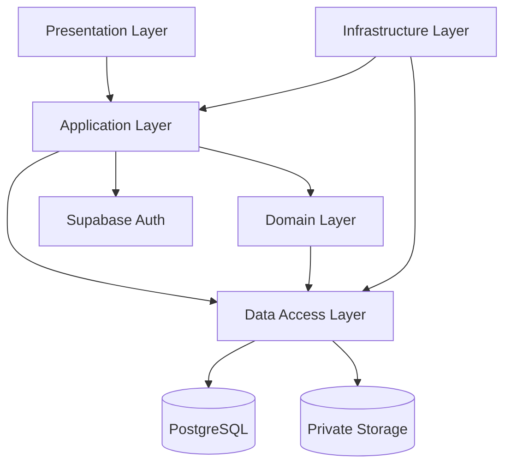
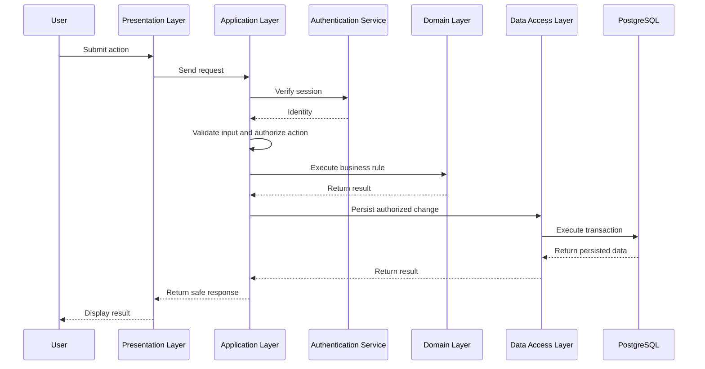
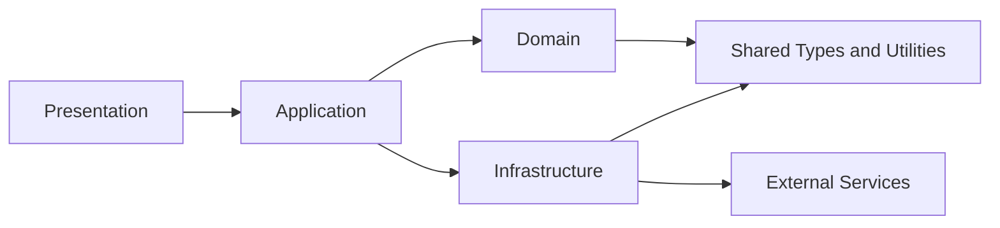

# Application Architecture

**Project:** Financial Operating System

**Internal Codename:** Athena

**Document Version:** 1.0.0

**Status:** Draft

**Owner:** Caitlin Gillum

**Primary Architect:** Caitlin Gillum

**Technical Advisor:** OpenAI ChatGPT

**Last Updated:** July 26, 2026

---

## Table of Contents

- [Purpose](#purpose)
- [Scope](#scope)
- [Application Architecture Overview](#application-architecture-overview)
- [Architectural Style](#architectural-style)
- [Logical Layers](#logical-layers)
  - [Presentation Layer](#presentation-layer)
  - [Application Layer](#application-layer)
  - [Domain Layer](#domain-layer)
  - [Data Access Layer](#data-access-layer)
  - [Infrastructure Layer](#infrastructure-layer)
- [Request Execution Model](#request-execution-model)
- [Client and Server Boundaries](#client-and-server-boundaries)
- [Domain Module Organization](#domain-module-organization)
- [Cross-Cutting Concerns](#cross-cutting-concerns)
  - [Authentication](#authentication)
  - [Authorization](#authorization)
  - [Validation](#validation)
  - [Audit Logging](#audit-logging)
  - [Error Handling](#error-handling)
  - [Observability](#observability)
  - [Configuration and Secrets](#configuration-and-secrets)
- [State Management](#state-management)
- [Data Access Rules](#data-access-rules)
- [Background Processing](#background-processing)
- [File Handling](#file-handling)
- [Testing Boundaries](#testing-boundaries)
- [Folder Structure](#folder-structure)
- [Dependency Rules](#dependency-rules)
- [Security Considerations](#security-considerations)
- [Requirement Traceability](#requirement-traceability)
- [Deferred Decisions](#deferred-decisions)
- [Related Documents](#related-documents)
- [Revision History](#revision-history)

---

## Purpose

This document defines the internal application architecture for Project Athena.

It describes how the Athena application shall be organized within the selected Next.js and TypeScript stack, including logical layers, module responsibilities, client and server boundaries, dependency rules, cross-cutting concerns, and testing boundaries.

This document does not define detailed user interface design, database schema, deployment configuration, or individual API contracts.

---

## Scope

This document covers:

- Application organization
- Logical layers
- Domain-module boundaries
- Client and server responsibilities
- Request execution
- Data access
- Validation
- Authorization
- Error handling
- Audit logging
- File handling
- Background processing
- Testing boundaries
- Initial source-code organization

This document does not define:

- Final page layouts
- Styling conventions
- Database tables
- Supabase migration details
- Detailed Row Level Security policies
- Deployment environments
- Monitoring-provider configuration
- Final library selections

---

## Application Architecture Overview

Athena shall use a modular layered architecture within a single Next.js application.



The architecture shall separate:

- User interface concerns
- Request orchestration
- Financial business logic
- Persistence logic
- External service integration
- Security and operational concerns

The system shall initially remain a modular monolith.

A modular monolith provides clear internal boundaries without introducing the operational complexity of multiple independently deployed services.

---

## Architectural Style

Athena shall use the following architectural style:

- Modular monolith
- Layered application design
- Domain-oriented modules
- Server-controlled financial logic
- Explicit dependency direction
- Shared cross-cutting infrastructure
- Deterministic business rules
- Repository-controlled schema migrations

The architecture should preserve the option to extract services later if scale, operational needs, or integration complexity justify that change.

Athena shall not begin as a microservices system.

---

## Logical Layers

### Presentation Layer

The presentation layer is responsible for user interaction.

Responsibilities include:

- Rendering pages and components
- Displaying financial information
- Collecting user input
- Client-side navigation
- Accessible forms
- Upload interfaces
- Loading and error states
- Confirmation workflows
- Review queues
- Visual reporting

The presentation layer shall not:

- Perform authoritative financial calculations
- Access privileged credentials
- Bypass server-side authorization
- Directly modify protected records without trusted validation
- Store authoritative financial state in the browser

### Application Layer

The application layer coordinates user requests and system workflows.

Responsibilities include:

- Receiving authenticated requests
- Validating request structure
- Verifying authorization
- Calling domain services
- Coordinating database operations
- Initiating audit records
- Returning safe responses
- Scheduling background work
- Managing transactions across multiple operations

Examples include:

- Import a CSV
- Approve a transaction categorization
- Create a monthly budget
- Record a debt payment
- Generate a net worth snapshot
- Export financial data

The application layer may use:

- Server Actions
- Route Handlers
- Server-side service functions

The final interface pattern shall be documented separately if a significant design decision is required.

### Domain Layer

The domain layer contains Athena's authoritative financial logic.

Responsibilities include:

- Transaction normalization
- Duplicate fingerprint generation
- Internal transfer detection
- Categorization precedence
- Budget calculations
- Debt payoff calculations
- Net worth calculations
- Goal progress calculations
- Child support balance calculations
- Financial report aggregation rules
- Review-state transitions

Domain logic shall be:

- Deterministic
- Testable
- Independent of user-interface components
- Independent of deployment-provider behavior
- Explicit about validation and failure
- Free from privileged client exposure

The domain layer should accept validated inputs and return typed results or explicit domain errors.

### Data Access Layer

The data access layer manages communication with PostgreSQL and private object storage.

Responsibilities include:

- Executing authorized queries
- Enforcing user ownership
- Mapping database records to application types
- Managing transactional writes
- Applying persistence constraints
- Reading and writing private files
- Handling schema-specific persistence behavior
- Supporting audit and import records

The data access layer shall not contain user-interface logic.

It shall not allow unrestricted client-originated queries to protected financial data.

### Infrastructure Layer

The infrastructure layer provides shared technical services.

Responsibilities include:

- Supabase client creation
- Server-only credential handling
- Environment validation
- Logging adapters
- Error-reporting adapters
- Background-job adapters
- File-storage adapters
- Time and date utilities
- Identifier generation
- Cryptographic helpers where required
- External integration clients

Infrastructure implementations should be replaceable where practical.

Core financial rules shall not depend directly on vendor-specific APIs.

---

## Request Execution Model

A typical authenticated request shall follow this sequence:



Financially significant requests must not depend solely on client-side state.

---

## Client and Server Boundaries

Athena shall clearly distinguish between client and server execution.

### Client-Side Responsibilities

Client-side code may:

- Render interactive interfaces
- Manage temporary form state
- Display filtered data
- Provide immediate validation feedback
- Handle navigation
- Display charts
- Initiate authenticated requests

Client-side code must not:

- Contain service-role credentials
- Perform privileged database operations
- Define authoritative authorization logic
- Persist unvalidated financial changes
- Trust user-supplied ownership identifiers
- Expose private storage paths unnecessarily

### Server-Side Responsibilities

Server-side code shall:

- Verify authentication
- Enforce authorization
- Validate untrusted input
- Execute financial business logic
- Access protected database records
- Use privileged credentials only when necessary
- Generate audit records
- Return redacted and safe errors
- Perform protected file operations

The boundary between client and server code must remain explicit in source organization and code review.

---

## Domain Module Organization

Athena shall organize application behavior by domain rather than by generic technical function alone.

Initial domain modules include:

- accounts
- imports
- transactions
- merchants
- categorization
- review
- budgets
- bills
- debts
- assets
- net-worth
- goals
- reports
- legal
- medical
- child-support
- audit
- identity

Each domain module may contain:

- types
- schemas
- services
- repositories
- calculations
- errors
- tests

Not every module must use every subdirectory.

The structure should remain proportional to actual complexity.

---

## Cross-Cutting Concerns

### Authentication

Authentication shall be verified in trusted server contexts.

Application code must not assume that a user interface state proves identity.

Session validation must occur before protected operations.

### Authorization

Authorization shall be enforced at multiple layers where appropriate:

- Application-layer ownership checks
- Database Row Level Security
- Storage access policies
- Restricted server-only operations

Authorization logic must never depend exclusively on identifiers supplied by the browser.

### Validation

Athena shall validate all untrusted data at runtime.

Validation applies to:

- Form input
- Route parameters
- Query parameters
- Uploaded files
- CSV records
- External service responses
- Environment variables
- Database-bound values

TypeScript types shall not be treated as runtime validation.

### Audit Logging

Financially significant mutations shall create audit records.

Audit logging should capture:

- Actor
- Action
- Resource type
- Resource identifier
- Timestamp
- Source
- Previous state where appropriate
- Resulting state where appropriate
- Correlation identifier

Audit failures for critical actions must be handled explicitly.

### Error Handling

Athena shall use typed or structured errors where practical.

Errors should be divided into categories such as:

- Validation errors
- Authentication errors
- Authorization errors
- Domain errors
- Conflict errors
- Not-found errors
- Infrastructure errors
- Unexpected errors

User-facing errors must not expose:

- Credentials
- Database internals
- Stack traces
- Sensitive file paths
- Protected financial values
- Internal policy details

### Observability

Operational logging must remain separate from financial audit logging.

Operational telemetry may include:

- Request duration
- Error counts
- Job status
- Deployment health
- Service availability
- Import completion state

Sensitive financial content must be excluded or redacted.

### Configuration and Secrets

Configuration shall be validated at startup or deployment time.

Secrets shall:

- Remain outside source control
- Use environment-specific storage
- Be server-only when privileged
- Be rotated when exposure is suspected
- Never be embedded in client bundles
- Never appear in ordinary logs

---

## State Management

Athena shall distinguish among:

- Authoritative server state
- Temporary client state
- Derived reporting state
- Cached state

Authoritative financial records shall remain server-controlled.

Client state may include:

- Form input
- Selected filters
- Temporary review choices
- Visual preferences
- Pagination state

Client state must not become the source of truth for financial records.

A dedicated global state-management library shall not be introduced unless application complexity demonstrates a clear need.

---

## Data Access Rules

Data access shall follow these rules:

- Protected financial records require authenticated access.
- User ownership must be enforced.
- Privileged credentials remain server-only.
- Database writes must use validated inputs.
- Multi-record financial updates should use database transactions.
- Data access functions should expose narrow operations.
- Raw unrestricted query capability shall not be exposed to client code.
- Database constraints shall reinforce application validation.
- Original import values must remain distinguishable from later metadata.
- Destructive actions must be explicit and auditable.

---

## Background Processing

Version 1 may initially process small operations synchronously.

Background processing shall be introduced when required for:

- Large CSV imports
- Long-running exports
- Monthly snapshot generation
- Scheduled reports
- Future bank synchronization
- Notification workflows
- Backup verification

Background jobs must include:

- Unique identifiers
- Ownership context
- Idempotency protection
- Status tracking
- Retry limits
- Failure recording
- Audit linkage
- Sensitive-data redaction

The final background-job platform remains deferred.

---

## File Handling

Uploaded files must be treated as untrusted.

File-handling controls shall include:

- File-size limits
- File-type validation
- Extension validation
- Content validation
- Filename normalization
- Storage isolation
- Ownership checks
- Safe parsing
- Rejection of unsupported formats
- Audit records for imports
- Retention and deletion rules

Original filenames must not be trusted as safe storage paths.

---

## Testing Boundaries

The application architecture shall support distinct testing layers.

### Unit Tests

Unit tests shall cover:

- Financial calculations
- Normalization
- Categorization rules
- Duplicate fingerprints
- Transfer detection
- Validation
- Domain-state transitions

### Integration Tests

Integration tests shall cover:

- Database writes
- Database constraints
- Row Level Security behavior
- Storage policies
- Import persistence
- Audit creation
- Transaction rollback

### End-to-End Tests

End-to-end tests shall cover:

- Authentication
- File import
- Review workflow
- Budget creation
- Debt updates
- Dashboard access
- Data export
- Authorization failures

Test data must be synthetic and sanitized.

---

## Folder Structure

The initial application source structure may follow this pattern:

```
src/
├── app/
│   ├── (auth)/
│   ├── (dashboard)/
│   ├── api/
│   └── layout.tsx
├── components/
│   ├── ui/
│   ├── forms/
│   └── charts/
├── domains/
│   ├── accounts/
│   ├── imports/
│   ├── transactions/
│   ├── categorization/
│   ├── budgets/
│   ├── debts/
│   ├── assets/
│   ├── goals/
│   ├── reports/
│   └── audit/
├── application/
│   ├── commands/
│   ├── queries/
│   └── workflows/
├── infrastructure/
│   ├── database/
│   ├── storage/
│   ├── auth/
│   ├── logging/
│   └── config/
├── lib/
│   ├── validation/
│   ├── errors/
│   ├── dates/
│   └── identifiers/
└── types/
```

This structure is provisional.

The final source tree should evolve based on actual implementation needs rather than forcing empty abstractions.

---

## Dependency Rules

Athena shall follow these dependency rules:



The following rules apply:

- Presentation may depend on application interfaces.
- Application may depend on domain services.
- Domain logic should not depend on presentation components.
- Domain logic should not depend directly on Vercel or Supabase APIs.
- Infrastructure may implement interfaces required by application or domain layers.
- Cross-domain dependencies should remain explicit.
- Circular dependencies are prohibited.
- Shared utilities must not become an unstructured dumping ground.
- Server-only modules must not be imported into client components.

---

## Security Considerations

The application architecture must prevent common full-stack security failures.

Key risks include:

- Client exposure of privileged credentials
- Missing authorization checks
- Row Level Security bypass
- Unsafe file parsing
- Insecure direct object references
- Sensitive logging
- Improper server and client imports
- Unsanitized user input
- Partial financial writes
- Cross-user data access
- Preview deployment access to production data

Security review shall verify that:

- Protected operations execute in trusted contexts
- Ownership checks are consistent
- Server-only modules remain server-only
- Audit records are created where required
- Sensitive data is redacted from telemetry
- Database policies provide defense in depth
- Application errors fail securely

---

## Requirement Traceability

| Application Area | Related Requirements |
|---|---|
| Presentation layer | FR-014 through FR-017, NFR-015, NFR-016 |
| Application layer | FR-001 through FR-031, NFR-005, NFR-006 |
| Domain layer | FR-003 through FR-024, FR-031, NFR-005, NFR-012 |
| Data access layer | FR-025 through FR-030, NFR-001 through NFR-007 |
| Authentication | FR-025, NFR-003 |
| Authorization | FR-026, NFR-001, NFR-002 |
| Audit logging | FR-027, NFR-005, NFR-018 |
| Validation | FR-002, NFR-005, NFR-006 |
| File handling | FR-001 through FR-004, FR-030 |
| Background processing | NFR-008, NFR-009, NFR-013 |
| Testing boundaries | NFR-010 through NFR-012 |
| Client/server separation | NFR-001, NFR-002, NFR-004, NFR-011 |

---

## Deferred Decisions

The following application-level decisions remain open:

- Server Actions versus Route Handlers by use case
- Runtime validation library
- Form-management library
- Global state-management library
- Data-fetching and caching library
- Database-access abstraction
- ORM selection
- Repository pattern usage
- Background-job provider
- Error-result pattern
- Logging provider
- Monitoring provider
- Feature-flag system
- API versioning strategy
- PWA implementation
- Charting library
- Component library

These decisions should be made only when implementation requires them.

---

## Related Documents

- docs/product-requirements.md
- docs/architecture/README.md
- docs/architecture/engineering-principles.md
- docs/architecture/system-architecture.md
- docs/adr/0002-initial-technology-stack.md

---

## Revision History

| Version | Date | Author | Summary |
|---|---|---|---|
| 1.0.0 | 2026-07-26 | Caitlin Gillum | Defined Athena's modular layered application architecture, client and server boundaries, domain organization, dependency rules, cross-cutting concerns, and provisional source structure. |