# Data Flow Architecture

**Project:** Financial Operating System

**Internal Codename:** Athena

**Document Version:** 1.2.0

**Status:** Draft

**Owner:** Caitlin Gillum

**Primary Architect:** Caitlin Gillum

**Technical Advisor:** OpenAI ChatGPT

**Last Updated:** August 1, 2026

---

## Table of Contents

- [Purpose](#purpose)
- [Scope](#scope)
- [Data Flow Philosophy](#data-flow-philosophy)
- [Data Flow Objectives](#data-flow-objectives)
- [Core Data Principles](#core-data-principles)
- [High-Level System Data Flow](#high-level-system-data-flow)
- [Data Classes](#data-classes)
- [Trust Boundaries](#trust-boundaries)
- [Ingress Points](#ingress-points)
- [Egress Points](#egress-points)
- [Common Request Flow](#common-request-flow)
- [Authentication Flow](#authentication-flow)
- [Authorization Flow](#authorization-flow)
- [Validation Flow](#validation-flow)
- [Manual Transaction Flow](#manual-transaction-flow)
- [Import Flow](#import-flow)
- [Import State Transitions](#import-state-transitions)
- [Duplicate Detection Flow](#duplicate-detection-flow)
- [Merchant Normalization Flow](#merchant-normalization-flow)
- [Classification Flow](#classification-flow)
- [Classification Precedence](#classification-precedence)
- [Review Queue Flow](#review-queue-flow)
- [Transfer Flow](#transfer-flow)
- [Reimbursement Flow](#reimbursement-flow)
- [Budget Flow](#budget-flow)
- [Bill Flow](#bill-flow)
- [Debt Flow](#debt-flow)
- [Asset and Liability Flow](#asset-and-liability-flow)
- [Net Worth Flow](#net-worth-flow)
- [Financial Goal Flow](#financial-goal-flow)
- [Specialized Financial Context Flow](#specialized-financial-context-flow)
- [Dashboard Flow](#dashboard-flow)
- [Reporting Flow](#reporting-flow)
- [Export Flow](#export-flow)
- [Audit Flow](#audit-flow)
- [Notification Flow](#notification-flow)
- [Background Job Flow](#background-job-flow)
- [AI Assistance Flow](#ai-assistance-flow)
- [Error Flow](#error-flow)
- [Data Lifecycle](#data-lifecycle)
- [Authoritative State Transitions](#authoritative-state-transitions)
- [Idempotency and Retry Flow](#idempotency-and-retry-flow)
- [Concurrency Flow](#concurrency-flow)
- [Caching and Derived Data Flow](#caching-and-derived-data-flow)
- [Sequence Diagram Catalog](#sequence-diagram-catalog)
- [Failure Scenarios](#failure-scenarios)
- [Security Considerations](#security-considerations)
- [Privacy Considerations](#privacy-considerations)
- [Performance Considerations](#performance-considerations)
- [Observability Requirements](#observability-requirements)
- [Testing Strategy](#testing-strategy)
- [Requirement Traceability](#requirement-traceability)
- [Deferred Decisions](#deferred-decisions)
- [Related Documents](#related-documents)
- [Revision History](#revision-history)

---

## Purpose

This document defines the Data Flow Architecture for Project Athena.

It describes how data moves through the platform from initial input to validation, authorization, domain processing, authoritative persistence, audit, reporting, presentation, export, archival, and deletion.

The document connects Athena's structural architecture to its runtime behavior.

It answers questions such as:

- Where does financial data enter the platform?
- Which system boundary validates it?
- Where is ownership enforced?
- When does data become authoritative?
- How are ambiguous records handled?
- How are duplicate financial effects prevented?
- How are derived reports produced?
- How does data reach the dashboard?
- How are exports protected?
- How does AI participate without becoming authoritative?
- What happens when part of a workflow fails?

---

## Scope

This document covers:

- User and system data ingress
- Authentication and authorization flow
- Runtime validation
- Manual transaction creation
- Financial-file imports
- Duplicate detection
- Merchant normalization
- Classification
- Review resolution
- Transfers
- Reimbursements
- Budgets
- Bills
- Debts
- Assets
- Liabilities
- Net worth
- Financial goals
- Specialized financial contexts
- Dashboards
- Reports
- Exports
- Audit events
- Notifications
- Background jobs
- AI-assisted workflows
- Error propagation
- Retries
- Idempotency
- Data lifecycle
- State transitions
- Failure scenarios
- Security and privacy boundaries
- Performance and observability expectations

This document does not define:

- Final API routes
- Final request or response schemas
- Final database tables
- Final event-bus provider
- Final queue provider
- Final notification provider
- Final AI provider
- Final export formats
- Final cache provider
- Final background-job scheduler
- Final retention periods
- Final error codes

Those decisions will be resolved during implementation or in later architecture documents and ADRs.

---

## Data Flow Philosophy

Athena shall treat data movement as a controlled sequence of trust decisions.

Data does not become authoritative merely because it:

- Reached the server
- Passed syntax validation
- Came from an authenticated user
- Appeared in an uploaded statement
- Was suggested by an AI system
- Was returned by an external provider
- Was displayed in the user interface
- Was written to temporary storage

Authoritative data must pass through the required:

1. Authentication
2. Runtime validation
3. Authorization
4. Ownership verification
5. Domain rules
6. Transactional persistence
7. Audit requirements

Ambiguous data must be preserved without being silently treated as confirmed financial truth.

---

## Data Flow Objectives

Athena's data flows should provide:

### Traceability

Material data must be traceable from its source through processing and persistence.

### Integrity

A failed or repeated workflow must not create duplicate or partial financial effects.

### Security

Every protected flow must verify identity, permission, and ownership.

### Explainability

The platform should be able to explain how a transaction was imported, normalized, classified, reviewed, and included in reporting.

### Recoverability

Interrupted workflows should be retryable or safely recoverable.

### Determinism

The same accepted inputs and rules should produce the same financial result.

### Separation of Concerns

Source data, authoritative data, derived data, and presentation data must remain distinguishable.

### Observability

Important workflow transitions and failures must be measurable without exposing sensitive data.

---

## Core Data Principles

Athena shall follow these data-flow principles:

1. External data is untrusted.
2. The browser is not an authoritative source.
3. Authentication precedes protected processing.
4. Authorization precedes protected access or mutation.
5. Ownership is enforced independently from record identifiers.
6. Runtime validation occurs at trust boundaries.
7. Source values remain distinguishable from accepted values.
8. Ambiguous data enters review.
9. Financial mutations are transactional.
10. Retryable operations are idempotent.
11. Known duplicates are prevented.
12. Internal transfers do not count as income or spending.
13. Reimbursements remain distinguishable from income.
14. Expected financial support is not guaranteed income.
15. Historical values are preserved where materially significant.
16. Derived data must be reproducible or explicitly snapshotted.
17. Dashboard configuration is not financial truth.
18. AI output is advisory and untrusted.
19. Audit events are separate from operational logs.
20. Public examples and tests use synthetic data.

---

## High-Level System Data Flow

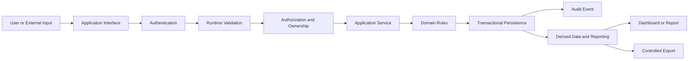

The trusted server boundary coordinates all authoritative flows.

---

## Data Classes

Athena recognizes four primary data classes.

### Source Data

Source Data represents original external or user-provided values.

Examples:

- Uploaded transaction description
- Source amount
- Source date
- Source row number
- Original filename metadata
- External provider identifier

Source Data is preserved for lineage but is not always authoritative.

### Candidate Data

Candidate Data has been parsed or normalized but has not yet completed all required acceptance steps.

Examples:

- Parsed import row
- Suggested merchant
- Suggested category
- Possible duplicate
- Proposed transfer match

Candidate Data may require review.

### Authoritative Data

Authoritative Data represents accepted platform state.

Examples:

- Confirmed transaction
- Approved classification
- Budget allocation
- Debt payment
- Verified asset valuation
- Resolved support payment

### Derived Data

Derived Data is calculated from authoritative records.

Examples:

- Monthly spending
- Budget variance
- Net worth
- Debt progress
- Goal progress
- Dashboard summaries

Derived Data must be reproducible or explicitly stored as a dated snapshot.

---

## Trust Boundaries

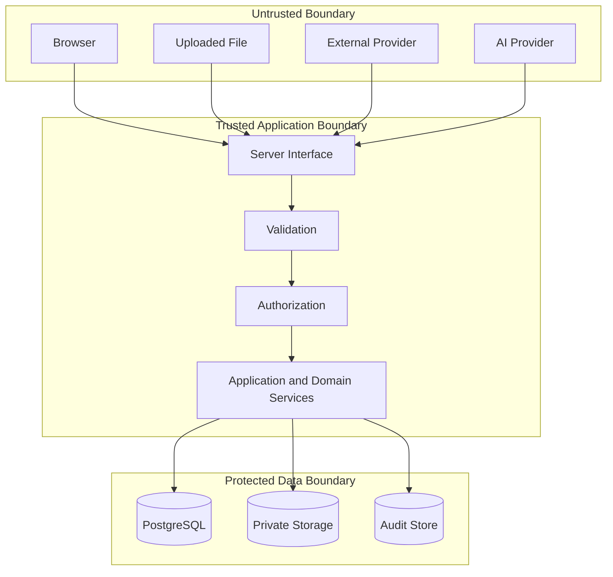

Crossing a trust boundary requires explicit validation and authorization appropriate to the flow.

---

## Ingress Points

Athena's anticipated data ingress points include:

- Authentication forms
- Manual transaction forms
- Financial account forms
- File uploads
- Import records
- Budget forms
- Bill forms
- Debt records
- Asset and liability records
- Goal forms
- Dashboard configuration
- Search and filter parameters
- Background-job payloads
- External provider responses
- Future webhooks
- Future AI suggestions
- Environment configuration

Each ingress point must define:

- Authentication requirements
- Input schema
- Size limits
- Allowed values
- Ownership rules
- Idempotency requirements
- Error behavior
- Audit requirements
- Retention behavior

---

## Egress Points

Athena's anticipated egress points include:

- Server-rendered pages
- Client-visible JSON
- Dashboard summaries
- Reports
- Downloadable exports
- Signed storage links
- Notifications
- Operational logs
- Audit records
- Monitoring telemetry
- Third-party requests

Each egress point must minimize data exposure.

Sensitive data should not leave the trusted boundary unless the user is authorized and the destination is approved.

---

## Common Request Flow

Most protected requests follow this sequence:

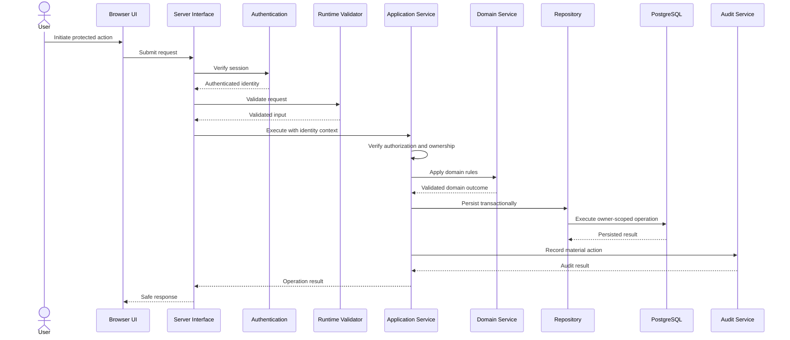

Not every read requires an audit event, but all protected flows require authentication and authorization.

---

## Authentication Flow

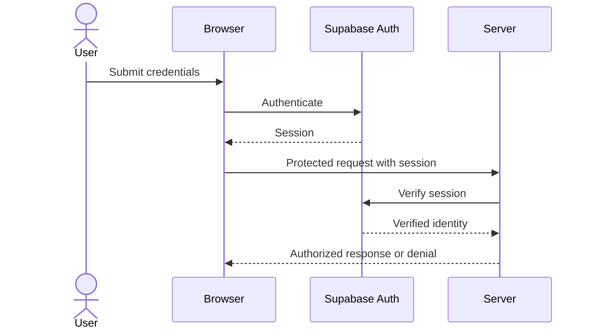

Authentication establishes identity but does not establish access to a specific resource.

### Implementation Note (Current State)

This flow is now implemented for email/password (no social login or magic links). "Server verifies session" is `requireAuthenticatedUser()` (`src/lib/auth/authenticated-user.ts`), which calls Supabase's `auth.getUser()` — revalidated against the Auth server, not a locally-trusted cookie read. `src/proxy.ts` additionally refreshes the session cookie and redirects unauthenticated requests to `/login` as defense in depth; the layout/page-level `requireAuthenticatedUser()` call remains the authoritative check. The dev-owner scaffolding this note previously described (`resolveDevelopmentOwnerId()`) has been fully removed — no authenticated route depends on it anymore.

---

## Authorization Flow

Authorization occurs after identity verification.

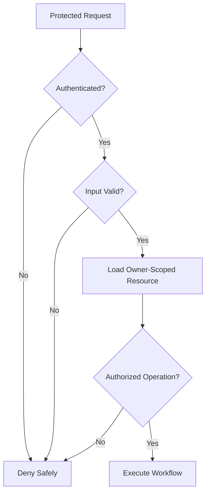

Authorization decisions may consider:

- Authenticated user
- Resource owner
- Resource status
- Requested operation
- Aggregate rules
- Privileged workflow context

---

## Validation Flow

Validation occurs at multiple layers.

### Interface Validation

Checks:

- Required fields
- Types
- Formats
- Lengths
- File size
- Allowed values
- Date syntax
- Monetary precision

### Application Validation

Checks:

- User context
- Resource existence
- Ownership
- Workflow eligibility
- Idempotency context

### Domain Validation

Checks:

- Business invariants
- State transitions
- Financial relationships
- Classification precedence
- Period rules
- Historical restrictions

### Database Validation

Checks:

- Foreign keys
- Unique constraints
- Check constraints
- Not-null constraints
- Row Level Security

No single validation layer replaces the others.

---

## Manual Transaction Flow

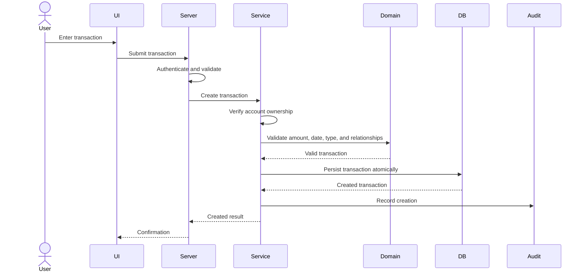

The browser may provide an account identifier, but the server must independently verify that the account belongs to the authenticated owner.

---

## Import Flow

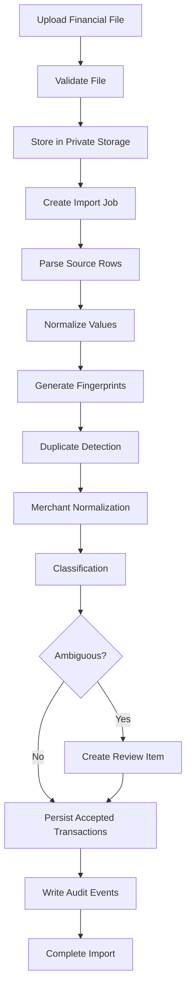

An import may be processed synchronously for small files or by a background job for larger workloads.

---

## Import State Transitions

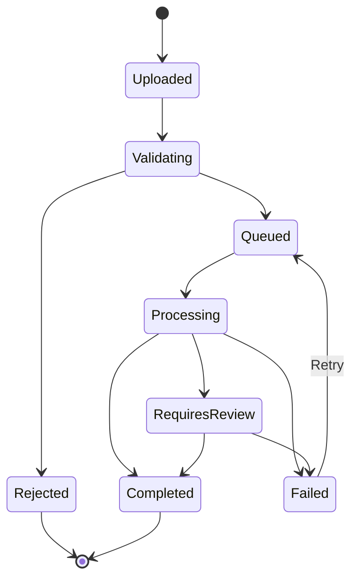

Potential import statuses include:

- Uploaded
- Validating
- Rejected
- Queued
- Processing
- Requires Review
- Completed
- Failed
- Cancelled

Status transitions must be explicit and observable.

---

## Duplicate Detection Flow

Duplicate detection occurs at multiple levels.

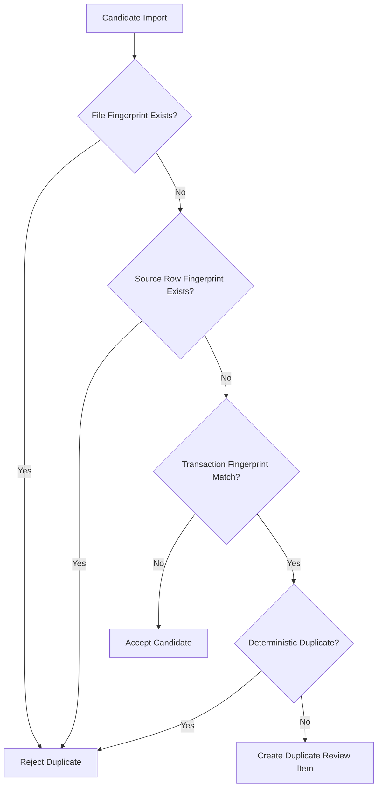

Duplicate detection may use:

- Owner
- Account
- Date
- Amount
- Description
- Source identifier
- Import fingerprint
- Existing transaction relationships

Ambiguous similarity must not automatically delete valid financial activity.

---

## Merchant Normalization Flow

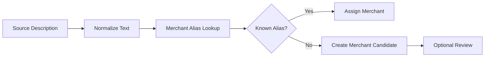

Original descriptions must remain preserved even when a normalized merchant is assigned.

---

## Classification Flow

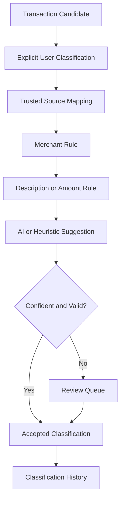

Classification must remain explainable through decision source, rule, version, actor, and timestamp.

---

## Classification Precedence

Athena should apply classification sources in documented precedence.

A provisional order is:

1. Explicit user-confirmed classification
2. Accepted review resolution
3. Context-specific authoritative rule
4. Exact merchant rule
5. Exact normalized-description rule
6. Source mapping
7. Pattern-based deterministic rule
8. Historical suggestion
9. AI-assisted suggestion
10. Unclassified review state

Higher-precedence decisions must not be silently overwritten by lower-precedence suggestions.

---

## Review Queue Flow

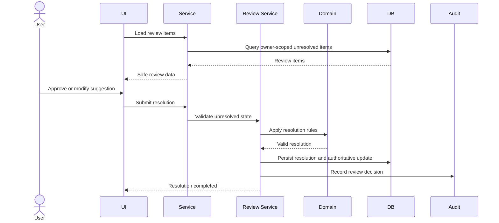

The original reason for review must remain preserved after resolution.

---

## Transfer Flow

An internal transfer links two financial movements without treating either as ordinary income or spending.

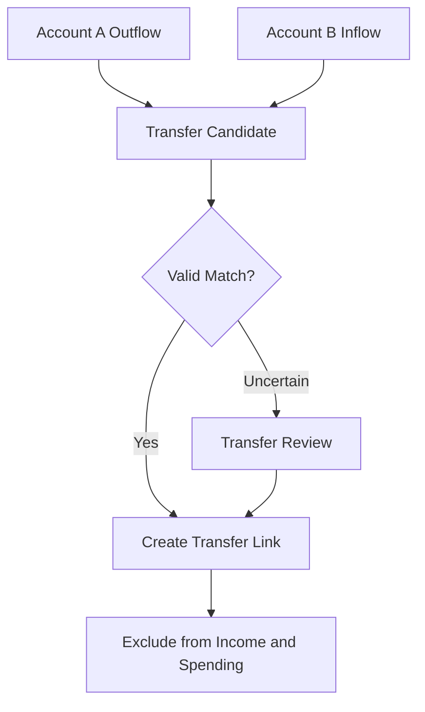

A transfer match may consider:

- Same owner
- Opposite signs
- Equivalent magnitude
- Compatible dates
- Compatible account types
- Existing link status

---

## Reimbursement Flow

Reimbursements must remain distinct from ordinary income.

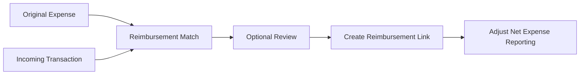

The incoming transaction remains an authoritative transaction but is classified as reimbursement rather than earned or recurring income.

---

## Budget Flow

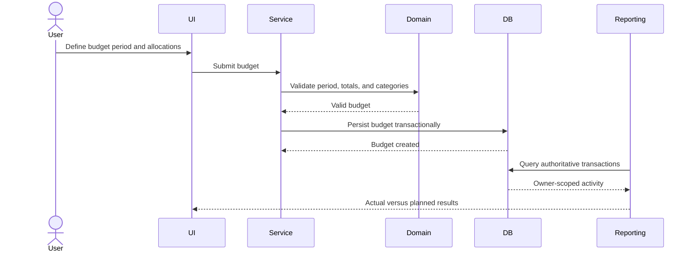

Actual spending derives from authoritative transactions rather than manually duplicated totals.

---

## Bill Flow

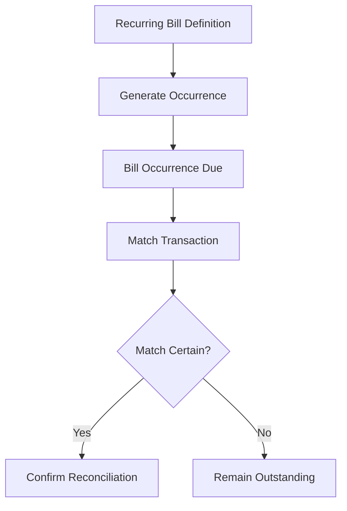

Changes to a recurring bill must not rewrite prior occurrences.

---

## Debt Flow

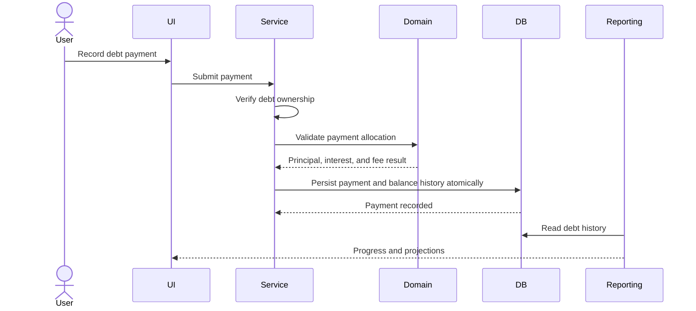

Actual payment records and hypothetical payoff scenarios must remain separate.

---

## Asset and Liability Flow

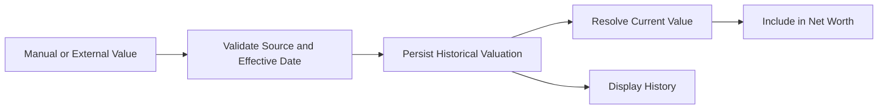

New valuations append history rather than overwriting prior values.

---

## Net Worth Flow

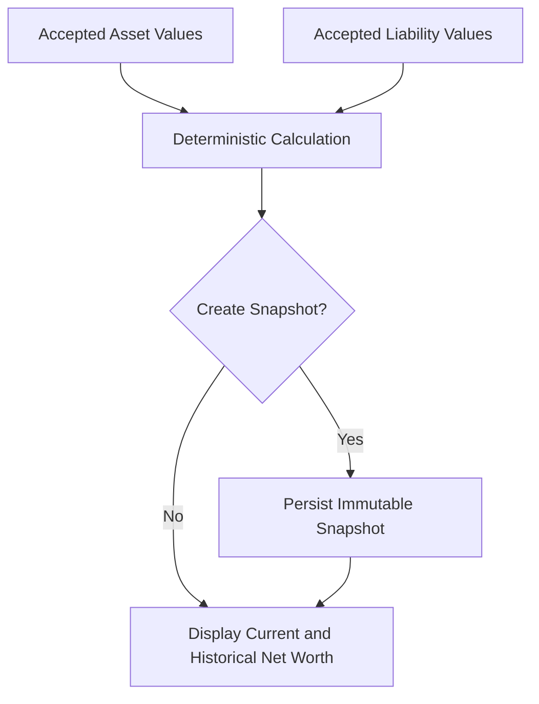

A stored snapshot must record the effective source values and calculation version.

---

## Financial Goal Flow


Goal progress must identify its source and must not duplicate account balances or budget allocations.

---

## Specialized Financial Context Flow

Specialized financial contexts may include:

- Legal expenses
- Medical expenses
- Education expenses
- Dependent expenses
- Financial support obligations
- Tax-related expenses

```mermaid
flowchart LR
    Transaction[Authoritative Transaction]
    Context[Attach Specialized Context]
    Metadata[Persist Context-Specific Metadata]
    Reporting[Contextual Reporting]
    Core[Core Financial Reporting]

    Transaction --> Context
    Context --> Metadata
    Transaction --> Core
    Metadata --> Reporting
```

The context extends the transaction rather than creating a second financial event.

---

## Dashboard Flow

```mermaid
sequenceDiagram
    actor User
    participant UI
    participant Server
    participant Service
    participant Repo
    participant DB

    User->>UI: Open dashboard
    UI->>Server: Request dashboard
    Server->>Server: Verify session
    Server->>Service: Load dashboard data
    Service->>Repo: Query owner-scoped summaries
    Repo->>DB: Execute optimized queries
    DB-->>Repo: Authoritative and derived data
    Repo-->>Service: Dashboard read model
    Service-->>Server: Validated view model
    Server-->>UI: Render dashboard
```

Dashboard configuration controls presentation but not authoritative financial state.

### Implementation Note (Current State)

The sequence above is now implemented as described — "Verify session" is `requireAuthenticatedUser()`, backed by real Supabase Auth (see [Authentication Flow](#authentication-flow)). As of the current implementation:

- The read path is `PostgreSQL → Drizzle repositories → DashboardService → dashboard data adapter → dashboard page`, composed in `src/composition/dashboard-composition.ts` and `src/composition/dashboard-query.ts` — the only files outside `src/infrastructure` permitted to import it. Presentation components never import infrastructure or the database directly.
- `ownerId` comes from `requireAuthenticatedUser()`'s verified identity, called in `src/app/(authenticated)/layout.tsx` and again in the dashboard page (deduplicated per-request via React's `cache()`). The earlier development-only `resolveDevelopmentOwnerId()` / `DEVELOPMENT_OWNER_ID` scaffolding this note used to describe has been fully removed now that real authentication exists — no authenticated route depends on it, and nothing in the codebase references it anymore.
- Live data currently backs: the Net Worth, Monthly Cash Flow, and Investments stat tiles; the Financial Overview chart and period summary; Spending by Category; Accounts Overview (using the Slice 8 account presentation mapping, so all twelve schema account types display correctly rather than being collapsed into the legacy four-category UI type); and Recent Activity.
- Budget Status, Confidence Score, Mission Progress/Status, and Upcoming Objectives remain intentionally mocked — their backing domains (budgets, the Confidence Engine, the Mission Engine, recommendations) are not implemented yet. No deltas, confidence scores, missions, or objectives are fabricated from real data.
- The dashboard route is `force-dynamic` and renders errors through a route-level error boundary that never surfaces database or connection detail to the client.

---

## Reporting Flow

```mermaid
flowchart TD
    Request[Authorized Report Request]
    Validate[Validate Filters and Period]
    Query[Owner-Scoped Query]
    Rules[Apply Reporting Rules]
    Aggregate[Calculate Aggregates]
    View[Return Report View]
    Snapshot[Optional Snapshot]

    Request --> Validate
    Validate --> Query
    Query --> Rules
    Rules --> Aggregate
    Aggregate --> View
    Aggregate --> Snapshot
```

Reporting rules must explicitly account for:

- Internal transfers
- Reimbursements
- Excluded transactions
- Pending review
- Date basis
- Currency
- Specialized financial contexts

---

## Export Flow

```mermaid
sequenceDiagram
    actor User
    participant UI
    participant Service
    participant Job as Export Job
    participant DB
    participant Storage
    participant Audit

    User->>UI: Request export
    UI->>Service: Submit export parameters
    Service->>Service: Authenticate, authorize, and validate
    Service->>Job: Create export job
    Job->>DB: Query owner-scoped data
    DB-->>Job: Authorized records
    Job->>Job: Sanitize and format export
    Job->>Storage: Store private export
    Job->>Audit: Record export generation
    Job-->>Service: Export ready
    Service-->>UI: Time-limited download access
```

Exports must include only authorized data and should protect against spreadsheet formula injection where applicable.

---

## Audit Flow

```mermaid
flowchart LR
    Action[Material Action]
    Context[Actor and Owner Context]
    Metadata[Safe Change Metadata]
    Audit[Append Audit Event]
    Operational[Operational Log]
    Monitor[Monitoring]

    Action --> Context
    Context --> Metadata
    Metadata --> Audit
    Action --> Operational
    Operational --> Monitor
```

Audit records and operational logs serve different purposes.

Audit records should preserve accountability without duplicating full sensitive payloads.

---

## Notification Flow

Notifications may be generated for:

- Import completion
- Import failure
- Review items
- Bill due dates
- Goal milestones
- Export completion
- Security events

```mermaid
flowchart TD
    Event[Domain or Operational Event]
    Preference[Check Notification Preference]
    Eligible{Notification Allowed?}
    Compose[Create Minimal Message]
    Deliver[Approved Provider]
    Status[Record Delivery Status]

    Event --> Preference
    Preference --> Eligible
    Eligible -- No --> Status
    Eligible -- Yes --> Compose
    Compose --> Deliver
    Deliver --> Status
```

Notifications must minimize sensitive financial detail.

---

## Background Job Flow

```mermaid
sequenceDiagram
    participant Producer as Application Service
    participant Queue as Job Store or Queue
    participant Worker as Background Worker
    participant DB
    participant Audit

    Producer->>Queue: Enqueue versioned idempotent job
    Queue-->>Producer: Job identifier
    Worker->>Queue: Claim job
    Worker->>Worker: Validate payload and version
    Worker->>DB: Execute owner-scoped transactional work
    DB-->>Worker: Result
    Worker->>Audit: Record material completion
    Worker->>Queue: Mark complete
```

Jobs must preserve:

- Owner context
- Job version
- Idempotency key
- Attempt count
- Status
- Failure reason
- Correlation identifier

---

## AI Assistance Flow

```mermaid
sequenceDiagram
    actor User
    participant Service
    participant Sanitizer
    participant AI as AI Provider
    participant Validator
    participant Review
    participant DB
    participant Audit

    User->>Service: Request or trigger suggestion
    Service->>Sanitizer: Minimize and redact input
    Sanitizer->>AI: Send approved context
    AI-->>Validator: Return suggestion
    Validator->>Validator: Validate schema and allowed values
    Validator->>Review: Create advisory suggestion
    Review-->>User: Present suggestion
    User->>Review: Approve, modify, or reject
    Review->>DB: Persist accepted authoritative change
    Review->>Audit: Record accepted decision
```

AI must never bypass:

- Runtime validation
- Authorization
- Domain rules
- User approval where required
- Transactional persistence
- Audit controls

---

## Error Flow

```mermaid
flowchart TD
    Failure[Failure Occurs]
    Classify[Classify Error]
    Rollback[Rollback Transaction]
    SafeResponse[Return Safe User Response]
    Log[Write Sanitized Operational Log]
    Audit{Audit Required?}
    AuditEvent[Write Audit or Security Event]
    Retry{Retryable?}
    Queue[Schedule Retry]
    Final[Mark Failed]

    Failure --> Classify
    Classify --> Rollback
    Rollback --> SafeResponse
    Classify --> Log
    Classify --> Audit
    Audit -- Yes --> AuditEvent
    Audit -- No --> Retry
    AuditEvent --> Retry
    Retry -- Yes --> Queue
    Retry -- No --> Final
```

Errors should be categorized as:

- Validation
- Authentication
- Authorization
- Not found
- Conflict
- Duplicate
- Domain rule violation
- Dependency failure
- Retryable infrastructure failure
- Permanent processing failure
- Unexpected internal error

Internal details must not be exposed in client responses.

---

## Data Lifecycle

Athena's data lifecycle is:

```mermaid
flowchart LR
    Create[Create or Receive]
    Validate[Validate]
    Process[Normalize and Classify]
    Review[Review if Required]
    Persist[Persist Authoritatively]
    Use[Report and Display]
    Preserve[Preserve History]
    Archive[Archive]
    Delete[Delete Under Policy]

    Create --> Validate
    Validate --> Process
    Process --> Review
    Review --> Persist
    Persist --> Use
    Use --> Preserve
    Preserve --> Archive
    Archive --> Delete
```

Not every record follows every stage.

Temporary processing records may expire earlier than authoritative financial records.

---

## Authoritative State Transitions

Financial records must use controlled state transitions.

Example transaction lifecycle:

```mermaid
stateDiagram-v2
    [*] --> Candidate
    Candidate --> RequiresReview
    Candidate --> Accepted
    RequiresReview --> Accepted
    RequiresReview --> Rejected
    Accepted --> Adjusted
    Accepted --> Archived
    Adjusted --> Archived
    Rejected --> [*]
    Archived --> [*]
```

A material correction should preserve prior state through history or adjustment records rather than silent replacement.

---

## Idempotency and Retry Flow

```mermaid
flowchart TD
    Request[Operation Request]
    Key[Resolve Idempotency Key]
    Existing{Existing Result?}
    Return[Return Existing Result]
    Lock[Acquire Safe Execution Scope]
    Execute[Execute Transaction]
    Store[Store Idempotency Result]
    Response[Return Result]

    Request --> Key
    Key --> Existing
    Existing -- Yes --> Return
    Existing -- No --> Lock
    Lock --> Execute
    Execute --> Store
    Store --> Response
```

Retries must not create duplicate:

- Transactions
- Imports
- Exports
- Snapshots
- Debt payments
- Review resolutions
- Notifications
- Background jobs

---

## Concurrency Flow

```mermaid
sequenceDiagram
    participant ClientA
    participant ClientB
    participant Service
    participant DB

    ClientA->>Service: Update resource version 4
    ClientB->>Service: Update resource version 4
    Service->>DB: Apply first update where version = 4
    DB-->>Service: Updated to version 5
    Service-->>ClientA: Success

    Service->>DB: Apply second update where version = 4
    DB-->>Service: No matching row
    Service-->>ClientB: Conflict; refresh required
```

Financially significant workflows should not rely on silent last-write-wins behavior.

---

## Caching and Derived Data Flow

Caching may be used only for derived or safely reproducible data.

```mermaid
flowchart TD
    Request[Dashboard or Report Request]
    Cache{Valid Cache Available?}
    Return[Return Cached Read Model]
    Query[Query Authoritative Data]
    Calculate[Calculate Derived Result]
    Store[Store Cache with Freshness Metadata]

    Request --> Cache
    Cache -- Yes --> Return
    Cache -- No --> Query
    Query --> Calculate
    Calculate --> Store
    Store --> Return
```

Cache records must define:

- Authoritative source
- Freshness
- Invalidation
- Rebuild method
- Owner scope
- Failure behavior

Cached data must not be used to authorize access or permanently mutate authoritative records.

---

## Sequence Diagram Catalog

The following sequence diagrams are defined in this document:

| Diagram | Purpose |
|---|---|
| Common Request Flow | Standard protected request behavior |
| Authentication Flow | Identity verification |
| Manual Transaction Flow | Direct transaction creation |
| Review Queue Flow | Human resolution of ambiguity |
| Budget Flow | Budget creation and reporting |
| Debt Flow | Debt-payment persistence |
| Dashboard Flow | Read-model delivery |
| Export Flow | Private export generation |
| Background Job Flow | Asynchronous processing |
| AI Assistance Flow | Advisory AI integration |
| Concurrency Flow | Optimistic conflict handling |

Additional sequence diagrams may be separated into a dedicated catalog during implementation.

---

## Failure Scenarios

### Invalid Input

Expected behavior:

- Reject before domain execution
- Return field-safe validation errors
- Do not persist authoritative state
- Record telemetry without sensitive values

### Authentication Failure

Expected behavior:

- Deny protected access
- Do not reveal resource existence
- Record security telemetry when appropriate

### Authorization Failure

Expected behavior:

- Deny access
- Do not expose cross-owner data
- Record a security event for suspicious or repeated attempts

### Import Parser Failure

Expected behavior:

- Preserve import-job status
- Roll back incomplete batch state
- Retain safe failure context
- Allow controlled retry

### Duplicate Detection Conflict

Expected behavior:

- Avoid duplicate persistence
- Create review item when ambiguity remains
- Preserve source lineage

### Classification Failure

Expected behavior:

- Preserve transaction candidate
- Leave classification unresolved
- Route to review
- Do not invent a category

### Audit Write Failure

For material mutations, the application must define whether:

- The transaction fails closed, or
- The action succeeds with a recoverable audit outbox record

The final pattern is deferred.

### Database Failure

Expected behavior:

- Roll back current transaction
- Return a safe temporary failure
- Retry only when the workflow is idempotent
- Alert on repeated failures

### Storage Failure

Expected behavior:

- Do not mark upload or export complete
- Preserve job state
- Avoid orphaned database references
- Retry safely where appropriate

### AI Provider Failure

Expected behavior:

- Preserve deterministic workflow
- Continue without suggestion where possible
- Do not block authoritative manual processing
- Do not persist malformed output

### Notification Failure

Expected behavior:

- Preserve the underlying financial action
- Record delivery failure separately
- Retry according to policy
- Avoid duplicate notifications

---

## Security Considerations

Data-flow security risks include:

- Cross-owner data access
- Client-forged ownership
- Unvalidated identifiers
- Malicious files
- Injection
- Duplicate financial effects
- Unsafe retries
- Sensitive data in logs
- Public exports
- Insecure signed URLs
- Background jobs without owner context
- AI prompt injection
- Unauthorized state transitions
- Cache leakage
- Incorrect Row Level Security

Required controls include:

- Authentication
- Runtime validation
- Server-side authorization
- Owner-scoped repositories
- Row Level Security
- Parameterized queries
- Transactional persistence
- Idempotency
- Private storage
- Restricted exports
- Safe logging
- Versioned jobs
- Controlled state transitions
- Automated cross-owner tests

---

## Privacy Considerations

Athena shall minimize sensitive data throughout all flows.

Privacy controls include:

- Preserve only required source fields
- Limit raw import retention
- Avoid sensitive details in URLs
- Redact operational logs
- Restrict exports
- Use private storage
- Minimize notification content
- Avoid unnecessary narrative notes
- Redact AI inputs where practical
- Use synthetic data in tests and public examples

Specialized legal or medical classifications must not cause unnecessary duplication of sensitive details.

---

## Performance Considerations

Data-flow performance concerns include:

- Large imports
- Duplicate detection
- Merchant matching
- Classification
- Dashboard aggregation
- Report generation
- Export generation
- Background-job throughput
- Database connection limits
- Repeated review queries

Performance strategies may include:

- Batch processing
- Pagination
- Owner-scoped indexes
- Background jobs
- Bounded file sizes
- Bounded report periods
- Precomputed read models
- Controlled caching
- Efficient fingerprinting
- Query-plan review

Performance improvements must not weaken authorization, lineage, accuracy, or auditability.

---

## Observability Requirements

Every material workflow should expose safe operational signals.

Potential workflow metadata includes:

- Correlation identifier
- Owner-safe internal identifier
- Workflow type
- Current status
- Attempt count
- Duration
- Records processed
- Records accepted
- Records rejected
- Records requiring review
- Failure category
- Deployment version

Observability must not include:

- Full financial descriptions
- Full account identifiers
- Raw uploaded files
- Authentication secrets
- Full exports
- Sensitive notes

---

## Testing Strategy

### Flow Unit Tests

Verify:

- State transitions
- Classification precedence
- Transfer rules
- Reimbursement rules
- Budget calculations
- Debt allocations
- Snapshot calculations
- Retry eligibility

### Integration Tests

Verify:

- Authentication and authorization
- Owner-scoped persistence
- Transaction rollback
- Import lineage
- Review resolution
- Audit coordination
- Background-job execution
- Export access

### Idempotency Tests

Verify repeated requests do not duplicate:

- Imports
- Transactions
- Payments
- Snapshots
- Exports
- Notifications

### Concurrency Tests

Verify:

- Conflicting updates are detected
- Duplicate review resolutions are prevented
- Default-resource uniqueness is enforced
- Concurrent imports remain safe

### Security Flow Tests

Verify:

- Cross-owner access fails
- Client-provided ownership is ignored
- Private files remain inaccessible
- Signed links expire
- AI suggestions cannot bypass approval
- Caches cannot leak data across owners

### Failure Tests

Verify:

- Parser failure
- Database failure
- Storage failure
- Provider failure
- Audit failure
- Notification failure
- Partial batch failure
- Retry exhaustion

All tests shall use synthetic or sanitized data.

---

## Requirement Traceability

| Data Flow Area | Related Requirements |
|---|---|
| Authentication and authorization | FR-025, FR-026, NFR-001 through NFR-004 |
| Imports | FR-001 through FR-005, FR-030, NFR-005 through NFR-009 |
| Transactions | FR-003 through FR-006, NFR-005, NFR-006 |
| Merchant normalization | FR-007, FR-008, NFR-018 |
| Classification | FR-007 through FR-010, FR-031 |
| Review queue | FR-009, FR-031, NFR-005, NFR-018 |
| Budgets | FR-011 through FR-013 |
| Reporting | FR-014 through FR-017, FR-028 |
| Debts | FR-018, FR-019 |
| Assets and net worth | FR-020 through FR-022 |
| Financial goals | FR-023, FR-024 |
| Audit | FR-027, NFR-005, NFR-018 |
| Export | FR-028, NFR-017 |
| Backup and recovery flows | FR-029, NFR-007 |
| Dashboard | FR-032, NFR-013 through NFR-018 |
| Data integrity | NFR-005, NFR-006 |
| Availability and performance | NFR-007 through NFR-009 |
| Maintainability and testing | NFR-010 through NFR-014 |
| Privacy | NFR-001 through NFR-004, NFR-017 |
| Explainability | FR-007 through FR-010, FR-027, NFR-018 |

---

## Deferred Decisions

The following data-flow decisions remain open:

- Final API transport patterns
- Final server-action boundaries
- Final import file formats
- Maximum upload size
- Maximum import row count
- Parser architecture
- Import batch size
- Import retry policy
- File fingerprint algorithm
- Row fingerprint algorithm
- Transaction fingerprint algorithm
- Duplicate similarity thresholds
- Merchant normalization algorithm
- Classification-rule persistence
- Classification confidence thresholds
- Review priority model
- Review assignment model
- Transfer-matching tolerance
- Reimbursement-matching rules
- Budget close and reopen process
- Bill-occurrence generation schedule
- Debt interest-calculation flow
- Asset valuation source integrations
- Net worth snapshot schedule
- Goal progress refresh behavior
- Specialized-context extension model
- Dashboard cache strategy
- Reporting read-model strategy
- Export formats
- Export retention
- Notification provider
- Notification retry policy
- Background-job provider
- Job queue semantics
- Dead-letter handling
- Audit failure strategy
- Transactional outbox use
- Domain event persistence
- AI provider
- AI redaction strategy
- AI confidence requirements
- Cache provider
- Cache invalidation strategy
- Data-retention periods
- Archival automation
- Hard-deletion workflow
- Event versioning
- Sequence-diagram catalog structure
- Error-code taxonomy

Architecturally significant decisions shall be documented through ADRs.

---

## Related Documents

- docs/product-requirements.md
- docs/architecture/README.md
- docs/architecture/engineering-principles.md
- docs/architecture/system-architecture.md
- docs/architecture/application-architecture.md
- docs/architecture/frontend-architecture.md
- docs/architecture/domain-model.md
- docs/architecture/backend-architecture.md
- docs/architecture/database-architecture.md
- docs/architecture/security-architecture.md
- docs/architecture/deployment-architecture.md
- docs/adr/README.md
- docs/adr/0002-initial-technology-stack.md

---

## Revision History

| Version | Date | Author | Summary |
|---|---|---|---|
| 1.0.0 | 2026-07-29 | Caitlin Gillum | Defined Athena's end-to-end data flows, including authentication, authorization, validation, manual transactions, imports, duplicate detection, classification, review, transfers, budgets, debts, reporting, exports, audit, background jobs, AI assistance, retries, failures, and authoritative state transitions. |
| 1.1.0 | 2026-07-31 | Caitlin Gillum | Added an implementation note to the Dashboard Flow describing the current interim read path (composition root, `DashboardService`, adapter) and the temporary `DEVELOPMENT_OWNER_ID` scaffolding standing in for Supabase Auth, including which dashboard sections are live versus intentionally mocked. |
| 1.2.0 | 2026-08-01 | Caitlin Gillum | Updated the Authentication Flow and Dashboard Flow implementation notes now that Supabase Auth is implemented: `requireAuthenticatedUser()` replaces the removed development-owner scaffolding as the verified-session check on every protected route. |