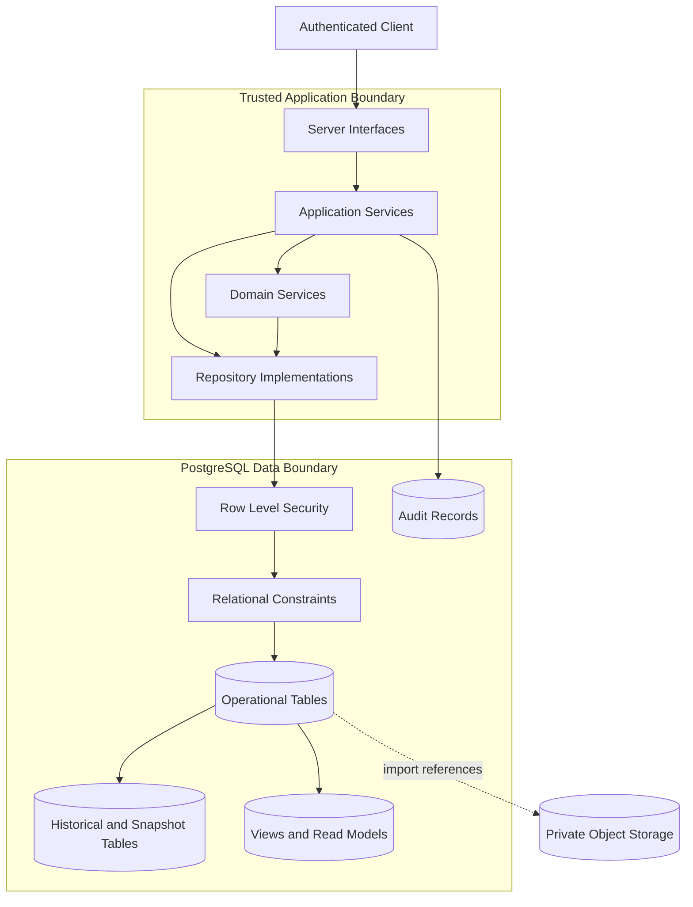

# Database Architecture

**Project:** Financial Operating System

**Internal Codename:** Athena

**Document Version:** 1.0.0

**Status:** Draft

**Owner:** Caitlin Gillum

**Primary Architect:** Caitlin Gillum

**Technical Advisor:** OpenAI ChatGPT

**Last Updated:** July 28, 2026

---

## Table of Contents

- [Purpose](#purpose)
- [Scope](#scope)
- [Database Philosophy](#database-philosophy)
- [Architecture Overview](#architecture-overview)
- [Database Responsibilities](#database-responsibilities)
- [PostgreSQL Design Principles](#postgresql-design-principles)
- [Logical Schema Organization](#logical-schema-organization)
- [Domain-to-Database Mapping](#domain-to-database-mapping)
- [Authoritative and Derived Data](#authoritative-and-derived-data)
- [Identifier Strategy](#identifier-strategy)
- [Ownership Model](#ownership-model)
- [Row Level Security Strategy](#row-level-security-strategy)
- [Relationship Strategy](#relationship-strategy)
- [Normalization Strategy](#normalization-strategy)
- [Controlled Denormalization](#controlled-denormalization)
- [Monetary Data](#monetary-data)
- [Date and Time Data](#date-and-time-data)
- [Status and Enumeration Strategy](#status-and-enumeration-strategy)
- [Constraints and Integrity](#constraints-and-integrity)
  - [Primary Key Constraints](#primary-key-constraints)
  - [Foreign Key Constraints](#foreign-key-constraints)
  - [Unique Constraints](#unique-constraints)
  - [Check Constraints](#check-constraints)
  - [Not-Null Constraints](#not-null-constraints)
- [Financial Accounts](#financial-accounts)
- [Import Persistence](#import-persistence)
- [Transaction Persistence](#transaction-persistence)
- [Merchant and Classification Persistence](#merchant-and-classification-persistence)
- [Review Queue Persistence](#review-queue-persistence)
- [Budget Persistence](#budget-persistence)
- [Bill Persistence](#bill-persistence)
- [Debt Persistence](#debt-persistence)
- [Asset and Liability Persistence](#asset-and-liability-persistence)
- [Net Worth Persistence](#net-worth-persistence)
- [Goal Persistence](#goal-persistence)
- [Specialized Financial Contexts](#specialized-financial-contexts)
- [Dashboard Configuration Persistence](#dashboard-configuration-persistence)
- [Audit Persistence](#audit-persistence)
- [Historical Data Strategy](#historical-data-strategy)
- [Soft Deletion, Archival, and Hard Deletion](#soft-deletion-archival-and-hard-deletion)
- [Import Lineage and Provenance](#import-lineage-and-provenance)
- [Transactional Boundaries](#transactional-boundaries)
- [Idempotency and Duplicate Prevention](#idempotency-and-duplicate-prevention)
- [Concurrency Control](#concurrency-control)
- [Indexing Strategy](#indexing-strategy)
- [Query Performance Strategy](#query-performance-strategy)
- [Reporting and Read Models](#reporting-and-read-models)
- [Database Functions and Triggers](#database-functions-and-triggers)
- [Migration Strategy](#migration-strategy)
- [Seed and Reference Data](#seed-and-reference-data)
- [Backup and Recovery](#backup-and-recovery)
- [Data Retention](#data-retention)
- [Encryption and Sensitive Data](#encryption-and-sensitive-data)
- [Secrets and Privileged Access](#secrets-and-privileged-access)
- [Database Observability](#database-observability)
- [Database Maintenance](#database-maintenance)
- [Testing Strategy](#testing-strategy)
- [Security Considerations](#security-considerations)
- [Performance Considerations](#performance-considerations)
- [Provisional Physical Model](#provisional-physical-model)
- [Requirement Traceability](#requirement-traceability)
- [Deferred Decisions](#deferred-decisions)
- [Related Documents](#related-documents)
- [Revision History](#revision-history)

---

## Purpose

This document defines the database architecture for Project Athena.

It describes how Athena shall persist authoritative financial records, preserve historical state, enforce ownership boundaries, maintain import lineage, support auditability, prevent duplicate financial effects, and provide trusted data to backend services and reporting workflows.

The database architecture bridges the gap between:

- Athena's conceptual Domain Model
- Athena's trusted Backend Architecture
- Athena's future physical PostgreSQL schema

This document defines architectural rules and logical structures without prematurely specifying every table, column, index, or migration.

---

## Scope

This document covers:

- PostgreSQL persistence principles
- Logical schema organization
- Domain-to-database mapping
- Ownership
- Row Level Security
- Identifiers
- Relationships
- Normalization
- Constraints
- Financial precision
- Historical records
- Import lineage
- Transactional consistency
- Idempotency
- Duplicate prevention
- Concurrency
- Indexing
- Reporting
- Audit storage
- Migrations
- Backups
- Recovery
- Retention
- Encryption
- Database testing
- Operational maintenance

This document does not define:

- Final production table definitions
- Final SQL migration files
- Final Row Level Security policies
- Final index names
- Final query-builder or ORM selection
- Final backup provider configuration
- Final Supabase project settings
- Final deployment workflow
- Final retention periods
- Final data warehouse strategy
- Final analytics platform
- Final external financial integration schema

Those decisions will be completed during implementation or documented in separate architecture documents and ADRs.

---

## Database Philosophy

Athena's database is the authoritative source of financial truth.

Authoritative financial state must not be defined by:

- Browser state
- Dashboard configuration
- Cached responses
- AI-generated suggestions
- Export files
- Temporary import records
- Client-side calculations
- Logs
- Third-party provider responses
- Derived reporting views

The database must preserve enough information to explain:

- Where a financial record originated
- Who owns it
- How it was classified
- Whether it was changed
- Which business rule was applied
- Whether it requires review
- Whether it is included in reporting
- How derived financial results were calculated
- Which historical values were valid at a given time

The database is not merely a storage mechanism. It is an integrity boundary for Athena's financial model.

---

## Architecture Overview



Athena shall use PostgreSQL as the primary persistent store.

Supabase may provide managed PostgreSQL, authentication integration, storage integration, and Row Level Security support, but Athena's logical data model shall remain based on standard relational principles.

---

## Database Responsibilities

The database is responsible for:

- Persisting authoritative financial state
- Enforcing relational integrity
- Enforcing required ownership relationships
- Supporting Row Level Security
- Preventing invalid state through constraints
- Preserving historical records
- Supporting transactional operations
- Preventing duplicate records where deterministically possible
- Supporting idempotent workflows
- Maintaining import provenance
- Supporting auditability
- Supporting authorized reporting
- Enabling backup and recovery
- Providing predictable query performance
- Preserving consistency under concurrent access

The database shall not become the sole location for undocumented business logic.

Business behavior should remain visible through Athena's Domain Model, Backend Architecture, application services, and tests.

---

## PostgreSQL Design Principles

Athena shall follow these PostgreSQL design principles:

- Prefer explicit relational structures over unstructured storage.
- Use constraints to protect critical invariants.
- Preserve imported source values separately from derived metadata.
- Model ownership explicitly.
- Apply Row Level Security to protected user data.
- Use fixed-precision monetary storage.
- Preserve history rather than silently overwriting material financial state.
- Use transactions for related financial mutations.
- Design retryable workflows to be idempotent.
- Normalize authoritative data before introducing derived read models.
- Use denormalization only for measured reporting or performance needs.
- Avoid unrestricted JSON as a substitute for data modeling.
- Keep privileged access narrow and server-controlled.
- Treat audit data as protected and append-oriented.
- Make destructive operations explicit and recoverable where practical.
- Use migrations as the only approved production schema-change mechanism.
- Keep development, preview, and production environments isolated.
- Use synthetic data for public examples and automated testing.

---

## Logical Schema Organization

Athena may organize PostgreSQL objects into logical schemas.

A provisional strategy is:

| Schema | Responsibility |
|---|---|
| public | Application-facing domain tables where required by platform conventions |
| financial | Core accounts, transactions, merchants, budgets, debts, assets, and goals |
| imports | Import jobs, source records, parser metadata, and processing outcomes |
| reporting | Authorized views, materialized views, and reporting functions |
| audit | Protected audit records and security-relevant history |
| reference | Controlled reference and lookup data |
| internal | Restricted operational records not exposed to ordinary application clients |

The final use of PostgreSQL schemas depends on Supabase conventions, migration tooling, and Row Level Security behavior.

Logical separation may also be implemented through naming conventions if multiple schemas introduce unnecessary complexity.

---

## Domain-to-Database Mapping

Athena's domain entities will generally map to relational tables, but the mapping need not be one entity to one table.

| Domain Concept | Likely Persistence Pattern |
|---|---|
| User | Authentication provider identity plus Athena profile or ownership record |
| Financial Account | Core account table |
| Import Job | Import job table |
| Import Record | Import source-row table |
| Transaction | Core transaction table |
| Merchant | Merchant table |
| Merchant Alias | Merchant alias table |
| Category | Category table |
| Classification Rule | Rule table |
| Review Item | Review queue table |
| Budget Period | Budget period table |
| Budget Allocation | Allocation table |
| Bill | Recurring bill table |
| Bill Occurrence | Bill occurrence table |
| Debt | Debt table |
| Debt Payment | Debt payment table |
| Asset | Asset table |
| Asset Valuation | Asset valuation history table |
| Liability | Liability table or debt-derived liability projection |
| Net Worth Snapshot | Snapshot header and snapshot-item tables |
| Financial Goal | Goal table and optional contribution history |
| Dashboard Layout | Layout table |
| Widget Configuration | Widget configuration table |
| Child Support Obligation | Specialized obligation table |
| Child Support Payment | Specialized payment table |
| Audit Event | Append-oriented audit table |

The final physical mapping shall follow aggregate boundaries, query patterns, ownership requirements, and consistency rules.

---

## Authoritative and Derived Data

Athena shall distinguish among four database data classes.

### Authoritative Data

Authoritative Data represents accepted financial state.

Examples include:

- Accounts
- Transactions
- Budget allocations
- Debt balances
- Asset valuations
- Support obligations
- Support payments
- Approved classifications
- Approved review resolutions

### Source Data

Source Data preserves external or imported values.

Examples include:

- Original transaction descriptions
- Source dates
- Source amounts
- Source row values
- Parser metadata
- Import-file fingerprint
- Source institution identifiers

### Derived Data

Derived Data is calculated from authoritative records.

Examples include:

- Spending totals
- Budget variance
- Debt payoff projections
- Net worth
- Goal progress
- Dashboard summaries

Derived Data must be reproducible from documented inputs or preserved as a dated snapshot.

### Presentation Data

Presentation Data controls display behavior.

Examples include:

- Dashboard layouts
- Widget order
- Visibility
- User-selected dashboard filters

Presentation Data must not become authoritative financial state.

---

## Identifier Strategy

Athena shall use stable, opaque identifiers.

Recommended properties include:

- Globally unique within Athena
- Non-sequential where externally exposed
- Safe for distributed generation
- Independent of display labels
- Independent of imported source identifiers
- Suitable for references in audit records
- Difficult to enumerate

Potential identifier formats include:

- UUID version 4
- UUID version 7
- Another PostgreSQL-supported opaque identifier

Final identifier format requires implementation validation.

Database identifiers shall not contain:

- Names
- Email addresses
- Account numbers
- Merchant descriptions
- Financial values
- Legal or medical context

Source-provider identifiers may be stored separately and must not replace Athena-owned primary keys.

---

## Ownership Model

All protected user-domain records shall include or derive an owner relationship.

Potential ownership patterns include:

- Direct owner_id on the record
- Ownership inherited through a required parent relationship
- Ownership verified through a join to an owned aggregate

Direct ownership columns should be preferred where they simplify:

- Row Level Security
- Repository queries
- Indexing
- Auditability
- Incident investigation
- Prevention of cross-user joins

Ownership duplication may be acceptable when it is protected by constraints and improves security clarity.

### Ownership Invariants

- Protected records must not exist without a valid owner.
- Ownership changes must be prohibited or strictly controlled.
- Child records must not reference parent records owned by another user.
- Owner scope must be enforced in application code and database policy.
- Privileged service access must not bypass owner checks accidentally.
- Ownership must not be inferred from browser-supplied values alone.

---

## Row Level Security Strategy

Row Level Security shall provide database-level defense in depth.

RLS should apply to user-owned operational tables, including:

- Financial accounts
- Transactions
- Imports
- Budgets
- Bills
- Debts
- Assets
- Goals
- Review items
- Dashboard configurations
- Specialized financial-context records
- User-generated exports

RLS policies should enforce:

- Authenticated access
- Owner-scoped reads
- Owner-scoped inserts
- Owner-scoped updates
- Owner-scoped deletes where deletion is permitted

### Policy Philosophy

RLS is not a substitute for application authorization.

Athena shall use:

- Application-level authorization
- Owner-scoped repositories
- Row Level Security
- Foreign-key and constraint enforcement
- Restricted service-role access

### Privileged Access

Service-role credentials may be required for:

- Background jobs
- Administrative migrations
- Controlled import processing
- Recovery operations
- Audit maintenance
- Scheduled snapshots

Privileged code must perform explicit owner validation before accessing user data.

Service-role credentials must never be exposed to the browser.

---

## Relationship Strategy

Relationships shall use explicit foreign keys wherever practical.

Foreign keys should define:

- Required parent relationships
- Deletion behavior
- Update behavior
- Ownership-compatible references
- Historical preservation rules

Potential deletion behaviors include:

- RESTRICT for financially significant parents
- NO ACTION where deletion requires explicit workflow
- SET NULL for optional non-authoritative references
- CASCADE only for tightly bound dependent records whose independent existence has no meaning

Cascade deletion shall not be the default for authoritative financial records.

---

## Normalization Strategy

Athena shall normalize authoritative financial data to reduce:

- Update anomalies
- Duplicate facts
- Conflicting classifications
- Repeated merchant metadata
- Inconsistent ownership
- Historical corruption
- Double counting

Initial design should generally target third normal form for authoritative records.

Examples include:

- Merchant aliases stored separately from merchants
- Budget allocations stored separately from budget periods
- Debt payments stored separately from debts
- Asset valuations stored separately from assets
- Bill occurrences stored separately from recurring bill definitions
- Snapshot items stored separately from snapshot headers

Normalization should not be pursued mechanically when it would make authorization, reporting, or integrity substantially more difficult.

---

## Controlled Denormalization

Denormalization may be introduced for:

- High-frequency dashboard summaries
- Expensive monthly reporting
- Historical snapshots
- Import-processing summaries
- Cached aggregate values
- Search-oriented projections

Any denormalized value must define:

- Authoritative source
- Calculation logic
- Update mechanism
- Freshness expectations
- Invalidation behavior
- Rebuild strategy
- Failure behavior

Denormalized data must never silently become more authoritative than its source records.

---

## Monetary Data

Authoritative monetary amounts shall use fixed-precision storage.

Athena shall not use floating-point types for financial values.

Potential PostgreSQL representation:

```
NUMERIC(19, 4)
```

The final precision and scale require implementation validation.

### Monetary Rules

- Positive values represent inflows where signed transaction amounts are used.
- Negative values represent outflows where signed transaction amounts are used.
- Some domain fields, such as balances or budget allocations, may require non-negative constraints.
- Currency must be explicit where future multi-currency support is possible.
- Version 1 uses U.S. dollars.
- Rounding rules must be deterministic.
- Intermediate calculations must not introduce uncontrolled precision loss.
- Stored values must not rely on locale-formatted strings.

### Currency Representation

Potential currency representation:

```
currency_code CHAR(3) NOT NULL DEFAULT 'USD'
```

Multi-currency conversion is deferred.

---

## Date and Time Data

Athena must distinguish among:

- Transaction date
- Posting date
- Effective date
- Due date
- Statement period
- Budget period
- Valuation date
- Snapshot date
- Created timestamp
- Updated timestamp
- Completed timestamp

### Storage Guidance

Use:

- DATE for calendar dates without time-of-day meaning
- TIMESTAMPTZ for real-world timestamps
- Explicit period start and end dates for reporting intervals

Athena should store timestamps in UTC and convert them for display.

Calendar-based financial events should not be shifted because of time-zone conversion.

---

## Status and Enumeration Strategy

Statuses must use controlled values.

Potential implementation options include:

- PostgreSQL enum types
- Text columns with check constraints
- Reference tables

Athena should prefer the strategy that best supports:

- Safe migrations
- Type generation
- Validation
- Reporting
- Clear allowed values

Uncontrolled free-text statuses are prohibited.

Status transitions must also be validated by application and domain logic.

---

## Constraints and Integrity

Database constraints shall protect critical invariants even if application validation fails.

### Primary Key Constraints

Every persistent entity must have a stable primary key.

Composite primary keys may be used for pure relationship tables when appropriate, but externally referenced entities should generally have their own opaque identifier.

### Foreign Key Constraints

Foreign keys shall prevent:

- Orphaned records
- Invalid relationships
- Cross-domain reference corruption
- Deletion of required parents without explicit handling

### Unique Constraints

Potential unique constraints include:

- One normalized merchant key per owner
- One merchant alias pattern within a defined scope
- One default dashboard layout per owner
- One budget period per owner and date range where overlapping periods are prohibited
- One import file fingerprint per owner and source policy
- One idempotency key per operation scope
- One snapshot per owner and effective date where policy requires
- One rule priority and pattern combination within a defined scope

Uniqueness requirements must account for archived records and case normalization.

### Check Constraints

Potential check constraints include:

- End date must not precede start date
- Target amount must be non-negative
- Interest rate must be within an allowed range
- Confidence values must remain within defined bounds
- Currency code must follow allowed format
- Review resolution fields must correspond to resolved status
- Closed timestamps must correspond to closed state
- Payment components must reconcile to payment total where required
- Snapshot totals must reconcile to included values where stored
- Account closing date must not precede opening date

### Not-Null Constraints

Required business fields shall use NOT NULL.

Nullable fields must represent genuine absence, optionality, or unknown state.

Null must not be used interchangeably with:

- Zero
- Empty string
- False
- Not applicable
- Unprocessed
- Unknown classification
- Deleted

---

## Financial Accounts

Financial account persistence should support:

- Ownership
- Account type
- Institution
- Masked identifier
- Currency
- Active or archived status
- Opening and closing dates
- Balance source
- Import configuration
- Historical relationships

Potential logical records include:

- financial_accounts
- account_balance_history
- account_import_profiles

Current balance may be:

- Derived from transactions
- Imported from statements
- Manually recorded
- Provided by an external integration

The balance source and effective date must be explicit.

Archived accounts must remain available for historical reporting.

---

## Import Persistence

Import persistence must preserve both operational state and source lineage.

Potential logical records include:

- import_jobs
- import_records
- import_files
- import_errors
- parser_versions
- import_summaries

### Import Job Data

An import job may persist:

- Owner
- Account
- Source institution
- File fingerprint
- Original filename metadata
- Storage reference
- Parser identifier
- Parser version
- Status
- Row counts
- Error counts
- Review counts
- Started timestamp
- Completed timestamp
- Correlation identifier
- Idempotency key

### Import Record Data

An import record may persist:

- Import job
- Source row number
- Raw source representation
- Parsed values
- Normalized candidate values
- Validation outcome
- Duplicate outcome
- Transfer outcome
- Classification outcome
- Review outcome
- Resulting transaction
- Failure reason

Raw source storage must be minimized and protected.

Unstructured source payloads may use JSON where source formats vary, but normalized fields required for processing should remain relational.

---

## Transaction Persistence

Transactions are the core authoritative financial records.

Potential logical records include:

- transactions
- transaction_source_values
- transaction_classifications
- transaction_links
- transaction_adjustments
- transaction_notes
- transaction_history

A transaction record may include:

- Owner
- Account
- Amount
- Currency
- Transaction date
- Posting date
- Transaction type
- Merchant
- Category
- Subcategory
- Purpose
- Life event
- Review status
- Exclusion status
- Source type
- Import record
- Created timestamp
- Updated timestamp
- Version number

### Source Preservation

Original imported values should be stored separately or in clearly identified immutable columns.

User edits must not silently overwrite:

- Source amount
- Source description
- Source date
- Source account reference
- Source institution identifier

### Transaction Links

Transaction relationships may include:

- Transfer pair
- Refund relationship
- Reimbursement relationship
- Debt-payment relationship
- Bill-occurrence relationship
- Support-payment relationship
- Adjustment relationship

Relationship types must be controlled and protected from circular or invalid links.

---

## Merchant and Classification Persistence

Potential logical records include:

- merchants
- merchant_aliases
- categories
- subcategories
- purposes
- life_events
- classification_rules
- classification_rule_versions
- classification_decisions

### Classification Decisions

Athena should preserve:

- Classification result
- Source of decision
- Rule applied
- Rule version
- Actor
- Timestamp
- Confidence where applicable
- Whether review was required
- Whether the decision was overridden

Historical decisions may be stored separately from the current accepted classification.

This allows Athena to explain how a transaction reached its current state.

---

## Review Queue Persistence

Potential logical records include:

- review_items
- review_suggestions
- review_resolutions
- review_history

A review item should preserve:

- Owner
- Review type
- Related aggregate
- Reason
- Current status
- Suggested outcome
- Suggestion source
- Confidence
- Priority
- Created timestamp
- Resolved timestamp
- Resolving actor
- Resulting action

A resolved review item should not lose the ambiguity that originally created it.

---

## Budget Persistence

Potential logical records include:

- budget_periods
- budget_allocations
- budget_income_sources
- sinking_funds
- sinking_fund_movements
- budget_adjustments

Budget periods must preserve:

- Date range
- Status
- Available income basis
- Total allocation
- Actual totals
- Close timestamp
- Reopen history

Actual spending should derive from transactions rather than being manually duplicated.

Closed budget periods should remain stable.

Post-close changes should use explicit adjustments or controlled reopening.

---

## Bill Persistence

Potential logical records include:

- bills
- bill_schedules
- bill_occurrences
- bill_transaction_links

Recurring bill definitions must remain separate from individual due occurrences.

Historical occurrences must preserve the expected amount and due date that applied at the time.

Updating a recurring bill must not silently rewrite past occurrences.

---

## Debt Persistence

Potential logical records include:

- debts
- debt_balance_history
- debt_payments
- debt_payment_allocations
- payoff_scenarios
- payoff_scenario_results

Actual payment history must remain separate from modeled payoff scenarios.

Debt balances may be:

- Derived from payment history
- Imported
- Manually reconciled
- Supplied by a financial integration

The balance source and effective date must be recorded.

---

## Asset and Liability Persistence

Potential logical records include:

- assets
- asset_valuations
- liabilities
- liability_balances
- valuation_sources

Every valuation or liability balance must include:

- Effective date
- Amount
- Source
- Verification status
- Creation timestamp

Current values must not overwrite historical values.

Estimated values must remain distinguishable from verified values.

---

## Net Worth Persistence

Potential logical records include:

- net_worth_snapshots
- net_worth_snapshot_assets
- net_worth_snapshot_liabilities

A snapshot must preserve:

- Snapshot date
- Total assets
- Total liabilities
- Net worth
- Included values
- Source timestamps
- Calculation version
- Creation method

Snapshots should be immutable after finalization.

Corrections should create a replacement or adjustment with a documented relationship rather than silently rewriting history.

---

## Goal Persistence

Potential logical records include:

- financial_goals
- goal_progress_history
- goal_contributions
- goal_account_links

A goal must remain separate from:

- Budget allocation
- Account balance
- Transfer
- Sinking fund

Goal progress may be derived or explicitly snapshotted.

The source of progress must be identifiable.

---

## Specialized Financial Contexts

Athena may support specialized financial contexts such as:

- Legal expenses
- Medical expenses
- Dependent expenses
- Financial support obligations
- Tax-related expenses
- Education expenses

These domains should extend or classify authoritative transactions rather than duplicate them.

Potential patterns include:

- Context-specific extension tables
- Transaction-context links
- Structured classification metadata
- Specialized obligations and payment records

### Design Rule

A specialized financial context must not create a second authoritative copy of the same transaction.

For example, a medical expense record may reference a transaction and add protected medical classification metadata, but it must not duplicate the expense amount as a separate spending event.

---

## Dashboard Configuration Persistence

Potential logical records include:

- dashboard_layouts
- dashboard_widget_configurations
- dashboard_filter_presets

Dashboard configuration should contain:

- Owner
- Layout name
- Default status
- Widget identifier
- Position
- Size
- Visibility
- Supported configuration
- User-selected filters
- Version
- Created timestamp
- Updated timestamp

Presentation configuration must remain separate from financial tables.

Invalid configuration must not affect financial correctness.

---

## Audit Persistence

Audit records shall be stored separately from ordinary domain tables and operational logs.

Potential logical records include:

- audit_events
- audit_event_changes
- security_events

Audit records may include:

- Actor
- Owner context
- Action
- Resource type
- Resource identifier
- Correlation identifier
- Timestamp
- Source
- Outcome
- Previous state reference
- Resulting state reference
- Failure classification

### Audit Storage Principles

- Append-oriented
- Protected from ordinary updates
- Protected from ordinary deletion
- Minimal sensitive payload
- Queryable by correlation identifier
- Independent from application logs
- Retained according to documented policy

Full copies of sensitive records should not be stored in audit payloads unless required.

Field-level changes may be represented using redacted or structured metadata.

---

## Historical Data Strategy

Athena shall preserve history for financially significant state.

Potential historical records include:

- Transaction classification changes
- Account balance history
- Debt balance history
- Asset valuations
- Liability balances
- Budget close state
- Goal progress
- Rule versions
- Review resolutions
- Support obligation changes
- Net worth snapshots
- Dashboard configuration versions where useful

Historical strategy options include:

- Append-only history tables
- Effective-dated records
- Version columns
- Snapshot tables
- Audit events
- Explicit adjustment records

No single history mechanism must serve every purpose.

Audit history, business history, and reporting snapshots have different responsibilities.

---

## Soft Deletion, Archival, and Hard Deletion

Athena shall distinguish:

### Archival

Archival removes a record from active workflows while preserving history.

Examples:

- Closed account
- Completed goal
- Inactive merchant
- Retired classification rule
- Paid-off debt

### Soft Deletion

Soft deletion marks a record as deleted while retaining recoverability.

It may be appropriate for:

- User-created configuration
- Draft records
- Recoverable presentation metadata

### Hard Deletion

Hard deletion permanently removes data.

It may be appropriate for:

- Temporary processing records after retention expires
- Failed uploads with no retained business purpose
- User-requested deletion where legally and operationally supported
- Synthetic test data

### Deletion Rules

- Authoritative financial records should not be hard-deleted through ordinary workflows.
- Deletion must not orphan dependent records.
- Deletion behavior must be explicit.
- Protected deletions must be authorized and audited.
- Legal, compliance, and privacy requirements may override ordinary retention.
- Soft-deleted records must not appear in ordinary queries unless requested.
- Unique constraints must account for soft-deleted records.

---

## Import Lineage and Provenance

Every imported transaction must be traceable to its source.

Lineage may include:

- Import job
- Import record
- Source file
- Source institution
- Source account
- Parser
- Parser version
- Source row number
- Original source values
- Normalization version
- Classification rule
- Review decision

### Lineage Invariants

- Transaction edits must not erase source lineage.
- Import retries must preserve prior attempts.
- Reprocessing must identify the new parser or rule version.
- Source values must remain distinguishable from accepted values.
- A transaction created manually must be marked as manual rather than imported.
- Failed source records must remain observable until retention rules allow deletion.

---

## Transactional Boundaries

Related financial changes must use PostgreSQL transactions.

Examples include:

- Creating an import job and import records
- Creating transactions and linking them to source rows
- Resolving review and updating accepted classification
- Linking both sides of a transfer
- Recording a debt payment and balance change
- Closing a budget period
- Creating a net worth snapshot and snapshot items
- Recording a support payment and applying it to an obligation
- Creating an export record and audit event

### Transaction Rules

- Either all required changes succeed or none do.
- Partial financial state must not be committed silently.
- Transaction scope should be as small as practical.
- External network calls should generally occur outside open database transactions.
- Long-running imports may use controlled batch transactions.
- Batch failure must preserve an accurate job status.

---

## Idempotency and Duplicate Prevention

Athena must prevent repeated requests from creating duplicate financial effects.

Potential controls include:

- Unique idempotency keys
- File fingerprints
- Source record fingerprints
- Transaction fingerprints
- Unique provider references
- Unique job identifiers
- Unique snapshot keys
- Database exclusion constraints where appropriate

### Duplicate Detection Layers

- File-level duplicate detection
- Source-row duplicate detection
- Transaction-level duplicate detection
- Relationship-level duplicate detection
- Workflow-level idempotency

Duplicate candidates that cannot be resolved deterministically should enter review.

Uniqueness constraints should prevent known duplicates, while review workflows should handle ambiguous duplicates.

---

## Concurrency Control

Athena must protect against conflicting writes.

Potential concurrency risks include:

- Two reviews resolving the same item
- Two imports creating the same transaction
- Two sessions editing one transaction
- Concurrent budget activation
- Concurrent debt-balance updates
- Duplicate snapshot generation
- Conflicting default dashboard layouts

Potential controls include:

- Database transactions
- Unique constraints
- Optimistic locking
- Version columns
- Updated-at checks
- SELECT ... FOR UPDATE
- Advisory locks for narrowly justified workflows
- Atomic update statements

Financially significant updates should not rely on silent last-write-wins behavior.

---

## Indexing Strategy

Indexes shall support demonstrated query patterns.

Likely index categories include:

### Ownership Indexes

- Owner identifier
- Owner plus status
- Owner plus date
- Owner plus aggregate identifier

### Transaction Indexes

- Owner and transaction date
- Owner and posting date
- Owner and account
- Owner and merchant
- Owner and category
- Owner and review status
- Import record reference
- Transaction fingerprint

### Import Indexes

- Owner and file fingerprint
- Import job and row number
- Job status
- Correlation identifier
- Resulting transaction

### Reporting Indexes

- Owner and reporting period
- Owner, category, and date
- Owner, transaction type, and date
- Owner and specialized context

### Operational Indexes

- Background-job status
- Idempotency key
- Audit correlation identifier
- Updated timestamp
- Soft-delete or archive status where selective

### Indexing Rules

- Foreign-key columns used in joins should generally be indexed.
- Indexes must reflect actual query patterns.
- Redundant indexes should be avoided.
- Indexes increase write cost and must be justified.
- Partial indexes may support active-record queries.
- Unique indexes may enforce business invariants.
- Index effectiveness shall be measured using query plans.

---

## Query Performance Strategy

Athena's primary query workloads are expected to include:

- Monthly transaction listing
- Date-range filtering
- Category summaries
- Dashboard aggregates
- Import review
- Budget performance
- Debt progress
- Net worth history
- Goal progress
- Specialized expense reporting
- Audit lookup

Performance strategy includes:

- Owner-scoped predicates
- Date-range indexes
- Pagination
- Bounded result sets
- Selective column retrieval
- Avoidance of repeated per-row queries
- Batch loading
- Query-plan review
- Materialized views only where justified
- Background generation for expensive exports
- Measured optimization

Security predicates and RLS must be included when testing query performance.

---

## Reporting and Read Models

Athena may use:

- SQL views
- Security-barrier views where appropriate
- Materialized views
- Reporting tables
- Snapshot tables
- Application-generated projections

Reporting objects must:

- Enforce authorization
- Derive from authoritative records
- Define freshness
- Prevent double counting
- Exclude internal transfers where appropriate
- Distinguish reimbursements from income
- Preserve specialized context without duplicating totals
- Remain rebuildable where derived

Views should not become undocumented locations for critical business logic.

Complex calculations must remain documented and tested.

---

## Database Functions and Triggers

Database functions or triggers may be appropriate for:

- Updated timestamps
- Restricted audit behavior
- Consistency enforcement
- Row Level Security helpers
- Atomic aggregate operations
- Controlled snapshot generation
- Search-vector maintenance

They should not become the default location for all business logic.

### Trigger Rules

Triggers must be:

- Documented
- Tested
- Included in migrations
- Observable
- Deterministic
- Safe under retries
- Limited in scope

Hidden trigger behavior that materially changes financial records should be avoided.

---

## Migration Strategy

All schema changes shall use version-controlled migrations.

Migrations must include:

- Forward change
- Compatibility analysis
- Data migration where required
- Constraint rollout strategy
- Index rollout strategy
- Rollback or recovery plan where practical
- Testing
- Documentation update where architectural behavior changes

### Migration Principles

- No manual production schema changes.
- Migrations must run in deterministic order.
- Development, preview, and production use the same migration history.
- Destructive migrations require explicit review.
- Large data rewrites should be staged.
- New non-null columns may require backfill before enforcement.
- New constraints may require validation against existing data.
- Production migrations must preserve recoverability.

Schema state must be reproducible from source control.

---

## Seed and Reference Data

Seed data may include:

- Default categories
- Default subcategories
- Transaction types
- Account types
- Review types
- Supported currencies
- Widget definitions
- Synthetic demonstration records

Seed data must not include:

- Real financial records
- Real account identifiers
- Real legal information
- Real medical information
- Real names in sensitive contexts
- Credentials
- Production secrets

Reference data changes should use migrations or controlled seed versioning.

---

## Backup and Recovery

Athena must support recovery from:

- Accidental deletion
- Failed migration
- Application defect
- Database corruption
- Provider outage
- Security incident
- User error

Backup strategy should consider:

- Automated backups
- Point-in-time recovery
- Backup retention
- Encryption
- Environment separation
- Restoration testing
- Recovery documentation
- Recovery-point objective
- Recovery-time objective

A backup is not considered reliable until restoration has been tested.

### Recovery Priorities

1. Restore database availability.
2. Protect existing evidence and audit information.
3. Validate ownership and Row Level Security.
4. Reconcile imports and idempotent jobs.
5. Verify financial totals.
6. Confirm historical snapshots.
7. Restore ordinary application access.

---

## Data Retention

Retention periods must be defined for:

- Authoritative transactions
- Import files
- Import source rows
- Failed uploads
- Audit events
- Operational logs
- Background-job records
- Exports
- Soft-deleted records
- Temporary files
- Historical snapshots

Retention policy must balance:

- Financial usefulness
- Privacy
- Recovery
- Auditability
- Storage cost
- Legal obligations
- User expectations

Sensitive data must not be retained indefinitely without documented purpose.

---

## Encryption and Sensitive Data

Athena shall protect sensitive database data through:

- Encryption in transit
- Managed encryption at rest
- Private network and credential controls
- Least-privilege access
- Data minimization
- Redacted logging
- Restricted exports
- Protected backups

Potential field-level encryption may be considered for:

- Highly sensitive notes
- External account references
- Legal metadata
- Medical metadata
- Sensitive source identifiers

Field-level encryption must not be introduced without considering:

- Search requirements
- Indexing
- Key management
- Rotation
- Recovery
- Operational complexity

---

## Secrets and Privileged Access

Database secrets include:

- Connection strings
- Database passwords
- Service-role keys
- Encryption keys
- Backup credentials
- Migration credentials

Secrets must:

- Remain outside source control
- Use environment-specific secret storage
- Be accessible only to required server contexts
- Never appear in client bundles
- Never appear in logs
- Be rotated after suspected exposure
- Follow least privilege

Migration access, application access, background-job access, and administrative access should use separate roles where practical.

---

## Database Observability

Database observability should include:

- Connection usage
- Query latency
- Slow queries
- Lock contention
- Deadlocks
- Transaction failures
- Storage growth
- Index usage
- Sequential scans
- Replication or backup health
- Migration status
- Row Level Security failures where observable

Observability must not expose:

- Full transaction descriptions
- Full account identifiers
- Sensitive legal or medical details
- Uploaded file contents
- Credentials
- Secret values

Operational telemetry must remain separate from financial audit records.

---

## Database Maintenance

Routine database maintenance may include:

- Statistics updates
- Vacuum monitoring
- Index review
- Query-plan review
- Storage-growth review
- Retention cleanup
- Backup validation
- RLS policy review
- Privileged-role review
- Migration verification
- Constraint validation
- Orphan-detection checks
- Integrity reconciliation

Maintenance tasks must be documented and safe to retry where automated.

---

## Testing Strategy

### Schema Tests

Schema tests shall verify:

- Required tables and columns
- Primary keys
- Foreign keys
- Unique constraints
- Check constraints
- Nullability
- Default values
- Allowed statuses
- Ownership fields

### Row Level Security Tests

RLS tests shall verify:

- Owners can read authorized records.
- Owners cannot read another owner's records.
- Owners cannot update another owner's records.
- Owners cannot insert records for another owner.
- Unauthorized sessions are denied.
- Privileged workflows perform explicit owner validation.

### Migration Tests

Migration tests shall verify:

- Clean database creation
- Upgrade from prior schema state
- Data preservation
- Constraint compatibility
- Index creation
- Rollback or recovery procedure where applicable

### Repository Integration Tests

Integration tests shall verify:

- Owner-scoped reads
- Transaction rollback
- Duplicate prevention
- Idempotency
- Concurrency behavior
- Import persistence
- Audit creation
- Historical preservation

### Financial Integrity Tests

Financial tests shall verify:

- Signed amount conventions
- Transfer exclusion
- Reimbursement handling
- Debt-payment linking
- Snapshot totals
- Budget totals
- No double counting
- Deterministic rounding
- Fixed-precision calculations

All tests shall use synthetic or sanitized data.

---

## Security Considerations

Database security risks include:

- Broken Row Level Security
- Overly broad service-role access
- SQL injection
- Cross-owner foreign-key references
- Public storage references
- Sensitive data in audit payloads
- Sensitive data in logs
- Weak deletion controls
- Unprotected backups
- Privileged credential leakage
- Unsafe migration scripts
- Default-public database objects
- Unbounded data exports
- Incorrect reporting views
- Unauthorized direct database access

Required controls include:

- Parameterized queries
- Runtime validation
- Owner-scoped repositories
- Row Level Security
- Least-privilege roles
- Private storage
- Migration review
- Secret scanning
- Backup encryption
- Restore testing
- RLS integration tests
- Audit protection
- Environment isolation
- Restricted production access

---

## Performance Considerations

Database performance objectives include:

- Fast owner-scoped transaction queries
- Efficient monthly imports
- Predictable dashboard response times
- Efficient reporting by date and category
- Scalable review-queue filtering
- Efficient debt and net worth history
- Safe batch persistence
- Bounded export generation

Performance improvements must not compromise:

- Authorization
- Financial correctness
- History
- Auditability
- Recovery
- Data isolation

Athena shall favor measured improvements over premature database complexity.

---

## Provisional Physical Model

The following model is conceptual and does not prescribe final SQL.

The physical schema will be refined during implementation.

---

## Requirement Traceability

| Database Area | Related Requirements |
|---|---|
| Ownership and RLS | FR-025, FR-026, NFR-001 through NFR-004 |
| Accounts | FR-001 through FR-006, FR-020 through FR-022 |
| Imports and lineage | FR-001 through FR-005, FR-030, NFR-005 through NFR-009 |
| Transactions | FR-003 through FR-006, NFR-005, NFR-006 |
| Merchant and classification | FR-007 through FR-010, FR-031, NFR-018 |
| Review queue | FR-009, FR-031, NFR-005, NFR-018 |
| Budgets | FR-011 through FR-013 |
| Reporting data | FR-014 through FR-017, FR-028 |
| Debts | FR-018 through FR-019 |
| Assets and net worth | FR-020 through FR-022 |
| Goals | FR-023 through FR-024 |
| Authentication integration | FR-025, NFR-003 |
| Authorization | FR-026, NFR-001, NFR-002 |
| Audit storage | FR-027, NFR-005, NFR-018 |
| Export records | FR-028, NFR-017 |
| Backup and recovery | FR-029, NFR-007 |
| Dashboard configuration | FR-032, NFR-013 through NFR-018 |
| Financial precision | NFR-005, NFR-006 |
| Performance and indexing | NFR-008, NFR-009 |
| Maintainability and migrations | NFR-010 through NFR-014 |
| Data protection | NFR-001 through NFR-004, NFR-017, NFR-018 |

---

## Deferred Decisions

The following database decisions remain open:

- Final PostgreSQL schema layout
- UUID version
- ORM or query-builder selection
- Migration tooling
- Monetary precision and scale
- Category storage model
- PostgreSQL enums versus check constraints
- Final account-balance model
- Transaction split model
- Joint ownership model
- Multi-currency support
- Transaction-history implementation
- Classification-version storage
- Rule precedence persistence
- Review-history retention
- Soft-deletion conventions
- Archive conventions
- Hard-deletion policy
- Import raw-data retention
- Import file retention
- File fingerprint algorithm
- Transaction fingerprint algorithm
- Transfer-pair constraint design
- Reimbursement relationship design
- Bill reconciliation design
- Debt interest-calculation storage
- Net worth snapshot frequency
- Snapshot immutability enforcement
- Goal-progress storage
- Specialized-context extension pattern
- Audit payload format
- Audit retention
- Field-level encryption
- Database-role strategy
- Materialized-view use
- Reporting schema design
- Cache-table use
- Partitioning thresholds
- Point-in-time recovery settings
- Recovery objectives
- Production maintenance schedule

These decisions shall be resolved only when implementation requirements and measured constraints justify them.

Architecturally significant choices shall be documented through ADRs.

---

## Related Documents

- docs/product-requirements.md
- docs/architecture/README.md
- docs/architecture/engineering-principles.md
- docs/architecture/system-architecture.md
- docs/architecture/application-architecture.md
- docs/architecture/frontend-architecture.md
- docs/architecture/domain-model.md
- docs/architecture/backend-architecture.md
- docs/adr/README.md
- docs/adr/0002-initial-technology-stack.md

---

## Revision History

| Version | Date | Author | Summary |
|---|---|---|---|
| 1.0.0 | 2026-07-28 | Caitlin Gillum | Defined Athena's PostgreSQL database architecture, authoritative-data philosophy, ownership and Row Level Security model, relational integrity strategy, financial precision, historical preservation, import lineage, transactional boundaries, indexing, migrations, backup, recovery, and database testing expectations. |
