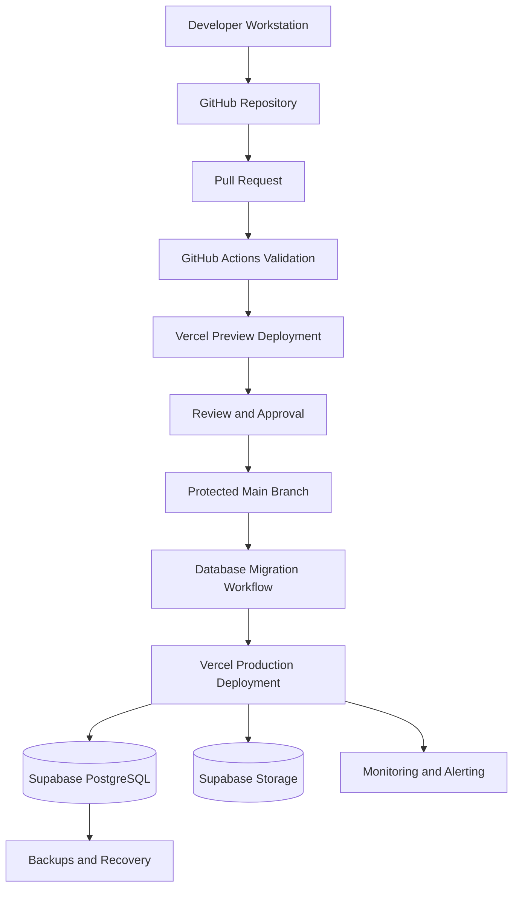
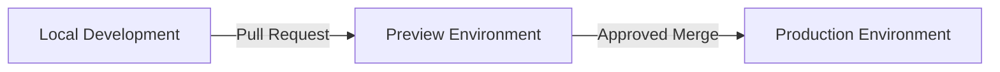
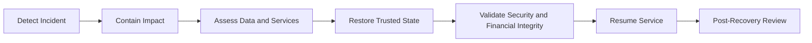

# Deployment Architecture

**Project:** Financial Operating System

**Internal Codename:** Athena

**Document Version:** 1.0.0

**Status:** Draft

**Owner:** Caitlin Gillum

**Primary Architect:** Caitlin Gillum

**Technical Advisor:** OpenAI ChatGPT

**Last Updated:** July 29, 2026

---

## Table of Contents

- [Purpose](#purpose)
- [Scope](#scope)
- [Deployment Philosophy](#deployment-philosophy)
- [Deployment Objectives](#deployment-objectives)
- [Deployment Principles](#deployment-principles)
- [Architecture Overview](#architecture-overview)
- [Technology and Hosting Strategy](#technology-and-hosting-strategy)
- [Infrastructure Components](#infrastructure-components)
- [Environment Strategy](#environment-strategy)
  - [Local Development](#local-development)
  - [Preview](#preview)
  - [Production](#production)
- [Environment Isolation](#environment-isolation)
- [Source Control as the Deployment Authority](#source-control-as-the-deployment-authority)
- [Branch and Release Model](#branch-and-release-model)
- [Deployment Pipeline](#deployment-pipeline)
- [Pull Request Validation](#pull-request-validation)
- [Build Process](#build-process)
- [Build Artifacts](#build-artifacts)
- [Configuration Management](#configuration-management)
- [Environment Variables](#environment-variables)
- [Secrets Management](#secrets-management)
- [Deployment Ordering](#deployment-ordering)
- [Database Migration Deployment](#database-migration-deployment)
- [Backward-Compatible Changes](#backward-compatible-changes)
- [Application Deployment](#application-deployment)
- [Preview Deployments](#preview-deployments)
- [Production Deployments](#production-deployments)
- [Release Process](#release-process)
- [Deployment Approval](#deployment-approval)
- [Health Checks](#health-checks)
- [Startup and Runtime Validation](#startup-and-runtime-validation)
- [Rollback Strategy](#rollback-strategy)
- [Roll-Forward Strategy](#roll-forward-strategy)
- [Failed Deployment Handling](#failed-deployment-handling)
- [Availability Strategy](#availability-strategy)
- [Scalability Strategy](#scalability-strategy)
- [Performance Strategy](#performance-strategy)
- [Network and Connectivity](#network-and-connectivity)
- [Domain and DNS](#domain-and-dns)
- [TLS and HTTPS](#tls-and-https)
- [Database Connectivity](#database-connectivity)
- [Storage Connectivity](#storage-connectivity)
- [Background Work and Scheduled Operations](#background-work-and-scheduled-operations)
- [Observability](#observability)
- [Logging](#logging)
- [Metrics](#metrics)
- [Tracing and Correlation](#tracing-and-correlation)
- [Monitoring](#monitoring)
- [Alerting](#alerting)
- [Backup Integration](#backup-integration)
- [Disaster Recovery](#disaster-recovery)
- [Recovery Objectives](#recovery-objectives)
- [Operational Runbooks](#operational-runbooks)
- [Maintenance and Change Management](#maintenance-and-change-management)
- [Infrastructure Changes](#infrastructure-changes)
- [Cost Management](#cost-management)
- [Security Considerations](#security-considerations)
- [Deployment Testing Strategy](#deployment-testing-strategy)
- [Production Readiness Review](#production-readiness-review)
- [Requirement Traceability](#requirement-traceability)
- [Deferred Decisions](#deferred-decisions)
- [Related Documents](#related-documents)
- [Revision History](#revision-history)

---

## Purpose

This document defines the deployment architecture for Project Athena.

It describes how Athena shall move safely and consistently from source code to a running application across local development, preview, and production environments.

The Deployment Architecture establishes requirements for:

- Source-controlled releases
- Automated validation
- Reproducible builds
- Environment isolation
- Configuration management
- Secret protection
- Database migrations
- Deployment sequencing
- Health verification
- Rollback and recovery
- Monitoring
- Operational readiness
- Availability
- Scalability
- Secure production access

This document ensures that Athena's deployment model preserves the security, integrity, auditability, and financial correctness defined by the rest of the architecture suite.

---

## Scope

This document covers:

- Hosting strategy
- Infrastructure components
- Environment separation
- Source-control deployment
- Pull-request validation
- Build and release pipelines
- Configuration
- Secrets
- Database migrations
- Preview deployments
- Production deployments
- Release approval
- Health checks
- Rollback
- Recovery
- Availability
- Scalability
- Network connectivity
- Domain and TLS
- Observability
- Logging
- Metrics
- Monitoring
- Alerting
- Backups
- Disaster recovery
- Operational runbooks
- Production-readiness review

This document does not define:

- Final Vercel plan
- Final Supabase plan
- Final custom-domain name
- Final DNS provider
- Final monitoring provider
- Final alerting provider
- Final logging provider
- Final background-job provider
- Final infrastructure-as-code tooling
- Final service-level objectives
- Final recovery objectives
- Final release cadence
- Final production support model
- Final maintenance-window schedule
- Final cost budget

Those decisions will be resolved during implementation or documented in separate ADRs and operational procedures.

---

## Deployment Philosophy

Athena shall be deployed through controlled, repeatable, observable, and recoverable processes.

Production must never depend on undocumented manual actions.

Every deployment should answer:

- What changed?
- Who approved it?
- Which commit produced it?
- Which tests passed?
- Which configuration was used?
- Which migration state was expected?
- How was success verified?
- How can the change be reversed or corrected?
- What operational signals should be monitored?

A deployment is not complete when code reaches a hosting provider.

A deployment is complete only when:

- The expected application version is running.
- Required database changes are complete.
- Health checks pass.
- Critical user workflows remain functional.
- Monitoring confirms normal behavior.
- Recovery remains possible.
- The release is traceable to source control.

---

## Deployment Objectives

Athena's deployment architecture has the following objectives.

### Reproducibility

The same source, dependencies, configuration contract, and build process should produce equivalent results.

### Safety

Deployments must not expose data, corrupt financial state, bypass authorization, or introduce incompatible database behavior.

### Traceability

Every deployed version must map to a source-control commit and approved workflow.

### Recoverability

Failed releases must have a documented rollback or roll-forward path.

### Isolation

Development, preview, and production must remain operationally and logically separate.

### Observability

Deployment status and runtime health must be measurable.

### Automation

Repeatable checks and release steps should be automated where practical.

### Simplicity

Version 1 should use the simplest deployment architecture that meets Athena's security and reliability requirements.

---

## Deployment Principles

Athena shall follow these deployment principles:

1. Deploy from source control only.
2. Never modify production application code manually.
3. Every deployment must be traceable to a commit.
4. Every deployment must be reproducible.
5. Every deployment must be observable.
6. Every deployment must preserve a recovery path.
7. Production is not a testing environment.
8. Preview environments must not use production data.
9. Secrets must remain separate from build artifacts.
10. Infrastructure and configuration changes must be reviewed.
11. Database changes must use version-controlled migrations.
12. Schema changes should remain backward compatible during rollout.
13. Failed deployments must fail safely.
14. Health checks must validate meaningful dependencies.
15. Automated tests must run before production deployment.
16. Deployment credentials must follow least privilege.
17. Production data must remain isolated from lower environments.
18. Rollback procedures must be considered before release.
19. Manual operational actions must be documented.
20. Deployment complexity must be justified by actual requirements.

---

## Architecture Overview

Athena's initial deployment model shall use:

- GitHub for source control and workflow history
- GitHub Actions for automated validation
- Vercel for Next.js application hosting
- Supabase for PostgreSQL, authentication, and private storage
- Managed HTTPS and domain routing
- Environment-specific configuration and credentials

---

## Technology and Hosting Strategy

Athena's accepted Version 1 deployment stack is:

| Responsibility | Technology |
|---|---|
| Source control | GitHub |
| Continuous integration | GitHub Actions |
| Application hosting | Vercel |
| Frontend and backend runtime | Next.js on Vercel |
| Database | Supabase PostgreSQL |
| Authentication | Supabase Auth |
| File storage | Supabase Storage |
| Deployment environments | Local, Vercel Preview, Vercel Production |
| Database migrations | Version-controlled PostgreSQL migrations |
| Domain and HTTPS | Managed DNS and TLS |
| Monitoring | Provider-native and application telemetry, final provider deferred |

The initial architecture favors managed infrastructure to reduce operational burden while maintaining professional deployment controls.

---

## Infrastructure Components

Athena's deployment architecture includes the following components.

### GitHub Repository

The GitHub repository stores:

- Application source
- Documentation
- Database migrations
- Automated tests
- CI/CD workflows
- Configuration templates
- Operational runbooks
- Release history

### GitHub Actions

GitHub Actions may perform:

- Dependency installation
- Formatting checks
- Linting
- Type checking
- Unit tests
- Integration tests
- Build verification
- Security scanning
- Migration validation
- Deployment checks

### Vercel

Vercel hosts:

- Next.js pages
- Server Components
- Server Actions
- Route Handlers
- Static assets
- Preview deployments
- Production deployment

### Supabase

Supabase provides:

- PostgreSQL
- Authentication
- Row Level Security
- Private object storage
- Managed backups according to selected service capabilities

### External Operational Services

Future operational services may provide:

- Application monitoring
- Error tracking
- Alerting
- Log aggregation
- Job scheduling
- Email
- Security monitoring

These services must be reviewed before receiving access to Athena data or secrets.

---

## Environment Strategy

Athena shall use at least three environment classes.

### Local Development

Local development supports:

- Feature development
- Unit testing
- Local builds
- Local migration testing
- Synthetic seed data
- Debugging
- Documentation work

Local development must not require production credentials or production data.

### Preview

Preview environments support:

- Pull-request review
- Visual verification
- Integration testing
- Accessibility testing
- Build validation
- Stakeholder review
- Environment-specific smoke tests

Preview deployments must use:

- Non-production credentials
- Non-production database resources
- Synthetic or sanitized data
- Clearly labeled environment state

### Production

Production hosts authoritative user workflows and protected financial data.

Production requires:

- Approved source
- Production credentials
- Production database and storage
- Required automated checks
- Deployment traceability
- Monitoring
- Backup integration
- Recovery procedures
- Restricted administrative access

---

## Environment Isolation

Each environment shall use separate:

- Database
- Authentication configuration
- Storage
- Service-role credentials
- Application secrets
- Deployment configuration
- Monitoring context
- External integration credentials where practical

Production credentials must not be available to:

- Local development
- Untrusted pull requests
- Public forks
- Ordinary preview deployments
- Client-side code
- Test suites that do not require them

Production data shall not be copied into lower environments unless it is explicitly sanitized and approved.

Environment identity should be visible through safe operational metadata without exposing secrets.

---

## Source Control as the Deployment Authority

GitHub shall be the authoritative source for deployable application state.

Production changes must originate from:

- Reviewed source changes
- Version-controlled migrations
- Approved workflow configuration
- Controlled environment configuration
- Documented operational procedures

The following are prohibited:

- Editing production code directly
- Applying undocumented production schema changes
- Deploying uncommitted local code
- Storing production secrets in the repository
- Bypassing required checks without documented emergency justification

Emergency actions must be recorded and followed by reconciliation into source control.

---

## Branch and Release Model

Athena shall use a protected default branch.

A provisional workflow is:

1. Create a feature branch.
2. Make one focused change.
3. Open a pull request.
4. Run automated checks.
5. Create or update a preview deployment.
6. Review code, documentation, and behavior.
7. Merge after approval.
8. Deploy the protected branch to production.
9. Verify deployment health.
10. Monitor the release.

Potential branch naming examples include:

- `feature/deployment-architecture`
- `feature/transaction-import`
- `fix/import-duplicate-detection`
- `docs/security-runbook`

Long-lived environment branches should be avoided unless an operational need justifies them.

---

## Deployment Pipeline

```mermaid
flowchart LR
    Commit[Feature Branch Commit]
    PullRequest[Pull Request]
    Static[Formatting, Lint, Type Check]
    Tests[Automated Tests]
    Build[Production Build]
    Security[Security Checks]
    Preview[Preview Deployment]
    Review[Human Review]
    Merge[Merge to Main]
    Migration[Migration Validation and Application]
    Deploy[Production Deployment]
    Verify[Health and Smoke Tests]
    Observe[Post-Deployment Monitoring]

    Commit --> PullRequest
    PullRequest --> Static
    Static --> Tests
    Tests --> Build
    Build --> Security
    Security --> Preview
    Preview --> Review
    Review --> Merge
    Merge --> Migration
    Migration --> Deploy
    Deploy --> Verify
    Verify --> Observe
```

The final sequence may vary depending on migration compatibility and provider capabilities.

---

## Pull Request Validation

Pull requests should run automated validation before merge.

Required checks may include:

- Markdown validation
- Formatting
- Linting
- Type checking
- Unit tests
- Integration tests
- Build verification
- Dependency scanning
- Secret scanning
- Migration validation
- Row Level Security tests where applicable
- Accessibility checks for affected interfaces
- Security tests for protected workflows

A preview deployment should not be treated as approved merely because the application builds.

---

## Build Process

The build process shall:

- Use a supported Node.js version
- Use a committed dependency lockfile
- Install exact dependency versions
- Validate required configuration
- Run TypeScript checks
- Build the Next.js application
- Fail on blocking errors
- Avoid production-data access
- Avoid exposing server-only variables
- Produce traceable build output

Builds should be deterministic to the extent supported by the selected tools.

The build process must not mutate production infrastructure.

---

## Build Artifacts

Athena's build artifacts may include:

- Compiled application output
- Static assets
- Server bundles
- Route metadata
- Source maps subject to security policy
- Build manifests
- Deployment metadata

Build artifacts must not contain:

- Database passwords
- Service-role keys
- Authentication secrets
- Private storage credentials
- Production exports
- Uploaded files
- Local environment files
- Real financial test data

Secrets shall be injected through approved runtime or deployment configuration rather than packaged into reusable artifacts.

---

## Configuration Management

Configuration shall be:

- Environment-specific
- Validated at startup or build time
- Documented
- Typed where practical
- Separate from source-code behavior
- Safe to inspect without exposing secrets where possible

Configuration categories may include:

- Application environment
- Public application URL
- Database connection settings
- Supabase project identifiers
- Feature flags
- Upload limits
- Logging level
- Monitoring configuration
- Provider endpoints
- Retention settings

Missing or invalid required configuration must cause a safe, visible failure rather than undefined behavior.

---

## Environment Variables

Environment variables shall be classified as:

### Public Variables

Public variables may be included in client-visible bundles.

They must not contain secrets.

### Server-Only Variables

Server-only variables may include:

- Database credentials
- Service-role keys
- Private API keys
- Monitoring credentials
- Encryption keys
- Migration credentials

### Environment Variable Rules

- Client-visible prefixes must be reviewed carefully.
- Server-only variables must never be imported into client code.
- Example environment files may contain placeholders only.
- Environment variable names should remain consistent across environments.
- Values must be environment-specific.
- Required variables must be validated.
- Deprecated variables must be removed.

---

## Secrets Management

Secrets shall be stored using approved provider secret-management capabilities.

Secrets must:

- Remain outside Git history
- Be scoped by environment
- Follow least privilege
- Be rotated after suspected exposure
- Never be logged
- Never be placed in documentation screenshots
- Never be embedded in build output
- Never be exposed to preview environments without a defined requirement

Production deployment secrets should be accessible only to approved production workflows.

CI workflows should receive only the secrets required for their specific job.

---

## Deployment Ordering

Application and database changes must be deployed in a compatible order.

A safe deployment may require:

1. Add backward-compatible database structures.
2. Deploy application code that supports old and new states.
3. Backfill or migrate data.
4. Enable new behavior.
5. Remove obsolete code.
6. Remove obsolete schema only in a later release.

Athena shall avoid releases that require the application and database to switch atomically unless the process is explicitly designed and tested.

---

## Database Migration Deployment

Database migrations shall be:

- Version controlled
- Reviewed
- Tested locally
- Tested against a disposable environment
- Validated against the prior schema state
- Applied through an approved workflow
- Traceable to the release
- Observable
- Recoverable where practical

Production migrations must not be applied automatically from untrusted pull requests.

### Migration Risk Categories

#### Low Risk

Examples:

- Add nullable column
- Add new table
- Add non-blocking index where supported
- Add unused reference data

#### Moderate Risk

Examples:

- Add required constraint after backfill
- Change query-critical index
- Introduce Row Level Security policy
- Backfill existing rows

#### High Risk

Examples:

- Drop column
- Rewrite large table
- Change monetary precision
- Change ownership relationship
- Remove accepted status
- Change primary key
- Modify audit behavior

Moderate- and high-risk migrations require explicit review and a documented recovery approach.

---

## Backward-Compatible Changes

Athena should prefer backward-compatible database and interface changes.

Examples include:

- Add before remove
- Read old and new formats temporarily
- Backfill before enforcing
- Deploy consumers before deleting legacy data
- Version behavior where coexistence is required
- Delay destructive cleanup

Backward compatibility reduces deployment coupling and makes rollback safer.

---

## Application Deployment

The application deployment shall:

- Reference an approved commit
- Use the correct environment configuration
- Complete a production build
- Use production-only secrets
- Connect only to production services
- Record deployment metadata
- Provide a visible deployment outcome
- Support rollback to a prior application version

Deployment success must not be inferred solely from build completion.

---

## Preview Deployments

Each eligible pull request may receive a preview deployment.

Preview deployments shall:

- Use non-production data
- Use non-production authentication
- Use non-production storage
- Avoid production service-role keys
- Clearly identify themselves as preview
- Support review of changed behavior
- Be removable after the pull request closes
- Avoid creating persistent operational obligations

Preview deployment access may be restricted if the application contains sensitive functionality even when synthetic data is used.

---

## Production Deployments

Production deployment shall occur only from an approved source branch or release reference.

Production deployment requirements include:

- Required checks passed
- Required review completed
- Migration compatibility confirmed
- Production configuration validated
- Recovery path understood
- Monitoring available
- No known unresolved release-blocking security issue
- Smoke tests defined
- Deployment owner identifiable

Direct production deployment from an arbitrary local branch is prohibited.

---

## Release Process

A production release should follow this sequence:

1. Confirm pull-request checks.
2. Confirm review approval.
3. Confirm migration requirements.
4. Confirm environment configuration.
5. Confirm backup and recovery readiness for material changes.
6. Merge or promote the approved source.
7. Apply compatible database migrations.
8. Deploy the application.
9. Run health checks.
10. Run smoke tests.
11. Review logs and metrics.
12. Record release outcome.
13. Continue heightened monitoring for an appropriate period.

Release notes may summarize:

- Version
- Commit
- Changes
- Migration state
- Known limitations
- Recovery instructions
- Verification results

---

## Deployment Approval

Version 1 may use a lightweight approval model while preserving traceability.

Approval expectations include:

- No self-bypassing of failed required checks
- Explicit review of security-sensitive workflow changes
- Explicit review of migrations
- Explicit review of secret or permission changes
- Explicit review of destructive actions
- Production deployment only from protected source

As the project grows, environment protection rules may require a distinct production approval.

---

## Health Checks

Health checks should validate more than the application process.

Potential checks include:

- Application route availability
- Expected deployment version
- Required configuration loaded
- Database connectivity
- Database migration compatibility
- Authentication-provider availability
- Private storage connectivity
- Background-job health where applicable

Health checks must not expose:

- Secrets
- Internal stack traces
- Database structure
- Sensitive financial data
- Privileged provider details

### Health States

Potential health states include:

- Healthy
- Degraded
- Unavailable
- Misconfigured

A dependency outage may result in degraded rather than completely failed service when safe behavior is possible.

---

## Startup and Runtime Validation

Athena shall validate required configuration before serving protected workflows.

Validation may include:

- Environment name
- Public application URL
- Supabase project configuration
- Server-only credentials
- Storage configuration
- Monitoring configuration
- Supported runtime version
- Database migration version

Invalid configuration must fail clearly and safely.

Silent fallback to an unintended environment is prohibited.

---

## Rollback Strategy

Rollback restores a previous application version when the new release is unsafe.

Rollback may include:

- Reverting application deployment
- Disabling a feature flag
- Reverting configuration
- Stopping a background job
- Restoring a prior database state only when necessary and safe

### Rollback Constraints

Application rollback is straightforward only when the database remains compatible.

Destructive database changes may make application rollback unsafe.

Athena shall therefore:

- Prefer additive schema changes
- Separate destructive cleanup into later releases
- Document migration compatibility
- Avoid immediate removal of old fields
- Test prior application compatibility where material

A database backup is not a substitute for a safe migration strategy.

---

## Roll-Forward Strategy

Some failures are safer to correct through a new deployment than by reverting.

Roll-forward is appropriate when:

- Data has already been written in the new format
- A migration cannot be safely reversed
- A small corrective change is lower risk
- Reverting would reintroduce a security issue
- External side effects have already occurred

Roll-forward actions must remain reviewed, tested, and traceable.

---

## Failed Deployment Handling

When a deployment fails:

1. Stop further promotion.
2. Determine whether production traffic changed.
3. Preserve logs and deployment metadata.
4. Identify whether database changes were applied.
5. Roll back or roll forward based on compatibility.
6. Verify application and database health.
7. Confirm financial workflows remain consistent.
8. Document the failure and corrective action.
9. Add regression coverage where practical.

A failed build should not affect production.

A failed post-deployment verification may require immediate rollback or traffic isolation.

---

## Availability Strategy

Athena's Version 1 availability strategy shall rely primarily on managed platform capabilities.

Availability considerations include:

- Managed application hosting
- Managed database service
- Managed authentication
- Managed object storage
- Automated backups
- Provider health monitoring
- Safe degraded behavior
- Recovery procedures
- Minimal infrastructure complexity

Athena is initially expected to operate as a single-region managed application unless requirements justify broader redundancy.

Multi-region architecture is deferred.

---

## Scalability Strategy

Athena should scale through simple managed-platform capabilities before introducing distributed architecture.

Expected Version 1 strategies include:

- Serverless application scaling
- Efficient database indexes
- Paginated queries
- Bounded report requests
- Background processing for expensive operations
- Private object storage for files
- Connection pooling where required
- Query optimization
- Controlled caching where justified

The modular monolith should remain intact until measured demand demonstrates a need for service separation.

---

## Performance Strategy

Deployment-related performance concerns include:

- Application cold starts
- Build duration
- Deployment duration
- Database connection limits
- Import duration
- Report-generation duration
- Static asset delivery
- Image optimization
- Cache behavior
- Regional latency

Performance optimizations shall not weaken:

- Authorization
- Input validation
- Financial correctness
- Auditability
- Data isolation
- Recovery

Performance targets should be measured in production-like environments.

---

## Network and Connectivity

Athena's network architecture should minimize unnecessary exposure.

Expected connectivity includes:

- User browser to Vercel over HTTPS
- Vercel server runtime to Supabase over encrypted connections
- Application runtime to approved monitoring or operational providers
- CI/CD to approved deployment and migration interfaces

The database should not be exposed to arbitrary public clients beyond approved provider access patterns.

Direct client access to Supabase resources must remain governed by authentication, Row Level Security, and storage policies.

---

## Domain and DNS

Athena may initially use provider-generated domains during development and preview.

Production should use a controlled custom domain when the application is ready for public use.

Domain controls should include:

- Controlled registrar access
- Multi-factor authentication
- Restricted DNS permissions
- Documented ownership
- Renewal protection
- Approved DNS changes
- No sensitive environment identifiers in public hostnames where avoidable

DNS changes should be reviewed because they can redirect application traffic.

---

## TLS and HTTPS

Production traffic must use HTTPS.

Expected protections include:

- Managed TLS certificates
- Automatic certificate renewal
- Redirect from HTTP to HTTPS
- Secure cookies
- HSTS when validated for the production domain
- No mixed-content dependencies

Certificate or domain failures should generate actionable operational alerts where supported.

---

## Database Connectivity

Application-to-database connectivity shall use:

- Encrypted transport
- Environment-specific credentials
- Least-privilege access
- Connection limits
- Approved pooling where required
- Timeout behavior
- Safe retry rules
- Observable failures

Database connection strings must remain server-only.

The browser must not receive privileged database credentials.

---

## Storage Connectivity

Private file storage shall use:

- Environment-specific buckets
- Restricted credentials
- Owner-scoped policies
- Generated object identifiers
- Signed access where required
- Expiring access links
- Upload and download limits
- Safe failure behavior

Production and preview storage must remain separate.

Storage access failures must not reveal object existence across ownership boundaries.

---

## Background Work and Scheduled Operations

Background work may support:

- Imports
- Exports
- Snapshot generation
- Scheduled reports
- Retention cleanup
- Backup verification
- Notification generation

Deployment considerations include:

- Job-version compatibility
- Safe retry
- Idempotency
- Owner context
- Job status visibility
- Deployment during active jobs
- Migration compatibility
- Dead-letter or failed-job handling

A new application deployment must not make existing queued work unsafe.

Versioned job payloads may be required when jobs can outlive a release.

---

## Observability

Athena's deployment and runtime behavior must be observable.

Observability should support:

- Release verification
- Error investigation
- Performance analysis
- Dependency health
- Database health
- Import health
- Security monitoring
- Capacity planning
- Recovery

Observability data must remain sanitized and access controlled.

---

## Logging

Deployment and runtime logs may include:

- Deployment identifier
- Commit identifier
- Environment
- Request correlation identifier
- Error category
- Route or workflow
- Duration
- Job status
- Migration status
- Provider failure category

Logs must exclude or redact:

- Authentication tokens
- Passwords
- Service-role keys
- Database connection strings
- Uploaded file contents
- Full transaction descriptions
- Full account identifiers
- Private storage links
- Sensitive legal or medical details
- Raw exports

---

## Metrics

Potential metrics include:

### Deployment Metrics

- Build success rate
- Build duration
- Deployment duration
- Deployment frequency
- Rollback frequency
- Failed release rate

### Application Metrics

- Request count
- Error rate
- Response duration
- Authentication failures
- Authorization failures
- Import duration
- Import failure rate
- Export duration
- Background-job failures

### Infrastructure Metrics

- Database connections
- Query latency
- Storage failures
- Backup status
- Provider availability
- Resource usage

Metrics must be meaningful and actionable.

---

## Tracing and Correlation

Athena should use correlation identifiers across:

- Incoming request
- Application workflow
- Database operation
- Background job
- Import process
- Audit event
- Operational logs

Correlation improves investigation without requiring sensitive payloads.

A correlation identifier must not contain personal or financial information.

---

## Monitoring

Monitoring should confirm:

- Production application availability
- Authentication availability
- Database connectivity
- Storage connectivity
- Error-rate thresholds
- Import health
- Background-job health
- Backup status
- Deployment outcome
- Security-sensitive failure patterns

Provider-native health information may be combined with application-level checks.

---

## Alerting

Alerts should be generated for conditions requiring action.

Potential alerts include:

- Production deployment failure
- Health-check failure
- Elevated error rate
- Database connection failure
- Backup failure
- Repeated authorization failure
- Import-processing failure spike
- Background-job backlog
- Storage-access failure
- Secret-scanning result
- Critical dependency vulnerability
- Unexpected privileged activity

Alerts should include:

- Environment
- Severity
- Time
- Affected component
- Correlation or deployment identifier
- Safe diagnostic context
- Runbook reference

Alert content must not include sensitive financial data.

---

## Backup Integration

The deployment architecture must account for database and storage backup behavior.

Backup integration should define:

- Backup provider
- Frequency
- Retention
- Encryption
- Access control
- Restoration process
- Restoration validation
- Environment isolation
- Recovery ownership

Application deployments that introduce high-risk migrations may require confirmation of recent backup readiness.

Backups must not be treated as complete until restoration has been tested.

---

## Disaster Recovery

Disaster recovery addresses severe failures such as:

- Database corruption
- Destructive migration
- Provider outage
- Credential compromise
- Data-loss incident
- Storage exposure
- Application-wide security defect
- Accidental production deletion

Recovery must validate more than availability.

Athena must also confirm:

- Ownership isolation
- Row Level Security
- Import consistency
- Transaction integrity
- Audit continuity
- Snapshot consistency
- Secret validity
- Backup trustworthiness

---

## Recovery Objectives

Athena should define:

### Recovery Point Objective

The maximum acceptable amount of data loss measured in time.

### Recovery Time Objective

The target duration for restoring acceptable service.

Final RPO and RTO values are deferred until:

- Production usage is understood
- Hosting plans are selected
- Backup capabilities are confirmed
- Operational ownership is established

Version 1 should document provider capabilities and realistic recovery expectations before launch.

---

## Operational Runbooks

Athena should maintain concise runbooks for:

- Failed production deployment
- Failed database migration
- Application rollback
- Database restoration
- Credential rotation
- Account takeover response
- Cross-user data exposure
- Storage exposure
- Import-processing failure
- Backup failure
- Provider outage
- Excessive error rate
- Lost domain or DNS control

Runbooks should include:

- Trigger conditions
- Immediate actions
- Required access
- Verification steps
- Recovery steps
- Escalation path
- Documentation requirements

Runbooks must not include plaintext secrets.

---

## Maintenance and Change Management

Operational changes should follow the same discipline as application changes.

Maintenance activities may include:

- Dependency upgrades
- Runtime upgrades
- Database maintenance
- Index changes
- RLS policy changes
- Secret rotation
- Domain changes
- Monitoring updates
- Retention cleanup
- Backup tests

Material changes should be:

- Planned
- Reviewed
- Tested
- Scheduled where appropriate
- Observable
- Recoverable
- Documented

---

## Infrastructure Changes

Infrastructure configuration should be version controlled where supported.

Potential infrastructure changes include:

- Vercel project configuration
- GitHub Actions workflows
- Environment variable contracts
- Supabase migrations
- Storage policies
- RLS policies
- DNS records
- Monitoring configuration
- Scheduled jobs

Manual provider-console changes should be minimized.

When manual changes are necessary, they must be documented and reconciled into the project's operational records or infrastructure definitions.

---

## Cost Management

Athena's initial infrastructure should remain cost-conscious.

Cost considerations include:

- Vercel usage
- Supabase compute and storage
- Database growth
- Backup retention
- File storage
- Egress
- Monitoring volume
- Log retention
- Background jobs
- Preview environment usage
- Third-party integrations

Cost optimization must not weaken:

- Data protection
- Backup reliability
- Authentication
- Monitoring
- Financial correctness
- Recovery readiness

Usage alerts and budget thresholds may be configured when supported.

All financial planning examples in public documentation should use synthetic amounts in U.S. dollars.

---

## Security Considerations

Deployment security risks include:

- Production secrets exposed to pull requests
- Unreviewed workflow changes
- Compromised deployment tokens
- Production data used in preview
- Unsafe migrations
- Public preview environments
- Incorrect environment selection
- Unauthorized production deployment
- Misconfigured domains
- Insecure storage buckets
- Disabled Row Level Security
- Sensitive logs
- Dependency compromise
- Third-party action compromise
- Backup exposure
- Excessive operational privilege

Required controls include:

- Protected branches
- Required checks
- Least-privilege CI permissions
- Environment-specific secrets
- Production environment protection
- Secret scanning
- Dependency scanning
- Workflow review
- Separate preview resources
- Migration validation
- RLS testing
- Deployment traceability
- Restricted administrative access
- Encrypted backups
- Tested recovery

---

## Deployment Testing Strategy

### Build Tests

Verify:

- Dependencies install from the lockfile.
- Type checking passes.
- Production build succeeds.
- Required configuration is validated.
- Server-only modules remain out of client bundles.
- Build output contains no known secrets.

### Preview Tests

Verify:

- Preview uses non-production services.
- Authentication functions.
- Protected routes enforce access.
- Database and storage access remain isolated.
- Changed interfaces render correctly.
- Core workflows complete with synthetic data.

### Migration Tests

Verify:

- Migrations apply from the previous schema state.
- Existing data remains valid.
- Application versions remain compatible where required.
- Constraints behave correctly.
- Row Level Security remains active.
- Recovery steps are documented.

### Production Smoke Tests

Verify:

- Application is reachable.
- Expected version is deployed.
- Authentication works.
- Protected reads work.
- Unauthorized access fails.
- Database connectivity works.
- Storage connectivity works.
- A low-risk synthetic or controlled workflow succeeds where appropriate.
- Monitoring receives expected signals.

### Rollback Tests

Verify:

- Previous application version can be restored.
- Database compatibility is preserved.
- Feature flags can disable unsafe behavior where used.
- Recovery procedures remain current.

### Disaster Recovery Tests

Verify:

- Backups can be located.
- Restoration steps are executable.
- Restored data is consistent.
- Authentication and ownership controls remain enforced.
- Financial totals can be validated.

---

## Production Readiness Review

Before production launch, Athena should complete a production-readiness review.

### Application

- [ ] Production build succeeds
- [ ] Core workflows tested
- [ ] Error handling implemented
- [ ] Accessibility reviewed
- [ ] Performance reviewed

### Security

- [ ] Authentication configured
- [ ] Authorization tested
- [ ] Row Level Security enabled and tested
- [ ] Secrets reviewed
- [ ] Security headers configured
- [ ] File access remains private
- [ ] Dependency and secret scans pass

### Database

- [ ] Migrations reviewed
- [ ] Constraints verified
- [ ] Indexes reviewed
- [ ] Backup capability confirmed
- [ ] Restore procedure tested
- [ ] Production access restricted

### Deployment

- [ ] Protected production branch configured
- [ ] Required checks configured
- [ ] Preview isolation verified
- [ ] Production configuration validated
- [ ] Rollback path tested
- [ ] Deployment ownership identified

### Operations

- [ ] Monitoring configured
- [ ] Alerts configured
- [ ] Runbooks created
- [ ] Recovery objectives documented
- [ ] Incident-response process documented
- [ ] Domain and TLS verified

Production launch should not occur while critical readiness items remain unresolved.

---

## Requirement Traceability

| Deployment Area | Related Requirements |
|---|---|
| Hosting and application delivery | FR-001 through FR-032, NFR-008 through NFR-014 |
| Environment isolation | NFR-001 through NFR-004, NFR-010 through NFR-014 |
| Secure deployment | FR-025 through FR-030, NFR-001 through NFR-007 |
| Database migrations | FR-001 through FR-031, NFR-005 through NFR-014 |
| Preview environments | NFR-010 through NFR-018 |
| Production releases | NFR-007 through NFR-014 |
| Availability | NFR-007, NFR-008 |
| Performance | NFR-008, NFR-009 |
| Backup and recovery | FR-029, NFR-007 |
| Monitoring and alerting | FR-027, FR-029, NFR-005, NFR-007, NFR-018 |
| Secrets and privileged access | FR-025, FR-026, NFR-001 through NFR-004 |
| Storage deployment | FR-001, FR-028, FR-030, NFR-001 through NFR-004 |
| CI/CD testing | NFR-010 through NFR-012 |
| Scalability | NFR-013, NFR-014 |
| Accessibility validation | NFR-015, NFR-016 |
| Privacy and public data handling | NFR-017, NFR-018 |

---

## Deferred Decisions

The following deployment decisions remain open:

- Final Vercel service plan
- Final Supabase service plan
- Final region selection
- Custom production domain
- DNS provider
- Production release cadence
- Release versioning strategy
- Git tag strategy
- Production approval rules
- Required pull-request reviewer count
- Required status checks
- Final Node.js version
- Package manager
- Migration execution mechanism
- Migration approval mechanism
- Migration rollback tooling
- Database connection-pooling configuration
- Preview database lifecycle
- Preview authentication lifecycle
- Preview storage lifecycle
- Preview access restrictions
- Feature-flag provider
- Background-job provider
- Scheduled-task provider
- Monitoring provider
- Error-tracking provider
- Log-aggregation provider
- Alerting provider
- On-call model
- Alert thresholds
- Service-level indicators
- Service-level objectives
- Recovery Point Objective
- Recovery Time Objective
- Backup frequency
- Backup retention
- Storage backup strategy
- Production smoke-test implementation
- Synthetic monitoring
- Infrastructure-as-code tooling
- DNS-as-code strategy
- Secret-rotation schedule
- Maintenance-window policy
- Dependency-update automation
- Production support-access procedure
- Multi-region strategy
- Disaster-recovery environment
- Cost budget
- Usage alert thresholds

Architecturally significant deployment decisions shall be documented through ADRs.

---

## Related Documents

- docs/product-requirements.md
- docs/architecture/README.md
- docs/architecture/engineering-principles.md
- docs/architecture/system-architecture.md
- docs/architecture/application-architecture.md
- docs/architecture/frontend-architecture.md
- docs/architecture/domain-model.md
- docs/architecture/backend-architecture.md
- docs/architecture/database-architecture.md
- docs/architecture/security-architecture.md
- docs/adr/README.md
- docs/adr/0002-initial-technology-stack.md

---

## Revision History

| Version | Date | Author | Summary |
|---|---|---|---|
| 1.0.0 | 2026-07-29 | Caitlin Gillum | Defined Athena's deployment architecture, environment strategy, source-controlled release process, CI/CD pipeline, configuration and secrets model, migration ordering, preview and production deployments, rollback and recovery strategy, observability, operational readiness, and production deployment safeguards. |