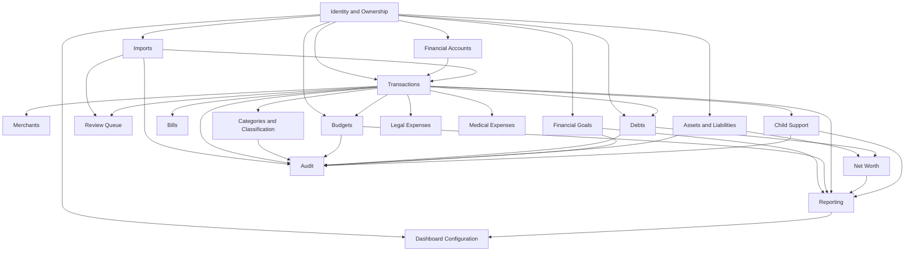
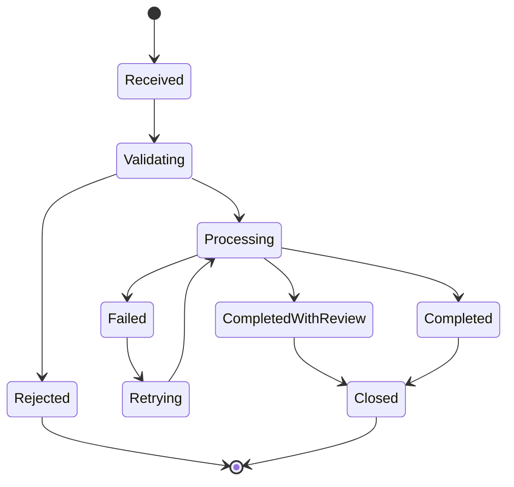
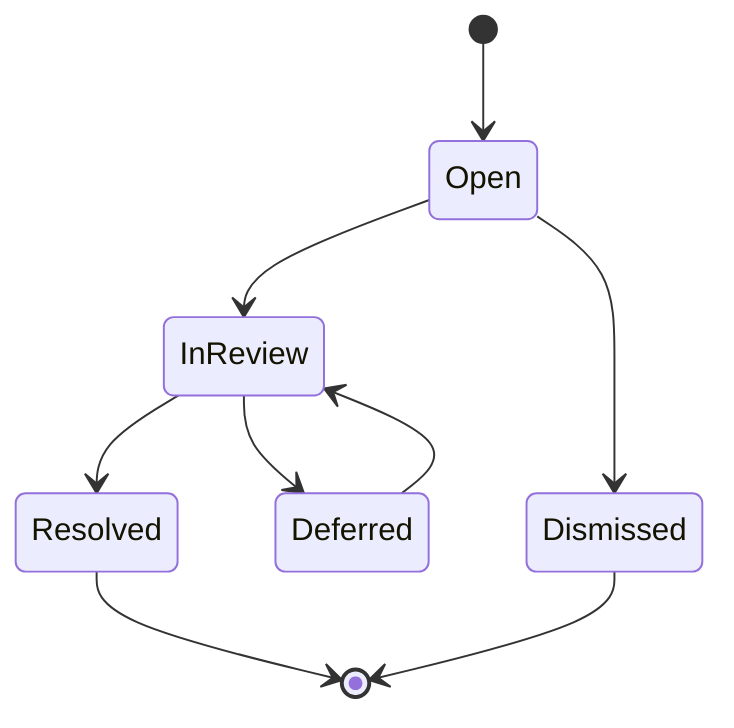
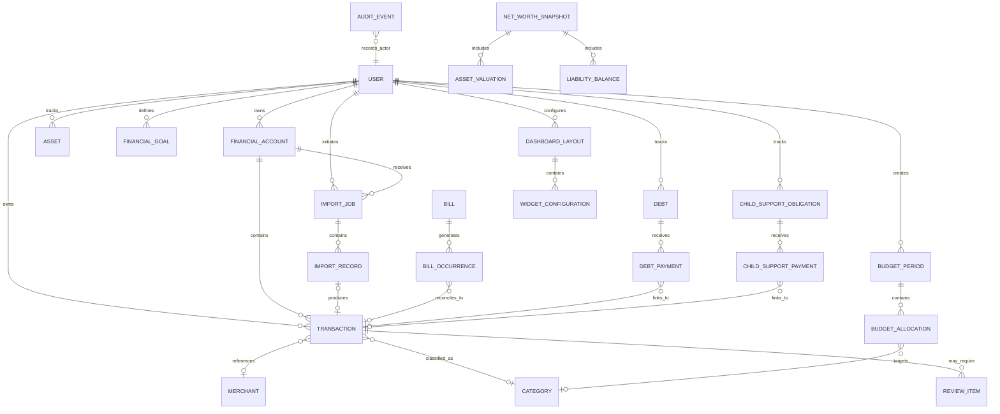

# Domain Model

**Project:** Financial Operating System

**Internal Codename:** Athena

**Document Version:** 1.1.0

**Status:** Draft

**Owner:** Caitlin Gillum

**Primary Architect:** Caitlin Gillum

**Technical Advisor:** OpenAI ChatGPT

**Last Updated:** August 2, 2026

---

## Table of Contents

- [Purpose](#purpose)
- [Scope](#scope)
- [Domain Modeling Philosophy](#domain-modeling-philosophy)
- [Domain Model Overview](#domain-model-overview)
- [Core Domain Areas](#core-domain-areas)
- [Identity and Ownership](#identity-and-ownership)
- [Financial Accounts](#financial-accounts)
- [Imports](#imports)
- [Transactions](#transactions)
- [Merchants](#merchants)
- [Categories and Classification](#categories-and-classification)
- [Review Queue](#review-queue)
- [Budgets](#budgets)
- [Bills](#bills)
- [Debts](#debts)
- [Assets and Liabilities](#assets-and-liabilities)
- [Net Worth](#net-worth)
- [Financial Goals](#financial-goals)
- [Reporting](#reporting)
- [Dashboard Configuration](#dashboard-configuration)
- [Legal Expenses](#legal-expenses)
- [Medical Expenses](#medical-expenses)
- [Child Support](#child-support)
- [Audit](#audit)
- [Shared Concepts](#shared-concepts)
- [Aggregate Boundaries](#aggregate-boundaries)
- [Domain Relationships](#domain-relationships)
- [Domain Events](#domain-events)
- [Business Invariants](#business-invariants)
- [Lifecycle and State Transitions](#lifecycle-and-state-transitions)
- [Data Classification](#data-classification)
- [Domain Service Boundaries](#domain-service-boundaries)
- [Cross-Domain Rules](#cross-domain-rules)
- [Requirement Traceability](#requirement-traceability)
- [Deferred Decisions](#deferred-decisions)
- [Related Documents](#related-documents)
- [Revision History](#revision-history)

---

## Purpose

This document defines the conceptual domain model for Project Athena.

The domain model identifies Athena's primary business concepts, responsibilities, relationships, ownership rules, state transitions, and financial invariants.

It establishes a shared vocabulary for future:

- Backend architecture
- Database architecture
- API design
- Application services
- Domain services
- Security controls
- Audit logging
- Testing
- User interface development
- Reporting
- Automation

The domain model describes the meaning and behavior of financial concepts independently from specific database tables, frameworks, vendors, or interface components.

---

## Scope

This document covers:

- Core financial domains
- Domain entities
- Value concepts
- Aggregate boundaries
- Ownership
- Relationships
- State transitions
- Business invariants
- Domain events
- Cross-domain interactions
- Sensitive-data classification
- Requirement traceability

This document does not define:

- Physical database tables
- Column types
- Database indexes
- API endpoints
- Source-code classes
- ORM models
- User interface layouts
- Final event-processing infrastructure
- Final reporting-query implementation
- Final background-job technology

Those concerns will be defined in later architecture and implementation documents.

---

## Domain Modeling Philosophy

Athena shall model financial behavior explicitly rather than treating all information as generic rows, labels, or key-value records.

The domain model follows these principles:

- Financial records have defined meaning and lifecycle.
- Authoritative data must remain distinguishable from presentation metadata.
- Imported source values must remain distinguishable from later user classifications.
- Financial calculations must be deterministic and reproducible.
- Ambiguity must be represented rather than hidden.
- Domain boundaries should reduce coupling.
- Cross-domain behavior must use explicit interfaces.
- Sensitive data must be minimized and protected.
- Auditability must be designed into material state changes.
- Domain language should remain understandable to users and engineers.
- Documentation and examples must describe the platform rather than any individual user's personal circumstances.

Athena shall avoid an anemic model in which business rules are scattered across interface components, database queries, and unrelated utility functions.

---

## Domain Model Overview



The domain is centered on authoritative financial records, deterministic processing, user ownership, and traceable state changes.

---

## Core Domain Areas

Athena includes the following primary domain areas:

| Domain | Primary Responsibility |
|---|---|
| Identity and Ownership | User identity, ownership, and authorization context |
| Financial Accounts | Metadata for checking, savings, credit, loan, and other accounts |
| Imports | Source-file ingestion and processing history |
| Transactions | Authoritative financial transaction records |
| Merchants | Merchant identity, normalization, and recognition |
| Categories and Classification | Financial classification and deterministic categorization rules |
| Review Queue | Resolution of ambiguous or failed processing outcomes |
| Budgets | Zero-based allocations, actuals, and rollover behavior |
| Bills | Recurring obligations and payment tracking |
| Debts | Debt balances, rates, payments, and payoff modeling |
| Assets and Liabilities | Financial position and valuation records |
| Net Worth | Historical aggregation of assets and liabilities |
| Financial Goals | Target balances, dates, and progress |
| Reporting | Authorized financial aggregation and export |
| Dashboard Configuration | User-controlled presentation preferences |
| Legal Expenses | Legal-specific classification and reporting |
| Medical Expenses | Medical-specific classification and reporting |
| Child Support | Obligations, payments, and outstanding balances |
| Audit | Protected history of material system actions |

---

## Identity and Ownership

The Identity and Ownership domain establishes who may access and modify Athena's resources.

### Primary Concepts

#### User

A User represents an authenticated Athena account owner.

A User:

- Owns financial accounts
- Owns imported files
- Owns transactions
- Owns budgets
- Owns debts
- Owns assets and liabilities
- Owns goals
- Owns reports and exports
- Owns dashboard preferences
- Is associated with audit events

Version 1 supports one authenticated account owner, but ownership shall still be modeled explicitly.

#### Ownership Context

Ownership Context represents the authenticated identity and authorization information required to perform an operation.

Ownership must not be inferred solely from identifiers supplied by the browser.

### Invariants

- Every protected domain record must be associated with an authorized owner.
- Authentication does not replace authorization.
- Cross-owner access must be denied by default.
- Privileged system operations must remain explicitly authorized and auditable.
- Ownership identifiers must not be trusted solely because they appear in a request.

---

## Financial Accounts

The Financial Accounts domain represents accounts that contain, receive, owe, or transfer financial value.

### Account Types

Potential account types include:

- Checking
- Savings
- Credit card
- Mortgage
- Personal loan
- Vehicle loan
- Cash
- Investment
- Retirement
- Property
- Other asset
- Other liability

### Primary Entity

#### Financial Account

A Financial Account may include:

- User-defined account name
- Account type
- Financial institution
- Masked account identifier
- Currency
- Active or archived status
- Opening date
- Closing date
- Current balance where applicable
- Balance update method
- Import configuration
- Notes

Full account numbers should not be required or retained.

### Invariants

- Every account belongs to one authorized owner in Version 1.
- Account identifiers displayed to the user must be masked where appropriate.
- Archived accounts remain available for historical reporting.
- Account deletion must not silently orphan historical transactions.
- Account type determines applicable behavior but must not override explicit transaction data.
- Currency is U.S. dollars for Version 1.

### Implementation: Account Lifecycle and CRUD

Implemented in `src/domains/accounts/`, `src/application/accounts/service.ts`, `src/infrastructure/db/accounts-repository.ts`, and `src/features/accounts/actions.ts`.

**Lifecycle.** An account has exactly two states, `active` and `archived` (`AccountStatus`), plus an orthogonal soft-delete marker (`deletedAt`) shared by every owned table. Archiving is a status transition (`status = 'archived'`), not a delete — it satisfies the "archived accounts remain available for historical reporting" invariant above by construction, since an archived account is still a normal row with an intact `id`/`ownerId`/transaction history. Soft-delete (`deletedAt`) is a separate, harder-to-reverse operation with no Server Action exposed in this slice; nothing in the CRUD surface hard-deletes a row.

```
create → active ⇄ archived
           (archive)  (restore)
```

**Archive behavior.** `archiveAccount`/`restoreAccount` are dedicated operations, each a direct `status` assignment scoped by `id` + `ownerId`, idempotent (archiving an already-archived account, or restoring an already-active one, succeeds and simply re-affirms the state). The general-purpose `updateAccount` Server Action's input schema deliberately excludes `status` — even though migration `0004_harden_owned_table_update_grants.sql` grants `authenticated` UPDATE on the `status` column at the database layer — so that status transitions always go through the archive/restore actions, which name the intent explicitly rather than treating lifecycle state as an incidental field on a generic PATCH.

**Ownership guarantees.** Every read, mutation, archive, and restore is scoped by both `id` and the caller's `ownerId`, derived exclusively from `requireActionUser()` (`src/lib/actions/context.ts`) — never from client input; `createAccount`'s input schema has no `ownerId` field at all. A request against another owner's account — read, update, archive, or restore — resolves through the same owner-scoped repository query used for a genuinely missing account, throws `NotFoundError`, and is classified as a `domain` error by the Server Action framework. This is intentional, not an omission of a distinct "authorization" response: Athena avoids confirming that another owner's resource exists (see `docs/architecture/security-architecture.md` and `docs/architecture/api-architecture.md` § Cross-Owner Response Behavior). Row Level Security (`src/db/migrations/0003_row_level_security.sql`, `0004_harden_owned_table_update_grants.sql`) enforces the same boundary independently at the database layer.

**CRUD conventions (Server Actions, `src/features/accounts/actions.ts`).**

| Action | Behavior |
|---|---|
| `getAccount` | Read one, owner-scoped; `NotFoundError` (→ `domain`) if absent or not owned |
| `listActiveAccounts` | All non-deleted accounts with `status = 'active'` for the caller |
| `listArchivedAccounts` | All non-deleted accounts with `status = 'archived'` for the caller |
| `createAccount` | `name` and `accountType` required; `institutionId` (if present) must reference an existing institution or the call fails with `NotFoundError`; `ownerId` always `requireActionUser()`'s id |
| `updateAccount` | Partial update of mutable fields only (`name`, `accountType`, `institutionId`, `maskedAccountNumber`, `currency`, `balanceSource`, `currentBalance`, `openingDate`, `closingDate`, `notes`); `id`, `ownerId`, timestamps, and `status` are not accepted as input |
| `archiveAccount` / `restoreAccount` | Dedicated status transitions, see above |

Every action follows `src/lib/actions/` conventions (`executeAction`, `parseAction`, `requireActionUser`) documented in `docs/standards/coding-standards.md` § Server Action Standards — validation errors never expose raw Zod output, and infrastructure/unexpected failures never expose provider or database error text.

**Manual vs. connected accounts.** `balanceSource` (`manual` | `computed`) already distinguishes user-maintained balances from provider-fed ones; this slice does not add a `data_provider_connections` linkage or any Plaid-specific fields, which remain out of scope until a dedicated provider-integration slice.

---

## Imports

The Imports domain manages financial files and processing outcomes.

### Primary Entities

#### Import Job

An Import Job represents one attempt to ingest a financial data file.

It may include:

- Owner
- Financial account
- Source institution
- Original filename metadata
- File fingerprint
- Statement period
- Import status
- Started timestamp
- Completed timestamp
- Record counts
- Failure summary
- Parser version
- Correlation identifier

#### Import Record

An Import Record represents one source row before or during normalization.

It may include:

- Original source values
- Source row number
- Parse status
- Validation status
- Normalized candidate values
- Rejection reason
- Duplicate status
- Review status
- Resulting transaction reference

### Import Status

An Import Job may move through:



### Invariants

- A file must be validated before financial records are created.
- Duplicate file processing must be detectable.
- Partial imports must not silently appear as successful.
- Every processed row must have an observable outcome.
- Original source values must be preserved or recoverable where required.
- Retry behavior must not create duplicate transactions.
- Import failures must not expose sensitive source data in ordinary logs.
- File retention must follow documented policy.

---

## Transactions

The Transactions domain contains Athena's authoritative financial activity records.

### Primary Entity

#### Transaction

A Transaction represents a financial event associated with an account.

A Transaction may include:

- Owner
- Financial account
- Transaction date
- Posting date
- Original description
- Normalized merchant
- Amount
- Transaction type
- Category
- Subcategory
- Purpose
- Life event
- Budget treatment
- Review status
- Import source
- Notes
- Exclusion status
- Transfer relationship
- Reimbursement relationship
- Creation source
- Created timestamp
- Updated timestamp

### Amount Convention

Athena shall use a consistent signed-amount convention:

- Positive amounts represent inflows.
- Negative amounts represent outflows.

Alternative source conventions must be normalized during import.

### Transaction Types

Potential transaction types include:

- Income
- Expense
- Transfer
- Refund
- Reimbursement
- Debt payment
- Asset contribution
- Adjustment

### Original and Derived Data

A Transaction must distinguish:

**Original Source Data**

- Source description
- Source date
- Source amount
- Source account
- Source institution reference where available

**Derived or User-Supplied Metadata**

- Normalized merchant
- Category
- Subcategory
- Purpose
- Life event
- Notes
- Budget treatment
- Review decision
- Rule attribution

### Invariants

- Original imported values must not be silently overwritten.
- Material classification changes must be auditable.
- A transaction must belong to an authorized owner and account.
- Signed amounts must follow the internal convention.
- Internal transfers must not inflate income or spending.
- Duplicate transactions must be prevented or explicitly resolved.
- Excluded transactions must retain a documented exclusion reason.
- Transaction edits must not erase import lineage.
- Financial reports must use authoritative transaction state.
- AI suggestions must not directly alter authoritative transaction data without approved review.

---

## Merchants

The Merchants domain identifies and normalizes transaction counterparties.

### Primary Entities

#### Merchant

A Merchant represents a normalized financial counterparty.

It may include:

- Display name
- Normalized key
- Aliases
- Default category
- Default subcategory
- Default purpose
- Default life event where appropriate
- Review requirement
- Active status

#### Merchant Alias

A Merchant Alias maps one or more raw descriptions to a normalized Merchant.

### Invariants

- Merchant normalization must preserve the original transaction description.
- Multiple aliases may map to one Merchant.
- Ambiguous merchants may require review.
- Broad marketplaces may be permanently designated for transaction-level review.
- Merchant defaults must not override explicit transaction exceptions without defined precedence.
- Rule changes must not silently rewrite historical transactions unless the user explicitly requests reprocessing.

---

## Categories and Classification

The Categories and Classification domain determines how financial activity is organized.

### Primary Concepts

#### Category

A Category represents a high-level financial grouping.

Examples include:

- Income
- Housing
- Food
- Transportation
- Dependents
- Personal
- Pets
- Legal
- Medical
- Education
- Utilities
- Debt
- Savings
- Reimbursement

#### Subcategory

A Subcategory refines a Category.

Examples include:

- Groceries
- Fuel
- Therapy
- Attorney Fees
- Personal Care
- Dependent Clothing
- Pet Food
- Career Development

#### Purpose

Purpose describes why the money was used.

Examples include:

- Essential living
- Dependents
- Medical care
- Legal services
- Career development
- Personal care
- Recreation
- Household operations

#### Life Event

Life Event provides contextual classification.

Examples include:

- Normal Living
- Legal Proceedings
- Medical Care
- Career Transition
- Relocation
- Family Change
- Temporary Housing
- Emergency

#### Classification Rule

A Classification Rule represents deterministic logic that may assign or suggest metadata.

A rule may include:

- Match type
- Match value
- Priority
- Account scope
- Merchant scope
- Effective date
- Resulting classification
- Review requirement
- Active status
- Rule version

### Classification Precedence

Classification precedence should follow a documented order, such as:

1. Explicit user decision
2. Transaction-specific override
3. High-specificity deterministic rule
4. Merchant default
5. Source-specific rule
6. Suggested classification
7. Review required

The final order requires separate design validation before implementation.

### Invariants

- Classification must remain explainable.
- Every automatic result must identify the applied rule.
- Conflicting rules must resolve deterministically.
- User-approved decisions take precedence over general defaults.
- Unknown or ambiguous results must enter review.
- Classification changes must be auditable.
- Categories must not be deleted if doing so would corrupt historical reporting.
- Historical reclassification must be explicit and reviewable.

---

## Review Queue

The Review Queue domain represents unresolved financial ambiguity.

### Primary Entity

#### Review Item

A Review Item may represent:

- Unknown merchant
- Ambiguous category
- Duplicate candidate
- Suspected transfer
- Invalid source data
- Conflicting rule result
- Missing required metadata
- AI-generated suggestion
- Import reconciliation issue

A Review Item may include:

- Owner
- Source record
- Review type
- Suggested action
- Suggestion source
- Confidence indicator
- Status
- Assigned priority
- Resolution
- Resolution timestamp
- Resulting rule
- Notes

### Review Status



### Invariants

- Review items must preserve the uncertainty that created them.
- Suggestions must not be presented as authoritative facts.
- Resolution must identify the actor or process.
- A resolved item must record the resulting action.
- Review resolution may create a future rule only with explicit approval.
- Deferred review must not be treated as resolved.
- Duplicate candidates must not create duplicate authoritative records while unresolved.

---

## Budgets

The Budgets domain manages zero-based planning and actual performance.

### Primary Entities

#### Budget Period

A Budget Period represents a defined financial period, typically one calendar month.

It may include:

- Owner
- Start date
- End date
- Status
- Guaranteed income
- Additional received income
- Total allocated
- Remaining amount
- Closed timestamp

#### Budget Allocation

A Budget Allocation assigns money to:

- Category
- Subcategory
- Bill
- Debt
- Goal
- Sinking fund
- Savings purpose

#### Sinking Fund

A Sinking Fund allows allocated value to accumulate across periods.

### Budget Status

Potential states include:

- Draft
- Active
- Closed
- Archived

### Invariants

- Guaranteed income must remain distinguishable from unreliable expected income.
- Expected financial support must not be treated as guaranteed income until received.
- Total zero-based allocations should equal the available budgeting amount before activation.
- Internal transfers must not count as spending.
- Extraordinary expenses must remain distinguishable from ordinary living expenses.
- Closed budget periods must preserve historical calculations.
- Budget edits after closure must require explicit reopening or adjustment behavior.
- Actual spending must derive from authoritative transactions.

---

## Bills

The Bills domain represents recurring financial obligations.

### Primary Entity

#### Bill

A Bill may include:

- Owner
- Name
- Payee
- Category
- Expected amount
- Frequency
- Due date
- Payment account
- Autopay status
- Active status
- Effective dates
- Notes

#### Bill Occurrence

A Bill Occurrence represents one expected or completed instance.

It may include:

- Due date
- Expected amount
- Actual transaction
- Payment status
- Paid date
- Variance
- Exception status

### Invariants

- Recurring templates must remain distinguishable from individual occurrences.
- A bill occurrence may be linked to an authoritative transaction.
- Missing payments must not be inferred solely from absence without defined reconciliation.
- Changes to expected amounts should not rewrite historical occurrences.
- Archived bills remain available for historical reporting.

---

## Debts

The Debts domain represents financial obligations and payoff behavior.

### Primary Entities

#### Debt

A Debt may include:

- Owner
- Debt name
- Creditor
- Debt type
- Original balance
- Current balance
- Interest rate
- Minimum payment
- Payment frequency
- Start date
- Target payoff date
- Active status

#### Debt Payment

A Debt Payment represents a payment applied to a Debt.

It may include:

- Payment date
- Total payment
- Principal amount
- Interest amount
- Fee amount
- Linked transaction
- Remaining balance

#### Payoff Scenario

A Payoff Scenario represents a modeled repayment strategy.

Potential strategies include:

- Minimum payment
- Debt snowball
- Debt avalanche
- Custom extra payment

### Invariants

- Current balance must not become negative without explicit adjustment logic.
- Debt payments must not be counted twice when linked to transactions.
- Payoff projections must identify assumptions.
- Interest calculations must remain deterministic and testable.
- Modeled payoff scenarios must remain distinguishable from actual payment history.
- Historical balances must remain available for progress reporting.

---

## Assets and Liabilities

The Assets and Liabilities domain represents Athena's financial-position records.

### Primary Entities

#### Asset

An Asset may represent:

- Cash
- Checking balance
- Savings balance
- Property
- Vehicle
- Investment
- Retirement account
- Other owned value

An Asset may include:

- Owner
- Name
- Asset type
- Valuation method
- Current value
- Valuation date
- Source
- Notes
- Active status

#### Liability

A Liability represents an amount owed.

Liabilities may overlap conceptually with Debt records but serve the net worth model.

A Liability may include:

- Owner
- Name
- Liability type
- Current balance
- Balance date
- Related debt
- Notes
- Active status

### Invariants

- Every valuation must include an effective date.
- Estimated values must remain distinguishable from verified balances.
- A liability linked to a debt must not be double-counted.
- Archived assets and liabilities remain part of historical snapshots where applicable.
- Valuation changes must not rewrite prior snapshots.

---

## Net Worth

The Net Worth domain calculates historical financial position.

### Primary Entity

#### Net Worth Snapshot

A Net Worth Snapshot represents financial position at a specific time.

It may include:

- Owner
- Snapshot date
- Total assets
- Total liabilities
- Net worth
- Included asset valuations
- Included liability balances
- Snapshot source
- Creation method

### Calculation

Net worth is derived from:

```
Net Worth = Total Assets - Total Liabilities
```

### Invariants

- Net worth must derive from dated asset and liability values.
- Historical snapshots must not change when current values change.
- Missing or stale values must be visible.
- Estimated values must remain identifiable.
- Debt and liability relationships must not cause double counting.
- Snapshot calculations must be deterministic and reproducible.

---

## Financial Goals

The Financial Goals domain tracks user-defined targets.

### Primary Entity

#### Financial Goal

A Financial Goal may include:

- Owner
- Name
- Goal type
- Target amount
- Current amount
- Target date
- Priority
- Contribution plan
- Status
- Related account
- Related sinking fund
- Notes

### Goal Types

Potential goal types include:

- Emergency fund
- Legal reserve
- Education funding
- Relocation fund
- Dependent expenses
- Debt payoff
- Savings target
- Major purchase
- Custom goal

### Invariants

- Goal progress must use documented source values.
- A contribution linked to a transfer must not also count as spending.
- Goal completion must be based on explicit criteria.
- Historical progress should remain visible.
- Goals must remain distinguishable from budget allocations.
- Archived goals must not disappear from historical reports.

---

## Reporting

The Reporting domain produces authorized financial summaries and exports.

### Primary Concepts

#### Report Definition

A Report Definition describes:

- Reporting period
- Filters
- Grouping
- Metrics
- Output format
- Authorized scope

#### Report Result

A Report Result contains derived data produced from authoritative records.

Potential reports include:

- Spending by category
- Income by source
- Monthly cash flow
- Budget performance
- Debt payoff
- Net worth
- Legal expenses
- Medical expenses
- Dependent expenses
- Education and career investment
- Child support
- Tax or professional-accounting summary

### Invariants

- Reports must derive from authoritative records.
- Reimbursements must remain distinguishable from earned income.
- Internal transfers must not inflate income or spending.
- Filters must apply consistently across metrics.
- Report results must respect authorization.
- Generated exports must not include unauthorized or unnecessary sensitive fields.
- Cached reports must define freshness and invalidation behavior.

---

## Dashboard Configuration

The Dashboard Configuration domain manages presentation preferences without modifying financial records.

### Primary Entities

#### Dashboard Layout

A Dashboard Layout may include:

- Owner
- Layout name
- Default status
- Device scope
- Active status
- Created timestamp
- Updated timestamp

#### Dashboard Widget Configuration

A Widget Configuration may include:

- Widget identifier
- Visibility
- Position
- Size
- Supported filters
- User-selected filters
- Display preferences

### Invariants

- Dashboard configuration is presentation metadata.
- Dashboard changes must not modify authoritative financial records.
- Widgets must use trusted reporting outputs.
- Unauthorized data must never become available through configuration.
- Widget filters must behave consistently with report definitions.
- Arbitrary user-provided executable code is prohibited.
- Invalid configuration must fall back safely to an approved default.
- Multiple layouts must remain scoped to their owner.

---

## Legal Expenses

The Legal Expenses domain provides specialized classification and reporting over transactions.

### Primary Concepts

Legal records may identify:

- Attorney fees
- Court-appointed professionals
- Filing fees
- Legal document preparation
- Mailing and delivery
- Co-parenting communication services
- Court-related expenses
- Temporary housing related to legal proceedings
- Other documented legal costs

### Invariants

- Legal classification must reference an authoritative transaction or approved adjustment.
- Legal context must not overwrite the transaction's original source data.
- Distinct legal matters must remain separately reportable where practical.
- Specialized legal reporting must not duplicate financial totals.
- Sensitive legal notes must be minimized and access-controlled.
- Legal documentation examples must use generic or synthetic terminology.

---

## Medical Expenses

The Medical Expenses domain provides specialized classification and reporting over transactions.

### Primary Concepts

Medical records may identify:

- Patient reference
- Provider
- Service type
- Therapy
- Specialist care
- Laboratory services
- Primary care
- Prescription
- Medical equipment
- Insurance reimbursement

### Invariants

- Medical classification must reference authoritative transactions or approved adjustments.
- Patient information must be minimized.
- Medical expenses and reimbursements must remain distinguishable.
- Specialized medical reports must not duplicate transaction totals.
- Sensitive medical notes must not enter ordinary logs.
- Access must follow Athena's strictest applicable privacy controls.
- Public documentation and examples must not contain real patient names or medical histories.

---

## Child Support

The Child Support domain tracks ordered obligations, received payments, adjustments, and outstanding balances.

### Primary Entities

#### Child Support Obligation

An Obligation may include:

- Owner
- Effective date
- Ordered amount
- Frequency
- Proration information
- Status
- Notes
- Source reference

#### Child Support Payment

A Payment may include:

- Received date
- Amount
- Payment source
- Linked transaction
- Applied period
- Adjustment status

#### Child Support Balance

The outstanding balance is derived from obligations, payments, and approved adjustments.

### Invariants

- Ordered support must remain distinguishable from received support.
- Expected support is not guaranteed budget income.
- Payments must be linked carefully to avoid double counting.
- Prorated periods must be explicitly represented.
- Outstanding balances must be deterministic and auditable.
- Adjustments must preserve history and rationale.
- Child support data must not be inferred from unrelated deposits without review.
- Documentation examples must remain generic and must not identify real individuals.

---

## Audit

The Audit domain records significant actions affecting financial data, authorization, or configuration.

### Primary Entity

#### Audit Event

An Audit Event may include:

- Owner
- Actor
- Action
- Resource type
- Resource identifier
- Timestamp
- Source
- Correlation identifier
- Previous state where appropriate
- Resulting state where appropriate
- Outcome
- Failure reason where appropriate

### Auditable Actions

Potential auditable actions include:

- Import started
- Import completed
- Import failed
- Transaction edited
- Classification changed
- Merchant rule created
- Budget activated
- Debt updated
- Asset value changed
- Child support adjustment recorded
- Export generated
- Protected record deleted
- Authorization failure
- Security setting changed

### Invariants

- Audit records must be protected from ordinary modification.
- Audit records must not expose unnecessary sensitive data.
- Critical mutations must not silently bypass auditing.
- Audit failures must receive explicit handling.
- Audit history must remain distinct from operational application logs.
- Correlation identifiers should connect related events.

---

## Shared Concepts

Athena uses shared concepts across domains.

### Money

Money represents a signed monetary amount in U.S. dollars for Version 1.

Requirements include:

- Fixed-precision representation
- No floating-point arithmetic for authoritative calculations
- Explicit sign convention
- Deterministic rounding rules
- Currency identification where appropriate

### Date and Time

Athena must distinguish:

- Calendar date
- Timestamp
- Posting date
- Transaction date
- Effective date
- Reporting period

Time-zone behavior must be explicit.

### Identifier

Identifiers must be:

- Unique within their intended scope
- Non-guessable where externally exposed
- Independent from user-provided labels
- Safe for authorization checks

### Status

Statuses must use defined state values rather than uncontrolled free text.

### Source

Source identifies where information originated.

Examples include:

- CSV import
- Manual entry
- User review
- Deterministic rule
- System calculation
- External integration
- Migration

### Note

Notes are optional supporting text.

Notes must not become the only location for structured financial facts required by calculations or reporting.

---

## Aggregate Boundaries

An aggregate represents a consistency boundary for related domain changes.

Initial conceptual aggregates include:

| Aggregate | Root | Included Concepts |
|---|---|---|
| Account Aggregate | Financial Account | Account metadata and import configuration |
| Import Aggregate | Import Job | Import records, status, and processing summary |
| Transaction Aggregate | Transaction | Classification, review linkage, transfer relationship, and notes |
| Merchant Aggregate | Merchant | Aliases and default classification behavior |
| Budget Aggregate | Budget Period | Allocations, sinking-fund behavior, and period status |
| Bill Aggregate | Bill | Recurring template and occurrences |
| Debt Aggregate | Debt | Payments, balance history, and payoff scenarios |
| Net Worth Aggregate | Net Worth Snapshot | Included asset and liability values |
| Goal Aggregate | Financial Goal | Progress records and contribution relationships |
| Dashboard Aggregate | Dashboard Layout | Widget configurations |
| Child Support Aggregate | Child Support Obligation | Payments, adjustments, and balance |
| Audit Aggregate | Audit Event | Immutable or protected action record |

Aggregate boundaries are conceptual and may be refined during backend and database design.

---

## Domain Relationships



This diagram is conceptual and does not prescribe final table names or cardinality implementation.

---

## Domain Events

Domain Events represent meaningful occurrences that other components may need to observe.

Potential events include:

- ImportReceived
- ImportValidated
- ImportRejected
- ImportCompleted
- TransactionCreated
- TransactionClassified
- TransactionReviewRequired
- TransactionReviewResolved
- TransferMatched
- MerchantRuleCreated
- BudgetActivated
- BudgetClosed
- DebtPaymentRecorded
- AssetValuationUpdated
- NetWorthSnapshotCreated
- GoalProgressUpdated
- ChildSupportPaymentRecorded
- DashboardLayoutUpdated
- FinancialExportGenerated
- ProtectedRecordDeleted

Version 1 may implement these events synchronously within the modular monolith.

The domain model does not require distributed event infrastructure.

### Event Invariants

- Events must not expose unnecessary sensitive information.
- Events must identify ownership context.
- Event handling must not create duplicate financial effects.
- Material event processing must be retry-safe where applicable.
- Audit records and domain events serve different purposes and must not be treated as interchangeable.

---

## Business Invariants

The following invariants apply across Athena:

- Financial records must belong to an authorized owner.
- Original imported values must remain distinguishable from later metadata.
- Internal transfers must not inflate income or spending.
- Reimbursements must remain distinguishable from earned income.
- Expected financial support must not be treated as guaranteed income until received.
- Ambiguous financial data must require review rather than unsupported assumptions.
- Financial calculations must be deterministic and reproducible.
- Authoritative monetary calculations must not use floating-point arithmetic.
- Dashboard configuration must not modify financial data or calculations.
- AI suggestions must not directly alter authoritative records without approved review.
- Financial mutations must preserve auditability.
- Historical snapshots must not change when current balances change.
- Specialized legal, medical, and child-support reporting must not duplicate transaction totals.
- Retryable operations must not create duplicate financial effects.
- Authorization must not rely solely on client-supplied ownership identifiers.
- Closed historical periods must remain stable unless explicitly reopened or adjusted.
- Destructive actions must be deliberate, authorized, and auditable.
- Presentation metadata must remain separate from authoritative financial data.
- Public documentation must not contain personally identifiable, legal, medical, or financial information belonging to a real user.
- Examples and test fixtures must use synthetic or sanitized data.

---

## Lifecycle and State Transitions

Domain entities with meaningful lifecycle must use explicit state transitions.

### Import Job

```
Received → Validating → Processing → Completed
                               └──→ Completed with Review
                    └────────────→ Failed
Validating → Rejected
```

### Review Item

```
Open → In Review → Resolved
                 └→ Deferred → In Review
Open → Dismissed
```

### Budget Period

```
Draft → Active → Closed → Archived
          ↑        |
          └ Reopened
```

Reopening behavior requires explicit rules and auditing.

### Financial Goal

```
Draft → Active → Completed
          ├──→ Paused
          └──→ Cancelled
```

### Debt

```
Active → Paid Off → Archived
   └──→ Charged Off or Settled
```

Final supported states require implementation review.

---

## Data Classification

Athena shall classify domain data according to sensitivity.

| Classification | Examples | Expected Protection |
|---|---|---|
| Public | Sanitized documentation and synthetic examples | May appear in the public repository |
| Internal | Architecture details without credentials or real financial records | Repository-controlled |
| Confidential | User preferences, categories, and non-sensitive configuration | Authenticated and authorized access |
| Highly Sensitive | Transactions, balances, legal expenses, medical expenses, child support, and uploaded files | Strong authorization, encryption in transit, private storage, and minimized logging |
| Secret | Service-role credentials, private keys, tokens, and database secrets | Server-only secret management; never committed or logged |

When multiple classifications apply, the strictest classification governs.

---

## Domain Service Boundaries

Domain Services shall handle behavior that does not naturally belong to one entity.

Potential Domain Services include:

- Transaction Normalization Service
- Duplicate Detection Service
- Transfer Matching Service
- Classification Service
- Budget Calculation Service
- Debt Payoff Service
- Net Worth Calculation Service
- Import Reconciliation Service
- Child Support Balance Service
- Reporting Aggregation Service
- Dashboard Query Service
- Export Service

Domain Services must:

- Use validated inputs
- Produce typed results
- Remain deterministic for authoritative calculations
- Avoid presentation concerns
- Avoid direct dependence on browser behavior
- Preserve authorization context through application coordination
- Remain testable without requiring full user-interface execution

---

## Cross-Domain Rules

Cross-domain interactions must remain explicit.

### Transactions and Budgets

Transactions provide actual spending data to budget calculations.

Budgets do not modify transaction amounts.

### Transactions and Debts

Debt payments may link to transactions.

A linked payment must not be counted twice.

### Assets, Debts, and Net Worth

Assets and liabilities provide dated values to Net Worth Snapshots.

Snapshots preserve historical values.

### Transactions and Specialized Reporting

Legal, Medical, and Child Support domains classify or interpret transactions without creating duplicate financial activity.

### Reporting and Dashboard

Reporting produces trusted aggregates.

Dashboard widgets display those aggregates and must not redefine them.

### Imports and Transactions

Imports may create transaction candidates.

Only successfully validated and approved candidates become authoritative Transactions.

### Review and Classification

Review resolves uncertainty.

A Review decision may update classification metadata and optionally create an approved deterministic rule.

---

## Requirement Traceability

| Domain Area | Related Requirements |
|---|---|
| Identity and Ownership | FR-025, FR-026, NFR-001 through NFR-004 |
| Accounts | FR-001 through FR-006, FR-020 through FR-022 |
| Imports | FR-001 through FR-005, FR-030, NFR-005 through NFR-009 |
| Transactions | FR-003 through FR-006, NFR-005, NFR-006 |
| Merchants and Classification | FR-007 through FR-010, FR-031, NFR-018 |
| Review Queue | FR-009, FR-031, NFR-005, NFR-018 |
| Budgets | FR-011 through FR-013 |
| Reporting | FR-014 through FR-017, FR-028 |
| Debts | FR-018 through FR-019 |
| Assets and Net Worth | FR-020 through FR-022 |
| Goals | FR-023 through FR-024 |
| Audit | FR-027, NFR-005, NFR-018 |
| Data Export | FR-028, NFR-017 |
| Backup and Recovery | FR-029, NFR-007 |
| Dashboard Configuration | FR-014, FR-032, NFR-013 through NFR-018 |
| AI Boundaries | FR-031, NFR-005, NFR-018 |
| Maintainability | NFR-010 through NFR-014 |
| Accessibility and Responsiveness | NFR-015, NFR-016 |

---

## Deferred Decisions

The following domain decisions remain open:

- Final classification precedence
- Transaction split support
- Joint transaction support
- Multi-currency domain behavior
- Shared household ownership
- Category inheritance rules
- Historical reclassification policy
- Rule versioning behavior
- Import correction workflow
- Account reconciliation model
- Bill-to-transaction matching rules
- Debt interest-calculation methods
- Asset valuation sources
- Net worth snapshot frequency
- Goal contribution allocation
- Dashboard layout versioning
- Legal data-retention policy
- Medical data-retention policy
- Child support proration rules
- Audit-record retention
- Domain-event persistence
- Soft deletion versus hard deletion
- Record archival rules
- Entity identifier format
- Date and time-zone conventions
- Monetary rounding policy
- Financial-period closing behavior

These decisions shall be resolved through architecture design, implementation requirements, and ADRs where appropriate.

---

## Related Documents

- docs/product-requirements.md
- docs/architecture/README.md
- docs/architecture/engineering-principles.md
- docs/architecture/system-architecture.md
- docs/architecture/application-architecture.md
- docs/architecture/frontend-architecture.md
- docs/adr/README.md
- docs/adr/0002-initial-technology-stack.md

---

## Revision History

| Version | Date | Author | Summary |
|---|---|---|---|
| 1.0.0 | 2026-07-26 | Caitlin Gillum | Defined Athena's platform-neutral conceptual domain model, core financial domains, aggregate boundaries, relationships, events, state transitions, financial invariants, data classifications, and cross-domain rules. |
| 1.1.0 | 2026-08-02 | Caitlin Gillum | Documented the implemented Account CRUD backend (Slice 2): active/archived lifecycle, archive vs. soft-delete distinction, ownership guarantees, and the `src/features/accounts/actions.ts` Server Action surface. |