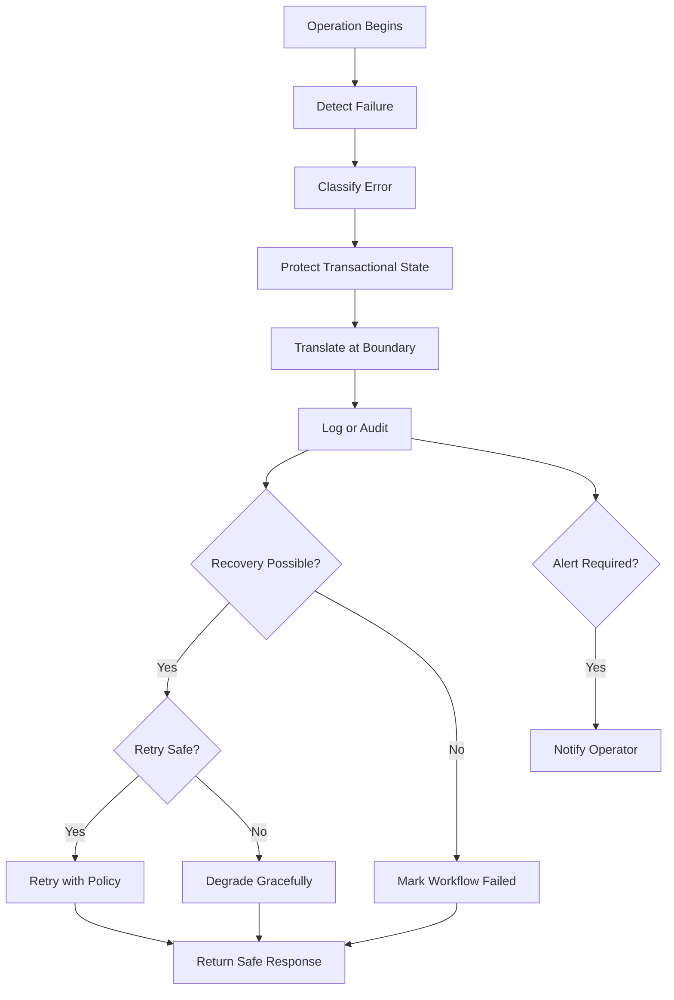
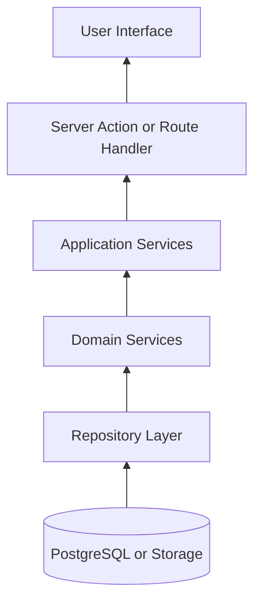
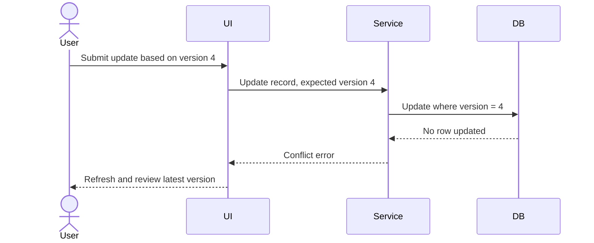
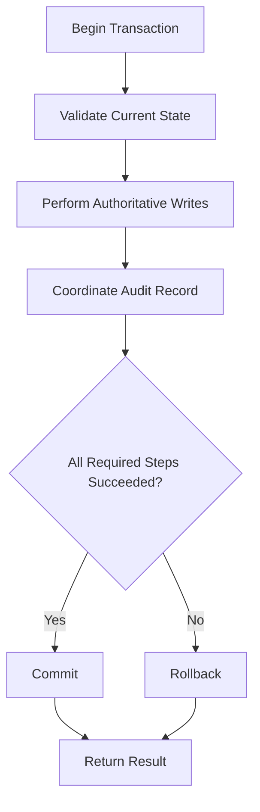
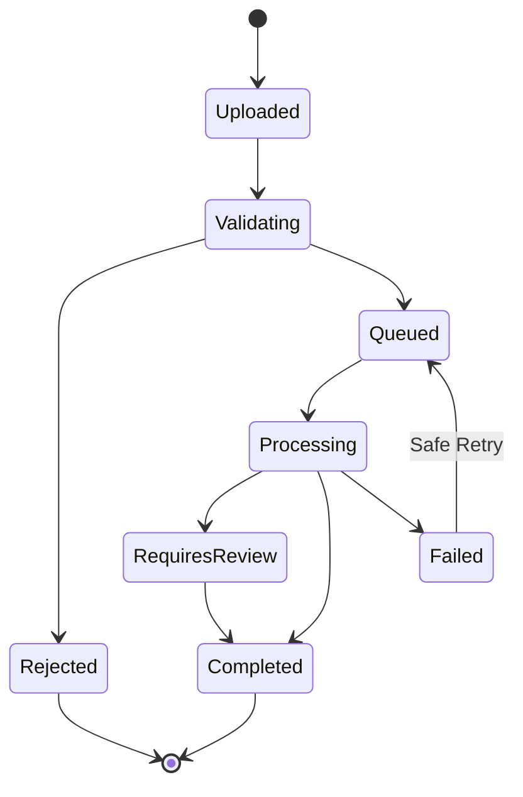
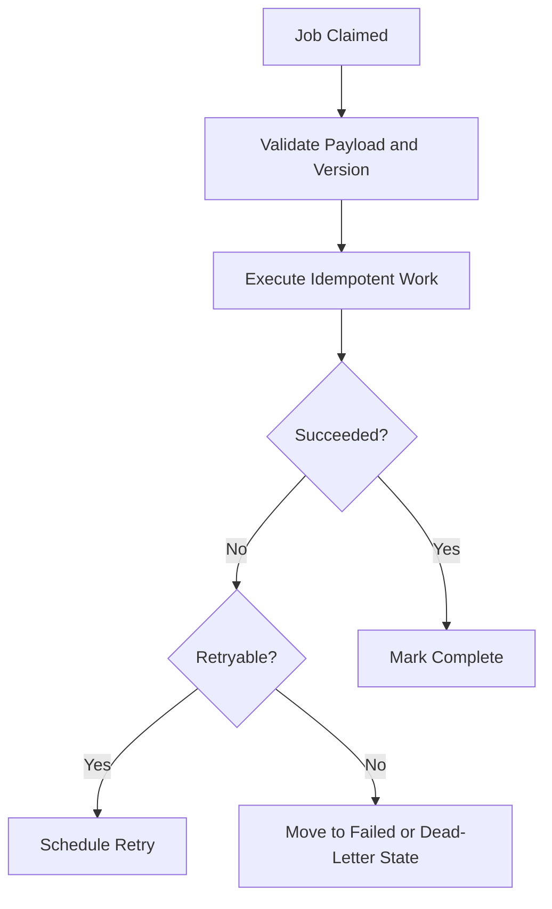
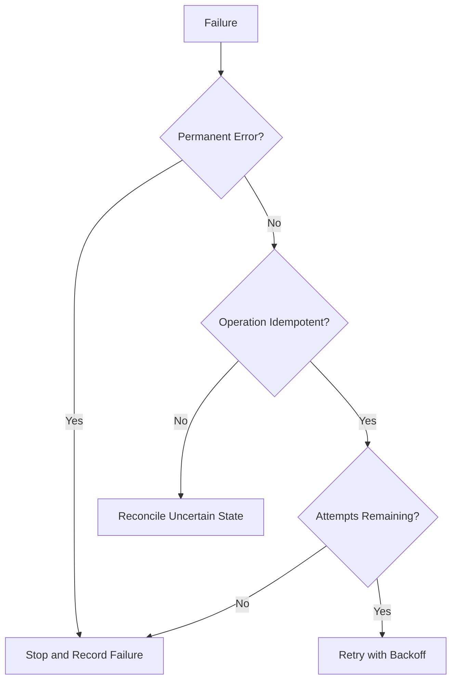
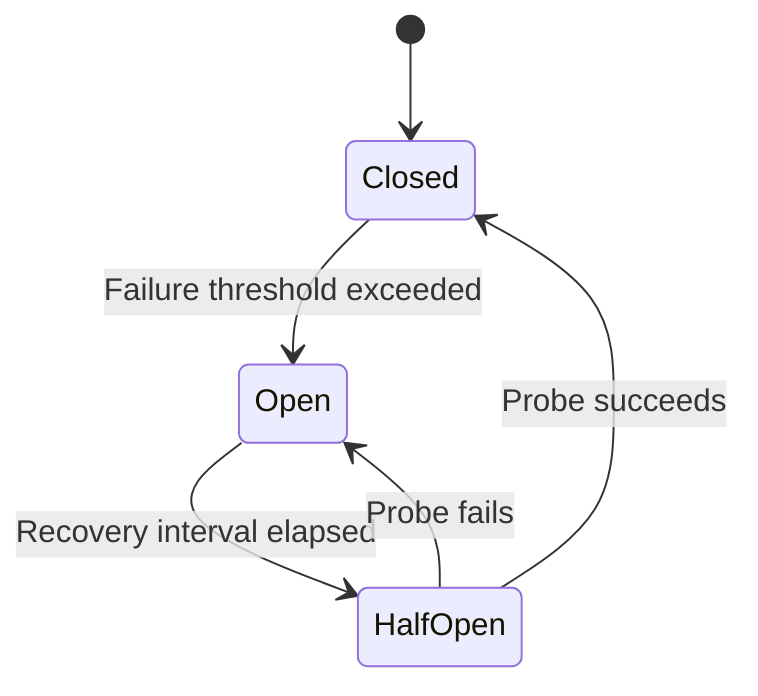
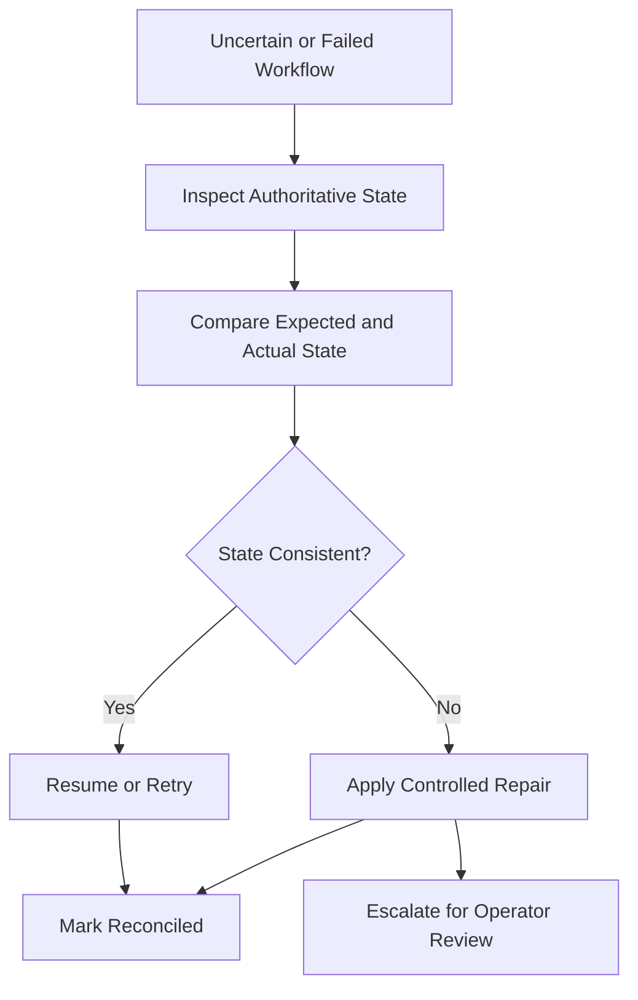

# Error Handling Strategy

**Project:** Financial Operating System

**Internal Codename:** Athena

**Document Version:** 1.1.0

**Status:** Draft

**Owner:** Caitlin Gillum

**Primary Architect:** Caitlin Gillum

**Technical Advisor:** OpenAI ChatGPT

**Last Updated:** August 2, 2026

---

## Table of Contents

- [Purpose](#purpose)
- [Scope](#scope)
- [Error Handling Philosophy](#error-handling-philosophy)
- [Objectives](#objectives)
- [Guiding Principles](#guiding-principles)
- [Definitions](#definitions)
- [Error Taxonomy](#error-taxonomy)
- [Error Severity](#error-severity)
- [Error Lifecycle](#error-lifecycle)
- [Architectural Boundaries](#architectural-boundaries)
- [Error Ownership](#error-ownership)
- [Detection](#detection)
- [Classification](#classification)
- [Propagation](#propagation)
- [Translation](#translation)
- [Standard Error Model](#standard-error-model)
- [Error Codes](#error-codes)
- [User-Facing Messages](#user-facing-messages)
- [Field-Level Validation Errors](#field-level-validation-errors)
- [Authentication Errors](#authentication-errors)
- [Authorization Errors](#authorization-errors)
- [Not-Found Behavior](#not-found-behavior)
- [Domain Rule Violations](#domain-rule-violations)
- [Conflict and Concurrency Errors](#conflict-and-concurrency-errors)
- [Duplicate Errors](#duplicate-errors)
- [Database Errors](#database-errors)
- [Transaction Failure and Rollback](#transaction-failure-and-rollback)
- [File Upload Errors](#file-upload-errors)
- [Import Errors](#import-errors)
- [Classification and Review Errors](#classification-and-review-errors)
- [Reporting and Dashboard Errors](#reporting-and-dashboard-errors)
- [Export Errors](#export-errors)
- [Storage Errors](#storage-errors)
- [Background Job Errors](#background-job-errors)
- [Notification Errors](#notification-errors)
- [External Dependency Errors](#external-dependency-errors)
- [AI Provider Errors](#ai-provider-errors)
- [Timeout Strategy](#timeout-strategy)
- [Retry Strategy](#retry-strategy)
- [Idempotency and Safe Retries](#idempotency-and-safe-retries)
- [Backoff and Jitter](#backoff-and-jitter)
- [Circuit Breakers](#circuit-breakers)
- [Dead-Letter Handling](#dead-letter-handling)
- [Graceful Degradation](#graceful-degradation)
- [Partial Failure](#partial-failure)
- [Recovery and Reconciliation](#recovery-and-reconciliation)
- [Audit Integration](#audit-integration)
- [Operational Logging](#operational-logging)
- [Monitoring and Alerting](#monitoring-and-alerting)
- [Security Considerations](#security-considerations)
- [Privacy Considerations](#privacy-considerations)
- [Performance Considerations](#performance-considerations)
- [Testing Strategy](#testing-strategy)
- [Production Readiness Requirements](#production-readiness-requirements)
- [Requirement Traceability](#requirement-traceability)
- [Deferred Decisions](#deferred-decisions)
- [Related Documents](#related-documents)
- [Revision History](#revision-history)

---

## Purpose

This document defines the Error Handling Strategy for Project Athena.

It establishes how the platform detects, classifies, propagates, translates, records, presents, retries, and recovers from failures.

The strategy protects:

- Financial integrity
- Data consistency
- User privacy
- System security
- Operational reliability
- Auditability
- User trust

Athena processes financial records, uploaded files, classifications, budgets, debts, reports, exports, background jobs, and other sensitive workflows.

A failed operation must therefore answer several questions clearly:

- Did any authoritative state change?
- Was the operation rolled back?
- Can the operation be retried safely?
- Did a duplicate financial effect occur?
- Is user action required?
- Is reconciliation required?
- Was the failure recorded?
- Should an operator be alerted?
- Can the platform continue in a degraded mode?

The central principle of this strategy is:

> A failed operation must never leave Athena in an ambiguous financial state.

---

## Scope

This document covers errors originating from:

- Browser interactions
- Server-rendered interfaces
- Server Actions
- Route Handlers
- Application services
- Domain services
- Repository operations
- PostgreSQL
- Supabase
- File uploads
- Private object storage
- Import processing
- Duplicate detection
- Merchant normalization
- Classification
- Review workflows
- Budgets
- Bills
- Debts
- Assets
- Liabilities
- Financial goals
- Reports
- Dashboards
- Exports
- Background jobs
- Notifications
- External providers
- AI-assisted workflows
- Deployment and runtime dependencies

This document does not define:

- Final user-interface copy
- Final API response schemas
- Final error-code catalog
- Final monitoring provider
- Final alert-routing provider
- Final retry limits
- Final timeout values
- Final queue provider
- Final circuit-breaker library
- Final dead-letter queue implementation
- Final incident-severity policy

These decisions may be resolved in later architecture documents, implementation specifications, or Architecture Decision Records.

---

## Error Handling Philosophy

Errors are expected operating conditions, not exceptional afterthoughts.

Athena shall design for failures at every trust and dependency boundary.

The platform must assume that:

- Users will submit invalid input.
- Sessions will expire.
- Resources may change between reading and writing.
- Uploaded files may be malformed.
- Imports may contain duplicate or ambiguous records.
- Databases may reject writes.
- Networks may time out.
- External providers may become unavailable.
- Background jobs may execute more than once.
- Notifications may fail after financial work succeeds.
- AI providers may return invalid or unsafe output.
- Deployments may introduce unexpected defects.

Errors must be handled deliberately according to their type, scope, financial effect, and recoverability.

---

## Objectives

Athena's error-handling strategy shall provide:

### Financial Safety

Failures must not create duplicated, missing, or partially applied financial effects.

### Consistency

Comparable errors should produce comparable system behavior and user experiences.

### Explainability

Operators and developers should be able to determine what failed without exposing sensitive data.

### Recoverability

Retryable workflows should recover without producing duplicate effects.

### Security

Error responses must not disclose protected records, internal implementation details, secrets, or cross-owner resource existence.

### User Clarity

Messages should explain what occurred and what the user can do next.

### Observability

Material failures must produce structured operational signals.

### Separation of Concerns

Low-level exceptions must be translated before crossing architectural boundaries.

### Graceful Degradation

A nonessential dependency failure should not disable unrelated authoritative workflows.

---

## Guiding Principles

Athena shall follow these principles:

1. Fail safely.
2. Fail consistently.
3. Fail at the earliest responsible boundary.
4. Preserve authoritative financial integrity.
5. Roll back incomplete financial mutations.
6. Never expose raw infrastructure exceptions to users.
7. Never use user-facing messages as operational diagnostics.
8. Classify errors before deciding how to respond.
9. Retry only when the operation is safe and idempotent.
10. Do not retry permanent validation or authorization failures.
11. Preserve correlation across services and background work.
12. Separate operational logs from audit events.
13. Minimize sensitive information in errors and logs.
14. Use stable internal error codes.
15. Provide actionable user messages.
16. Avoid silent failure.
17. Avoid false success.
18. Preserve failed-workflow state when recovery is possible.
19. Degrade optional capabilities before authoritative financial capabilities.
20. Use synthetic data in documentation and tests.

---

## Definitions

### Error

A known failure condition that the platform expects and can classify.

Examples:

- Invalid input
- Expired session
- Duplicate transaction
- Version conflict
- Unsupported file type

### Exception

A runtime mechanism representing an abnormal execution condition.

Exceptions may represent known errors or unexpected defects.

### Fault

The underlying condition that caused a failure.

Examples:

- Network interruption
- Invalid rule implementation
- Database outage
- Corrupted file

### Failure

The externally observable inability to complete an intended operation.

### Recoverable Error

An error that may succeed after retry, correction, or dependency recovery.

### Permanent Error

An error that will not succeed without changing the input, authorization, configuration, or implementation.

### User-Correctable Error

An error the user can resolve through an explicit action.

### System-Correctable Error

An error the platform can safely retry or recover from without user intervention.

### Expected Error

A known business, validation, authentication, authorization, or conflict condition.

### Unexpected Error

A defect or unclassified runtime failure that was not intentionally modeled.

---

## Error Taxonomy

Athena shall classify errors into a controlled taxonomy.

| Category | Description | Typical Retryability | Typical User Action |
|---|---|---:|---|
| Validation | Input does not satisfy the required schema | No | Correct input |
| Authentication | Identity cannot be verified | Sometimes | Sign in again |
| Authorization | Identity lacks permission | No | None or request access |
| Not Found | Requested resource is unavailable | No | Refresh or return |
| Domain Rule | Business invariant would be violated | No | Modify requested action |
| Conflict | Current state conflicts with the request | Sometimes | Refresh and retry |
| Duplicate | Operation would create a known duplicate | No | Review existing record |
| Concurrency | Resource changed during the operation | Yes, after refresh | Reload current data |
| Rate Limit | Request volume exceeds policy | Yes, after delay | Wait |
| Timeout | Operation exceeded its allowed duration | Sometimes | Retry safely |
| Dependency | Database, storage, queue, or provider failed | Often | Retry later |
| Processing | File or workflow could not be processed | Sometimes | Correct source or retry |
| Security | Suspicious or prohibited activity was detected | No | None |
| Configuration | Required system configuration is invalid | No | Operator action |
| Internal | Unexpected application defect | Unknown | Retry later or report |
| Degraded Service | Optional capability is unavailable | Yes | Continue without feature |

Every classified error should define:

- Stable error code
- Category
- Severity
- Retryability
- User-safe message
- Internal diagnostic context
- Logging level
- Audit requirement
- Monitoring requirement
- Financial-integrity effect
- Recovery behavior

---

## Error Severity

Athena shall distinguish error category from operational severity.

### Informational

Expected condition requiring no operator response.

Examples:

- Duplicate import correctly rejected
- User cancels an upload
- Optional suggestion unavailable

### Warning

A recoverable or user-correctable issue that may require observation.

Examples:

- Import contains records requiring review
- Notification delivery failed
- Retried dependency call succeeded

### Error

A workflow failed and could not complete as requested.

Examples:

- Import processing failed
- Database transaction rolled back
- Export generation failed

### Critical

A failure threatens availability, security, or financial integrity.

Examples:

- Repeated cross-owner access control failure
- Database corruption
- Financial mutation committed without required audit coordination
- Widespread transaction-processing failure
- Backup restoration failure
- Unauthorized exposure of protected data

Severity must not be determined solely by exception type.

Context, frequency, scope, and financial impact must also be considered.

---

## Error Lifecycle



The lifecycle may differ for synchronous requests and asynchronous workflows, but the same principles apply.

---

## Architectural Boundaries

Errors should become more abstract as they move outward from infrastructure to the user interface.



Examples:

```
PostgreSQL unique constraint violation
    ↓
Repository duplicate-record error
    ↓
Application duplicate-transaction error
    ↓
Interface conflict response
    ↓
"This transaction already exists."
```

The original exception may remain available in protected diagnostics but must not leak through the public boundary.

---

## Error Ownership

The layer that can most accurately understand a failure should classify it.

### User Interface

Responsible for:

- Displaying safe messages
- Associating field errors with controls
- Preserving user input where safe
- Offering appropriate recovery actions
- Preventing duplicate submissions

The user interface is not responsible for determining authorization or financial integrity.

### Interface Layer

Responsible for:

- Session verification
- Request parsing
- Runtime schema validation
- Error-to-response translation
- Correlation identifiers
- Safe response formatting

### Application Layer

Responsible for:

- Workflow-level error classification
- Authorization decisions
- Idempotency
- Transaction coordination
- Retry decisions
- Audit coordination
- Recovery state

### Domain Layer

Responsible for:

- Business-rule violations
- Invalid state transitions
- Financial invariants
- Deterministic domain errors

### Repository Layer

Responsible for:

- Translating database-specific failures
- Distinguishing missing, duplicate, conflict, and dependency conditions
- Preserving safe diagnostics
- Preventing raw SQL errors from crossing the repository boundary

### Infrastructure Layer

Responsible for:

- Timeouts
- Provider failures
- Queue errors
- Storage failures
- Connection errors
- Circuit-breaker state

---

## Detection

Failures may be detected through:

- Runtime validation
- Authentication checks
- Authorization checks
- Domain invariants
- Database constraints
- Version checks
- File inspection
- Parser validation
- Provider response validation
- Timeouts
- Health checks
- Monitoring thresholds
- Reconciliation processes
- User-reported inconsistencies

Athena shall prefer deterministic detection over inference where possible.

Examples:

- Unique constraints for duplicate protection
- Foreign keys for referential integrity
- Check constraints for valid monetary state
- Version columns for concurrent updates
- Explicit workflow states for background jobs
- Schema validation for provider responses

---

## Classification

Every error crossing the application-service boundary should be classified.

Unclassified exceptions shall be converted into a generic internal error while preserving the original exception in protected diagnostics.

Classification should consider:

- Was the input invalid?
- Was identity verified?
- Was the operation authorized?
- Does the resource exist?
- Was a domain invariant violated?
- Is this a duplicate?
- Did state change concurrently?
- Did an infrastructure dependency fail?
- Is the failure transient?
- Did any authoritative write commit?
- Is retry safe?
- Is user action required?
- Is operator action required?

---

## Propagation

Errors shall propagate upward only as far as needed.

A layer should:

- Handle an error when it can recover safely.
- Translate an error when crossing an architectural boundary.
- Re-throw or return the translated error when a higher layer must decide.
- Avoid catching an error solely to ignore it.
- Avoid wrapping errors repeatedly without adding useful context.

An error should retain:

- Stable internal code
- Category
- Correlation identifier
- Original causal chain where supported
- Safe contextual metadata
- Retryability
- Severity

---

## Translation

Translation converts implementation-specific failures into platform-specific errors.

Examples:

| Low-Level Failure | Platform Translation |
|---|---|
| Unique constraint violation | Duplicate resource |
| Foreign key violation | Invalid resource relationship |
| Row Level Security denial | Authorization failure |
| Serialization failure | Concurrency conflict |
| Storage object missing | File unavailable |
| Provider HTTP 429 | External provider rate limited |
| Provider HTTP 503 | External dependency unavailable |
| Parser exception | Import parsing failure |
| Invalid AI response schema | AI suggestion rejected |

Translation must not incorrectly convert unexpected defects into user mistakes.

---

## Standard Error Model

A standard internal error should contain fields equivalent to:

```typescript
type AppError = {
  code: string;
  category:
    | "validation"
    | "authentication"
    | "authorization"
    | "not_found"
    | "domain"
    | "conflict"
    | "duplicate"
    | "concurrency"
    | "rate_limit"
    | "timeout"
    | "dependency"
    | "processing"
    | "security"
    | "configuration"
    | "internal";
  message: string;
  userMessage: string;
  severity: "info" | "warning" | "error" | "critical";
  retryable: boolean;
  correlationId: string;
  fieldErrors?: Record<string, string[]>;
  safeMetadata?: Record<string, unknown>;
  cause?: unknown;
};
```

This example is conceptual and does not establish the final implementation.

The public response must expose only fields approved for the client.

---

## Error Codes

Error codes should be:

- Stable
- Searchable
- Machine-readable
- Independent from user-facing copy
- Independent from HTTP status text
- Specific enough for support and diagnostics
- General enough to avoid exposing internal structure

Example code families:

- `AUTHENTICATION_REQUIRED`
- `AUTHENTICATION_EXPIRED`
- `AUTHORIZATION_DENIED`
- `RESOURCE_NOT_FOUND`
- `VALIDATION_FAILED`
- `TRANSACTION_DUPLICATE`
- `TRANSACTION_CONFLICT`
- `IMPORT_UNSUPPORTED_FORMAT`
- `IMPORT_PARSE_FAILED`
- `IMPORT_REQUIRES_REVIEW`
- `EXPORT_GENERATION_FAILED`
- `BACKGROUND_JOB_FAILED`
- `DEPENDENCY_UNAVAILABLE`
- `RATE_LIMITED`
- `INTERNAL_ERROR`

Error codes shall not contain:

- User identifiers
- Account numbers
- File names
- Database table names
- SQL constraint names
- Provider secrets
- Sensitive financial data

---

## User-Facing Messages

User-facing error messages should be:

- Clear
- Brief
- Actionable
- Nontechnical
- Consistent
- Honest
- Safe

A message should communicate:

- What could not be completed
- Whether anything was saved
- What the user can do next

Examples:

- "This transaction could not be saved. No changes were made."
- "This transaction already exists and was not added again."
- "The file could not be processed because its format is not supported."
- "This record changed while you were editing it. Refresh the page and review the latest version before trying again."
- "The export could not be generated right now. Your financial records were not changed."

User-facing messages must not display:

- Stack traces
- SQL errors
- Constraint names
- Internal paths
- Provider payloads
- Secrets
- Raw authentication details
- Cross-owner resource information

---

## Field-Level Validation Errors

Field-level errors should be returned when the user can correct a specific input.

Examples:

- Missing account
- Invalid date
- Unsupported currency code
- Description exceeds allowed length
- Amount has excessive decimal precision
- End date precedes start date

Field-level errors should:

- Identify the affected field
- Explain the correction
- Preserve valid input where safe
- Be accessible to screen readers
- Avoid relying only on visual styling
- Remain consistent between client and server validation

Server validation remains authoritative even when client validation exists.

---

## Authentication Errors

Authentication errors include:

- Missing session
- Expired session
- Invalid session
- Revoked session
- Invalid credentials
- Authentication provider unavailable

Expected behavior:

- Deny protected processing.
- Do not begin financial mutation.
- Do not reveal protected resource existence.
- Clear invalid local session state where appropriate.
- Direct the user to authenticate again.
- Record suspicious patterns when appropriate.

Authentication failures are generally not retryable without session renewal.

Provider outages may be retryable but must not bypass authentication.

---

## Authorization Errors

Authorization errors include:

- Cross-owner access attempt
- Access to an unowned account
- Attempt to modify a protected record
- Attempt to resolve another owner's review item
- Attempt to retrieve another owner's export
- Attempt to perform a privileged operation without permission

Expected behavior:

- Deny access.
- Do not mutate authoritative state.
- Avoid revealing whether the target resource exists.
- Return a safe authorization or not-found response according to security policy.
- Record security telemetry.
- Escalate repeated or systematic attempts.

The browser must never determine final authorization.

---

## Not-Found Behavior

A resource may be unavailable because it:

- Does not exist
- Belongs to another owner
- Was archived
- Was deleted
- Is not visible in the current workflow state

Athena may intentionally return the same public result for missing and unauthorized resources to reduce information disclosure.

Internal diagnostics should distinguish them where safe.

---

## Domain Rule Violations

Domain errors represent valid requests that would violate business rules.

Examples:

- Invalid transaction state transition
- Attempt to count an internal transfer as income
- Attempt to reconcile the same bill occurrence twice
- Attempt to accept an already resolved review item
- Invalid reimbursement relationship
- Invalid debt-payment allocation
- Unsupported historical modification
- Invalid reporting-period operation

Domain errors:

- Must be deterministic.
- Must not be treated as infrastructure failures.
- Must not be retried automatically.
- Should explain the required correction.
- Must not partially mutate authoritative state.

---

## Conflict and Concurrency Errors

Conflicts occur when the requested action is valid in principle but incompatible with current state.

Examples:

- Record changed after the user loaded it
- Review item resolved by another request
- Import job already completed
- Default resource already assigned
- Concurrent update changed a version number



Conflict responses should provide a safe recovery action rather than silently overwriting current state.

---

## Duplicate Errors

Duplicates may be detected at:

- Request level
- Idempotency-key level
- File fingerprint level
- Source-row fingerprint level
- Transaction fingerprint level
- Database constraint level
- Domain-relationship level

A deterministic duplicate should produce a non-destructive result.

Examples:

- "This transaction already exists and was not added again."
- "This file has already been imported."

Ambiguous similarity should enter review rather than being rejected as a confirmed duplicate.

Duplicate handling must not create a second financial effect.

---

## Database Errors

Database errors may include:

- Connection failure
- Query timeout
- Constraint violation
- Serialization failure
- Deadlock
- Row Level Security denial
- Migration mismatch
- Capacity exhaustion
- Unexpected database exception

Repository code must translate database-specific errors.

### Constraint Violations

Known constraint violations should become domain, duplicate, validation, or conflict errors.

### Connection Failures

Connection failures are typically dependency errors and may be retryable.

### Deadlocks and Serialization Failures

These may be retried when:

- The workflow is idempotent.
- The transaction did not commit.
- Retry limits are enforced.
- Backoff is applied.

### Migration Mismatch

Schema incompatibility is a configuration or deployment error and should generate immediate operational alerts.

---

## Transaction Failure and Rollback

Financially significant mutations must execute within an appropriate database transaction.



On failure:

- All dependent writes must roll back.
- The user must not receive a success response.
- The workflow must not be marked complete.
- Retry behavior must account for uncertain commit state.
- Reconciliation must occur if commit status cannot be determined.

The system must never assume rollback solely because the client did not receive a response.

---

## File Upload Errors

Upload failures may include:

- Missing file
- Unsupported type
- Invalid extension
- File signature mismatch
- File exceeds size limit
- Empty file
- Corrupted file
- Storage upload failure
- Malware or unsafe-content detection
- Ownership mismatch
- Duplicate file

Expected behavior:

- Reject unsafe files before processing.
- Avoid creating completed import jobs.
- Remove orphaned temporary objects where safe.
- Preserve a failed workflow record when operational recovery is needed.
- Provide a safe explanation.
- Record security events for suspicious uploads.

File extensions alone must not establish file type.

---

## Import Errors

Import failures may occur during:

- Upload validation
- Storage
- Job creation
- Parsing
- Column mapping
- Date conversion
- Monetary conversion
- Normalization
- Fingerprinting
- Duplicate detection
- Classification
- Persistence
- Audit coordination



An import failure must preserve:

- Import identifier
- Owner context
- Current status
- Processing stage
- Safe failure category
- Attempt count
- Correlation identifier
- Accepted-row count
- Rejected-row count
- Review-item count
- Whether authoritative transactions were committed

Batch processing must define whether:

- The entire import is atomic, or
- Individual rows commit independently with explicit batch reconciliation

The final batch-atomicity model is deferred.

---

## Classification and Review Errors

Classification errors include:

- Rule evaluation failure
- Invalid category mapping
- Unsupported classification result
- AI output validation failure
- Classification history persistence failure
- Review item already resolved
- Invalid review resolution
- Suggested classification no longer applicable

Expected behavior:

- Preserve the original transaction.
- Do not invent a classification.
- Route unresolved ambiguity to review.
- Prevent lower-precedence rules from overwriting confirmed decisions.
- Preserve the reason for failure.
- Avoid blocking unrelated transaction access.

Classification failure should not remove or duplicate an authoritative transaction.

---

## Reporting and Dashboard Errors

Report and dashboard failures may originate from:

- Invalid date filters
- Unsupported aggregation
- Query timeout
- Stale read model
- Missing derived data
- Cache failure
- Database dependency failure
- Calculation defect

Expected behavior:

- Do not modify authoritative records.
- Distinguish unavailable data from zero values.
- Avoid displaying incomplete aggregates as complete.
- Label stale data when stale reads are permitted.
- Allow independent dashboard sections to degrade where safe.
- Provide retry controls for recoverable failures.

A failed report must not alter source financial data.

---

## Export Errors

Export failures may include:

- Invalid export filters
- Authorization failure
- Query timeout
- Formatting failure
- Storage failure
- Signed-link creation failure
- Export expiration
- Background-job failure

Expected behavior:

- Do not modify authoritative financial records.
- Do not mark the export complete before private storage succeeds.
- Do not expose partial exports.
- Record export-generation failures.
- Retry only when idempotent.
- Expire or remove incomplete artifacts.
- Provide time-limited access only after successful completion.

---

## Storage Errors

Storage failures may include:

- Upload failure
- Download failure
- Missing object
- Permission denial
- Signed-link failure
- Provider outage
- Capacity or quota exhaustion

Storage references and database records must remain coordinated.

The platform should detect and reconcile:

- Database records without objects
- Objects without database records
- Expired temporary files
- Incomplete exports
- Failed import uploads

Private storage failure must not cause the platform to make files public as a fallback.

---

## Background Job Errors

Background jobs may fail because of:

- Invalid payload
- Unknown job version
- Missing owner context
- Dependency outage
- Timeout
- Worker termination
- Duplicate execution
- Poison message
- Permanent domain error
- Retry exhaustion

Every job should preserve:

- Job identifier
- Job type
- Payload version
- Owner context
- Correlation identifier
- Idempotency key
- Attempt count
- Last failure category
- Next retry time
- Final status



A job must not be marked successful merely because the worker acknowledged receipt.

---

## Notification Errors

Notification delivery is generally a secondary workflow.

If notification delivery fails after an authoritative financial operation succeeds:

- The financial operation remains successful.
- Notification status is recorded separately.
- Delivery may be retried.
- The user must not be told the financial operation failed.
- Duplicate notifications must be prevented.

Security-sensitive notifications may receive higher retry and alert priority than informational notifications.

Notification content must remain minimal and must not include unnecessary financial details.

---

## External Dependency Errors

External dependencies may include:

- Authentication provider
- Database provider
- Storage provider
- Email provider
- Monitoring provider
- AI provider
- Future financial-data provider

Dependency failures should be classified as:

- Timeout
- Rate limit
- Authentication failure
- Invalid response
- Temporary unavailability
- Permanent rejection
- Configuration failure
- Provider defect

Provider-specific details must be translated before reaching application or interface boundaries.

---

## AI Provider Errors

AI-related failures may include:

- Provider timeout
- Rate limit
- Invalid schema
- Unsafe output
- Unsupported category
- Prompt-injection indicators
- Excessive response size
- Provider outage
- Redaction failure
- Confidence below threshold

Expected behavior:

- Reject malformed output.
- Never persist unvalidated suggestions.
- Never bypass review or domain rules.
- Continue deterministic workflows without AI where possible.
- Avoid treating provider output as authoritative.
- Log only safe metadata.
- Do not send expanded sensitive context during retry.

An AI failure must not block manual transaction review when the manual workflow remains available.

---

## Timeout Strategy

Every external or potentially long-running operation should define a timeout.

Timeouts may apply to:

- Database queries
- Storage requests
- Authentication verification
- Provider requests
- AI requests
- Export generation
- Import processing
- Background-job execution
- Report queries

Timeout behavior must specify:

- Maximum duration
- Whether cancellation is attempted
- Whether the operation may have committed
- Retryability
- Idempotency requirement
- User-facing response
- Monitoring threshold

A timeout does not prove that no external side effect occurred.

Operations with uncertain outcomes must reconcile before retrying.

---

## Retry Strategy

Retries are appropriate only when:

- The failure is transient.
- The operation is idempotent or protected by an idempotency key.
- The prior attempt did not produce an untracked side effect.
- Retry limits are bounded.
- Backoff is applied.
- Retry does not violate user intent.



Do not retry automatically:

- Validation errors
- Authentication failures requiring user action
- Authorization denials
- Confirmed duplicates
- Domain-rule violations
- Unsupported file formats
- Permanent provider rejections
- Unknown side-effect operations without reconciliation

---

## Idempotency and Safe Retries

Retryable mutations must use idempotency protection.

Applicable workflows include:

- Transaction creation
- Import creation
- Import processing
- Debt-payment recording
- Review resolution
- Export generation
- Snapshot creation
- Notification delivery
- Background-job execution

An idempotency record should identify:

- Owner
- Operation type
- Idempotency key
- Request fingerprint
- Status
- Result reference
- Creation time
- Expiration policy

A repeated request with the same key and compatible input should return the prior result rather than create a new financial effect.

A repeated key with conflicting input should produce a conflict error.

---

## Backoff and Jitter

Retries should generally use exponential backoff with jitter.

This helps prevent:

- Provider overload
- Queue retry storms
- Database contention
- Coordinated client retries
- Cascading failures

Retry configuration should define:

- Initial delay
- Growth factor
- Maximum delay
- Maximum attempts
- Jitter strategy
- Retryable categories
- Final-failure behavior

Final values are deferred.

---

## Circuit Breakers

Circuit breakers may protect Athena from repeatedly calling an unhealthy dependency.



Potential circuit-breaker targets include:

- AI provider
- Notification provider
- External financial-data provider
- Storage provider
- Noncritical reporting service

Circuit breakers should not replace:

- Timeouts
- Retries
- Health monitoring
- Graceful degradation
- Provider error translation

---

## Dead-Letter Handling

A job may enter a dead-letter or terminal-failure state when:

- Retry attempts are exhausted.
- The payload is invalid.
- The job version is unsupported.
- A permanent domain error occurs.
- Repeated execution would be unsafe.
- Operator review is required.

Dead-letter records should include:

- Job identifier
- Safe payload reference
- Failure category
- Attempt history
- Correlation identifier
- Owner-safe context
- Recovery instructions
- Resolution status

Sensitive payloads should not be duplicated into dead-letter metadata.

---

## Graceful Degradation

Athena should distinguish authoritative capabilities from optional capabilities.

### Authoritative Capabilities

Examples:

- Authentication
- Authorization
- Transaction persistence
- Ownership enforcement
- Database integrity

Failure may require blocking the operation.

### Optional Capabilities

Examples:

- AI suggestions
- Notifications
- Nonessential dashboard widgets
- Cached summaries
- Optional analytics

Failure should not block unrelated authoritative workflows when a safe fallback exists.

Examples:

- Continue manual classification when AI is unavailable.
- Display core account data when one dashboard widget fails.
- Complete a transaction even when an informational notification fails.
- Query authoritative data when a cache is unavailable.

---

## Partial Failure

Partial failure occurs when one part of a multi-step workflow succeeds and another fails.

Examples:

- Financial record commits but notification fails.
- Export file is created but signed-link generation fails.
- File uploads but import-job creation fails.
- Import rows persist but summary generation fails.
- Transaction commits but cache invalidation fails.

Every workflow must classify each step as:

- Required for commit
- Required for user success
- Recoverable after commit
- Optional
- Compensatable

Required financial steps should share a transaction where possible.

Secondary effects should use reliable coordination patterns such as:

- Transactional outbox
- Durable job records
- Reconciliation tasks
- Idempotent consumers

The final coordination pattern is deferred.

---

## Recovery and Reconciliation

Recovery restores a failed workflow to a known state.

Reconciliation compares expected and actual state.

Reconciliation may be required for:

- Timed-out writes
- Import counts
- Storage objects
- Export artifacts
- Notifications
- Background jobs
- Audit records
- Derived snapshots
- External-provider operations



Reconciliation actions must be auditable when they change authoritative state.

---

## Audit Integration

Audit records document material business and security actions.

Errors may require audit events when they involve:

- Failed authorization
- Suspicious access
- Import rejection
- Review resolution failure
- Financial mutation rollback
- Export denial
- Administrative recovery
- Reconciliation
- Security-control failure

Operational errors do not automatically require audit events.

Audit events should capture:

- Actor
- Owner context
- Action
- Outcome
- Resource type
- Safe resource identifier
- Correlation identifier
- Timestamp
- Failure category
- Approved metadata

Audit records must not include:

- Full stack traces
- Raw files
- Authentication secrets
- Complete financial descriptions
- Full provider payloads
- Sensitive narrative notes

---

## Operational Logging

Operational logs support diagnosis, monitoring, and incident response.

Structured error logs should include:

- Timestamp
- Environment
- Application version
- Correlation identifier
- Error code
- Category
- Severity
- Workflow
- Component
- Retryability
- Attempt count
- Duration
- Safe identifiers
- Sanitized causal chain

Logs must not include:

- Passwords
- Session tokens
- API keys
- Full account identifiers
- Full financial records
- Raw uploaded files
- Full exports
- Unredacted AI prompts
- Protected medical or legal narratives

Unexpected exceptions should include protected stack traces in approved server-side logging only.

---

## Monitoring and Alerting

Monitoring should identify:

- Error-rate increases
- Repeated transaction rollback
- Import failure spikes
- Background-job retry exhaustion
- Database dependency failures
- Storage failures
- Authentication anomalies
- Authorization-denial spikes
- Export failure spikes
- AI-provider degradation
- Notification-delivery failures
- Schema or migration mismatch
- Reconciliation backlog

Alerts should be based on:

- Severity
- Frequency
- Duration
- Scope
- Financial impact
- Security impact
- Recovery status

Not every user validation error should alert an operator.

Critical alerts must identify:

- Affected environment
- Workflow
- Correlation identifiers
- First occurrence
- Most recent occurrence
- Approximate scope
- Current recovery state

---

## Security Considerations

Error handling can introduce security vulnerabilities through:

- Information disclosure
- Resource enumeration
- Stack-trace exposure
- SQL-error exposure
- Secret leakage
- Insecure logging
- Retry amplification
- Cross-owner cache leakage
- Authorization bypass during fallback
- Unsafe debug modes
- Detailed authentication feedback
- Provider-payload exposure

Required controls include:

- Generic public messages for sensitive failures
- Server-side authorization on every protected operation
- Sanitized logs
- Restricted diagnostic access
- Stable public error codes
- Environment-specific debug controls
- Rate limiting
- Safe retry limits
- Cross-owner tests
- No production stack traces in client responses
- No authorization fallback during dependency failure

A security control failure must fail closed.

---

## Privacy Considerations

Error records must follow data-minimization principles.

Athena should avoid recording:

- Complete transaction descriptions
- Full uploaded rows
- Personal account names
- Full export filters when sensitive
- Sensitive legal or medical classifications
- Full AI prompts
- User-entered narrative details

Safe metadata may include:

- Internal resource identifiers
- Error category
- Workflow stage
- Record count
- File size
- File type
- Attempt count
- Processing duration
- Classification outcome

Retention periods for logs, failed jobs, and error diagnostics must be explicitly defined.

---

## Performance Considerations

Error handling should not create disproportionate system load.

Potential risks include:

- Retry storms
- Excessive stack-trace logging
- Duplicate audit events
- Repeated reconciliation
- Large failed-payload storage
- High-cardinality metrics
- Circuit-breaker thrashing
- Expensive error serialization

Controls may include:

- Bounded retries
- Sampling repeated errors
- Aggregated metrics
- Log-size limits
- Payload redaction
- Backoff and jitter
- Queue concurrency limits
- Dead-letter thresholds
- Rate limiting

Performance optimization must not suppress critical financial or security failures.

---

## Testing Strategy

### Unit Tests

Verify:

- Error classification
- Error-code stability
- Domain-error creation
- Retry decisions
- Timeout classification
- User-message mapping
- Redaction
- Backoff calculations

### Integration Tests

Verify:

- Repository error translation
- Database rollback
- Constraint handling
- Row Level Security denial
- Storage failure
- Provider timeout
- Audit coordination
- Background-job failure states

### Transaction Tests

Verify:

- No partial financial writes
- Rollback on required-step failure
- Commit behavior
- Uncertain commit reconciliation
- Idempotent repeated requests

### Security Tests

Verify:

- No cross-owner information disclosure
- No stack traces in public responses
- No secrets in logs
- Authorization fails closed
- Resource enumeration resistance
- Debug behavior disabled in production

### Concurrency Tests

Verify:

- Version conflicts
- Duplicate review resolution
- Concurrent import execution
- Deadlock retry behavior
- Idempotency-key conflicts

### Failure-Injection Tests

Simulate:

- Database outage
- Storage outage
- Authentication-provider outage
- AI-provider timeout
- Notification-provider failure
- Worker termination
- Queue redelivery
- Export interruption
- Audit failure
- Cache failure

### User-Interface Tests

Verify:

- Field errors are associated with controls.
- Error summaries are accessible.
- User input is preserved where safe.
- Loading states resolve correctly.
- Duplicate submission is prevented.
- Retry controls do not duplicate mutations.
- Technical details are not exposed.

All tests must use synthetic or sanitized data.

---

## Production Readiness Requirements

Before a workflow is production-ready, it must define:

- Expected error categories
- Stable error codes
- User-safe messages
- Transaction boundaries
- Rollback behavior
- Idempotency requirements
- Retry eligibility
- Retry limits
- Timeout behavior
- Logging fields
- Redaction requirements
- Audit requirements
- Monitoring thresholds
- Alert conditions
- Recovery process
- Reconciliation process
- Failure tests
- Operator runbook

Financial mutation workflows must not ship without tested rollback and duplicate-prevention behavior.

---

## Requirement Traceability

| Error Handling Area | Related Requirements |
|---|---|
| Authentication failures | FR-025, NFR-001 through NFR-004 |
| Authorization failures | FR-026, NFR-001 through NFR-004 |
| Validation errors | FR-001 through FR-032, NFR-005 |
| Import failures | FR-001 through FR-005, FR-030, NFR-005 through NFR-009 |
| Duplicate prevention | FR-003 through FR-005, NFR-005, NFR-006 |
| Classification and review errors | FR-007 through FR-010, FR-031, NFR-018 |
| Budget and reporting errors | FR-011 through FR-017, NFR-005, NFR-008 |
| Debt workflow errors | FR-018, FR-019, NFR-005, NFR-006 |
| Asset and net-worth errors | FR-020 through FR-022, NFR-005, NFR-006 |
| Goal workflow errors | FR-023, FR-024 |
| Audit failures | FR-027, NFR-005, NFR-018 |
| Export failures | FR-028, NFR-001 through NFR-004, NFR-017 |
| Recovery and backups | FR-029, NFR-007 |
| Background-processing failures | FR-030, NFR-007 through NFR-009 |
| Dashboard degradation | FR-032, NFR-008, NFR-013 through NFR-018 |
| Financial integrity | NFR-005, NFR-006 |
| Reliability | NFR-007 |
| Performance | NFR-008, NFR-009 |
| Maintainability | NFR-010 through NFR-014 |
| Privacy and data minimization | NFR-001 through NFR-004, NFR-017 |
| Explainability | NFR-018 |

---

## Deferred Decisions

The following decisions remain open:

- ~~Final error-class implementation~~ — resolved for the Server Action boundary: a six-category taxonomy (`validation`, `authentication`, `authorization`, `domain`, `infrastructure`, `unexpected`) implemented in `src/lib/actions/classify.ts`. Domain-layer error classes (`NotFoundError`, `ValidationError`, `ConflictError`) remain in `src/domains/errors.ts`, extended with optional `fieldErrors`. Application-service, Route Handler, and background-job error-class implementations remain open.
- Final public error-response schema
- Final error-code namespace
- HTTP status mapping
- ~~Server Action error-return conventions~~ — resolved: `ActionResult<T>` and `executeAction()` in `src/lib/actions/`. See `docs/standards/coding-standards.md` § Error Handling Standards.
- Route Handler error-return conventions
- Error localization strategy
- User-interface copy catalog
- Error-message ownership
- Correlation-ID generation
- Correlation propagation
- Logging provider
- Monitoring provider
- Alert-routing provider
- Stack-trace retention
- Log-retention period
- Error-metric cardinality limits
- Database retry limits
- Background-job retry limits
- Provider retry limits
- Timeout values
- Backoff configuration
- Jitter algorithm
- Circuit-breaker library
- Circuit-breaker thresholds
- Dead-letter queue provider
- Dead-letter retention
- Transactional outbox adoption
- Audit failure policy
- Import batch-atomicity model
- Partial-import recovery behavior
- Reconciliation scheduling
- Automatic repair boundaries
- Export cleanup schedule
- Orphaned-storage reconciliation
- Notification retry policy
- AI failure thresholds
- Rate-limit response policy
- Incident-severity mapping
- Operator runbook format
- User support reference identifiers
- Error-reporting feedback workflow

Architecturally significant decisions shall be documented through ADRs.

---

## Related Documents

- docs/product-requirements.md
- docs/architecture/README.md
- docs/architecture/engineering-principles.md
- docs/architecture/system-architecture.md
- docs/architecture/application-architecture.md
- docs/architecture/frontend-architecture.md
- docs/architecture/domain-model.md
- docs/architecture/backend-architecture.md
- docs/architecture/database-architecture.md
- docs/architecture/security-architecture.md
- docs/architecture/deployment-architecture.md
- docs/architecture/data-flow.md
- docs/adr/README.md
- docs/adr/0002-initial-technology-stack.md

---

## Revision History

| Version | Date | Author | Summary |
|---|---|---|---|
| 1.0.0 | 2026-07-29 | Caitlin Gillum | Defined Athena's error-handling philosophy, taxonomy, lifecycle, propagation, translation, user messaging, transaction rollback, retries, idempotency, dependency failures, graceful degradation, reconciliation, logging, audit integration, monitoring, security controls, and testing requirements. |
| 1.1.0 | 2026-08-02 | Caitlin Gillum | Resolved the "final error-class implementation" and "Server Action error-return conventions" deferred decisions for the Server Action boundary, implemented as `src/lib/actions/` (six-category taxonomy, `executeAction`, safe logging that never leaks infrastructure error text). |