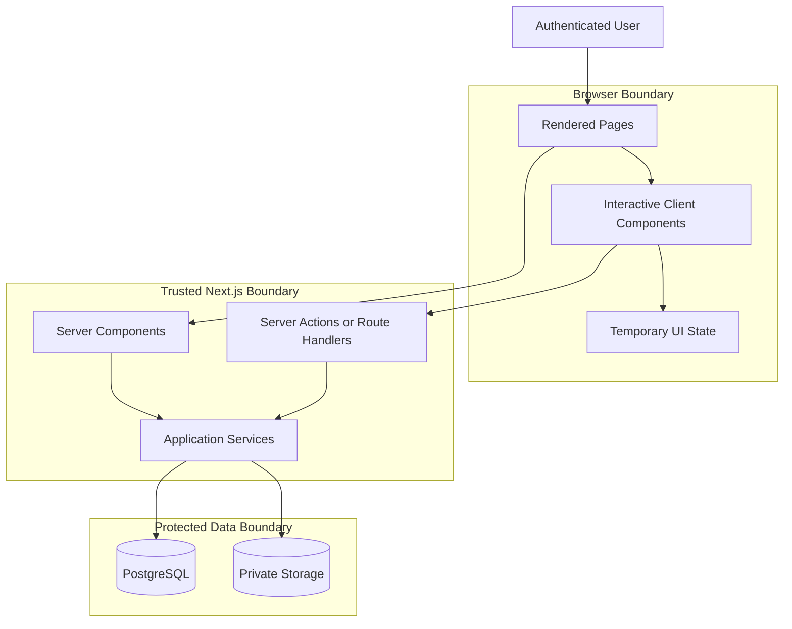
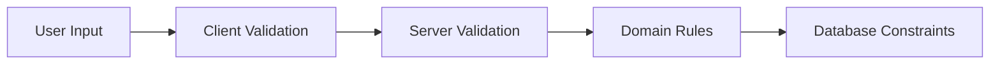
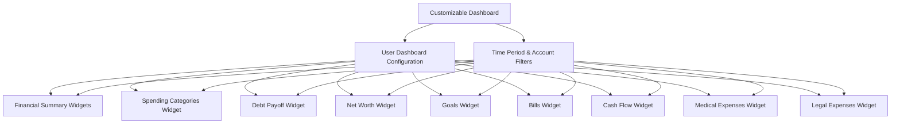
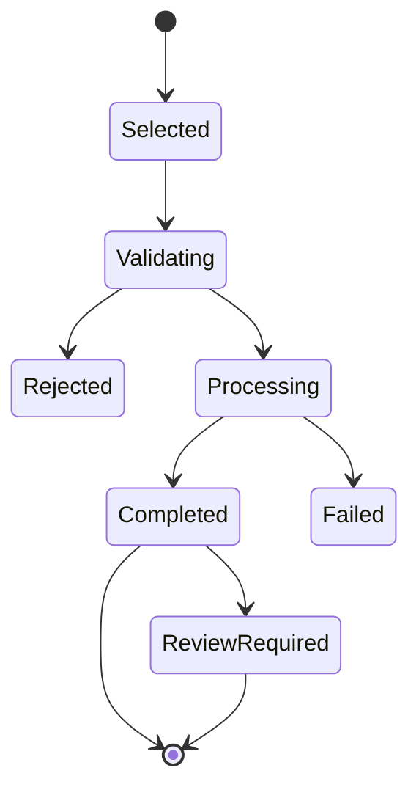

# Frontend Architecture

**Project:** Financial Operating System

**Internal Codename:** Athena

**Document Version:** 1.0.0

**Status:** Draft

**Owner:** Caitlin Gillum

**Primary Architect:** Caitlin Gillum

**Technical Advisor:** OpenAI ChatGPT

**Last Updated:** July 26, 2026

---

## Table of Contents

- [Purpose](#purpose)
- [Scope](#scope)
- [Frontend Architecture Overview](#frontend-architecture-overview)
- [Design Goals](#design-goals)
- [Rendering Strategy](#rendering-strategy)
- [Route Organization](#route-organization)
- [Page Responsibilities](#page-responsibilities)
- [Component Architecture](#component-architecture)
  - [Page Components](#page-components)
  - [Feature Components](#feature-components)
  - [Shared UI Components](#shared-ui-components)
  - [Chart Components](#chart-components)
  - [Form Components](#form-components)
- [Server and Client Components](#server-and-client-components)
- [Data Fetching](#data-fetching)
- [Mutations](#mutations)
- [State Management](#state-management)
- [Forms and Validation](#forms-and-validation)
- [Dashboard Architecture](#dashboard-architecture)
- [Transaction Review Experience](#transaction-review-experience)
- [File Upload Experience](#file-upload-experience)
- [Error Handling](#error-handling)
- [Loading and Empty States](#loading-and-empty-states)
- [Accessibility](#accessibility)
- [Responsive Design](#responsive-design)
- [Privacy and Sensitive Data Display](#privacy-and-sensitive-data-display)
- [Frontend Security](#frontend-security)
- [Performance](#performance)
- [Testing Strategy](#testing-strategy)
- [Provisional Folder Structure](#provisional-folder-structure)
- [Dependency Rules](#dependency-rules)
- [Requirement Traceability](#requirement-traceability)
- [Deferred Decisions](#deferred-decisions)
- [Related Documents](#related-documents)
- [Revision History](#revision-history)

---

## Purpose

This document defines the frontend architecture for Project Athena.

It describes how Athena's responsive web interface shall be organized, rendered, tested, and secured within the selected Next.js and React application stack.

The frontend must provide clear financial visibility while preserving strict boundaries between user-interface behavior and authoritative financial processing.

---

## Scope

This document covers:

- Route organization
- Page responsibilities
- Component structure
- Server and client component boundaries
- Data fetching
- Mutations
- State management
- Forms
- Dashboard presentation
- Transaction review
- File upload
- Loading and error handling
- Accessibility
- Responsive design
- Privacy controls
- Frontend security
- Frontend testing
- Provisional source organization

This document does not define:

- Final visual branding
- Final component library
- Final charting library
- Database schema
- API contracts
- Backend service implementation
- Deployment configuration
- Detailed authentication implementation
- Final design system tokens

---

## Frontend Architecture Overview

Athena shall use a server-first frontend architecture through Next.js.

Server Components shall be preferred for:

- Initial page rendering
- Protected data retrieval
- Financial summaries
- Dashboard data loading
- Report generation inputs
- Authorization-aware views
- Reduced client-side JavaScript

Client Components shall be used only where browser interaction is required.



The browser shall never become the authoritative owner of financial records.

---

## Design Goals

Athena's frontend shall prioritize:

- Financial clarity
- Minimal cognitive load
- Responsive access
- Accessible interaction
- Secure data presentation
- Explicit confirmation for material changes
- Clear review workflows
- Fast navigation
- Predictable component behavior
- Maintainable interface composition

The interface should make financial information easier to understand without hiding uncertainty, errors, or incomplete records.

---

## Rendering Strategy

Athena shall use a server-first rendering strategy.

### Server Rendering

Server rendering should be used for:

- Protected page shells
- Dashboard metrics
- Reports
- Account summaries
- Budget summaries
- Debt balances
- Net worth summaries
- Financial goal progress
- User-specific navigation state

Benefits include:

- Reduced sensitive data handling in the browser
- Faster initial rendering
- Lower client-side JavaScript requirements
- Centralized authorization
- Improved consistency

### Client Rendering

Client rendering should be limited to interactions requiring local browser behavior, including:

- Form input
- Modal dialogs
- Chart interaction
- Filters
- Sorting
- Pagination controls
- Drag-and-drop upload
- Expandable details
- Temporary review selections
- Optimistic interface feedback where safe

Authoritative values must be refreshed or confirmed by the server after material mutations.

---

## Route Organization

Athena may organize routes using Next.js route groups.

```
src/app/
├── (public)/
│   ├── login/
│   └── privacy/
├── (authenticated)/
│   ├── dashboard/
│   ├── transactions/
│   ├── imports/
│   ├── review/
│   ├── budgets/
│   ├── bills/
│   ├── debts/
│   ├── assets/
│   ├── net-worth/
│   ├── goals/
│   ├── reports/
│   ├── legal/
│   ├── medical/
│   ├── child-support/
│   └── settings/
├── api/
├── error.tsx
├── global-error.tsx
├── loading.tsx
├── layout.tsx
└── not-found.tsx
```

This structure is provisional and should remain proportional to actual implementation needs.

---

## Page Responsibilities

Each page shall have a focused responsibility.

| Page | Responsibility |
|---|---|
| Dashboard | High-level financial health and visual summaries |
| Transactions | Search, filter, inspect, and edit transaction metadata |
| Imports | Upload files and review import history |
| Review Queue | Resolve ambiguous or failed transaction classifications |
| Budgets | Create and monitor zero-based budgets |
| Bills | Track recurring financial obligations |
| Debts | Track balances, rates, payments, and payoff progress |
| Assets | Track asset balances and valuation history |
| Net Worth | Visualize assets, liabilities, and net worth history |
| Goals | Track financial targets |
| Reports | Filter, analyze, and export financial data |
| Legal | Review legal expenses and trends |
| Medical | Review medical expenses and trends |
| Child Support | Track obligations, payments, and outstanding balances |
| Settings | Manage user preferences, exports, and security settings |

Pages should compose domain components rather than contain substantial business logic.

---

## Component Architecture

### Page Components

Page components shall:

- Establish page structure
- Retrieve authorized server data
- Compose feature components
- Set page metadata
- Handle route-level loading and errors
- Avoid embedding complex financial calculations

### Feature Components

Feature components shall correspond to financial workflows.

Examples include:

- TransactionTable
- TransactionDetails
- ImportUploader
- ImportSummary
- ReviewQueue
- BudgetAllocationTable
- DebtPayoffProgress
- NetWorthTrend
- GoalProgress
- LegalExpenseSummary
- MedicalExpenseSummary
- ChildSupportBalance

Feature components may combine multiple shared UI components but should remain focused on one domain responsibility.

### Shared UI Components

Shared UI components may include:

- Button
- Input
- Select
- Checkbox
- Dialog
- Table
- Card
- Badge
- Alert
- Tabs
- Pagination
- DatePicker
- CurrencyDisplay
- EmptyState
- LoadingState
- ErrorState
- ConfirmationDialog

Shared components shall remain domain-neutral.

A generic component should not contain hidden financial rules.

### Chart Components

Charts shall visualize server-derived data.

Potential charts include:

- Spending by category
- Monthly cash flow
- Debt payoff
- Net worth
- Budget performance
- Income by source
- Goal progress
- Legal costs over time
- Medical costs over time

Chart components shall:

- Receive typed data
- Include readable labels
- Provide accessible text alternatives
- Avoid misleading scales
- Display units clearly
- Handle empty and partial data
- Avoid recalculating authoritative financial values
- Support responsive layouts

Charts should improve understanding rather than merely decorate the interface.

### Form Components

Forms shall:

- Provide accessible labels
- Display validation errors clearly
- Preserve unsaved user input where practical
- Require confirmation for destructive actions
- Submit to trusted server handlers
- Prevent duplicate submission
- Show progress and completion states

Financially significant forms must not rely solely on browser-side validation.

---

## Server and Client Components

Athena shall default to Server Components.

A component should become a Client Component only when it requires:

- Browser event handlers
- Local interactive state
- Browser APIs
- Client-side chart behavior
- Real-time interface updates
- User-controlled filtering without navigation

Client Components must not import:

- Service-role clients
- Server-only configuration
- Privileged database adapters
- Secret values
- Backend-only services
- Protected storage credentials

Server-only modules should be marked or organized so accidental client imports are detected during development.

---

## Data Fetching

Protected data fetching shall occur in trusted server contexts.

Data-fetching functions shall:

- Verify authentication
- Enforce ownership
- Return only required fields
- Avoid over-fetching sensitive records
- Use typed results
- Return safe errors
- Respect pagination
- Support filtering
- Avoid embedding secrets in responses

The frontend shall not request complete financial datasets when only summary data is required.

---

## Mutations

Material changes shall execute through trusted server-controlled interfaces.

Examples include:

- Editing transaction metadata
- Approving categorization
- Creating merchant rules
- Updating budgets
- Recording debt payments
- Updating asset values
- Creating goals
- Deleting records
- Exporting data

Mutation handlers shall:

- Verify authentication
- Validate input
- Verify authorization
- Execute domain logic
- Persist changes transactionally
- Create audit records
- Return safe results
- Refresh affected views

Optimistic updates may be used only where failure cannot create misleading authoritative financial state.

---

## State Management

Athena shall minimize global client state.

### Server State

Server state includes:

- Transactions
- Budgets
- Debts
- Assets
- Liabilities
- Net worth
- Goals
- Reports
- Import history
- Audit history

This state remains authoritative.

### Local Client State

Local client state may include:

- Form values
- Active filters
- Open dialogs
- Selected rows
- Chart period selections
- Pagination
- Temporary upload state
- Review decisions before submission
- Unsaved dashboard layout changes
- Active dashboard widgets
- Temporary widget configuration

Persisted dashboard preferences, including widget visibility, ordering, sizing, and saved layouts, shall be stored as authorized server state when those capabilities are implemented.

---

## Forms and Validation

Athena shall use layered validation.



### Client Validation

Client validation improves usability through:

- Required-field feedback
- Format checks
- Immediate error display
- File-size warnings
- Supported-file-type warnings

### Server Validation

Server validation is authoritative.

It shall validate:

- Types
- Formats
- Ownership
- Permissions
- Financial constraints
- File content
- Record state
- Mutation intent

### Database Validation

Database constraints shall provide defense in depth.

---

## Dashboard Architecture

The Dashboard shall function as Athena's customizable executive financial overview.

Athena shall provide a secure default dashboard configuration while preserving an architecture that supports user-controlled customization.

Version 1 should support three primary visual areas:

1. Spending by Category
2. Debt Payoff Progress
3. Net Worth Trend

Supporting metrics may include:

- Total Income
- Total Spending
- Net Cash Flow
- Available Budget
- Legal Costs
- Medical Costs
- Child Support Outstanding
- Goal Progress

Dashboard content shall be implemented as modular widgets rather than as a single tightly coupled page.

Each dashboard widget should define:

- Unique widget identifier
- Display title
- Supported data source
- Default position
- Default size
- Required permissions
- Supported configuration options
- Loading state
- Empty state
- Error state
- Accessible text alternatives where visual data is displayed



Dashboard visuals shall derive exclusively from trusted reporting services.

The frontend shall never independently calculate authoritative financial values from raw transaction data unless that calculation has been explicitly approved, documented, and tested.

### Dashboard Customization

Athena's dashboard architecture shall support progressive customization.

#### Version 1

Version 1 may initially provide:

- Professionally designed default layout
- Visibility controls for optional widgets
- Time-period filters
- Account filters
- Saved user preferences where practical

#### Future Versions

Future versions may support:

- Drag-and-drop widget reordering
- Widget resizing
- Widget visibility management
- Multiple saved dashboard layouts
- User-created dashboard views
- Widget-specific filters
- Device-specific layouts
- Dashboard templates
- Reset to default layout

Dashboard customization shall **never**:

- Modify authoritative financial records
- Modify financial calculations
- Bypass authorization
- Expose unauthorized data
- Execute arbitrary user code
- Create inconsistent financial reporting

A user's dashboard configuration shall be treated as presentation metadata rather than authoritative financial data.

---

## Transaction Review Experience

The review queue shall make uncertainty visible.

Each review item should display:

- Original merchant description
- Date
- Amount
- Account
- Suggested category if available
- Rule or reason for suggestion
- Existing matching merchant rules
- Review status
- Notes

User actions may include:

- Approve suggestion
- Select another category
- Add a note
- Create a merchant rule
- Mark as transfer
- Mark as reimbursement
- Exclude from budget calculations
- Defer review

The interface must preserve the original imported record separately from later classification metadata.

---

## File Upload Experience

The CSV upload experience shall clearly communicate:

- Supported file type
- File-size limit
- Selected financial account
- Source institution
- Statement period
- Processing state
- Validation results
- Duplicate count
- Imported count
- Rejected count
- Review-required count



The interface shall not claim a file was imported successfully until server processing has completed.

---

## Error Handling

Frontend errors shall be:

- Clear
- Actionable
- Non-sensitive
- Consistent
- Appropriate to the user's current workflow

Examples include:

- Invalid file format
- Import failed
- Session expired
- Unauthorized action
- Record changed before submission
- Duplicate record detected
- Network interruption
- Unexpected system error

Unexpected errors should include a non-sensitive correlation identifier where practical.

---

## Loading and Empty States

Every major data view shall define:

- Loading state
- Empty state
- Error state
- Partial-data state
- Permission-denied state where applicable

Empty states should explain the next useful action.

Examples:

- Upload the first transaction file
- Create the first monthly budget
- Add the first debt
- Record the first asset
- Create the first financial goal

---

## Accessibility

Athena should target Web Content Accessibility Guidelines aligned with WCAG 2.1 AA where practical.

Frontend accessibility requirements include:

- Semantic HTML
- Keyboard navigation
- Visible focus states
- Form labels
- Error associations
- Accessible dialogs
- Adequate contrast
- Non-color status indicators
- Accessible chart summaries
- Responsive text sizing
- Screen-reader-friendly tables

Accessibility defects should be treated as product defects.

---

## Responsive Design

Athena shall support:

- Desktop
- Tablet
- Mobile browser access

The interface should use responsive layouts rather than separate device-specific applications.

Mobile priorities include:

- Reviewing transactions
- Checking available budget
- Viewing dashboard metrics
- Uploading files where supported
- Recording notes
- Updating balances
- Reviewing goals

Complex tables may use responsive alternatives such as cards, column controls, or detail drawers rather than forcing unreadable layouts.

---

## Privacy and Sensitive Data Display

The frontend shall minimize unnecessary exposure of sensitive information.

Controls may include:

- Masking account identifiers
- Omitting full source filenames
- Limiting displayed transaction descriptions
- Avoiding sensitive browser logs
- Avoiding sensitive URL parameters
- Avoiding financial data in analytics tools
- Preventing caching of protected pages where appropriate
- Requiring reauthentication for high-risk operations
- Providing a privacy mode for visible balances in future versions

Sensitive information shall not be placed in page titles, browser URLs, or client-side error messages.

---

## Frontend Security

Key frontend security controls include:

- No privileged credentials in browser bundles
- No direct use of service-role keys
- Strict client/server import boundaries
- Server-enforced authorization
- Input validation
- Safe output rendering
- Cross-site request protections where applicable
- Secure session handling
- Content Security Policy planning
- Dependency security review
- File-upload restrictions
- Safe redirect handling
- Protection against insecure direct object references
- No sensitive data in client telemetry

The browser shall always be treated as an untrusted execution environment.

---

## Performance

Frontend performance objectives include:

- Dashboard initial load within the established NFR target under normal conditions
- Minimal client-side JavaScript
- Paginated large transaction lists
- Server-side filtering where appropriate
- Lazy loading of non-critical visualizations
- Avoidance of repeated identical requests
- Efficient image and asset delivery
- Clear loading feedback
- Stable layouts during loading

Performance optimization must not weaken authorization or financial correctness.

---

## Testing Strategy

Frontend testing shall include:

### Component Tests

Cover:

- Forms
- Validation feedback
- Tables
- Dialogs
- Filters
- Charts
- Empty states
- Error states
- Confirmation workflows

### Accessibility Tests

Cover:

- Labels
- Keyboard navigation
- Focus management
- Dialog behavior
- Semantic structure
- Automated accessibility checks

### Integration Tests

Cover:

- Server-rendered protected pages
- Authorized data loading
- Mutations
- Validation
- Audit-triggering workflows
- Error responses

### End-to-End Tests

Cover:

- Login
- Dashboard access
- CSV upload
- Transaction review
- Budget creation
- Debt updates
- Asset updates
- Net worth display
- Data export
- Unauthorized access

Synthetic data shall be used in all public test fixtures.

---

## Provisional Folder Structure

```
src/
├── app/
│   ├── (public)/
│   ├── (authenticated)/
│   ├── api/
│   ├── error.tsx
│   ├── global-error.tsx
│   ├── loading.tsx
│   ├── layout.tsx
│   └── not-found.tsx
├── components/
│   ├── ui/
│   ├── forms/
│   ├── charts/
│   ├── tables/
│   ├── feedback/
│   └── navigation/
├── features/
│   ├── dashboard/
│   │   ├── components/
│   │   ├── widgets/
│   │   ├── configuration/
│   │   └── types/
│   ├── transactions/
│   ├── imports/
│   ├── review/
│   ├── budgets/
│   ├── debts/
│   ├── assets/
│   ├── net-worth/
│   ├── goals/
│   └── reports/
├── hooks/
├── styles/
└── types/
```

This structure is provisional.

Folders should be created only when implementation requires them.

---

## Dependency Rules

The frontend shall follow these rules:

- Pages may compose feature components.
- Feature components may compose shared UI components.
- Shared UI components shall not import domain services.
- Client Components shall not import server-only modules.
- Chart components shall receive prepared data.
- Forms shall submit to trusted server handlers.
- Domain calculations shall not live inside visual components.
- Route-specific components should remain close to their routes where practical.
- Generic components should remain independent of financial domains.
- Circular dependencies are prohibited.

---

## Requirement Traceability

| Frontend Area | Related Requirements |
|---|---|
| Dashboard | FR-014, NFR-008, NFR-015, NFR-016 |
| Transaction interface | FR-006 through FR-010 |
| CSV upload | FR-001 through FR-004, FR-030 |
| Review queue | FR-009, FR-031, NFR-018 |
| Budget interface | FR-011 through FR-013 |
| Debt interface | FR-018 through FR-019 |
| Net worth interface | FR-020 through FR-022 |
| Goal interface | FR-023 through FR-024 |
| Authentication views | FR-025, NFR-003 |
| Protected navigation | FR-026, NFR-001, NFR-002 |
| Error handling | NFR-006 |
| Accessibility | NFR-015 |
| Responsive design | NFR-016 |
| Privacy controls | NFR-001, NFR-004 |
| Explainable automation | FR-031, NFR-018 |
| Dashboard customization | FR-014, NFR-013 through NFR-016, NFR-018 |

---

## Deferred Decisions

The following frontend decisions remain open:

- Styling framework
- Component library
- Charting library
- Form library
- Runtime validation library
- Data-fetching library
- Client caching strategy
- Global state library
- Table library
- Date-picker library
- Icon library
- Animation policy
- Design token system
- Theme support
- Privacy mode
- PWA capabilities
- Offline behavior
- Localization strategy
- Accessibility testing tools
- Visual regression testing
- Frontend analytics
- Dashboard widget registry
- Dashboard layout persistence
- Drag-and-drop implementation
- Widget resizing behavior
- Widget configuration model
- Multiple dashboard layouts
- Device-specific dashboard layouts
- Dashboard privacy mode
- Dashboard sharing for future multi-user support

These decisions should be evaluated only when implementation requires them.

---

## Related Documents

- docs/product-requirements.md
- docs/architecture/README.md
- docs/architecture/engineering-principles.md
- docs/architecture/system-architecture.md
- docs/architecture/application-architecture.md
- docs/adr/0002-initial-technology-stack.md

---

## Revision History

| Version | Date | Author | Summary |
|---|---|---|---|
| 1.0.0 | 2026-07-26 | Caitlin Gillum | Defined Athena's server-first frontend architecture, route organization, component boundaries, dashboard structure, review workflows, accessibility requirements, privacy controls, and responsive design strategy. |