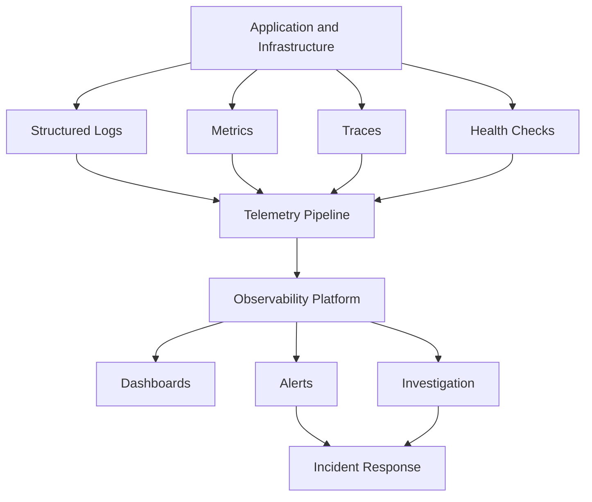
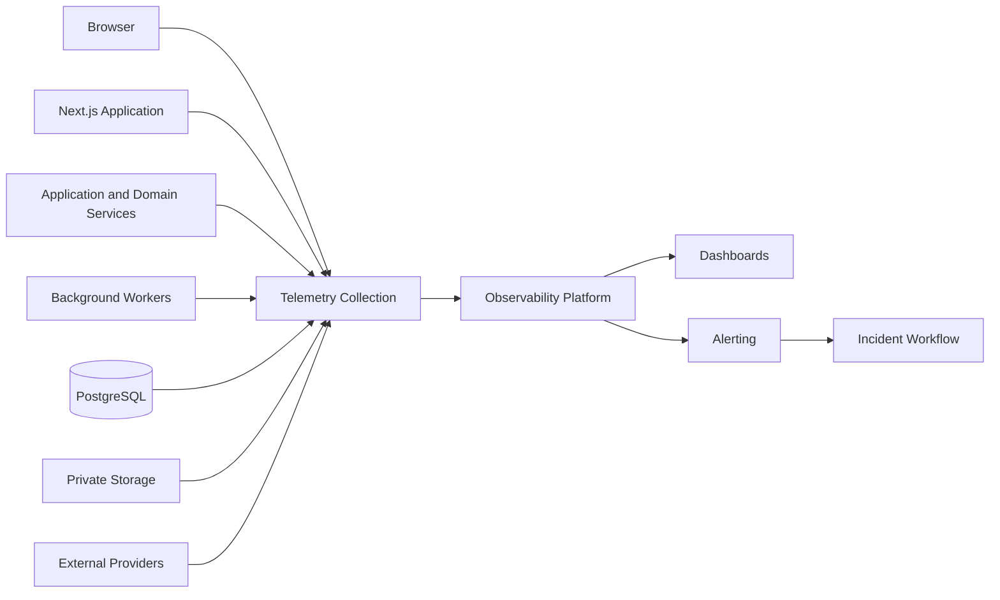
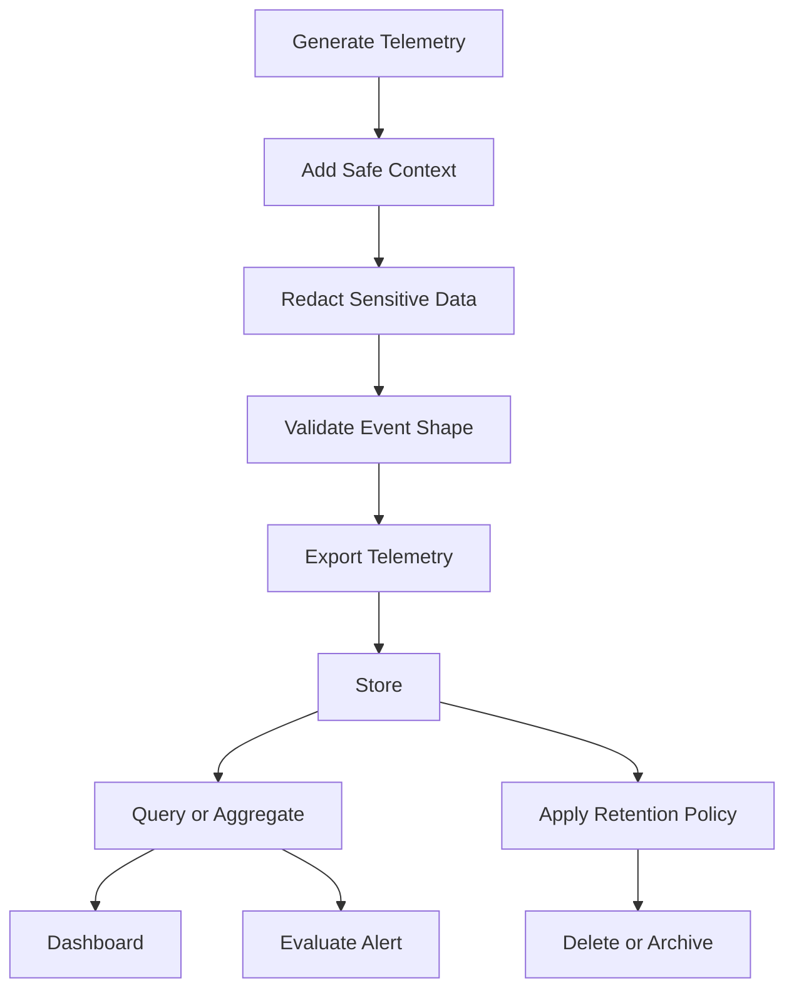
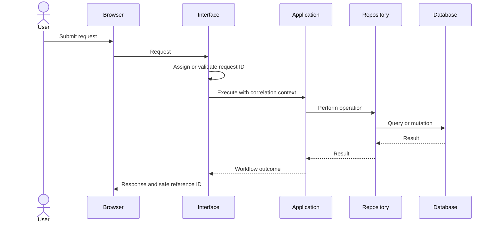
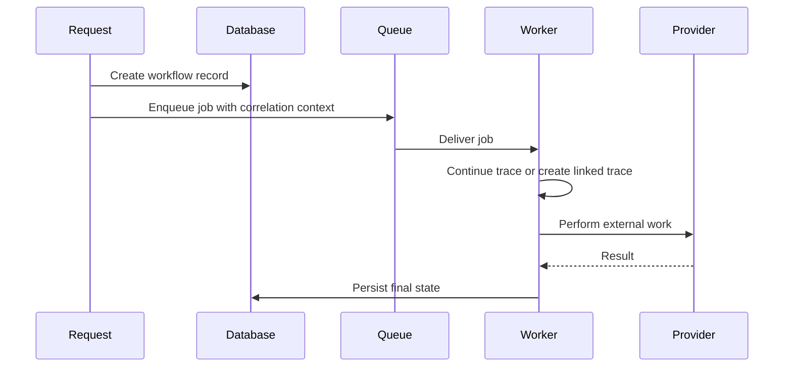
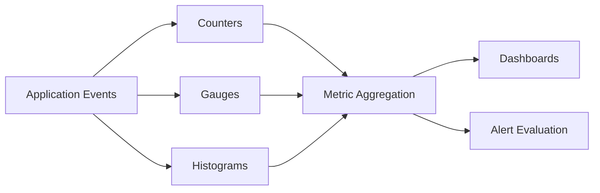
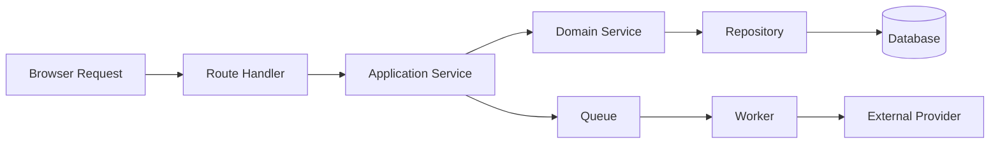
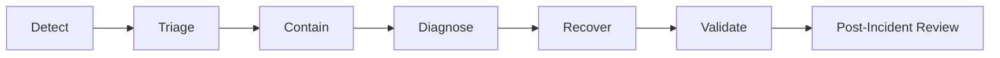

# Observability Architecture

**Project:** Financial Operating System

**Internal Codename:** Athena

**Document Version:** 1.0.0

**Status:** Draft

**Owner:** Caitlin Gillum

**Primary Architect:** Caitlin Gillum

**Technical Advisor:** OpenAI ChatGPT

**Last Updated:** July 29, 2026

---

## Table of Contents

- [Purpose](#purpose)
- [Scope](#scope)
- [Observability Philosophy](#observability-philosophy)
- [Objectives](#objectives)
- [Guiding Principles](#guiding-principles)
- [Definitions](#definitions)
- [Observability Model](#observability-model)
- [Observability Signals](#observability-signals)
- [System Health Model](#system-health-model)
- [Telemetry Architecture](#telemetry-architecture)
- [Telemetry Lifecycle](#telemetry-lifecycle)
- [Telemetry Ownership](#telemetry-ownership)
- [Environment and Deployment Context](#environment-and-deployment-context)
- [Correlation Identifiers](#correlation-identifiers)
- [Request Correlation](#request-correlation)
- [Background Job Correlation](#background-job-correlation)
- [Trace Context Propagation](#trace-context-propagation)
- [Structured Logging](#structured-logging)
- [Log Event Model](#log-event-model)
- [Log Levels](#log-levels)
- [Log Categories](#log-categories)
- [Logging by Architectural Layer](#logging-by-architectural-layer)
- [Security Logging](#security-logging)
- [Financial Workflow Logging](#financial-workflow-logging)
- [Audit Logging Versus Operational Logging](#audit-logging-versus-operational-logging)
- [Sensitive Data Redaction](#sensitive-data-redaction)
- [Metrics Architecture](#metrics-architecture)
- [Metric Types](#metric-types)
- [Metric Naming](#metric-naming)
- [Metric Dimensions](#metric-dimensions)
- [Cardinality Controls](#cardinality-controls)
- [Application Metrics](#application-metrics)
- [Frontend Metrics](#frontend-metrics)
- [API and Server Metrics](#api-and-server-metrics)
- [Database Metrics](#database-metrics)
- [Authentication Metrics](#authentication-metrics)
- [Authorization Metrics](#authorization-metrics)
- [Import Metrics](#import-metrics)
- [Classification Metrics](#classification-metrics)
- [Review Workflow Metrics](#review-workflow-metrics)
- [Dashboard and Reporting Metrics](#dashboard-and-reporting-metrics)
- [Export Metrics](#export-metrics)
- [Background Job Metrics](#background-job-metrics)
- [Notification Metrics](#notification-metrics)
- [Storage Metrics](#storage-metrics)
- [AI Assistance Metrics](#ai-assistance-metrics)
- [Error and Retry Metrics](#error-and-retry-metrics)
- [Business and Product Metrics](#business-and-product-metrics)
- [Distributed Tracing](#distributed-tracing)
- [Trace and Span Model](#trace-and-span-model)
- [Tracing Boundaries](#tracing-boundaries)
- [Trace Sampling](#trace-sampling)
- [Performance Monitoring](#performance-monitoring)
- [Frontend Performance](#frontend-performance)
- [Backend Performance](#backend-performance)
- [Database Performance](#database-performance)
- [Background Processing Performance](#background-processing-performance)
- [Service Level Indicators](#service-level-indicators)
- [Service Level Objectives](#service-level-objectives)
- [Error Budgets](#error-budgets)
- [Health Checks](#health-checks)
- [Liveness Checks](#liveness-checks)
- [Readiness Checks](#readiness-checks)
- [Dependency Health](#dependency-health)
- [Synthetic Monitoring](#synthetic-monitoring)
- [Dashboards](#dashboards)
- [Executive Health Dashboard](#executive-health-dashboard)
- [Application Health Dashboard](#application-health-dashboard)
- [Financial Workflow Dashboard](#financial-workflow-dashboard)
- [Import Operations Dashboard](#import-operations-dashboard)
- [Background Job Dashboard](#background-job-dashboard)
- [Security Dashboard](#security-dashboard)
- [Alerting Strategy](#alerting-strategy)
- [Alert Severity](#alert-severity)
- [Alert Design](#alert-design)
- [Alert Routing](#alert-routing)
- [Alert Suppression and Deduplication](#alert-suppression-and-deduplication)
- [Incident Detection](#incident-detection)
- [Incident Response Integration](#incident-response-integration)
- [Runbooks](#runbooks)
- [Capacity Planning](#capacity-planning)
- [Trend Analysis](#trend-analysis)
- [Telemetry Retention](#telemetry-retention)
- [Telemetry Access Control](#telemetry-access-control)
- [Security Considerations](#security-considerations)
- [Privacy Considerations](#privacy-considerations)
- [Performance and Cost Considerations](#performance-and-cost-considerations)
- [Testing Strategy](#testing-strategy)
- [Production Readiness Requirements](#production-readiness-requirements)
- [Requirement Traceability](#requirement-traceability)
- [Deferred Decisions](#deferred-decisions)
- [Related Documents](#related-documents)
- [Revision History](#revision-history)

---

## Purpose

This document defines the Observability Architecture for Project Athena.

It establishes how the platform produces, collects, correlates, stores, analyzes, visualizes, and responds to operational telemetry.

The architecture enables developers and operators to understand:

- Whether the application is available
- Whether user requests are succeeding
- Whether financial workflows are completing correctly
- Whether imports are processing accurately
- Whether background jobs are delayed or failing
- Whether database performance is degrading
- Whether retries are increasing
- Whether external providers are unavailable
- Whether security controls are denying suspicious activity
- Whether errors threaten financial integrity
- Whether optional features are degrading
- Whether production behavior differs from expected behavior

The central principle of this architecture is:

> Every meaningful workflow should leave behind enough evidence to explain what happened without exposing sensitive financial data.

---

## Scope

This document covers observability for:

- Browser interactions
- Next.js application behavior
- React rendering and client performance
- Server Actions
- Route Handlers
- Application services
- Domain services
- Repository operations
- PostgreSQL
- Supabase authentication
- Supabase storage
- Database migrations
- Financial mutations
- File uploads
- Import pipelines
- Duplicate detection
- Merchant normalization
- Transaction classification
- Review workflows
- Budgets
- Bills
- Debts
- Assets
- Liabilities
- Net worth
- Financial goals
- Dashboards
- Reports
- Exports
- Background jobs
- Notifications
- AI-assisted workflows
- Vercel deployments
- GitHub Actions
- External dependencies
- Security events
- Error recovery
- Reconciliation workflows

This document does not finalize:

- Observability provider
- Logging provider
- Metrics provider
- Tracing provider
- Alerting provider
- Incident-management provider
- Exact SLO targets
- Exact retention periods
- Exact sampling rates
- Final dashboard layouts
- Final alert thresholds
- Final on-call policy
- Final incident-severity policy
- Final telemetry cost limits

These decisions may be resolved through implementation specifications, environment configuration, or Architecture Decision Records.

---

## Observability Philosophy

Monitoring answers known questions.

Observability enables investigation of unknown conditions.

Athena shall not rely solely on isolated infrastructure statistics such as CPU usage or memory consumption.

The platform must provide enough context to answer questions such as:

- Why did this import fail?
- Which stage of the pipeline caused the delay?
- Did a background job retry?
- Did the underlying financial mutation commit?
- Are all users affected or only one workflow?
- Is the problem related to a deployment?
- Is an external dependency degraded?
- Are authorization failures increasing?
- Did retries prevent an outage or hide one?
- Is the dashboard displaying stale information?
- Did a user-facing error originate in the database, application, or provider layer?

Observability must be designed into workflows rather than added after implementation.

---

## Objectives

Athena's observability architecture shall provide:

### Operational Visibility

Operators can determine the current health of the platform and its major workflows.

### Financial Workflow Confidence

Material financial workflows can be traced from initiation through final authoritative state.

### Fast Diagnosis

Failures can be investigated using correlation identifiers, structured events, metrics, and traces.

### Early Detection

Degradation is detected before it becomes widespread or threatens financial integrity.

### Security Awareness

Authentication, authorization, suspicious access, and security-control failures produce appropriate telemetry.

### Privacy Protection

Observability data does not become an uncontrolled copy of sensitive financial information.

### Performance Insight

Latency, throughput, saturation, and resource bottlenecks are measurable.

### Release Validation

Deployments can be compared against prior performance and error baselines.

### Capacity Planning

Usage and resource trends support future scaling decisions.

### Cost Control

Telemetry volume, retention, and cardinality remain intentional and bounded.

---

## Guiding Principles

Athena shall follow these principles:

1. Instrument meaningful workflows, not every line of code.
2. Prefer structured telemetry over unstructured text.
3. Correlate synchronous and asynchronous work.
4. Use stable event and metric names.
5. Separate operational telemetry from audit records.
6. Preserve business context without exposing sensitive content.
7. Treat logs as sensitive data.
8. Use metrics for trends and alerts.
9. Use traces for request-path and latency analysis.
10. Use logs for detailed event context.
11. Avoid high-cardinality dimensions.
12. Measure user-visible outcomes.
13. Distinguish authoritative success from secondary-effect success.
14. Alert on symptoms and material impact, not every exception.
15. Use synthetic data in examples and tests.
16. Instrument failure, retry, recovery, and reconciliation.
17. Make deployment versions visible in telemetry.
18. Preserve environment boundaries.
19. Avoid telemetry that changes financial behavior.
20. Continuously test critical observability signals.

---

## Definitions

### Observability

The ability to understand internal system behavior through externally produced signals.

### Monitoring

The continuous evaluation of known system conditions using predefined checks, metrics, and thresholds.

### Telemetry

Machine-generated operational data including logs, metrics, traces, events, and health signals.

### Log

A structured record describing an event that occurred at a particular time.

### Metric

A numeric measurement aggregated over time.

### Trace

A representation of an operation as it moves through multiple system components.

### Span

A timed unit of work within a trace.

### Correlation Identifier

A stable identifier used to associate related telemetry across layers or processes.

### Service Level Indicator

A measurable signal representing service behavior.

### Service Level Objective

A target for an SLI over a defined time window.

### Error Budget

The acceptable amount of unreliability implied by an SLO.

### Cardinality

The number of unique combinations of metric label or dimension values.

### Saturation

The degree to which a resource approaches its capacity limit.

---

## Observability Model

Athena's observability model combines:

- Logs
- Metrics
- Traces
- Health checks
- Deployment metadata
- Security telemetry
- Product and workflow measurements
- Alerts
- Dashboards
- Incident records
- Reconciliation signals



No single signal is sufficient for complete diagnosis.

---

## Observability Signals

Athena shall use the following primary signals.

### Logs

Logs answer:

- What happened?
- Which workflow was involved?
- What outcome occurred?
- Which error category was produced?
- Which deployment handled the operation?

### Metrics

Metrics answer:

- How frequently is this happening?
- Is performance improving or degrading?
- What proportion of operations succeed?
- Are queues or retries increasing?
- Is capacity approaching a limit?

### Traces

Traces answer:

- Where did time get spent?
- Which component failed?
- Which dependency introduced latency?
- Which spans retried?
- How did asynchronous work continue?

### Health Signals

Health signals answer:

- Is the process alive?
- Is the deployment ready to receive traffic?
- Are required dependencies available?
- Is a service degraded but still operational?

---

## System Health Model

Athena shall classify health at both platform and workflow levels.

| Status | Meaning |
|---|---|
| Healthy | Required workflows are operating within expected thresholds |
| Degraded | The system is available, but one or more optional or noncritical capabilities are impaired |
| Unhealthy | Required workflows are failing or unavailable |
| Unknown | Insufficient telemetry exists to establish health |

A platform may be operational while an individual workflow is degraded.

Example:

```
Authentication: Healthy
Manual transaction creation: Healthy
AI suggestions: Degraded
Email notifications: Degraded
Import pipeline: Healthy
```

Health must not be summarized as healthy solely because the root page returns an HTTP response.

---

## Telemetry Architecture



Telemetry transmission must not block authoritative financial operations unless observability is required for a security or integrity control.

---

## Telemetry Lifecycle



Telemetry should be sanitized before leaving the application boundary.

---

## Telemetry Ownership

### User Interface Layer

Responsible for:

- User-visible performance signals
- Client-side errors
- Navigation timing
- Failed requests
- Accessibility-relevant failures
- Safe browser context
- Deployment version

The browser must not transmit sensitive form values as telemetry.

### Interface Layer

Responsible for:

- Request start and completion
- Route or action identity
- Correlation identifiers
- Authentication outcome
- Validation outcome
- Response classification
- Request duration

### Application Layer

Responsible for:

- Workflow start and completion
- Business outcome
- Retry decisions
- Idempotency outcomes
- Transaction state
- Recovery and reconciliation events

### Domain Layer

Responsible for:

- Domain-rule violations
- State transitions
- Financial invariant failures
- Deterministic business outcomes

### Repository Layer

Responsible for:

- Query duration
- Database error translation
- Retryable database conflicts
- Row counts
- Transaction outcomes

The repository layer must not log raw query parameters containing sensitive values.

### Infrastructure Layer

Responsible for:

- Provider latency
- Timeout
- Rate limits
- Dependency failures
- Queue state
- Storage state
- Connection health
- Circuit-breaker state

---

## Environment and Deployment Context

Every relevant telemetry event should identify:

- Environment
- Application version
- Deployment identifier
- Commit SHA where available
- Runtime region where applicable
- Component
- Workflow
- Event schema version

Environment values may include:

- Local
- Development
- Preview
- Staging
- Production

Telemetry from different environments must remain distinguishable.

Production alerts must not be triggered by preview-environment activity unless explicitly configured.

---

## Correlation Identifiers

Athena shall use correlation identifiers to connect related events.

Potential identifiers include:

- Request ID
- Trace ID
- Span ID
- Workflow ID
- Job ID
- Import ID
- Export ID
- Audit event ID
- Reconciliation ID
- Deployment ID

A correlation identifier must:

- Be generated by a trusted server or telemetry framework
- Be unique enough for its intended scope
- Avoid embedding personal information
- Avoid sequential values that expose system volume
- Propagate across architectural boundaries
- Appear in logs and traces where applicable
- Be safe to present as a support reference

Correlation identifiers are not authorization credentials.

---

## Request Correlation



The same correlation context should connect:

- Request log
- Application workflow log
- Repository spans
- Error event
- Retry event
- Response result

---

## Background Job Correlation

Asynchronous work must preserve the originating context.



Job telemetry should include:

- Job ID
- Job type
- Correlation ID
- Attempt number
- Payload version
- Queue delay
- Execution duration
- Final status
- Retryability
- Safe owner context where approved

---

## Trace Context Propagation

Trace context should propagate through:

- Browser-to-server requests
- Server Actions
- Route Handlers
- Application services
- Repository calls
- Database operations
- Storage calls
- Provider requests
- Queue messages
- Background workers
- Retry attempts

When a new trace is required, it should retain a link to the originating trace where the tracing platform supports it.

Untrusted client-provided trace data must not override trusted server context without validation.

---

## Structured Logging

Athena shall prefer structured logs over free-form text.

Conceptual example:

```json
{
  "timestamp": "2026-07-29T20:00:00Z",
  "level": "error",
  "environment": "production",
  "applicationVersion": "1.0.0",
  "component": "import-worker",
  "workflow": "transaction-import",
  "event": "import.processing.failed",
  "errorCode": "IMPORT_PARSE_FAILED",
  "correlationId": "corr_01J...",
  "traceId": "trace_01J...",
  "importId": "imp_01J...",
  "attempt": 2,
  "retryable": false,
  "durationMs": 1432
}
```

This example is conceptual and does not establish a final schema.

---

## Log Event Model

A structured log should contain fields equivalent to:

```typescript
type OperationalLogEvent = {
  timestamp: string;
  level: "debug" | "info" | "warn" | "error" | "fatal";
  event: string;
  schemaVersion: number;
  environment: string;
  applicationVersion?: string;
  deploymentId?: string;
  component: string;
  workflow?: string;
  correlationId?: string;
  traceId?: string;
  spanId?: string;
  errorCode?: string;
  durationMs?: number;
  outcome?: "started" | "succeeded" | "failed" | "degraded";
  retryable?: boolean;
  attempt?: number;
  safeMetadata?: Record<string, unknown>;
};
```

Production logging should use stable keys and event names.

---

## Log Levels

### Debug

Used for detailed development diagnostics.

Debug logging should be restricted or sampled in production.

Examples:

- Internal state transitions
- Non-sensitive branch decisions
- Cache lookup details

### Info

Used for expected operational events.

Examples:

- Import started
- Export completed
- Background job succeeded
- Deployment became ready

### Warning

Used for degraded or recoverable behavior.

Examples:

- Retry scheduled
- Notification failed after financial success
- AI provider unavailable
- Import requires review
- Circuit breaker opened

### Error

Used when a workflow fails.

Examples:

- Database transaction rolled back
- Import processing failed
- Export generation failed
- Job retry limit reached

### Fatal

Used when the application or required capability cannot continue safely.

Examples:

- Required configuration missing
- Schema incompatibility
- Security initialization failure
- Database integrity failure

Fatal events should be rare and actionable.

---

## Log Categories

Athena should define categories such as:

- Application
- Authentication
- Authorization
- Security
- Database
- Storage
- Import
- Classification
- Review
- Reporting
- Export
- Background job
- Notification
- AI provider
- Deployment
- Reconciliation
- Performance

Category and log level are separate concepts.

---

## Logging by Architectural Layer

### Browser

Log only:

- Safe navigation failures
- Client rendering errors
- Request failures
- Performance measurements
- Deployment version
- Browser capability information where approved

Do not log:

- Form contents
- Account names
- Transaction descriptions
- Uploaded file contents
- Tokens

### Interface Layer

Log:

- Request completion
- Status category
- Duration
- Validation outcome
- Authentication outcome
- Correlation context

### Application Layer

Log:

- Workflow state
- Business outcome
- Transaction result
- Retry decision
- Recovery decision
- Secondary-effect outcome

### Domain Layer

Log selectively:

- Invalid state transitions
- Financial invariant violations
- Rule evaluation outcomes where operationally useful

### Repository Layer

Log:

- Query duration
- Rows affected
- Database failure category
- Transaction result

Avoid logging raw SQL and parameters in production unless safely sanitized and strictly controlled.

---

## Security Logging

Security telemetry may include:

- Failed authentication
- Expired or invalid session
- Authorization denial
- Cross-owner access attempt
- Repeated resource enumeration behavior
- Rate-limit activation
- Suspicious file upload
- Invalid signed link
- Row Level Security denial
- Security-control initialization failure
- Administrative recovery action
- Unexpected privilege escalation attempt

Security logs should include enough context for investigation without revealing protected financial details.

Repeated suspicious behavior may increase severity.

---

## Financial Workflow Logging

Material financial workflows should emit start and outcome events.

Examples:

```
transaction.create.started
transaction.create.succeeded
transaction.create.failed

import.processing.started
import.processing.completed
import.processing.failed

review.resolution.started
review.resolution.succeeded
review.resolution.conflict

export.generation.started
export.generation.completed
export.generation.failed
```

Each workflow should distinguish:

- Requested
- Validated
- Persisted
- Committed
- Secondary effects complete
- Failed
- Reconciled

A user response alone must not be treated as evidence that a financial mutation committed.

---

## Audit Logging Versus Operational Logging

Operational logs and audit records serve different purposes.

| Operational Logs | Audit Records |
|---|---|
| Diagnose system behavior | Establish material action history |
| May be sampled | Must follow audit completeness rules |
| May have shorter retention | May require longer retention |
| Include performance context | Include actor, action, resource, outcome |
| Can contain stack traces after redaction | Must not contain stack traces |
| Used by developers and operators | Used for security, accountability, and review |

An audit event must not be inferred solely from an operational log.

Operational telemetry failure must not silently eliminate required audit behavior.

---

## Sensitive Data Redaction

Athena must treat observability data as sensitive.

The following must never appear in logs, metrics, or traces:

- Passwords
- Authentication tokens
- Session cookies
- Refresh tokens
- API keys
- Secrets
- Encryption keys
- Full account numbers
- Full bank identifiers
- Full transaction descriptions
- Uploaded file contents
- Export contents
- Raw AI prompts containing financial data
- Raw AI responses containing sensitive data
- Medical narratives
- Legal narratives
- Protected personal notes
- Database connection strings

Potentially sensitive values should be:

- Omitted
- Masked
- Hashed where appropriate
- Replaced with internal identifiers
- Reduced to counts or classifications

Redaction must occur before telemetry leaves the application boundary.

---

## Metrics Architecture

Metrics provide aggregated numeric measurements over time.

Athena shall use metrics to measure:

- Traffic
- Success
- Failure
- Latency
- Throughput
- Saturation
- Retry activity
- Queue delay
- Business outcomes
- Security events
- Dependency health



---

## Metric Types

### Counter

A value that increases over time.

Examples:

- Requests completed
- Imports started
- Authorization denials
- Retries scheduled
- Exports generated

### Gauge

A current value that may increase or decrease.

Examples:

- Queue depth
- Active jobs
- Open circuit breakers
- Pending review items
- Database connections

### Histogram

A distribution of measured values.

Examples:

- Request duration
- Query duration
- Import processing time
- File size
- Queue delay

### Summary

A client-calculated distribution may be used only when the provider and aggregation model support it appropriately.

Histograms are generally preferable for centralized percentile analysis.

---

## Metric Naming

Metric names should be:

- Stable
- Lowercase
- Consistent
- Domain-oriented
- Independent of provider-specific naming where possible
- Explicit about units

Conceptual examples:

- `athena_http_requests_total`
- `athena_http_request_duration_seconds`
- `athena_imports_total`
- `athena_import_duration_seconds`
- `athena_background_jobs_active`
- `athena_background_job_retries_total`
- `athena_authorization_denials_total`
- `athena_database_query_duration_seconds`

Units should follow a consistent standard.

---

## Metric Dimensions

Useful dimensions may include:

- Environment
- Component
- Workflow
- Outcome
- Error category
- Job type
- Import stage
- Provider
- HTTP method
- Route template
- Deployment version

Dimensions must not include:

- User ID
- Account ID
- Transaction ID
- Import ID
- File name
- Correlation ID
- Raw URL with identifiers
- Error message
- Transaction description

Those values create excessive cardinality or privacy risk.

---

## Cardinality Controls

High-cardinality metrics can cause:

- Excessive observability cost
- Slow queries
- Memory pressure
- Unusable dashboards
- Accidental sensitive-data exposure

Athena shall:

- Use route templates rather than raw paths.
- Use error categories rather than raw messages.
- Use job types rather than job IDs.
- Use workflow names rather than resource identifiers.
- Limit provider and environment values to controlled enums.
- Review new dimensions before production use.
- Prefer logs or traces for unique identifiers.

---

## Application Metrics

Application-level metrics should include:

- Request count
- Request success rate
- Request error rate
- Request latency
- Active requests
- Validation failures
- Authentication failures
- Authorization denials
- Timeout count
- Retry count
- Unhandled exception count
- Deployment error rate
- Cold-start duration where relevant

---

## Frontend Metrics

Frontend metrics may include:

- Page load time
- Navigation time
- Largest Contentful Paint
- Interaction to Next Paint
- Cumulative Layout Shift
- Client rendering errors
- Failed data requests
- Hydration errors
- JavaScript bundle size
- Route transition duration
- User-visible error frequency

Frontend performance should be evaluated by route and deployment version without using user identifiers as metric dimensions.

---

## API and Server Metrics

Server-side metrics should include:

- Request throughput
- Success rate
- Error rate
- Latency percentiles
- Timeout rate
- Validation rejection rate
- Authentication outcome
- Authorization outcome
- Database time
- Provider time
- Response size
- Server Action duration
- Route Handler duration

Metrics should distinguish read workflows from financial mutations.

---

## Database Metrics

Database telemetry should include:

- Connection usage
- Connection failures
- Query latency
- Slow query count
- Transaction duration
- Transaction rollback count
- Deadlock count
- Serialization conflict count
- Lock wait duration
- Rows scanned where available
- Rows affected
- Storage utilization
- Replication health where applicable
- Migration status
- Row Level Security denial signals where available

Database monitoring must not expose raw financial query parameters.

---

## Authentication Metrics

Authentication metrics may include:

- Sign-in attempts
- Sign-in success rate
- Sign-in failure rate
- Session validation failures
- Expired sessions
- Revoked sessions
- Authentication-provider latency
- Authentication-provider failures
- Password reset requests where applicable
- Rate-limited authentication attempts

Metrics must avoid revealing usernames or email addresses.

---

## Authorization Metrics

Authorization metrics may include:

- Authorization decisions
- Denials by workflow
- Cross-owner access attempts
- Row Level Security denials
- Privileged-operation denials
- Repeated denial patterns
- Authorization-service latency

A sudden increase in authorization denials may indicate:

- Application defect
- Policy misconfiguration
- Attack activity
- Deployment regression

---

## Import Metrics

Import metrics should include:

- Files uploaded
- Files rejected
- Imports started
- Imports completed
- Imports failed
- Imports requiring review
- Rows parsed
- Rows accepted
- Rows rejected
- Rows identified as duplicates
- Rows requiring review
- Processing duration
- Queue delay
- File size distribution
- Retry count
- Failure stage
- Reconciliation backlog

Import success should distinguish:

- Fully completed
- Completed with review items
- Partially completed
- Failed
- Rejected before processing

---

## Classification Metrics

Classification metrics may include:

- Transactions evaluated
- Deterministic rule matches
- Merchant rule matches
- User-confirmed classifications
- Low-confidence classifications
- Unclassified transactions
- Classification failures
- Rule evaluation duration
- AI suggestions requested
- AI suggestions accepted
- AI suggestions rejected
- Manual overrides

These metrics should measure system behavior, not expose transaction content.

---

## Review Workflow Metrics

Review metrics may include:

- Review items created
- Review items resolved
- Review items reopened
- Review conflicts
- Average resolution time
- Pending review count
- Oldest unresolved review age
- Resolution outcome
- Suggested classification acceptance rate

A growing review backlog may indicate classification quality or usability problems.

---

## Dashboard and Reporting Metrics

Metrics may include:

- Dashboard load count
- Dashboard load duration
- Widget failure count
- Partial dashboard render count
- Report generation count
- Report duration
- Report query timeout
- Cache hit rate
- Cache miss rate
- Stale-data response count
- Aggregation failure count

A failed widget must not be counted as a successful complete dashboard load.

---

## Export Metrics

Export metrics may include:

- Exports requested
- Exports completed
- Exports failed
- Export duration
- Export file size
- Signed-link generation failures
- Expired exports
- Incomplete export cleanup
- Export retry count
- Authorization denials

Metrics must not contain export names or query filters that reveal financial details.

---

## Background Job Metrics

Background job metrics should include:

- Jobs enqueued
- Jobs started
- Jobs completed
- Jobs failed
- Jobs retried
- Jobs dead-lettered
- Queue depth
- Queue delay
- Execution duration
- Active workers
- Worker failures
- Duplicate delivery count
- Idempotent replay count
- Retry exhaustion
- Oldest queued job age

Queue health should be measured by both depth and age.

---

## Notification Metrics

Notification metrics may include:

- Notifications created
- Delivery attempts
- Delivery success
- Delivery failure
- Retry count
- Provider latency
- Provider rate limits
- Duplicate prevention
- Permanent rejection
- Delivery delay

Notification metrics must not include message content or recipient addresses.

---

## Storage Metrics

Storage metrics may include:

- Upload attempts
- Upload success
- Upload failure
- Download failures
- Signed-link failures
- Missing object count
- Orphaned object count
- Storage latency
- Stored bytes
- Temporary-file cleanup
- Export artifact cleanup
- Import-object reconciliation

Storage metrics should distinguish private uploads from generated exports.

---

## AI Assistance Metrics

AI telemetry may include:

- Requests submitted
- Requests completed
- Provider latency
- Timeouts
- Rate limits
- Invalid response schemas
- Unsafe-output rejections
- Confidence threshold failures
- Suggestions accepted
- Suggestions rejected
- Manual fallback usage
- Token usage where available and safe
- Estimated provider cost

AI telemetry must not include raw prompts, transaction descriptions, or provider responses containing sensitive information.

---

## Error and Retry Metrics

Metrics should include:

- Errors by category
- Errors by workflow
- Unhandled exceptions
- Retry attempts
- Retry success
- Retry exhaustion
- Timeout count
- Circuit-breaker state
- Dead-letter count
- Reconciliation count
- Reconciliation failure
- Transaction rollback
- Uncertain commit state

A rising retry-success rate can still indicate a degrading dependency and should not automatically be considered healthy.

---

## Business and Product Metrics

Business and product metrics describe whether Athena's core workflows are delivering expected outcomes.

Examples:

- Accounts created
- Transactions added
- Transactions imported
- Duplicate transactions prevented
- Imports completed
- Review items resolved
- Budgets created
- Reports generated
- Exports completed
- Financial goals created
- Dashboard usage
- Manual classification rate
- Classification override rate
- AI suggestion acceptance rate

These metrics must:

- Avoid sensitive dimensions
- Be documented separately from financial analytics
- Not be used to infer private user behavior without explicit design approval
- Remain aggregated
- Follow data-minimization principles

Business metrics are observability signals, not product surveillance.

---

## Distributed Tracing

Tracing represents an end-to-end workflow as related spans.



Tracing should focus on:

- Workflow duration
- Dependency calls
- Database time
- Queue delay
- Retry attempts
- Failure location
- Critical state transitions

---

## Trace and Span Model

A trace represents one logical operation.

A span represents a timed unit of work.

Conceptual spans may include:

- `http.request`
- `auth.session.validate`
- `authorization.check`
- `transaction.create`
- `database.transaction`
- `database.query`
- `storage.upload`
- `import.parse`
- `import.normalize`
- `import.persist`
- `queue.publish`
- `job.execute`
- `provider.ai.request`
- `notification.send`

Span attributes must use controlled, low-cardinality values.

---

## Tracing Boundaries

Tracing should exist at:

- Browser request boundary
- Server request boundary
- Application workflow boundary
- Database transaction boundary
- External provider boundary
- Queue publish boundary
- Background-job execution boundary
- Storage operation boundary
- Retry attempt boundary

Tracing every internal function is unnecessary and may create noise and cost.

---

## Trace Sampling

Trace sampling may reduce telemetry volume.

Sampling policy should consider:

- Environment
- Workflow criticality
- Error outcome
- Latency
- Security event
- Financial mutation
- Background-job failure

Potential policy:

- Sample a percentage of successful low-risk requests.
- Retain all failed traces.
- Retain all critical financial mutation failures.
- Retain slow traces.
- Retain security-control failures.
- Retain reconciliation failures.

Final sampling rates are deferred.

---

## Performance Monitoring

Athena should observe:

- Latency
- Throughput
- Error rate
- Resource saturation
- Queue delay
- Dependency latency
- Cold starts
- Database contention
- Render performance
- Export and import duration

Performance measurements should distinguish:

- Median behavior
- Tail latency
- Warm versus cold execution
- Read versus mutation workflows
- User-visible versus background work

---

## Frontend Performance

Frontend performance should measure:

- Initial page load
- Route navigation
- Core Web Vitals
- Time to usable content
- Dashboard render time
- Long tasks
- Client error rate
- Failed network requests
- Bundle size
- Hydration duration

Performance telemetry should be grouped by route template and deployment version.

---

## Backend Performance

Backend performance should measure:

- Request latency
- Server Action latency
- Route Handler latency
- Validation time
- Authorization time
- Application-service time
- Provider latency
- Serialization time
- Response generation time
- Cold-start time where applicable

Tail latency should be tracked using percentiles such as p95 and p99 where supported.

---

## Database Performance

Database performance should measure:

- Query latency
- Transaction latency
- Lock wait
- Deadlocks
- Connection saturation
- Slow queries
- Rows scanned
- Query-plan changes where available
- Index usage
- Storage growth

Performance investigation must preserve query privacy.

---

## Background Processing Performance

Background processing should measure:

- Queue delay
- Execution duration
- Retry delay
- End-to-end completion time
- Worker utilization
- Throughput
- Backlog age
- Dead-letter rate

A job may execute quickly while remaining operationally slow due to queue delay.

---

## Service Level Indicators

Athena should define SLIs for critical user and workflow outcomes.

Potential SLIs include:

- Successful authenticated request rate
- Manual transaction creation success rate
- Import completion rate
- Financial mutation latency
- Dashboard availability
- Export completion rate
- Background-job completion rate
- Authorization-control correctness
- Database transaction success rate

SLIs should measure user-visible or integrity-relevant outcomes rather than only infrastructure availability.

---

## Service Level Objectives

Conceptual SLO categories may include:

### Availability

Percentage of valid requests that complete successfully.

### Latency

Percentage of requests completed within an approved duration.

### Correctness

Percentage of financial workflows completed without reconciliation or integrity error.

### Durability

Percentage of committed authoritative records preserved successfully.

### Freshness

Percentage of dashboards or derived views updated within the allowed delay.

Exact targets are deferred until implementation and baseline measurement.

---

## Error Budgets

An error budget represents the unreliability permitted by an SLO.

Error budgets may guide:

- Release velocity
- Reliability work
- Alert thresholds
- Risk acceptance
- Provider evaluation
- Capacity investment

Financial-integrity violations may have a near-zero or zero acceptable budget even when ordinary availability permits limited failure.

An error budget must never justify known data corruption or security-control failure.

---

## Health Checks

Health checks provide machine-readable service status.

Health endpoints must:

- Avoid sensitive information
- Return quickly
- Avoid expensive full-system checks
- Distinguish liveness from readiness
- Avoid becoming an attack surface
- Avoid exposing provider credentials or internal topology

---

## Liveness Checks

Liveness answers:

> Is the process running and capable of responding?

A liveness check should not depend on every external service.

Failure may cause the runtime platform to restart the process.

Liveness checks should be:

- Fast
- Local
- Lightweight
- Stable
- Free of sensitive details

---

## Readiness Checks

Readiness answers:

> Can this deployment safely receive traffic?

Readiness may verify:

- Required configuration loaded
- Application initialized
- Database connectivity available
- Required schema version compatible
- Security controls initialized
- Required dependencies reachable

An optional AI or notification provider outage should not necessarily make the entire application unready.

---

## Dependency Health

Dependency health should classify:

- Healthy
- Degraded
- Unavailable
- Unknown

Dependencies may include:

- PostgreSQL
- Supabase authentication
- Supabase storage
- Queue provider
- Notification provider
- AI provider
- Monitoring provider

Dependency health should be based on actual operational signals rather than only provider status pages.

---

## Synthetic Monitoring

Synthetic checks simulate controlled user workflows.

Potential synthetic checks include:

- Load public application
- Authenticate with a synthetic test account
- Read a synthetic account
- Create and remove a synthetic transaction
- Upload a synthetic import file
- Generate a synthetic report
- Verify a private export link
- Validate dashboard rendering

Synthetic data must remain isolated from real user data.

Production synthetic mutations require strict controls, cleanup, and naming conventions.

---

## Dashboards

Dashboards should answer specific operational questions.

A dashboard must define:

- Intended audience
- Key questions
- Time range
- Data source
- Refresh behavior
- Alert links
- Runbook links
- Owner

Dashboards should not become unstructured collections of unrelated charts.

---

## Executive Health Dashboard

The executive health dashboard should summarize:

- Platform status
- Request success rate
- Critical workflow success
- Error budget status
- Active incidents
- Import completion
- Background-job backlog
- Database health
- Current deployment
- Critical dependency status

This dashboard should remain high level.

---

## Application Health Dashboard

The application dashboard should include:

- Request rate
- Error rate
- Latency percentiles
- Active requests
- Client errors
- Server errors
- Validation failures
- Authentication outcomes
- Authorization denials
- Deployment comparison
- Top failing workflows

---

## Financial Workflow Dashboard

The financial workflow dashboard should include:

- Transaction mutation success
- Transaction rollback
- Duplicate prevention
- Concurrency conflicts
- Reconciliation events
- Uncertain commit states
- Review backlog
- Reporting failures
- Export failures

Any indication of ambiguous financial state should be highly visible.

---

## Import Operations Dashboard

The import dashboard should include:

- Imports started
- Imports completed
- Imports failed
- Imports requiring review
- Processing duration
- Queue delay
- Rows accepted
- Rows rejected
- Duplicate rate
- Failure stage
- Retry count
- Oldest incomplete import
- Reconciliation backlog

---

## Background Job Dashboard

The background-job dashboard should include:

- Queue depth
- Oldest queued job
- Jobs active
- Jobs completed
- Jobs failed
- Retry rate
- Retry exhaustion
- Dead-letter count
- Worker health
- Execution duration
- Queue delay

---

## Security Dashboard

The security dashboard may include:

- Authentication failures
- Authorization denials
- Cross-owner access attempts
- Rate-limit events
- Suspicious uploads
- Row Level Security denials
- Security-control failures
- Privileged action failures
- Repeated suspicious patterns

Security dashboards must restrict access appropriately.

---

## Alerting Strategy

Alerts should indicate conditions requiring human attention.

Athena should alert on:

- User-visible failure
- Financial-integrity risk
- Security-control failure
- Widespread dependency failure
- Sustained latency degradation
- Queue backlog
- Retry exhaustion
- Critical import failure rate
- Reconciliation backlog
- Deployment regression
- Database saturation
- Missing required telemetry

Athena should not alert on every isolated exception.

---

## Alert Severity

### Informational

No immediate action required.

Examples:

- Deployment completed
- Optional provider recovered
- Low-priority threshold crossed

### Warning

Investigation should occur during normal operational response.

Examples:

- Retry rate increasing
- Notification failure rate elevated
- Queue delay approaching limit
- AI provider degraded

### High

Prompt operator attention required.

Examples:

- Import failure rate significantly elevated
- Database latency materially degraded
- Background-job backlog growing
- Export failures affecting users

### Critical

Immediate response required.

Examples:

- Financial mutation integrity risk
- Authentication unavailable
- Authorization control failure
- Database unavailable
- Widespread transaction failure
- Confirmed data exposure
- Reconciliation unable to resolve ambiguous state

---

## Alert Design

Each alert should include:

- Alert name
- Severity
- Environment
- Affected workflow
- Trigger condition
- Current value
- Expected threshold
- Start time
- Deployment version
- Dashboard link
- Runbook link
- Correlation or example trace references
- Recovery condition
- Owner

Alerts should be actionable.

Bad alert:

```
Error rate high
```

Better alert:

```
Production transaction-creation failure rate exceeded the approved threshold for
10 minutes after deployment 01J...
```

---

## Alert Routing

Alert routing should consider:

- Severity
- Environment
- Workflow ownership
- Time sensitivity
- Security sensitivity
- Financial impact
- Current incident state

Potential destinations include:

- Development workflow
- Email
- Chat operations channel
- Incident-management platform
- Security response channel

Final routing is deferred.

---

## Alert Suppression and Deduplication

Alert controls should prevent:

- Duplicate alerts for the same incident
- Repeated notifications during an ongoing outage
- Alert storms caused by cascading failures
- Separate alerts for every failed job
- Preview-environment noise in production channels

Suppression must not hide distinct critical incidents.

Alerts should group by:

- Environment
- Workflow
- Error category
- Dependency
- Deployment version

---

## Incident Detection

An incident may be detected through:

- Automated alert
- Dashboard review
- Security signal
- Reconciliation failure
- User report
- Provider outage
- Deployment regression
- Synthetic-monitor failure

Incident creation should preserve links to:

- Alerts
- Dashboards
- Logs
- Traces
- Deployment
- Runbooks
- Relevant correlation identifiers

---

## Incident Response Integration

Observability should support incident response stages:



Telemetry should help answer:

- What happened?
- When did it begin?
- Which users or workflows were affected?
- Which deployment was active?
- What authoritative state changed?
- Was recovery successful?
- Is reconciliation required?
- How can recurrence be prevented?

---

## Runbooks

Every critical alert should link to a runbook.

A runbook should define:

- Alert meaning
- Likely causes
- Immediate checks
- Relevant dashboards
- Relevant log queries
- Trace investigation steps
- Safe mitigation actions
- Rollback instructions
- Reconciliation requirements
- Escalation path
- Recovery validation
- Closure criteria

Runbooks must avoid exposing secrets.

---

## Capacity Planning

Capacity planning should use trends in:

- Request volume
- Database utilization
- Storage growth
- Import volume
- Background-job throughput
- Queue depth
- Export size
- AI usage
- Telemetry volume
- Provider rate limits

Capacity decisions should consider peak and sustained usage.

---

## Trend Analysis

Trend analysis should identify:

- Slow increase in latency
- Rising retry rate
- Growing review backlog
- Increasing database storage
- Growing queue age
- Changes in classification acceptance
- Increased authorization denials
- Increasing observability cost
- Deployment-related regressions

Trends should be reviewed over appropriate time windows rather than only during incidents.

---

## Telemetry Retention

Retention policy should vary by signal.

Potential categories:

- Debug logs
- Standard operational logs
- Error logs
- Security logs
- Metrics
- Traces
- Incident records
- Audit records

Retention should consider:

- Operational usefulness
- Security investigation needs
- Privacy
- Cost
- Legal requirements
- Audit requirements
- Environment

Audit retention is governed separately from ordinary telemetry retention.

Exact periods are deferred.

---

## Telemetry Access Control

Access to observability systems should follow least privilege.

Controls should include:

- Role-based access
- Environment separation
- Production-access restrictions
- Security-log restrictions
- Audit of administrative access
- Strong authentication
- Secret management
- Export restrictions
- Retention enforcement

Access to logs does not imply authorization to access all financial data.

---

## Security Considerations

Observability can create security risks through:

- Secret leakage
- Token leakage
- Stack-trace exposure
- Cross-owner metadata leakage
- Log injection
- Untrusted event fields
- Excessive diagnostic access
- Provider compromise
- Public health endpoints
- Unrestricted telemetry export
- Sensitive trace attributes

Required controls include:

- Redaction before export
- Structured event validation
- Restricted production access
- No raw user input as event names
- No secrets in telemetry
- Safe health responses
- Controlled correlation identifiers
- Encrypted transport
- Approved retention
- Access logging
- Environment isolation
- Alerting for telemetry-pipeline failure where critical

Security-control failures must remain observable even when optional telemetry is degraded.

---

## Privacy Considerations

Observability shall follow data minimization.

Athena should prefer:

- Counts instead of content
- Internal identifiers instead of names
- Categories instead of descriptions
- Durations instead of payloads
- Aggregates instead of individual behavior
- Controlled enums instead of free-form metadata

Telemetry must not become a shadow financial database.

Product metrics should be designed to understand system effectiveness, not to profile individual users.

---

## Performance and Cost Considerations

Observability introduces overhead.

Potential costs include:

- Application CPU
- Network transfer
- Storage
- Query cost
- Trace ingestion
- High-cardinality metrics
- Dashboard computation
- Long retention
- Excessive client telemetry

Controls may include:

- Sampling
- Aggregation
- Batching
- Cardinality limits
- Log-level controls
- Retention tiers
- Payload-size limits
- Environment-specific configuration
- Duplicate suppression
- Metric review

Observability must not materially delay authoritative financial transactions.

---

## Testing Strategy

### Unit Tests

Verify:

- Log-event construction
- Required metadata
- Redaction
- Metric-name generation
- Controlled dimensions
- Correlation-context handling
- Severity mapping
- Alert-rule logic

### Integration Tests

Verify:

- Request-to-database correlation
- Background-job context propagation
- Log export
- Metric collection
- Trace creation
- Provider-span instrumentation
- Health-check responses
- Deployment metadata

### Privacy Tests

Verify:

- Tokens are redacted.
- Account identifiers are masked or omitted.
- Transaction descriptions do not enter telemetry.
- Uploaded file contents are absent.
- AI prompts and responses are not recorded.
- Error stack traces remain server-side.
- Browser telemetry excludes sensitive form values.

### Failure Tests

Verify telemetry for:

- Database outage
- Storage outage
- Authentication-provider outage
- Import failure
- Background-job retry
- Retry exhaustion
- AI timeout
- Notification failure
- Export interruption
- Reconciliation failure

### Alert Tests

Verify:

- Alert thresholds activate.
- Alert recovery resolves.
- Deduplication works.
- Preview environments do not page production responders.
- Critical financial-integrity alerts route correctly.
- Runbook links are valid.

### Dashboard Tests

Verify:

- Data sources are correct.
- Missing data is distinguishable from zero.
- Time ranges are appropriate.
- Panels use controlled dimensions.
- Dashboard queries remain performant.
- Sensitive values are not displayed.

### Synthetic Tests

Verify:

- Production endpoints are reachable.
- Synthetic authentication works.
- Synthetic workflows complete.
- Cleanup succeeds.
- Synthetic records remain isolated.

All tests must use synthetic or sanitized data.

---

## Production Readiness Requirements

Before a workflow is production-ready, it must define:

- Workflow name
- Start event
- Success event
- Failure event
- Correlation strategy
- Trace boundaries
- Key metrics
- Sensitive-data exclusions
- Expected latency
- Failure-rate measurement
- Dashboard representation
- Alert conditions
- Runbook
- Retention requirements
- Testing coverage
- Deployment comparison behavior

Before production launch, Athena must provide:

- Request correlation
- Structured server logs
- Error-rate metrics
- Latency metrics
- Database health
- Import workflow visibility
- Background-job visibility
- Critical financial mutation visibility
- Security event telemetry
- At least one operational dashboard
- Critical alerting
- Sensitive-data redaction tests
- Deployment identifiers
- Health checks
- Runbooks for critical alerts

---

## Requirement Traceability

| Observability Area | Related Requirements |
|---|---|
| Authentication monitoring | FR-025, NFR-001 through NFR-004, NFR-007 |
| Authorization monitoring | FR-026, NFR-001 through NFR-004 |
| Audit separation | FR-027, NFR-005, NFR-018 |
| Export monitoring | FR-028, NFR-007 through NFR-009 |
| Recovery visibility | FR-029, NFR-005 through NFR-007 |
| Background-job monitoring | FR-030, NFR-007 through NFR-009 |
| Import observability | FR-001 through FR-005, NFR-005 through NFR-009 |
| Classification metrics | FR-007 through FR-010, FR-031, NFR-018 |
| Budget and reporting metrics | FR-011 through FR-017, NFR-008, NFR-018 |
| Debt workflow monitoring | FR-018, FR-019, NFR-005 through NFR-007 |
| Asset and net-worth monitoring | FR-020 through FR-022, NFR-005 through NFR-007 |
| Goal workflow metrics | FR-023, FR-024 |
| Dashboard monitoring | FR-032, NFR-008, NFR-013 through NFR-018 |
| Security telemetry | NFR-001 through NFR-004 |
| Financial integrity telemetry | NFR-005, NFR-006 |
| Reliability monitoring | NFR-007 |
| Performance monitoring | NFR-008, NFR-009 |
| Maintainability | NFR-010 through NFR-014 |
| Accessibility monitoring | NFR-015, NFR-016 |
| Privacy and redaction | NFR-001 through NFR-004, NFR-017 |
| Explainability | NFR-018 |

---

## Deferred Decisions

The following decisions remain open:

- Final observability provider
- Final logging provider
- Final metrics provider
- Final tracing provider
- OpenTelemetry adoption
- Browser telemetry provider
- Incident-management provider
- Alert-routing provider
- Dashboard provider
- Log schema implementation
- Event naming registry
- Metric naming registry
- Trace propagation library
- Correlation-ID format
- Correlation-ID response behavior
- Trace sampling rate
- Error-trace retention
- Successful-trace sampling
- Log retention
- Metric retention
- Trace retention
- Security-log retention
- Environment-specific telemetry policy
- Health endpoint paths
- Health endpoint authentication
- Dependency health-check depth
- Synthetic-monitoring provider
- Synthetic test frequency
- Final SLI definitions
- Final SLO targets
- Error-budget policy
- Alert thresholds
- Alert evaluation windows
- Alert suppression rules
- Alert escalation policy
- On-call expectations
- Incident-severity model
- Runbook format
- Dashboard layouts
- Dashboard ownership
- Frontend Web Vitals provider
- Database slow-query threshold
- High-cardinality enforcement
- Telemetry schema validation
- Log sampling
- Trace baggage policy
- Provider cost tracking
- Telemetry cost budget
- Storage-growth alerts
- Queue-backlog thresholds
- Review-backlog thresholds
- Reconciliation-backlog thresholds
- AI usage and cost thresholds
- Security telemetry escalation thresholds
- Audit-system health monitoring
- Observability pipeline failure behavior
- Production debug-log policy

Architecturally significant decisions shall be documented through ADRs.

---

## Related Documents

- docs/product-requirements.md
- docs/architecture/README.md
- docs/architecture/engineering-principles.md
- docs/architecture/system-architecture.md
- docs/architecture/application-architecture.md
- docs/architecture/frontend-architecture.md
- docs/architecture/domain-model.md
- docs/architecture/backend-architecture.md
- docs/architecture/database-architecture.md
- docs/architecture/security-architecture.md
- docs/architecture/deployment-architecture.md
- docs/architecture/data-flow.md
- docs/architecture/error-handling-strategy.md
- docs/adr/README.md
- docs/adr/0002-initial-technology-stack.md

---

## Revision History

| Version | Date | Author | Summary |
|---|---|---|---|
| 1.0.0 | 2026-07-29 | Caitlin Gillum | Defined Athena's observability philosophy, telemetry architecture, structured logging, metrics, tracing, correlation, health checks, SLO concepts, dashboards, alerting, incident integration, sensitive-data controls, testing requirements, and production-readiness expectations. |