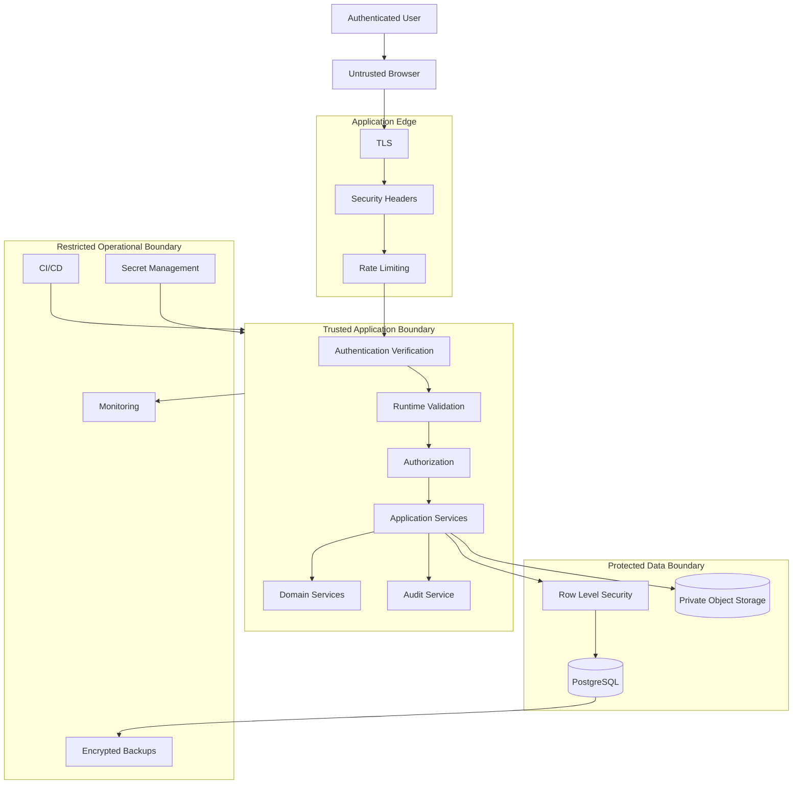
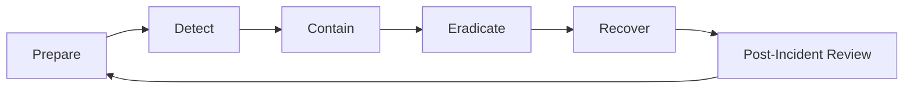

# Security Architecture

**Project:** Financial Operating System

**Internal Codename:** Athena

**Document Version:** 1.4.0

**Status:** Draft

**Owner:** Caitlin Gillum

**Primary Architect:** Caitlin Gillum

**Technical Advisor:** OpenAI ChatGPT

**Last Updated:** August 1, 2026

---

## Table of Contents

- [Purpose](#purpose)
- [Scope](#scope)
- [Security Philosophy](#security-philosophy)
- [Security Objectives](#security-objectives)
- [Security Architecture Overview](#security-architecture-overview)
- [Security Principles](#security-principles)
- [Threat Model](#threat-model)
- [Protected Assets](#protected-assets)
- [Threat Actors](#threat-actors)
- [Trust Boundaries](#trust-boundaries)
- [Attack Surface](#attack-surface)
- [Identity Architecture](#identity-architecture)
- [Authentication](#authentication)
- [Session Security](#session-security)
- [Authorization](#authorization)
- [Ownership Enforcement](#ownership-enforcement)
- [Row Level Security](#row-level-security)
- [Privileged Access](#privileged-access)
- [Frontend Security](#frontend-security)
- [Backend Security](#backend-security)
- [API and Server Interface Security](#api-and-server-interface-security)
- [Input Validation](#input-validation)
- [Output Encoding](#output-encoding)
- [Database Security](#database-security)
- [File Upload Security](#file-upload-security)
- [Private Storage Security](#private-storage-security)
- [Import Pipeline Security](#import-pipeline-security)
- [Financial Integrity Controls](#financial-integrity-controls)
- [AI Security Boundaries](#ai-security-boundaries)
- [Secrets Management](#secrets-management)
- [Cryptography and Encryption](#cryptography-and-encryption)
- [Security Headers](#security-headers)
- [Cross-Site Request Forgery](#cross-site-request-forgery)
- [Cross-Site Scripting](#cross-site-scripting)
- [Injection Prevention](#injection-prevention)
- [Server-Side Request Forgery](#server-side-request-forgery)
- [Insecure Direct Object Reference Prevention](#insecure-direct-object-reference-prevention)
- [Rate Limiting and Abuse Prevention](#rate-limiting-and-abuse-prevention)
- [Audit Logging](#audit-logging)
- [Operational Logging](#operational-logging)
- [Monitoring and Alerting](#monitoring-and-alerting)
- [Dependency and Supply Chain Security](#dependency-and-supply-chain-security)
- [Source Control Security](#source-control-security)
- [CI/CD Security](#cicd-security)
- [Environment Isolation](#environment-isolation)
- [Preview Environment Security](#preview-environment-security)
- [Production Access](#production-access)
- [Backup Security](#backup-security)
- [Data Retention and Deletion](#data-retention-and-deletion)
- [Privacy and Data Minimization](#privacy-and-data-minimization)
- [Incident Response](#incident-response)
- [Vulnerability Management](#vulnerability-management)
- [Security Testing Strategy](#security-testing-strategy)
- [Security Review Gates](#security-review-gates)
- [Security Requirements by Component](#security-requirements-by-component)
- [Requirement Traceability](#requirement-traceability)
- [Deferred Decisions](#deferred-decisions)
- [Related Documents](#related-documents)
- [Revision History](#revision-history)

---

## Purpose

This document defines the security architecture for Project Athena.

It establishes the security controls, trust boundaries, access rules, defensive layers, threat assumptions, and operational practices required to protect Athena's financial data and supporting infrastructure.

The Security Architecture ensures that Athena's design accounts for:

- Confidentiality
- Integrity
- Availability
- Authentication
- Authorization
- Ownership
- Privacy
- Auditability
- Financial correctness
- Recovery
- Secure software delivery

Security is treated as an architectural responsibility rather than a feature added after implementation.

---

## Scope

This document covers:

- Identity and authentication
- Session protection
- Authorization
- Ownership enforcement
- Row Level Security
- Privileged access
- Frontend security
- Backend security
- Database security
- File and storage security
- Import-pipeline security
- Financial-integrity controls
- Secrets
- Encryption
- Common web threats
- Logging and monitoring
- Supply-chain security
- Source-control security
- CI/CD security
- Environment isolation
- Backup security
- Data retention
- Privacy
- Incident response
- Vulnerability management
- Security testing
- Security review gates

This document does not define:

- Final authentication-provider settings
- Final multi-factor authentication configuration
- Final password policy
- Final security-header values
- Final rate limits
- Final monitoring provider
- Final alert thresholds
- Final incident-response communication plan
- Final data-retention periods
- Final penetration-testing provider
- Final compliance certification
- Final legal or regulatory interpretation

Those decisions will be completed during implementation or documented through separate operational procedures and ADRs.

---

## Security Philosophy

Athena shall assume that every external input, browser request, uploaded file, client-supplied identifier, dependency, and third-party response may be incorrect, malformed, malicious, or compromised.

Athena shall therefore:

- Treat the browser as untrusted.
- Verify identity on every protected request.
- Enforce authorization independently from authentication.
- Validate all untrusted input at runtime.
- Enforce ownership at multiple layers.
- Minimize privileged access.
- Preserve auditability for material actions.
- Prevent duplicate or unauthorized financial effects.
- Fail securely.
- Protect secrets from client exposure.
- Avoid collecting unnecessary sensitive data.
- Use synthetic data in public documentation and testing.
- Design recovery before failure occurs.

Security controls shall support the financial domain rather than obstructing it or existing only for appearance.

---

## Security Objectives

Athena's security architecture has the following objectives.

### Confidentiality

Only authorized users and approved server-side processes may access protected financial data.

### Integrity

Financial records, classifications, balances, imports, reports, and audit history must remain protected from unauthorized or unintended modification.

### Availability

The system should remain available during ordinary failures and recoverable following major disruptions.

### Accountability

Material actions must be attributable to an authenticated actor or approved system process.

### Least Privilege

Users, services, jobs, and deployment environments receive only the permissions required for their responsibilities.

### Defense in Depth

Security shall not depend on one control, provider, framework, or database policy.

### Secure Defaults

New resources, routes, storage objects, and database records should be private unless explicitly designed otherwise.

### Financial Correctness

Security controls must prevent unauthorized access and also protect against duplicate, inconsistent, or misleading financial outcomes.

---

## Security Architecture Overview

Athena shall protect data through overlapping controls at the client, application, database, storage, deployment, and operational layers.

---

## Security Principles

Athena shall follow these security principles:

- Never trust the browser.
- Authentication and authorization are separate controls.
- Ownership must be verified server-side.
- Sensitive resources are private by default.
- Privileged credentials remain server-only.
- Every untrusted input requires runtime validation.
- Financial mutations require explicit intent.
- Retryable operations must be idempotent.
- Material changes require auditability.
- Operational logs must minimize sensitive content.
- Secrets must never be committed to source control.
- Development, preview, and production must remain isolated.
- Security controls must be testable.
- Security failures must fail closed where practical.
- Dependencies must be reviewed and monitored.
- Destructive actions require stronger safeguards.
- AI output is untrusted advisory input.
- Public documentation must not contain real private financial data.
- Backups must be protected and restoration-tested.
- Security decisions must remain documented and reviewable.

---

## Threat Model

Athena's threat model identifies likely risks to the platform and its users.

Primary threat categories include:

- Account takeover
- Session theft
- Broken authorization
- Cross-user data exposure
- Row Level Security bypass
- Injection
- Cross-site scripting
- Cross-site request forgery
- Malicious file uploads
- Import manipulation
- Duplicate financial effects
- Privileged credential exposure
- Sensitive logging
- Insecure storage access
- Dependency compromise
- CI/CD compromise
- Misconfigured preview environments
- Database corruption
- Unauthorized exports
- AI prompt injection or unsafe automation
- Insider misuse
- Accidental destructive changes
- Backup exposure
- Denial of service
- Supply-chain compromise

Threat modeling shall be revisited when major functionality is added.

---

## Protected Assets

Athena's protected assets include:

### Identity Assets

- User identity
- Authentication sessions
- Recovery mechanisms
- Multi-factor authentication configuration
- Authorization context

### Financial Assets

- Transactions
- Balances
- Accounts
- Budgets
- Bills
- Debts
- Assets
- Liabilities
- Net worth
- Financial goals
- Financial support records
- Specialized financial classifications

### Sensitive Files

- Uploaded financial statements
- Import files
- Generated exports
- Backup files

### Application Assets

- Source code
- Deployment configuration
- Database migrations
- Infrastructure configuration
- CI/CD workflows
- Audit records

### Secret Assets

- Database credentials
- Service-role keys
- Storage credentials
- Authentication secrets
- Encryption keys
- Deployment tokens
- Third-party API keys

The strictest applicable protection level governs when multiple asset types overlap.

---

## Threat Actors

Potential threat actors include:

- Unauthenticated internet users
- Authenticated users attempting unauthorized access
- Attackers using stolen credentials
- Malicious automated clients
- Compromised browser extensions
- Compromised dependencies
- Malicious or compromised third-party services
- Individuals with leaked deployment credentials
- Insiders with excessive privilege
- Accidental operators
- Attackers targeting public source repositories
- Attackers targeting CI/CD infrastructure

Athena must also account for non-malicious failures, including:

- Programming defects
- Misconfiguration
- User mistakes
- Failed migrations
- Provider outages
- Data-import inconsistencies
- Incorrect classification rules

---

## Trust Boundaries

Athena includes the following primary trust boundaries.

### Browser Boundary

The browser is controlled by the user and may also be influenced by:

- Malicious scripts
- Extensions
- Modified requests
- Stale sessions
- Local compromise

No client-provided value is authoritative solely because it originated from Athena's interface.

### Application Boundary

Server-side application code is trusted only when:

- It is deployed through approved workflows.
- It uses validated configuration.
- It verifies identity and authorization.
- It uses restricted credentials.
- It has passed required review and testing.

### Database Boundary

PostgreSQL protects authoritative records through:

- Authentication
- Restricted roles
- Row Level Security
- Constraints
- Transactions
- Auditability

### Storage Boundary

Private object storage protects uploaded and generated files.

Storage-object references do not grant access by themselves.

### CI/CD Boundary

CI/CD may hold deployment authority and limited secrets.

Workflow definitions and dependencies are therefore security-sensitive.

### Third-Party Boundary

External providers must be treated as separate trust domains.

Their responses require validation and their access must remain narrowly scoped.

---

## Attack Surface

Athena's attack surface may include:

- Login and recovery pages
- Session cookies
- Server Actions
- Route Handlers
- File-upload endpoints
- Import-processing workflows
- Report-generation endpoints
- Export downloads
- Dashboard queries
- Search and filtering
- Database queries
- Row Level Security policies
- Storage access policies
- Background jobs
- Scheduled tasks
- CI/CD workflows
- Environment variables
- Dependency installation
- Future webhooks
- Future AI integrations
- Future financial-institution integrations

Every new externally reachable interface must receive security review.

---

## Identity Architecture

Athena shall use Supabase Auth as the accepted Version 1 identity provider.

Identity responsibilities include:

- Account registration where enabled
- Sign-in
- Session issuance
- Session refresh
- Password reset
- Email verification where enabled
- Multi-factor authentication support
- Session revocation
- User identity lookup

Athena application records shall reference authenticated user identifiers without duplicating sensitive authentication data unnecessarily.

The application must not store plaintext passwords.

### Implementation Note (Current State)

Supabase Auth (email/password only — no social login or magic links yet) is implemented via `@supabase/ssr`, with three deliberately separate clients: `src/lib/supabase/client.ts` (browser, anon key only), `src/lib/supabase/server.ts` (Server Components/Actions/Route Handlers, cookie-based session), and `src/lib/supabase/middleware.ts` (session-refresh only, used by `src/proxy.ts`). No service-role client exists in the codebase — nothing in the current feature set needs one, and `src/architecture-boundaries.test.ts` asserts one doesn't get added casually.

**Canonical identity model**: one UUID flows through the whole system — `auth.users.id = public.users.id = accounts.owner_id = categories.owner_id = transactions.owner_id = data_provider_connections.owner_id`. `public.users.id` has a foreign key to `auth.users.id` (`ON DELETE RESTRICT` — see Data Retention and Deletion below) and no longer generates its own id. Authorization never uses email — see Ownership Enforcement below.

The `public.users` profile row is created by a database trigger (`handle_new_user`, `src/db/migrations/0002_handle_new_user_trigger.sql`) when `auth.users` gains a row — never by application code — so an auth user can never exist without a matching profile (the insert is atomic with signup).

---

## Authentication

Authentication verifies who is making a request.

Protected operations must verify authentication server-side.

Authentication controls should include:

- Secure password handling through the identity provider
- Email verification where appropriate
- Brute-force protections
- Rate limiting
- Secure recovery
- Session expiration
- Revocation
- Multi-factor authentication support
- Reauthentication for highly sensitive actions where justified

Authentication errors must not reveal whether sensitive accounts or records exist.

### Implementation Note (Current State)

`requireAuthenticatedUser()` / `getAuthenticatedUser()` (`src/lib/auth/authenticated-user.ts`) are the single trusted contract — every protected page calls one of these rather than trusting a client-passed identity. Both call Supabase's `auth.getUser()`, which revalidates the JWT against the Auth server; `auth.getSession()` (which only reads the local cookie without verification) is never used as authorization evidence anywhere in the codebase. `getAuthenticatedUser()` is wrapped in React's `cache()` so multiple calls within one request (layout + page) only hit Supabase once.

Login, signup, password recovery, and confirmation-resend (`src/app/(auth)/actions.ts`) all return one generic, enumeration-safe message per failure class — wrong password, unknown email, and unconfirmed email are indistinguishable in the login response; signup returns the same "check your email" message whether the address was new or already registered; password-recovery requests always return the same response regardless of whether the account exists. Raw Supabase/provider error text is never rendered to the user or logged — only `.status`/`.code`/`.message` from the `AuthError`, which never carries credentials. HTTP 429 responses are mapped to a single generic "too many attempts" message everywhere they can occur (login, signup, recovery, resend).

---

## Session Security

Session security should include:

- Secure cookies
- HttpOnly cookies where supported
- Secure cookie transmission
- Appropriate SameSite behavior
- Session expiration
- Session refresh protection
- Session revocation
- Protection against session fixation
- No session tokens in source control or logs
- No sensitive session data exposed to client JavaScript unnecessarily

Sensitive operations may require recent authentication.

Logout should invalidate or revoke the active session where supported rather than only clearing visible client state.

### Implementation Note (Current State)

Session cookies are managed entirely by `@supabase/ssr`'s cookie-based SSR handling (HttpOnly, Secure, SameSite as set by that library) — application code never reads or writes the session cookie directly. `src/proxy.ts` refreshes the session on every matched request via `updateSession()` so tokens don't silently expire mid-session. Logout (`src/lib/auth/actions.ts`) calls `supabase.auth.signOut()`, which revokes the session server-side, not just clearing client state, then redirects to `/login`.

Route protection is layered: `src/proxy.ts` redirects unauthenticated requests as defense in depth, but the authoritative check is `requireAuthenticatedUser()` called server-side in `src/app/(authenticated)/layout.tsx` (and again in the dashboard page, deduplicated via `cache()`) — client components never make authorization decisions. A `redirectTo` value is validated against a small internal allowlist (`src/lib/auth/redirect.ts`) before ever being used in a redirect, preventing open-redirect abuse of the post-login destination.

---

## Authorization

Authorization determines whether an authenticated actor may perform an action.

Athena shall authorize based on:

- Authenticated identity
- Resource ownership
- Requested operation
- Resource status
- Application workflow
- Required privilege
- Security-sensitive context

Authorization must be enforced:

- Before protected reads
- Before protected mutations
- Before file access
- Before exports
- Before background-job execution
- Before privileged database access
- Before destructive actions

Authorization decisions shall not rely solely on hidden user-interface elements.

---

## Ownership Enforcement

Every protected user-domain record must include or derive ownership.

Ownership shall be enforced through:

- Authenticated user context
- Application-service authorization
- Owner-scoped repositories
- Row Level Security
- Foreign-key and relational constraints
- Audit logging for sensitive actions

Client-supplied ownership identifiers must be ignored or independently verified.

A record identifier alone must never prove authorization.

Cross-owner references must be rejected.

### Implementation Note (Current State)

`ownerId` for every protected request comes exclusively from `requireAuthenticatedUser()`'s verified identity — never from a route param, query string, form field, header, or client-supplied prop. `src/architecture-boundaries.test.ts` asserts the dashboard page derives it this way. No authorization decision anywhere uses email; email is cached display/contact data only (see Identity Architecture above), enforced by convention and covered by a repository-level test (`src/infrastructure/db/users-repository.test.ts`).

---

## Row Level Security

PostgreSQL Row Level Security shall provide database-level isolation for user-owned data.

RLS should be applied to:

- Financial accounts
- Transactions
- Imports
- Review items
- Budgets
- Bills
- Debts
- Assets
- Goals
- Dashboard configurations
- Specialized financial records
- Exports
- Other protected user-owned resources

RLS policies must address:

- SELECT
- INSERT
- UPDATE
- DELETE, where permitted

### RLS Requirements

- Unauthenticated access is denied by default.
- Users may access only records within their ownership scope.
- Users may not assign records to another owner.
- Child records may not reference another owner's parent record.
- Administrative or job access must use restricted, explicit workflows.
- RLS policies must be tested automatically.

RLS does not replace application authorization.

### Implementation Note (Current State)

Implemented for all six current tables (`users`, `accounts`, `categories`, `transactions`, `data_provider_connections`, `institutions`) in `src/db/migrations/0003_row_level_security.sql`. Every table has RLS enabled; every policy is scoped `TO authenticated` explicitly (no policy targets `public` or `anon`); no owned table has a permissive `USING (true)` — that predicate is used exactly once, on `institutions`, which is intentionally shared reference data, not user-owned.

**Coverage by table:**

| Table | SELECT | INSERT | UPDATE | DELETE |
|---|---|---|---|---|
| `users` | own row only | none (trigger-only, see Identity Architecture) | own row; column-restricted to `display_name` only | none (see Account Closure Boundary) |
| `accounts` | `owner_id = auth.uid()` | `WITH CHECK owner_id = auth.uid()` | `USING`/`WITH CHECK owner_id = auth.uid()` (blocks reassignment), column-restricted — see below | none granted |
| `categories` | same as `accounts` | same | same, column-restricted | none granted |
| `transactions` | same as `accounts` | same | same, column-restricted | none granted |
| `data_provider_connections` | same as `accounts` | same | same, column-restricted | none granted |
| `institutions` | any authenticated user (`USING (true)`) | none granted | none granted | none granted |

No DELETE grant exists on any owned table — the narrowest safe choice, since the application only ever soft-deletes. This can be revisited if a real product need for direct deletion emerges; today it's simply absent, not policied-and-denied.

**Column-level UPDATE hardening** (`src/db/migrations/0004_harden_owned_table_update_grants.sql`). RLS's `WITH CHECK` is row-scoped, not column-scoped — it can reject an update that *results* in a different `owner_id`, but on its own it doesn't stop `id`, `owner_id`, `created_at`, `updated_at`, or `deleted_at` from being grant-eligible for UPDATE in the first place. Column-level `GRANT UPDATE (...)` closes that gap, the same way `users.display_name` was already restricted in 0003. The allowed column list per table is exactly the field set that table's own application-layer update schema already permits (e.g. `AccountService`'s `updateAccountSchema`) — one authoritative source, not redefined at the SQL layer:

| Table | Authenticated may UPDATE only |
|---|---|
| `accounts` | `institution_id`, `name`, `account_type`, `masked_account_number`, `currency`, `status`, `balance_source`, `current_balance`, `opening_date`, `closing_date`, `notes` |
| `categories` | `name`, `parent_category_id` |
| `transactions` | `category_id`, `transaction_date`, `posting_date`, `original_description`, `merchant`, `amount`, `transaction_type`, `is_excluded`, `notes` |
| `data_provider_connections` | `institution_id`, `provider_name`, `external_reference`, `status`, `connected_at` |

`id`, `owner_id`, `created_at`, `updated_at`, and `deleted_at` have no UPDATE grant on any owned table — verified empirically against the live database (zero rows returned for a query asking which of those five columns has UPDATE granted to `authenticated`, across all four tables). One observed consequence, confirmed live: attempting to reassign `owner_id` is now rejected at the grant-check level (`permission denied for table X`) before RLS's `WITH CHECK` is ever reached — a strictly stronger guarantee than relying on `WITH CHECK` alone. `updated_at` is deliberately excluded too, not just the obviously-dangerous columns: the application itself never lets a caller set it directly (every repository sets it server-side, `{...changes, updatedAt: new Date()}`), so the authenticated-role grant doesn't either. If a real authenticated-role write path is built later, add a `BEFORE UPDATE` trigger to auto-set `updated_at` rather than granting it directly.

**Roles affected by `REVOKE ALL`, precisely.** Every `REVOKE ALL ON <table> FROM ...` statement in 0003 names exactly `anon, authenticated` — `service_role` is never referenced by 0003 or 0004, in either direction. `service_role`'s grants are exactly whatever Supabase's own project defaults already were before this slice (`REFERENCES`, `TRIGGER`, `TRUNCATE` — no SELECT/INSERT/UPDATE/DELETE), unchanged and unexamined further, since this app has no service-role client and RLS doesn't apply to it anyway (`service_role` also carries `BYPASSRLS` by Supabase default). Resulting table-level grants, verified live:

| Table | `anon` | `authenticated` (table-level) | `service_role` |
|---|---|---|---|
| `users` | none | SELECT (+ column UPDATE, above) | REFERENCES, TRIGGER, TRUNCATE |
| `accounts` / `categories` / `transactions` / `data_provider_connections` | none | SELECT, INSERT (+ column UPDATE, above) | REFERENCES, TRIGGER, TRUNCATE |
| `institutions` | none | SELECT | REFERENCES, TRIGGER, TRUNCATE |

`anon` has zero privileges of any kind on any of these six tables — full default-deny for unauthenticated Data API access.

**RLS and soft deletion solve different problems, deliberately kept separate.** RLS policies here check ownership only (`owner_id = auth.uid()`) — none of them also filter `deleted_at IS NULL`. Owner-only access remains enforced even for a soft-deleted row: the owner can still see their own deleted rows through a direct authenticated Data API call, exactly as intended, since RLS's job is *who may access a row*, not *whether it's currently considered active*. Whether ordinary application reads include soft-deleted rows stays a repository-filtering concern (`isNull(table.deletedAt)` in the Drizzle query layer) — unchanged by this migration. Administrative recovery of a soft-deleted row (or any workflow needing to reason about deleted rows across owners) will require privileged tooling later; nothing here provides that today.

**Future views.** No new views were added in this slice. Any future view exposed to `authenticated` must either declare `security_invoker = true` (so it runs with the querying user's permissions and existing RLS policies apply to it, not the view creator's) or remain in a schema not exposed to the Data API with no grants to `anon`/`authenticated`. A `security_invoker`-less view over an RLS-protected table would silently bypass RLS for anyone who can query it — this is a well-known Postgres/Supabase footgun and must not happen by accident.

**Two separate trust boundaries — do not conflate them.** The application's own server-side queries (Drizzle, via `DATABASE_URL`) connect as the `postgres` role, which owns every table and has `BYPASSRLS` — RLS has zero effect on that path, verified directly against the live database. Ownership scoping for the app's own queries remains entirely an application-layer concern (owner-scoped repository methods), exactly as before this migration. RLS governs a *different* path: an authenticated user's JWT talking directly to Supabase's Data API (PostgREST) as the `authenticated` role — a path the application doesn't use for data today (only for Auth), but which is now secure by default the moment anything does. A passing Drizzle-based application test is never evidence RLS works; only a test running as `authenticated` with a real `auth.uid()` is.

**Verified two ways**, both against the live development database, both actually run (not just written):
1. Direct role/claim simulation (`src/infrastructure/db/rls-policies.test.ts`) — sets `ROLE authenticated` and the `request.jwt.claims` GUC that `auth.uid()` itself reads from, inside a rolled-back transaction. Runs with only `DATABASE_URL`; 41 tests, all passing live (36 policy tests + 5 covering the column-level UPDATE hardening below).
2. Real JWT round-trip through Supabase's actual Auth + Data API (`src/lib/supabase/rls-policies.jwt.test.ts`), signing in as two persistent, non-production test identities (`SUPABASE_TEST_USER_A/B_*`) with `signInWithPassword()` and issuing real PostgREST requests with the resulting session. 20/20 passing live. Confirmed independently, via `curl`, that the Data API correctly resolves `public` schema tables (a genuine Postgres grant error, not a "schema not exposed" error) before ever running the test suite.

Both suites agree. See the slice report for the two non-obvious fixture-creation pitfalls this surfaced (an email-domain validation rule, and required `auth.identities`/token-column state that a naive manual `auth.users` insert doesn't produce) — documented in `README.md`'s "Row Level Security test users" section so they aren't rediscovered the hard way again.

`GRANT`s were necessary alongside every policy: `anon`/`authenticated` had zero SELECT/INSERT/UPDATE/DELETE grants on any of these tables before this migration (verified against the live database) — RLS policies only restrict rows within an operation a role is already granted, they cannot grant the operation itself. The two test identities exist only in this non-production development project; see README for the rotation/recreation procedure and the explicit requirement to delete them before any production cutover.

---

## Privileged Access

Privileged access includes:

- Service-role database access
- Migration access
- Production administration
- Backup access
- Storage administration
- Deployment access
- Secret management
- Audit maintenance

Privileged access shall:

- Be restricted to approved server or operational contexts
- Use separate roles where practical
- Follow least privilege
- Require stronger authentication
- Be logged where supported
- Avoid routine use for ordinary application requests
- Be removed when no longer needed
- Never be exposed to the browser

Privileged workflows must still validate ownership and operation scope explicitly.

---

## Frontend Security

The frontend is a presentation and interaction layer, not a security boundary.

Frontend security responsibilities include:

- Avoid rendering unsanitized HTML
- Avoid exposing secrets
- Avoid trusting hidden form fields
- Avoid storing sensitive data unnecessarily
- Use safe navigation and redirect behavior
- Prevent accidental display of cross-user data
- Clear sensitive transient state when appropriate
- Avoid placing sensitive information in URLs
- Avoid unsafe third-party scripts
- Use approved client dependencies
- Handle authentication expiration safely

Client-side validation improves usability but does not replace server-side validation.

---

## Backend Security

The backend is Athena's primary trusted execution boundary.

Backend controls include:

- Authentication verification
- Runtime validation
- Authorization
- Owner-scoped data access
- Transactional financial mutations
- Idempotency
- Structured error handling
- Audit logging
- Restricted secrets
- Safe file processing
- Safe external-service calls
- Rate limiting
- Security telemetry

Server-only modules must not be imported into client bundles.

---

## API and Server Interface Security

Athena may use:

- Server Components
- Server Actions
- Route Handlers
- Background-job handlers
- Future webhook handlers
- Future external APIs

Each interface must define:

- Authentication requirements
- Authorization requirements
- Input schema
- Output schema
- Rate limits
- Error behavior
- Idempotency requirements
- Audit requirements
- Sensitive-data handling
- Allowed methods
- Request-size limits

Unexpected HTTP methods should be rejected.

Interfaces should return only the minimum required data.

---

## Input Validation

All external input must be validated at runtime.

Untrusted input includes:

- Form submissions
- URL parameters
- Query strings
- Headers
- Cookies
- Uploaded files
- CSV records
- JSON payloads
- External API responses
- AI-generated suggestions
- Environment variables
- Background-job payloads

Validation should address:

- Type
- Length
- Format
- Range
- Allowed values
- Required fields
- Ownership references
- State transitions
- Money precision
- Date validity
- File type
- File size
- Character encoding
- Nested object depth

Invalid input should be rejected before domain execution or persistence.

---

## Output Encoding

Athena shall safely encode output based on destination context.

Output controls include:

- Default React escaping
- Avoidance of unsafe HTML rendering
- Safe JSON serialization
- Safe CSV export formatting
- Spreadsheet formula-injection protection
- Safe HTTP headers
- Safe filenames
- Safe log formatting

User-controlled values beginning with spreadsheet formula characters may require neutralization in CSV exports.

---

## Database Security

Database security shall include:

- Restricted roles
- Strong credential management
- Row Level Security
- Parameterized queries
- Foreign keys
- Check constraints
- Unique constraints
- Transactional integrity
- Restricted direct access
- Environment isolation
- Encrypted connections
- Protected backups
- Migration review
- Query monitoring

The application shall not expose unrestricted database clients to the browser.

Production data access should remain limited and auditable where possible.

---

## File Upload Security

Uploaded files must be treated as hostile.

File-upload controls shall include:

- Maximum file size
- Approved file types
- Extension validation
- Content-type validation
- Content inspection
- Filename normalization
- Generated storage identifiers
- Restricted storage location
- Ownership metadata
- Upload rate limits
- Safe parser behavior
- Failure isolation
- Retention limits

Original filenames must never be used directly as trusted storage paths.

Uploaded files must not execute within the application environment.

---

## Private Storage Security

Athena's object storage shall be private by default.

Storage controls include:

- Owner-scoped access
- Time-limited signed access where required
- No public financial-file buckets
- Restricted service credentials
- Generated object paths
- Encryption in transit
- Managed encryption at rest
- Retention rules
- Secure deletion workflows
- Access testing

Possession of a storage-object identifier must not independently grant access.

Generated exports must also remain private.

---

## Import Pipeline Security

The import pipeline processes untrusted financial files and therefore requires layered protection.

Controls include:

- Upload validation
- File-size limits
- Source-format validation
- Parser isolation
- Row-count limits
- Field-length limits
- Encoding validation
- Formula-injection protection
- Duplicate detection
- Idempotency
- Explicit import status
- Error isolation
- Owner validation
- Audit logging
- Sensitive-log redaction
- Safe retry behavior

Malformed rows must not cause partial imports to appear successful.

Import errors must not disclose unrelated records or internal implementation details.

---

## Financial Integrity Controls

Security includes protecting the correctness of financial outcomes.

Financial-integrity controls include:

- Fixed-precision monetary values
- Signed-amount conventions
- Transactional persistence
- Duplicate prevention
- Idempotency
- Transfer matching
- Reimbursement distinction
- Review of ambiguity
- Classification explainability
- Historical preservation
- Snapshot immutability
- Auditability
- Concurrency protection
- Controlled period reopening

Unauthorized changes and technically authorized but inconsistent changes are both security concerns.

---

## AI Security Boundaries

Any future AI capability must remain advisory.

AI-generated output shall be treated as untrusted input.

AI controls include:

- No direct authoritative database writes
- Explicit approval before applying suggestions
- Runtime validation of AI output
- Confidence and explanation metadata
- Data minimization
- Sensitive-input redaction where practical
- Restricted provider credentials
- Request and response size limits
- Prompt-injection resistance
- No secret disclosure
- No privileged tool execution without authorization
- Auditability for accepted suggestions

AI must not override deterministic financial rules or ownership controls.

---

## Secrets Management

Secrets include:

- Database credentials
- Service-role keys
- Authentication secrets
- Storage credentials
- Deployment tokens
- Monitoring tokens
- Encryption keys
- Future provider API keys

Secrets shall:

- Remain outside source control
- Use approved secret storage
- Be environment-specific
- Remain server-only
- Follow least privilege
- Be rotated after suspected exposure
- Never appear in logs
- Never appear in screenshots
- Never be included in public documentation
- Never be placed in client-visible environment variables

Example environment files may contain only placeholder values.

---

## Cryptography and Encryption

Athena shall use established platform cryptography rather than custom cryptographic implementations.

Expected controls include:

- TLS for data in transit
- Managed database encryption at rest
- Managed storage encryption at rest
- Encrypted backups
- Secure password hashing through the identity provider
- Cryptographically secure identifiers
- Secure random token generation

Field-level encryption may be considered for narrowly defined highly sensitive fields.

Encryption decisions must account for:

- Key management
- Rotation
- Search
- Indexing
- Recovery
- Backup restoration
- Operational access

Encryption does not replace authorization.

---

## Security Headers

Athena should apply appropriate security headers, including consideration of:

- Content Security Policy
- Strict-Transport-Security
- X-Content-Type-Options
- Referrer-Policy
- Permissions-Policy
- Frame restrictions
- Cross-origin policies where appropriate

Header values must be tested against actual application behavior.

Policies should begin restrictive and allow only documented requirements.

---

## Cross-Site Request Forgery

State-changing requests must be protected against Cross-Site Request Forgery.

Protections may include:

- SameSite cookies
- Framework-provided Server Action protections
- Origin validation
- CSRF tokens where required
- Reauthentication for sensitive operations
- Rejection of unexpected content types

GET requests must not perform financially significant mutations.

---

## Cross-Site Scripting

Athena shall prevent Cross-Site Scripting through:

- React's default escaping
- Avoidance of unsafe HTML rendering
- Input validation
- Output encoding
- Restrictive Content Security Policy
- Safe third-party scripts
- Dependency review
- Sanitization where rich text is ever supported

Financial descriptions, merchant names, notes, and imported values must be treated as untrusted display content.

---

## Injection Prevention

Athena shall prevent injection attacks through:

- Parameterized SQL
- Approved query builders
- Runtime validation
- Controlled query construction
- Restricted command execution
- Safe logging
- Safe CSV export
- No dynamic evaluation of user input
- No shell execution with untrusted values

Potential injection classes include:

- SQL injection
- Command injection
- Log injection
- CSV formula injection
- Template injection
- Header injection
- Path traversal

---

## Server-Side Request Forgery

Future server-side integrations may introduce Server-Side Request Forgery risk.

Controls should include:

- Approved destination allowlists
- URL parsing and validation
- Protocol restrictions
- Redirect limits
- Private-network address restrictions
- Request timeouts
- Response-size limits
- Restricted credentials
- No arbitrary user-controlled destination fetching

Version 1 should avoid general-purpose server-side URL fetching.

---

## Insecure Direct Object Reference Prevention

Athena shall prevent insecure direct object references by:

- Using opaque identifiers
- Verifying authentication
- Verifying ownership
- Using owner-scoped repository methods
- Applying Row Level Security
- Avoiding authorization based only on record identifiers
- Returning safe not-found or denied responses
- Testing cross-user access

Predicting or obtaining a valid identifier must not grant access.

---

## Rate Limiting and Abuse Prevention

Rate limiting should protect:

- Authentication
- Password recovery
- File uploads
- Imports
- Exports
- Expensive reports
- Search
- Future AI endpoints
- Future webhooks

Controls may include:

- Per-user limits
- Per-session limits
- Per-IP limits
- Request-size limits
- Concurrency limits
- Background-job limits
- Progressive delays
- Temporary blocking

Limits should protect the platform without disrupting normal use.

### Implementation Note (Current State)

Authentication rate limiting (login, signup, password recovery, confirmation resend) is enforced by Supabase Auth's own built-in limits — Athena does not implement a custom or distributed limiter (no Redis) for this slice. The application layer's job is safe UX around Supabase's HTTP 429 responses: `src/app/(auth)/actions.ts` maps every 429 to one generic "too many attempts" message, and the signup-confirmation screen has a client-side resend cooldown (`src/components/auth/resend-confirmation-button.tsx`, 30s) that's UX-only — Supabase's own limit is the real enforcement.

The following require manual review in the Supabase dashboard and are not configurable from application code — see `README.md`'s Supabase Auth configuration checklist for the full list: Auth rate-limit thresholds, email confirmation being enabled, the redirect URL allowlist, the production Site URL, CAPTCHA/Turnstile (before public beta — not yet added), breached-password protection (plan-dependent), and MFA readiness for later sensitive-action work.

---

## Audit Logging

Audit logging records material financial and security actions.

Audit events may include:

- Sign-in security changes
- Import started
- Import completed
- Import failed
- Transaction created
- Transaction edited
- Classification changed
- Review resolved
- Budget activated
- Budget reopened
- Debt updated
- Asset valuation updated
- Support adjustment recorded
- Export generated
- Protected record deleted
- Privileged action performed
- Authorization failure
- Security configuration changed

Audit records should include:

- Actor
- Owner context
- Action
- Resource
- Timestamp
- Correlation identifier
- Source
- Outcome
- Minimal change metadata

Audit records must remain separate from ordinary application logs.

---

## Operational Logging

Operational logs support troubleshooting and performance monitoring.

Operational logs may include:

- Request duration
- Error category
- Import duration
- Job status
- Database connectivity
- Deployment version
- Correlation identifier

Operational logs must exclude or redact:

- Full transaction descriptions
- Full account identifiers
- Uploaded file contents
- Authentication tokens
- Passwords
- Service-role keys
- Sensitive legal or medical information
- Full financial exports
- Private storage URLs

Log retention must be documented.

---

## Monitoring and Alerting

Monitoring should detect:

- Authentication abuse
- Repeated authorization failures
- Import failure spikes
- Background-job failures
- Database errors
- Storage-access failures
- Deployment failures
- Secret-scanning findings
- Dependency vulnerabilities
- Backup failures
- Unusual privileged activity
- Unexpected export volume
- Excessive rate-limit events

Alerts should be actionable and prioritized.

Monitoring data must not become a secondary repository of sensitive financial information.

---

## Dependency and Supply Chain Security

Athena shall manage dependency risk through:

- Minimal dependency use
- Lockfiles
- Automated dependency scanning
- Version review
- Removal of unused packages
- Review of install scripts
- Trusted registries
- Reproducible builds where practical
- Prompt patching for critical vulnerabilities
- Review of major upgrades
- Software Bill of Materials consideration

Dependencies with access to authentication, database, files, or build infrastructure require heightened review.

---

## Source Control Security

GitHub security controls should include:

- Private handling of secrets
- Secret scanning
- Dependency scanning
- Branch protection
- Pull-request review
- Required status checks
- Restricted force pushes
- Protected default branch
- Signed commits where later justified
- Minimal repository permissions
- Review of workflow changes
- No real financial data in commits

Commit history must be treated as persistent.

Removing a secret from the latest file does not remove it from history or eliminate the need for rotation.

---

## CI/CD Security

CI/CD security shall include:

- Least-privilege workflow permissions
- Restricted secrets
- Environment-specific deployments
- Protected production approvals
- Dependency pinning where practical
- Review of third-party actions
- No untrusted pull-request access to production secrets
- Build and test gates
- Migration controls
- Deployment traceability
- Rollback capability

Workflow files are privileged code and require review.

---

## Environment Isolation

Athena shall maintain separate:

- Development
- Preview
- Production

Each environment should use separate:

- Database resources
- Authentication configuration
- Storage resources
- Secrets
- Service-role credentials
- Deployment settings
- Monitoring context

Production data must not be copied into lower environments without explicit sanitization and approval.

---

## Preview Environment Security

Preview deployments may be publicly discoverable and must not be treated as automatically safe.

Preview controls should include:

- No production database access
- No production service-role credentials
- Synthetic data
- Restricted authentication where appropriate
- Short-lived resources
- Clear environment labeling
- Limited third-party integrations
- Automatic cleanup where practical

Preview URLs must not expose sensitive application state.

---

## Production Access

Production access shall be limited to approved operational needs.

Controls should include:

- Strong authentication
- Multi-factor authentication
- Least privilege
- Separate administrative roles
- Limited direct database access
- Logged privileged actions where supported
- Time-bounded access where practical
- Immediate revocation when no longer needed
- Periodic access review

Routine development should not require direct production-data access.

---

## Backup Security

Backups contain highly sensitive financial data.

Backup controls include:

- Encryption
- Restricted access
- Environment separation
- Defined retention
- Secure deletion
- Restoration testing
- Access review
- Protected credentials
- Documented recovery procedures

Backup availability must not create a bypass around ordinary authorization controls.

Restored environments must receive equivalent security protections before use.

---

## Data Retention and Deletion

Athena shall define retention for:

- Transactions
- Import files
- Import source rows
- Exports
- Audit records
- Operational logs
- Failed jobs
- Temporary files
- Backups
- Soft-deleted records
- Historical snapshots

Deletion workflows must:

- Verify authorization
- Protect dependent records
- Preserve required history
- Record material actions
- Avoid incomplete cleanup
- Account for backups
- Follow documented retention policy

Authoritative financial records should not be hard-deleted through routine workflows.

### Implementation Note (Current State)

`public.users.id` has `ON DELETE RESTRICT` (not `CASCADE`) against `auth.users.id` (`src/db/migrations/0001_wooden_shen.sql`): removing an auth user is blocked by Postgres at the database level while their profile and financial records still exist, rather than silently cascading the deletion through accounts/categories/transactions. There is no account-deletion workflow yet — that remains explicit future work, and this constraint is exactly what a future controlled deletion workflow will need to work around deliberately (e.g., an explicit archival/anonymization step before the auth user can be removed), rather than something that can be bypassed accidentally.

---

## Privacy and Data Minimization

Athena shall collect and retain only information required for defined financial functions.

Privacy controls include:

- Generic public documentation
- Synthetic test data
- Minimal account identifiers
- No unnecessary patient or dependent names
- Minimal legal and medical detail
- Restricted notes
- Limited raw import retention
- Safe exports
- Protected screenshots
- Redacted logs
- Restricted support access

The platform should prefer structured financial classifications over unnecessary narrative detail.

---

## Incident Response

Athena's incident-response lifecycle should include:

### Incident Categories

Potential incidents include:

- Credential exposure
- Account takeover
- Cross-user data exposure
- Database compromise
- Storage exposure
- Malicious upload
- Dependency compromise
- CI/CD compromise
- Unauthorized export
- Backup exposure
- Data corruption
- Lost auditability

### Initial Response Priorities

1. Protect users and prevent further access.
2. Preserve evidence.
3. Revoke exposed credentials.
4. Contain affected environments.
5. Identify affected data and users.
6. Restore trusted operation.
7. Validate financial integrity.
8. Document findings and corrective actions.

Incident procedures shall be developed before production launch.

---

## Vulnerability Management

Athena's vulnerability-management process should include:

- Automated dependency scanning
- Static analysis
- Secret scanning
- Code review
- Security testing
- Vulnerability triage
- Severity classification
- Remediation tracking
- Patch verification
- Regression testing
- Documentation updates
- Periodic threat-model review

Critical vulnerabilities affecting authentication, authorization, financial integrity, or secret exposure require immediate prioritization.

---

## Security Testing Strategy

### Authentication Tests

Tests shall verify:

- Protected routes reject unauthenticated users.
- Invalid sessions are rejected.
- Revoked or expired sessions fail safely.
- Recovery flows do not expose account information.
- Sensitive operations can require reauthentication where implemented.

### Authorization Tests

Tests shall verify:

- Users can access authorized records.
- Users cannot access another owner's records.
- Users cannot mutate another owner's records.
- Users cannot assign records to another owner.
- Hidden interface controls do not replace server authorization.
- Privileged workflows validate ownership explicitly.

### Row Level Security Tests

Tests shall verify:

- Cross-owner reads fail.
- Cross-owner inserts fail.
- Cross-owner updates fail.
- Cross-owner deletes fail.
- Unauthenticated access fails.
- Policy changes do not create unintended access.

### Input Security Tests

Tests shall cover:

- Invalid identifiers
- Oversized inputs
- Unexpected types
- Malformed dates
- Excessive money precision
- Unsupported statuses
- Malformed files
- Dangerous filenames
- Formula-injection values
- Script-like text
- Unexpected nested data

### File Security Tests

Tests shall cover:

- Unsupported file types
- Oversized files
- Mismatched extension and content type
- Malformed CSV
- Excessive row count
- Invalid encoding
- Duplicate files
- Private-storage access
- Cross-user file access

### Financial Integrity Tests

Tests shall cover:

- Duplicate request retries
- Concurrent mutations
- Import rollback
- Transfer matching
- Reimbursement handling
- Audit failure behavior
- Snapshot immutability
- Period reopening
- Unauthorized classification changes

### Security Regression Tests

Every confirmed security defect should receive a regression test where practical.

All tests shall use synthetic or sanitized data.

---

## Security Review Gates

Security review should occur before:

- Introducing authentication changes
- Adding a new protected route
- Adding file uploads
- Adding exports
- Changing Row Level Security
- Adding privileged credentials
- Adding background jobs
- Adding external integrations
- Adding AI functionality
- Adding third-party scripts
- Changing CI/CD permissions
- Performing destructive migrations
- Launching production
- Restoring production data
- Changing backup policy

Security-sensitive changes should receive explicit review within the pull request.

---

## Security Requirements by Component

| Component | Required Controls |
|---|---|
| Browser | No secrets, safe rendering, minimal sensitive storage |
| Server Components | Authentication, authorization, minimal data retrieval |
| Server Actions | Runtime validation, authorization, CSRF-aware behavior, audit where required |
| Route Handlers | Method restrictions, validation, rate limiting, safe responses |
| Application Services | Ownership checks, transactional workflows, audit coordination |
| Domain Services | Deterministic logic, validated input, no privileged credentials |
| Repositories | Owner scope, parameterized queries, restricted operations |
| PostgreSQL | RLS, constraints, restricted roles, encrypted connections |
| Object Storage | Private access, owner scope, signed access where required |
| Background Jobs | Restricted credentials, owner context, idempotency, retry limits |
| CI/CD | Least privilege, protected secrets, required checks |
| Monitoring | Redacted telemetry, actionable alerts |
| Backups | Encryption, restricted access, tested restoration |
| AI Integrations | Advisory-only output, validation, approval, redaction |

---

## Requirement Traceability

| Security Area | Related Requirements |
|---|---|
| Authentication | FR-025, NFR-003 |
| Authorization and ownership | FR-026, NFR-001, NFR-002 |
| Data privacy | NFR-001 through NFR-004, NFR-017 |
| Financial integrity | FR-003 through FR-024, NFR-005, NFR-006 |
| Import security | FR-001 through FR-005, FR-030, NFR-005 through NFR-009 |
| Classification and AI boundaries | FR-007 through FR-010, FR-031, NFR-018 |
| Audit logging | FR-027, NFR-005, NFR-018 |
| Export security | FR-028, NFR-017 |
| Backup and recovery | FR-029, NFR-007 |
| Dashboard security | FR-032, NFR-013 through NFR-018 |
| Availability and resilience | NFR-007 through NFR-009 |
| Maintainability and testing | NFR-010 through NFR-014 |
| Accessibility-safe security behavior | NFR-015, NFR-016 |
| Operational security | NFR-001 through NFR-004, NFR-007, NFR-018 |

---

## Deferred Decisions

The following security decisions remain open:

- Final password-policy configuration
- Mandatory multi-factor authentication timing
- Reauthentication requirements
- Session duration
- Session inactivity timeout
- Final cookie configuration
- Content Security Policy
- Final security-header values
- CSRF implementation details
- Rate-limiting provider
- Rate-limit thresholds
- CAPTCHA or bot protection
- Monitoring provider
- Alerting provider
- Alert thresholds
- Incident-severity model
- Incident-notification procedures
- Production-access approval process
- Privileged-access logging
- Database-role structure
- Field-level encryption
- Encryption-key management
- Secret-rotation schedule
- File malware scanning
- File-retention period
- Export-retention period
- Audit-retention period
- Operational-log retention
- Backup-retention period
- Recovery objectives
- Penetration-testing scope
- Dynamic application security testing
- Software Bill of Materials generation
- Signed commit policy
- Dependency pinning policy
- Third-party GitHub Action policy
- Preview deployment access controls
- Production support-access procedure
- External security disclosure process
- AI provider security review
- AI data-redaction strategy
- Future compliance targets

Architecturally significant decisions shall be documented through ADRs.

---

## Related Documents

- docs/product-requirements.md
- docs/architecture/README.md
- docs/architecture/engineering-principles.md
- docs/architecture/system-architecture.md
- docs/architecture/application-architecture.md
- docs/architecture/frontend-architecture.md
- docs/architecture/domain-model.md
- docs/architecture/backend-architecture.md
- docs/architecture/database-architecture.md
- docs/adr/README.md
- docs/adr/0002-initial-technology-stack.md

---

## Revision History

| Version | Date | Author | Summary |
|---|---|---|---|
| 1.0.0 | 2026-07-29 | Caitlin Gillum | Defined Athena's security architecture, threat model, trust boundaries, identity and authorization controls, ownership enforcement, Row Level Security expectations, file and import protections, secrets management, infrastructure security, incident response, vulnerability management, and security testing strategy. |
| 1.1.0 | 2026-08-01 | Caitlin Gillum | Added implementation notes documenting the Supabase Auth foundation: the canonical identity model (`auth.users.id = public.users.id = owner_id`), the `requireAuthenticatedUser()` trust boundary, the `handle_new_user` profile trigger, server/client Supabase client separation, layered route protection, rate-limit and enumeration-safe error handling, the `ON DELETE RESTRICT` retention posture, and that Row Level Security remains an explicit open requirement. |
| 1.2.0 | 2026-08-01 | Caitlin Gillum | Documented the completed Row Level Security implementation: per-table policy coverage, the required grants alongside every policy, the trusted-server-vs-user-context trust boundary distinction, and the two live-verified test paths (direct role/claim simulation and real JWT round-trip). |
| 1.3.0 | 2026-08-01 | Caitlin Gillum | Documented the column-level UPDATE grant hardening (0004), the exact per-role grant table (`anon`/`authenticated`/`service_role`, confirming `service_role` is untouched by the RLS migrations), and completed live verification of the real JWT/PostgREST test suite (previously written but unverified) after fixing two non-obvious test-fixture issues. |
| 1.4.0 | 2026-08-01 | Caitlin Gillum | Rotated both RLS test-user identities (prior credentials had been exposed in a screenshot) to owner-controlled email aliases and fresh passwords; removed the one remaining example email from README in favor of a fully generic instruction. No content change to policy/grant documentation — credentials only. |