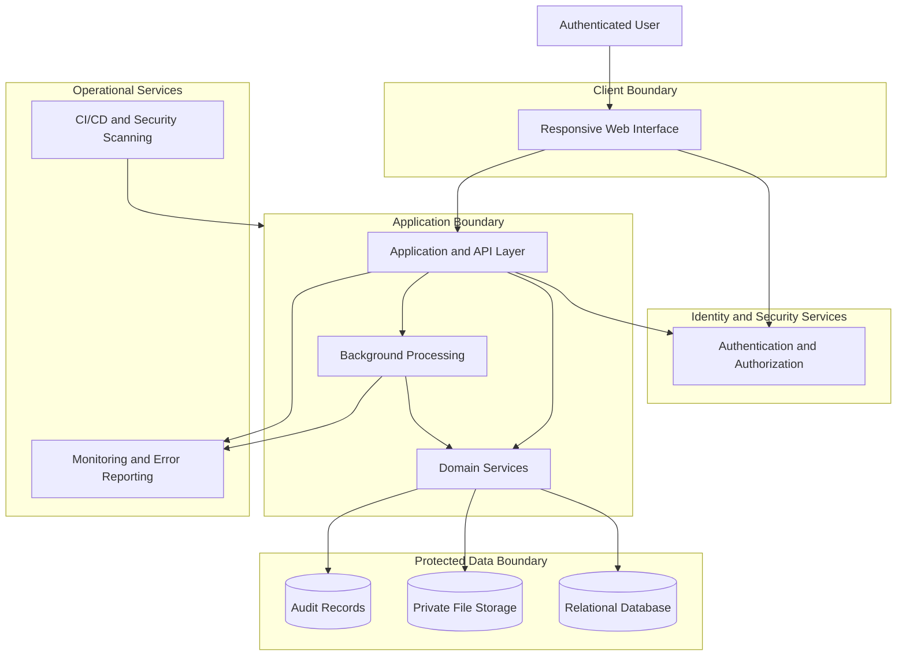
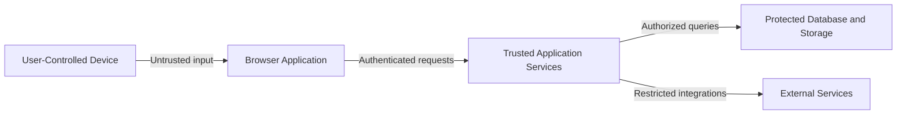
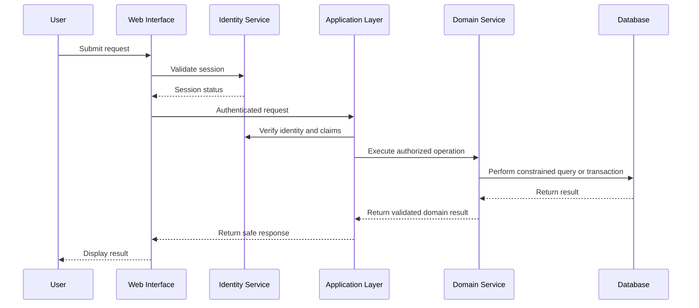
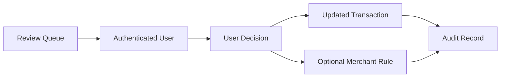
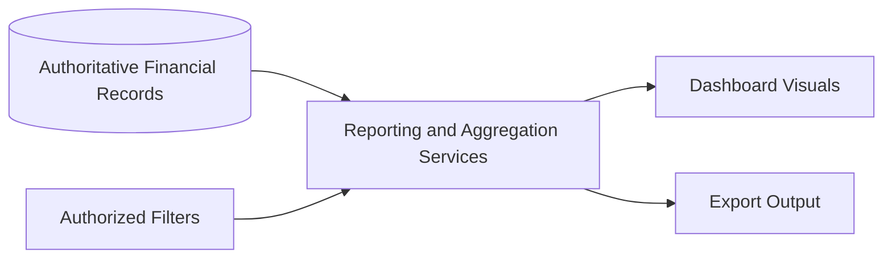

# System Architecture

**Project:** Financial Operating System

**Internal Codename:** Athena

**Document Version:** 1.0.0

**Status:** Draft

**Owner:** Caitlin Gillum

**Primary Architect:** Caitlin Gillum

**Technical Advisor:** OpenAI ChatGPT

**Last Updated:** July 26, 2026

---

## Table of Contents

- [Purpose](#purpose)
- [Scope](#scope)
- [System Context](#system-context)
- [Architecture Overview](#architecture-overview)
- [Major System Components](#major-system-components)
  - [User Interface](#user-interface)
  - [Application and API Layer](#application-and-api-layer)
  - [Domain Services](#domain-services)
  - [Data Persistence](#data-persistence)
  - [File Storage](#file-storage)
  - [Authentication and Authorization](#authentication-and-authorization)
  - [Audit and Observability](#audit-and-observability)
  - [Background Processing](#background-processing)
- [Primary Domain Modules](#primary-domain-modules)
- [Trust Boundaries](#trust-boundaries)
- [Primary Data Flows](#primary-data-flows)
  - [Authenticated Application Request](#authenticated-application-request)
  - [CSV Import](#csv-import)
  - [Transaction Review](#transaction-review)
  - [Dashboard and Reporting](#dashboard-and-reporting)
- [Security Architecture](#security-architecture)
- [Data Integrity](#data-integrity)
- [Failure and Recovery](#failure-and-recovery)
- [Scalability and Extensibility](#scalability-and-extensibility)
- [Deployment Model](#deployment-model)
- [Requirement Traceability](#requirement-traceability)
- [Architectural Constraints](#architectural-constraints)
- [Deferred Decisions](#deferred-decisions)
- [Related Documents](#related-documents)
- [Revision History](#revision-history)

---

## Purpose

This document defines the high-level system architecture for Project Athena.

It describes the major components of the Financial Operating System, their responsibilities, their relationships, and the security boundaries that govern communication between them.

This document provides the architectural foundation for more detailed documentation covering application structure, frontend design, backend services, database design, deployment, security, and data flow.

---

## Scope

This document covers:

- System-level components
- Logical architecture
- Component responsibilities
- Trust boundaries
- High-level data flows
- Security responsibilities
- Data integrity expectations
- Failure handling
- Scalability and extensibility
- Requirement traceability

This document does not define:

- Final technology selections
- Database tables or columns
- API endpoint specifications
- User interface layouts
- Deployment-provider configuration
- Source-code organization
- Detailed authentication flows
- Detailed threat mitigations

Those concerns will be documented separately.

---

## System Context

Athena is a private, authenticated financial platform that allows a user to import, organize, analyze, and manage personal financial information.

The system receives financial data primarily through user-provided CSV files in Version 1. Athena validates and normalizes the data, detects duplicates and transfers, applies deterministic categorization rules, identifies records requiring review, stores authoritative financial records, and generates financial reports and visualizations.

Athena also manages:

- Budgets
- Recurring bills
- Debts
- Assets
- Liabilities
- Net worth
- Financial goals
- Legal expenses
- Medical expenses
- Child support obligations and payments
- Audit history
- Import history

---

## Architecture Overview

Athena uses a layered architecture with clearly separated responsibilities.

The system is divided into the following major areas:

- Client presentation
- Application and API handling
- Domain-specific business logic
- Persistent data storage
- Private file storage
- Authentication and authorization
- Audit logging and observability
- Background processing
- Deployment and security automation

---

## Major System Components

### User Interface

The user interface provides authenticated access to Athena's financial features.

Responsibilities include:

- Authentication interaction
- Account navigation
- CSV upload
- Transaction review
- Budget management
- Debt tracking
- Asset and liability management
- Goal tracking
- Dashboard visualization
- Report filtering
- Data export requests
- Error and validation feedback

The user interface shall not contain authoritative financial business logic.

Client-side calculations may improve responsiveness, but authoritative values must be produced or verified by trusted application services.

### Application and API Layer

The application and API layer receives authenticated requests and coordinates system operations.

Responsibilities include:

- Request validation
- Authentication verification
- Authorization enforcement
- Input sanitization
- Domain-service orchestration
- Response formatting
- Rate limiting where appropriate
- Error handling
- Audit-event initiation
- Background-job submission

This layer shall not bypass domain validation or directly expose unrestricted database access to the client.

### Domain Services

Domain services contain Athena's authoritative financial and business logic.

Responsibilities include:

- Transaction normalization
- Duplicate detection
- Internal transfer detection
- Merchant recognition
- Deterministic categorization
- Budget calculations
- Debt calculations
- Net worth calculations
- Financial goal calculations
- Reporting aggregation
- Import reconciliation
- Review-queue management
- Data-export preparation

Domain services must remain deterministic, testable, and independent of presentation concerns.

### Data Persistence

The persistent data layer stores Athena's authoritative structured records.

The primary data store shall support:

- Relational integrity
- Transactions
- Constraints
- Indexing
- Historical records
- Auditing
- User-level data isolation
- Backup and recovery
- Schema migrations

Structured financial records shall not depend on spreadsheets or unvalidated files as the authoritative source after import.

### File Storage

Private file storage may retain approved source files or supporting documents when required.

Potential file types include:

- Imported CSV files
- Receipts
- Financial statements
- Legal invoices
- Medical invoices
- Data exports

File storage must:

- Remain private by default
- Enforce authenticated access
- Avoid publicly accessible object URLs
- Apply user ownership controls
- Support retention and deletion rules
- Avoid storing unnecessary sensitive files

Version 1 may delete source CSV files after successful processing if retention is not required.

### Authentication and Authorization

Authentication confirms user identity.

Authorization determines which actions and records the authenticated user may access.

Responsibilities include:

- Secure login
- Session management
- Multi-factor authentication support
- User ownership enforcement
- Row-level data isolation
- Restricted administrative operations
- Secure logout
- Session expiration
- Protection against unauthorized resource access

Authentication alone is not sufficient. Every protected operation must also enforce authorization.

### Audit and Observability

Audit logging records significant actions affecting financial data or system configuration.

Operational observability records application health without exposing sensitive information.

Audit responsibilities include:

- Recording imports
- Recording edits
- Recording deletions
- Recording categorization changes
- Recording budget changes
- Recording debt-balance updates
- Recording asset and liability updates
- Recording security-relevant events
- Identifying the actor and timestamp
- Preserving previous and resulting states where appropriate

Observability responsibilities include:

- Application errors
- Failed background jobs
- Service availability
- Performance metrics
- Security alerts
- Deployment health

Financial values, account details, and sensitive descriptions must not be written to general application logs unless explicitly required and safely protected.

### Background Processing

Background processing handles operations that should not block interactive user requests.

Potential responsibilities include:

- Large CSV imports
- Report generation
- Data exports
- Monthly snapshot creation
- Scheduled calculations
- Backup verification
- Notification generation
- Future financial-institution synchronization

Background jobs must be:

- Authenticated or system-authorized
- Idempotent where practical
- Retry-safe
- Observable
- Auditable
- Protected against duplicate execution

---

## Primary Domain Modules

Athena shall be organized around clear financial domains.

| Domain Module | Responsibility |
|---|---|
| Accounts | Financial-account metadata and ownership |
| Imports | File ingestion, validation, and processing history |
| Transactions | Authoritative financial transaction records |
| Merchants | Merchant normalization and recognition |
| Categorization | Categories, subcategories, and deterministic rules |
| Review Queue | Ambiguous or failed records requiring user action |
| Budgets | Zero-based budgets, category allocations, and rollovers |
| Bills | Recurring obligations and due-date tracking |
| Debts | Debt balances, rates, payments, and payoff calculations |
| Assets | Asset balances and valuation history |
| Net Worth | Asset and liability aggregation over time |
| Goals | Financial targets and progress |
| Reports | Financial aggregation, filtering, and export |
| Legal | Legal-expense classification and reporting |
| Medical | Medical-expense classification and reporting |
| Child Support | Obligations, payments, and outstanding balances |
| Audit | Immutable or protected history of significant actions |
| Identity | Authentication, ownership, and authorization |

Domain boundaries may evolve through documented architectural decisions.

---

## Trust Boundaries

Athena contains multiple trust boundaries that must be treated differently.

### User-Controlled Device Boundary

All input from the browser or uploaded files must be treated as untrusted.

This includes:

- Form values
- Query parameters
- Route parameters
- CSV files
- Filenames
- File metadata
- Imported transaction descriptions
- Client-generated identifiers

### Client-to-Application Boundary

The application must independently verify:

- Authentication
- Authorization
- Input validity
- Resource ownership
- Request intent

Client-side validation improves usability but does not provide security.

### Application-to-Data Boundary

Database and storage access must use:

- Least-privilege roles
- Ownership enforcement
- Parameterized operations
- Schema constraints
- Transactional updates
- Audited privileged actions

### External-Service Boundary

Third-party services must be treated as separate trust domains.

External integrations require:

- Documented data sharing
- Minimal permissions
- Secrets protection
- Failure handling
- Vendor-risk consideration
- Explicit architectural approval

---

## Primary Data Flows

### Authenticated Application Request

### CSV Import

```mermaid
flowchart LR
    Upload[CSV Upload]
    Validate[File Validation]
    Parse[Source-Specific Parsing]
    Normalize[Transaction Normalization]
    Fingerprint[Duplicate Fingerprinting]
    Transfer[Transfer Detection]
    Rules[Merchant and Category Rules]
    Review[Review Queue]
    Persist[Authoritative Persistence]
    Audit[Import Audit Record]

    Upload --> Validate
    Validate --> Parse
    Parse --> Normalize
    Normalize --> Fingerprint
    Fingerprint --> Transfer
    Transfer --> Rules
    Rules --> Review
    Rules --> Persist
    Review --> Persist
    Persist --> Audit
```

The import pipeline must prevent partially processed records from silently entering the authoritative transaction store.

### Transaction Review

User review must preserve the original imported values while recording the resulting classification and source of the decision.

### Dashboard and Reporting

Dashboards and reports must derive from authoritative records rather than duplicated manually maintained totals.

---

## Security Architecture

Athena's high-level security model includes:

- Authenticated access
- Multi-factor authentication capability
- Server-side authorization
- Row-level data isolation
- Least-privilege database access
- Private object storage
- Input validation
- Secure file handling
- Secrets management
- Audit logging
- Dependency scanning
- Static analysis
- Secret scanning
- Secure deployment pipelines
- Protected production configuration
- Sanitized error reporting
- Data minimization
- Export and deletion controls

Detailed security architecture will be documented separately.

---

## Data Integrity

Financial data integrity shall be protected through multiple controls.

These include:

- Schema validation
- Database constraints
- Referential integrity
- Transactional writes
- Deterministic calculations
- Duplicate fingerprints
- Import records
- Idempotent processing
- Audit history
- Controlled edits
- Backup verification
- Reconciliation workflows

Original imported values should remain distinguishable from user-supplied metadata and later corrections.

Material financial updates should not leave the system in a partially completed state.

---

## Failure and Recovery

Athena shall fail safely and visibly.

Failure-handling expectations include:

- Rejecting malformed files
- Preventing partial imports
- Rolling back incomplete database transactions
- Returning non-sensitive error messages
- Recording failed import status
- Supporting safe retries
- Preventing duplicate retry effects
- Preserving diagnostic identifiers
- Alerting on failed background jobs
- Supporting restoration from verified backups

A failed operation must not silently produce authoritative financial records.

---

## Scalability and Extensibility

Version 1 is designed for a single authenticated account owner, but the architecture should avoid assumptions that prevent future expansion.

Potential future capabilities include:

- Multi-user households
- Shared financial permissions
- Direct financial-institution integration
- Receipt processing
- Advanced analytics
- Optional AI assistance
- Investment tracking
- Tax-reporting support
- Notification services
- Additional currencies
- Native mobile clients

Extensibility must not justify unnecessary Version 1 complexity.

The system shall optimize for the current requirements while preserving clear module boundaries and migration paths.

---

## Deployment Model

Athena is expected to use a cloud-hosted deployment model with separate development and production environments.

The conceptual deployment includes:

- Web application hosting
- Trusted server-side application execution
- Managed relational database
- Managed identity service
- Private object storage
- Continuous integration
- Automated security scanning
- Environment-specific secrets
- Monitoring and error reporting
- Backup and recovery services

Specific providers and technologies require separate Architecture Decision Records before acceptance.

---

## Requirement Traceability

| Architectural Area | Related Requirements |
|---|---|
| CSV import pipeline | FR-001 through FR-005, FR-030 |
| Transaction management | FR-006 through FR-010 |
| Budget module | FR-011 through FR-013 |
| Reporting services | FR-014 through FR-017 |
| Debt module | FR-018 through FR-019 |
| Asset and net worth modules | FR-020 through FR-022 |
| Goal module | FR-023 through FR-024 |
| Identity and access controls | FR-025 through FR-027 |
| Export and recovery | FR-028 through FR-030 |
| AI assistance boundary | FR-031 |
| Security architecture | NFR-001 through NFR-004 |
| Data integrity and recovery | NFR-005 through NFR-007 |
| Performance | NFR-008 through NFR-009 |
| Maintainability and testing | NFR-010 through NFR-012 |
| Scalability and extensibility | NFR-013 through NFR-014 |
| Usability | NFR-015 through NFR-016 |
| Ownership and transparency | NFR-017 through NFR-018 |
| Engineering practices | NFR-019 through NFR-020 |

---

## Architectural Constraints

Version 1 is subject to the following constraints:

- One authenticated account owner
- U.S. dollars as the operating currency
- CSV-based financial transaction ingestion
- No direct payment execution
- No autonomous financial decision-making
- No public commercial onboarding
- No direct investment trading
- No native mobile application
- No authoritative AI-controlled accounting
- No real financial data in the public repository

These constraints may be revised only through documented requirements and architectural decisions.

---

## Deferred Decisions

The following decisions remain intentionally open:

- Frontend framework
- Application framework
- Database platform
- Authentication provider
- Object-storage provider
- Hosting platform
- Background-job infrastructure
- ORM or database-access strategy
- Monitoring provider
- Error-reporting provider
- Data-retention duration
- CSV source-file retention
- Backup frequency
- Production-region selection
- AI provider
- Direct bank-integration provider

Each significant selection shall be evaluated and documented through an ADR.

---

## Related Documents

- docs/product-requirements.md
- docs/architecture/README.md
- docs/architecture/engineering-principles.md
- docs/adr/README.md
- docs/adr/0001-athena-codename.md

---

## Revision History

| Version | Date | Author | Summary |
|---|---|---|---|
| 1.0.0 | 2026-07-26 | Caitlin Gillum | Defined Athena's high-level system architecture, major components, trust boundaries, primary data flows, security responsibilities, and architectural constraints. |