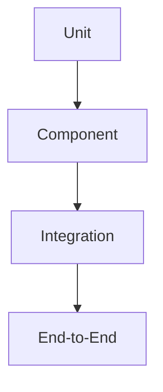
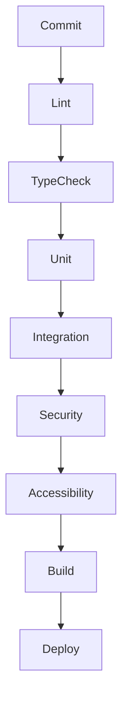

# Testing Architecture

**Project:** Financial Operating System

**Internal Codename:** Athena

**Document Version:** 1.0.0

**Status:** Draft

**Owner:** Caitlin Gillum

**Primary Architect:** Caitlin Gillum

**Technical Advisor:** OpenAI ChatGPT

**Last Updated:** July 30, 2026

---

# Table of Contents

- Purpose
- Scope
- Testing Philosophy
- Objectives
- Guiding Principles
- Definitions
- Testing Strategy
- Testing Pyramid
- Quality Gates
- Test Ownership
- Test Environments
- Test Data Strategy
- Synthetic Data Requirements
- Fixtures and Factories
- Unit Testing
- Component Testing
- Integration Testing
- Contract Testing
- Server Action Testing
- Route Handler Testing
- Repository Testing
- Database Testing
- Migration Testing
- Row Level Security Testing
- Authentication Testing
- Authorization Testing
- Validation Testing
- Domain Model Testing
- Financial Calculation Testing
- Transaction Integrity Testing
- Import Pipeline Testing
- Duplicate Detection Testing
- Merchant Normalization Testing
- Classification Engine Testing
- Review Queue Testing
- Budget Testing
- Reporting Testing
- Export Testing
- Background Job Testing
- Notification Testing
- Storage Testing
- AI Workflow Testing
- Concurrency Testing
- Idempotency Testing
- Recovery Testing
- Reconciliation Testing
- Error Handling Testing
- Observability Testing
- Accessibility Testing
- Cross Browser Testing
- Performance Testing
- Load Testing
- Stress Testing
- Security Testing
- Dependency Testing
- Continuous Integration
- Coverage Strategy
- Release Validation
- Definition of Done
- Requirement Traceability
- Deferred Decisions
- Related Documents
- Revision History

---

# Purpose

This document defines the Testing Architecture for Project Athena.

Testing provides confidence that the platform behaves correctly under normal, exceptional, and adverse conditions while preserving financial integrity, security, privacy, reliability, accessibility, and performance.

Testing exists to verify:

- Functional correctness
- Financial correctness
- Data integrity
- Security controls
- Privacy protections
- Reliability
- Availability
- Accessibility
- Performance
- Regression prevention

The central principle of this architecture is:

> Every critical workflow shall be verifiable before it reaches production.

---

# Scope

This document applies to:

- Browser interface
- React components
- Next.js application
- Server Actions
- Route Handlers
- Application services
- Domain services
- Repository layer
- PostgreSQL
- Supabase
- Row Level Security
- Storage
- Imports
- Financial workflows
- Background jobs
- Notifications
- Reports
- Dashboards
- AI-assisted workflows
- Authentication
- Authorization
- Deployment validation
- CI/CD pipeline

---

# Testing Philosophy

Testing is an architectural responsibility rather than an implementation afterthought.

Athena assumes:

- Bugs will exist.
- Dependencies will fail.
- Users will submit invalid data.
- Networks will become unreliable.
- Concurrent updates will occur.
- External providers will degrade.
- Human error will introduce regressions.

Testing reduces risk through repeatable verification.

Testing should prove correctness—not simply increase code coverage.

---

# Objectives

The testing architecture shall provide:

- Early defect detection
- Regression prevention
- Financial integrity validation
- Security verification
- Repeatable automation
- Fast developer feedback
- Production confidence
- Safe refactoring
- Deterministic testing
- Clear ownership

---

# Guiding Principles

Athena shall follow these principles:

1. Test behavior instead of implementation details.
2. Prefer automated tests.
3. Keep tests deterministic.
4. Isolate failures.
5. Test financial correctness before presentation.
6. Test authorization on every protected workflow.
7. Test rollback behavior.
8. Test unhappy paths.
9. Test observability.
10. Use synthetic data only.
11. Keep tests maintainable.
12. Fail fast.
13. Avoid flaky tests.
14. Verify accessibility.
15. Verify security continuously.
16. Test deployments before release.
17. Every bug should produce a regression test.
18. Every financial mutation must be verifiable.
19. Every retry mechanism must be tested.
20. Every release must pass the complete quality gate.

---

# Definitions

## Unit Test

Verifies one isolated unit of behavior.

## Component Test

Verifies a UI component in isolation.

## Integration Test

Verifies collaboration between multiple layers.

## Contract Test

Verifies interface compatibility.

## End-to-End Test

Verifies complete user workflows.

## Regression Test

Prevents previously fixed defects from returning.

## Fixture

Reusable predefined test data.

## Factory

Creates synthetic objects for tests.

## Mock

Controlled replacement for an external dependency.

## Stub

Provides predetermined responses.

## Fake

Working simplified implementation for testing.

---

# Testing Strategy

Athena uses multiple complementary testing layers.



Higher layers verify user behavior.

Lower layers verify correctness and business logic.

---

# Testing Pyramid

The majority of tests should exist at the unit and integration layers.

```
                End-to-End
             Integration
        Component Testing
         Unit Testing
```

The architecture intentionally avoids relying primarily on end-to-end testing.

---

# Quality Gates

Every pull request should satisfy:

- Formatting passes
- Linting passes
- Type checking passes
- Unit tests pass
- Integration tests pass
- Database tests pass
- Security tests pass
- Accessibility tests pass
- Critical end-to-end tests pass
- Build succeeds

Production deployment shall not proceed if required quality gates fail.

---

# Test Ownership

| Layer | Primary Responsibility |
|----------|-----------------------|
| UI | Component & accessibility tests |
| Application | Integration tests |
| Domain | Business logic tests |
| Repository | Database tests |
| Infrastructure | Deployment & environment tests |
| Security | Authorization & RLS tests |

Each feature owner is responsible for maintaining associated tests.

---

# Test Environments

Athena should distinguish:

- Local development
- CI environment
- Preview deployment
- Staging
- Production validation

Production tests must never modify real financial records.

---

# Test Data Strategy

Testing shall use only synthetic data.

Synthetic datasets should include:

- Accounts
- Transactions
- Budgets
- Bills
- Debts
- Assets
- Imports
- Reports
- Review queues

No production financial data shall be used.

---

# Synthetic Data Requirements

Synthetic data should:

- Be realistic
- Be repeatable
- Avoid PII
- Cover edge cases
- Support concurrency testing
- Support duplicate testing

---

# Fixtures and Factories

Fixtures should provide reusable baseline datasets.

Factories should generate:

- Transactions
- Accounts
- Imports
- Budgets
- Reports
- Notifications

Factories should support deterministic overrides.

---

# Unit Testing

Unit tests verify:

- Utility functions
- Domain calculations
- Validation
- Formatting
- Classification rules
- Retry logic
- Error translation

Unit tests should be:

- Fast
- Independent
- Deterministic

---

# Component Testing

Verify:

- Rendering
- States
- Loading
- Empty states
- Error states
- Accessibility
- User interaction

---

# Integration Testing

Verify:

- UI → Server Actions
- Application → Repository
- Repository → Database
- Background jobs
- Authentication flow
- Authorization flow

---

# Contract Testing

Verify compatibility between:

- Frontend
- Backend
- External providers
- Internal services

---

# Server Action Testing

Verify:

- Validation
- Authorization
- Successful execution
- Error handling
- Rollback
- Idempotency

---

# Route Handler Testing

Verify:

- Authentication
- Authorization
- Validation
- Response status
- Error responses

---

# Repository Testing

Verify:

- Queries
- Transactions
- Constraint handling
- Error translation

---

# Database Testing

Verify:

- Constraints
- Relationships
- Indexes
- Transactions
- Rollbacks

---

# Migration Testing

Every migration shall be tested for:

- Forward migration
- Rollback
- Existing data preservation

---

# Row Level Security Testing

Every policy should verify:

- Owner access
- Cross-owner denial
- Anonymous denial
- Administrative behavior

No production feature should bypass RLS.

---

# Authentication Testing

Verify:

- Login
- Logout
- Expired sessions
- Invalid sessions
- Session refresh

---

# Authorization Testing

Verify every protected action:

- Read
- Create
- Update
- Delete
- Export
- Import

Cross-owner access shall always fail.

---

# Validation Testing

Verify:

- Required fields
- Invalid types
- Invalid formats
- Length limits
- Monetary precision

---

# Domain Model Testing

Verify:

- Business invariants
- State transitions
- Transfer rules
- Budget rules
- Debt rules

---

# Financial Calculation Testing

Verify:

- Balances
- Budget totals
- Spending
- Income
- Cash flow
- Net worth
- Debt payoff
- Goal progress

Financial calculations require deterministic expected values.

---

# Transaction Integrity Testing

Verify:

- Commit
- Rollback
- Partial failures
- Duplicate prevention
- Concurrency

Financial mutations must never partially commit.

---

# Import Pipeline Testing

Verify:

- Upload
- Parsing
- Validation
- Duplicate detection
- Review generation
- Classification
- Persistence

---

# Duplicate Detection Testing

Verify:

- Exact duplicate
- Near duplicate
- Different owner
- Legitimate repeat transaction

---

# Merchant Normalization Testing

Verify consistent normalization across equivalent merchant names.

---

# Classification Engine Testing

Verify:

- Rules
- AI suggestions
- Overrides
- Confidence thresholds

---

# Review Queue Testing

Verify:

- Creation
- Resolution
- Conflict handling
- Audit logging

---

# Budget Testing

Verify:

- Budget creation
- Updates
- Spending calculations
- Remaining balance

---

# Reporting Testing

Verify:

- Accuracy
- Filters
- Date ranges
- Totals
- Export consistency

---

# Export Testing

Verify:

- File generation
- Authorization
- Expiration
- Download permissions

---

# Background Job Testing

Verify:

- Queue execution
- Retry
- Failure
- Dead-letter
- Idempotency

---

# Notification Testing

Verify:

- Creation
- Retry
- Failure
- Duplicate prevention

---

# Storage Testing

Verify:

- Upload
- Download
- Permissions
- Cleanup

---

# AI Workflow Testing

Verify:

- Prompt validation
- Response validation
- Unsafe output rejection
- Manual fallback

---

# Concurrency Testing

Verify:

- Simultaneous updates
- Version conflicts
- Duplicate submissions
- Lock contention

---

# Idempotency Testing

Verify repeated requests produce one financial outcome.

---

# Recovery Testing

Verify:

- Retry
- Restart
- Resume processing

---

# Reconciliation Testing

Verify:

- Missing records
- Orphaned files
- Import recovery
- Export recovery

---

# Error Handling Testing

Verify:

- Error translation
- User messages
- Logging
- Retry logic
- Rollback

---

# Observability Testing

Verify:

- Logs
- Metrics
- Traces
- Correlation IDs
- Redaction
- Alert generation

---

# Accessibility Testing

Verify:

- Keyboard navigation
- Screen readers
- Focus management
- Contrast
- ARIA labels

---

# Cross Browser Testing

Verify supported browsers render and behave consistently.

---

# Performance Testing

Measure:

- Response time
- Query latency
- Dashboard load
- Import duration

---

# Load Testing

Verify behavior under expected production load.

---

# Stress Testing

Verify graceful degradation beyond expected capacity.

---

# Security Testing

Verify:

- SQL injection resistance
- XSS protection
- CSRF protection
- Authorization
- Authentication
- RLS
- File upload validation
- Secret handling

---

# Dependency Testing

Verify failures of:

- Database
- Storage
- AI provider
- Notification provider

---

# Continuous Integration

Every commit should automatically execute:



---

# Coverage Strategy

Coverage should emphasize:

- Critical workflows
- Financial mutations
- Security controls

Coverage percentage alone is not a quality metric.

---

# Release Validation

Every release should verify:

- Build
- Tests
- Database migration
- Deployment health
- Smoke tests
- Observability

---

# Definition of Done

A feature is complete when:

- Requirements implemented
- Tests written
- Documentation updated
- CI passes
- Security reviewed
- Accessibility verified
- Performance acceptable

---

# Requirement Traceability

Testing shall verify every functional and non-functional requirement defined in the Product Requirements.

---

# Deferred Decisions

Deferred:

- Testing framework selection
- Coverage thresholds
- Browser support matrix
- Load testing provider
- Security scanning tools
- Performance tooling
- CI provider configuration
- Test reporting platform

---

# Related Documents

- Product Requirements
- Backend Architecture
- Database Architecture
- Security Architecture
- Error Handling Strategy
- Observability Architecture

---

# Revision History

| Version | Date | Summary |
|----------|------|---------|
|1.0.0|July 30, 2026|Initial Testing Architecture|