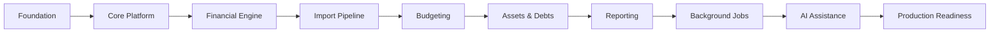
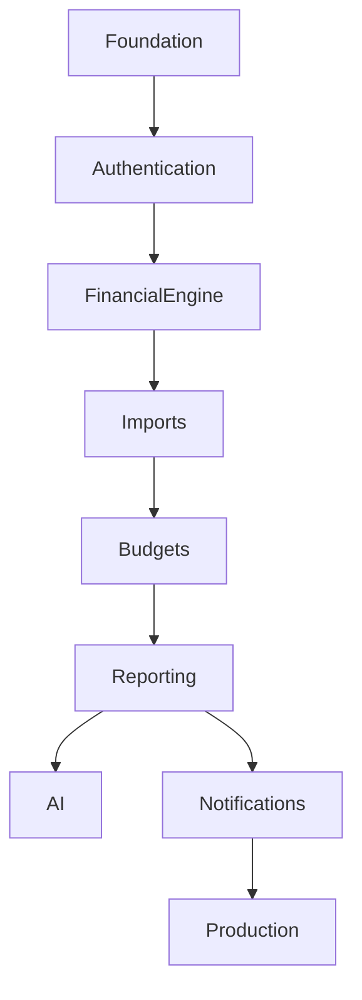

# Implementation Roadmap

**Project:** Financial Operating System

**Internal Codename:** Athena

**Document Version:** 1.0.0

**Status:** Draft

**Owner:** Caitlin Gillum

**Primary Architect:** Caitlin Gillum

**Technical Advisor:** OpenAI ChatGPT

**Last Updated:** July 30, 2026

---

# Table of Contents

- Purpose
- Scope
- Roadmap Philosophy
- Guiding Principles
- Success Criteria
- Delivery Strategy
- Phase Overview
- Phase 0 — Foundation
- Phase 1 — Core Platform
- Phase 2 — Financial Engine
- Phase 3 — Import Pipeline
- Phase 4 — Budgeting
- Phase 5 — Assets, Debts, and Net Worth
- Phase 6 — Reporting and Dashboards
- Phase 7 — Notifications and Background Jobs
- Phase 8 — AI Assistance
- Phase 9 — Hardening and Production Readiness
- Cross-Cutting Workstreams
- Risk Management
- Dependency Map
- Milestones
- Definition of Complete
- Deferred Work
- Requirement Traceability
- Related Documents
- Revision History

---

# Purpose

This roadmap defines the implementation strategy for Project Athena.

It translates the architecture into an incremental delivery plan that prioritizes correctness, maintainability, financial integrity, and production readiness.

The roadmap intentionally favors stable, iterative delivery over rapid feature accumulation.

---

# Scope

The roadmap covers the implementation of:

- Platform foundation
- Authentication and authorization
- Financial domain
- Imports
- Budgeting
- Assets and liabilities
- Reporting
- Background processing
- Notifications
- AI-assisted workflows
- Operational readiness

---

# Roadmap Philosophy

Athena will be developed in vertical slices.

Each phase should produce working, testable software.

No phase should depend on unfinished assumptions from later phases.

The architecture should guide implementation rather than evolve in response to incomplete code.

---

# Guiding Principles

1. Build the foundation before features.
2. Deliver working software continuously.
3. Preserve financial correctness.
4. Avoid unnecessary complexity.
5. Maintain architectural boundaries.
6. Keep every phase deployable.
7. Test continuously.
8. Document alongside implementation.
9. Minimize technical debt.
10. Never sacrifice correctness for speed.

---

# Success Criteria

The implementation is considered successful when:

- All Product Requirements are implemented.
- Architectural principles remain intact.
- Automated testing verifies critical workflows.
- Security controls are enforced.
- Observability is operational.
- Documentation reflects implementation.
- Production deployment is repeatable.

---

# Delivery Strategy

Athena will be delivered through incremental phases.

Each phase should include:

- Planning
- Development
- Testing
- Documentation
- Review
- Deployment readiness

No phase is considered complete until all quality gates pass.

---

# Phase Overview

---

# Phase 0 — Foundation

Objectives:

- Initialize repository
- Configure Next.js
- Configure TypeScript
- Configure Supabase
- Configure PostgreSQL
- Configure authentication
- Configure CI
- Configure linting
- Configure formatting
- Configure testing framework
- Configure deployment

Deliverable:

A deployable skeleton application.

---

# Phase 1 — Core Platform

Implement:

- Authentication
- Authorization
- User profile
- Layout
- Navigation
- Design system
- Error boundaries
- Logging
- Observability

Deliverable:

Secure authenticated platform.

---

# Phase 2 — Financial Engine

Implement:

- Accounts
- Transactions
- Categories
- Transfers
- Reimbursements
- Financial calculations

Deliverable:

Core financial ledger.

---

# Phase 3 — Import Pipeline

Implement:

- CSV import
- Parsing
- Validation
- Duplicate detection
- Merchant normalization
- Classification
- Review queue

Deliverable:

Reliable transaction ingestion.

---

# Phase 4 — Budgeting

Implement:

- Budgets
- Budget categories
- Monthly rollover
- Spending analysis
- Progress tracking

Deliverable:

Complete budgeting workflow.

---

# Phase 5 — Assets, Debts, and Net Worth

Implement:

- Assets
- Liabilities
- Debt payoff
- Goal tracking
- Net worth calculations

Deliverable:

Financial position tracking.

---

# Phase 6 — Reporting and Dashboards

Implement:

- Dashboard
- Analytics
- Trends
- Cash flow
- Reports
- Exports

Deliverable:

Executive financial reporting.

---

# Phase 7 — Notifications and Background Jobs

Implement:

- Scheduled jobs
- Notifications
- Retry logic
- Queue processing
- Maintenance jobs

Deliverable:

Automated operational workflows.

---

# Phase 8 — AI Assistance

Implement:

- AI categorization
- Spending insights
- Natural language assistance
- Recommendation engine

AI remains advisory.

Users remain authoritative.

Deliverable:

AI-assisted financial management.

---

# Phase 9 — Hardening and Production Readiness

Activities:

- Performance tuning
- Security review
- Accessibility audit
- Penetration testing
- Load testing
- Documentation review
- Disaster recovery validation

Deliverable:

Production-ready platform.

---

# Cross-Cutting Workstreams

The following activities continue throughout all phases:

- Documentation
- Testing
- Security
- Observability
- Dependency updates
- Performance monitoring
- Refactoring
- Technical debt management

---

# Risk Management

Key risks include:

- Financial calculation defects
- Data integrity issues
- Security vulnerabilities
- Scope expansion
- Performance bottlenecks
- Dependency changes

Mitigation:

- Incremental delivery
- Automated testing
- Code reviews
- Architecture reviews
- Continuous integration

---

# Dependency Map

---

# Milestones

| Milestone | Outcome |
|-----------|---------|
| Foundation Complete | Deployable application skeleton |
| Core Platform Complete | Secure authenticated application |
| Financial Engine Complete | Financial transactions operational |
| Import Pipeline Complete | Automated transaction ingestion |
| Budgeting Complete | Budget management available |
| Net Worth Complete | Asset and liability tracking |
| Reporting Complete | Dashboards and exports available |
| Automation Complete | Background processing operational |
| AI Complete | AI assistance available |
| Production Complete | Version 1.0 release candidate |

---

# Definition of Complete

Athena Version 1.0 is complete when:

- Product Requirements satisfied
- Architecture implemented
- Testing complete
- Documentation complete
- CI operational
- Security validated
- Performance acceptable
- Accessibility verified
- Production deployment successful

---

# Deferred Work

Future roadmap items include:

- Mobile applications
- Multi-user collaboration
- Open Banking integrations
- Investment tracking
- Tax planning
- Predictive analytics
- Plugin architecture
- Public API
- Internationalization

---

# Requirement Traceability

Each implementation phase maps directly to the Product Requirements and architecture documents to ensure complete coverage and architectural consistency.

---

# Related Documents

- Product Requirements
- Engineering Principles
- System Architecture
- Backend Architecture
- Database Architecture
- Security Architecture
- Testing Architecture
- Repository Standards
- Coding Standards

---

# Revision History

| Version | Date | Summary |
|----------|------|---------|
| 1.0.0 | July 30, 2026 | Initial implementation roadmap |