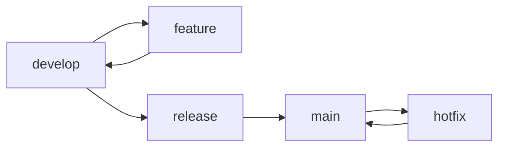

# Repository Standards

**Project:** Financial Operating System

**Internal Codename:** Athena

**Document Version:** 1.0.0

**Status:** Draft

**Owner:** Caitlin Gillum

**Primary Architect:** Caitlin Gillum

**Technical Advisor:** OpenAI ChatGPT

**Last Updated:** July 30, 2026

---

# Table of Contents

- Purpose
- Scope
- Repository Philosophy
- Objectives
- Guiding Principles
- Repository Organization
- Directory Standards
- File Naming Standards
- Folder Naming Standards
- Documentation Standards
- README Standards
- Architecture Documentation Standards
- ADR Standards
- Code Organization
- Feature Organization
- Shared Library Organization
- Configuration Standards
- Environment Variable Standards
- Secrets Management
- Git Strategy
- Branch Naming Standards
- Commit Message Standards
- Pull Request Standards
- Merge Strategy
- Semantic Versioning
- Release Management
- GitHub Labels
- Issue Templates
- Pull Request Templates
- Code Review Standards
- Code Ownership
- Dependency Management
- Generated Files
- Binary Assets
- Database Migration Standards
- Testing Organization
- Automation Standards
- Continuous Integration Expectations
- Repository Security
- Maintenance
- Definition of Ready
- Definition of Done
- Requirement Traceability
- Deferred Decisions
- Related Documents
- Revision History

---

# Purpose

This document defines the repository standards for Project Athena.

It establishes consistent organizational, documentation, version control, and collaboration practices to ensure the repository remains maintainable, scalable, secure, and understandable throughout the project's lifecycle.

The primary goal is consistency.

A contributor should be able to navigate any part of the repository using predictable conventions.

---

# Scope

These standards apply to:

- Source code
- Documentation
- Tests
- Database migrations
- Configuration
- Git workflows
- Pull requests
- Releases
- CI/CD
- Assets
- Generated files
- Dependencies

---

# Repository Philosophy

The repository is a long-term engineering asset.

It should optimize for:

- Readability
- Discoverability
- Maintainability
- Scalability
- Traceability
- Consistency
- Security
- Collaboration

Repository organization should reduce cognitive load rather than simply reflect technical implementation.

---

# Objectives

Athena's repository standards shall:

- Create predictable organization
- Minimize ambiguity
- Support feature growth
- Encourage documentation
- Simplify onboarding
- Improve code reviews
- Reduce merge conflicts
- Enable automation
- Preserve architectural consistency
- Maintain production readiness

---

# Guiding Principles

Athena follows these principles:

1. One responsibility per directory.
2. Organize by feature before technology where appropriate.
3. Prefer explicit over clever.
4. Documentation is part of the repository.
5. Every major decision is documented.
6. Repository structure should scale.
7. Avoid duplication.
8. Keep generated artifacts separate.
9. Secrets never enter version control.
10. Every change should be traceable.

---

# Repository Organization

The repository shall follow a consistent top-level structure.

Example:

```text
app/
components/
lib/
hooks/
types/
public/
tests/
docs/
```

Every directory should have a clearly defined responsibility.

Directories should not become miscellaneous collections of unrelated files.

---

# Directory Standards

Each top-level directory should own a single concern.

Example responsibilities:

| Directory | Responsibility |
|-----------|----------------|
| app | Application routes and layouts |
| components | Shared UI components |
| lib | Shared libraries and utilities |
| hooks | Reusable React hooks |
| types | Shared TypeScript types |
| tests | Automated tests |
| docs | Documentation |
| public | Static assets |

Directories should not overlap in responsibility.

---

# File Naming Standards

Athena uses consistent naming conventions.

General rules:

- lowercase
- kebab-case
- descriptive
- singular where appropriate

Examples:

```text
user-profile.tsx
transaction-table.tsx
repository-standards.md
```

Avoid:

```text
utils2.ts
helpersFinal.ts
new-file.ts
```

---

# Folder Naming Standards

Folders should use:

- lowercase
- kebab-case
- meaningful names

Example:

```text
transaction-import/
```

Avoid generic folders such as:

```text
misc/
temp/
stuff/
new/
```

---

# Documentation Standards

Documentation is treated as production-quality deliverables.

Major documents should include:

- Metadata
- Table of Contents
- Purpose
- Diagrams where appropriate
- Related documents
- Revision history

Documentation should evolve alongside implementation.

---

# README Standards

Every major directory should contain a README when its purpose is not immediately obvious.

READMEs should explain:

- Purpose
- Responsibilities
- Important conventions
- Relationships

---

# Architecture Documentation Standards

Architecture documents shall:

- Describe design decisions
- Avoid implementation details
- Include diagrams
- Remain technology-aware but implementation-independent
- Reference related architecture

Architectural changes should be reviewed before implementation.

---

# ADR Standards

Architecture Decision Records should:

- Capture significant decisions
- Explain rationale
- Document alternatives considered
- Describe consequences
- Remain immutable after acceptance

Superseding decisions require new ADRs.

---

# Code Organization

Code should prioritize feature cohesion.

Avoid scattering implementation across unrelated directories.

A feature should own:

- Components
- Validation
- Types
- Services
- Actions
- Tests

when appropriate.

---

# Feature Organization

Feature modules should keep related files together.

Example:

```text
transactions/

components/

actions/

validation/

types/

services/

tests/
```

This improves discoverability and maintainability.

---

# Shared Library Organization

Shared libraries belong in:

```text
lib/
```

Libraries should:

- Remain reusable
- Avoid business-specific behavior
- Minimize dependencies

---

# Configuration Standards

Configuration files should:

- Be minimal
- Be documented
- Avoid duplication
- Use environment variables when appropriate

---

# Environment Variable Standards

Environment variables shall:

- Use uppercase snake_case
- Be documented
- Be validated during startup
- Never contain secrets in source control

Example:

```text
DATABASE_URL
SUPABASE_URL
```

---

# Secrets Management

Secrets shall never be:

- committed
- logged
- exported
- embedded in source code

Secrets belong in approved secret-management systems.

---

# Git Strategy

Athena follows a structured Git workflow.



---

# Branch Naming Standards

Feature branches:

```text
feature/transaction-import
feature/review-queue
```

Bug fixes:

```text
fix/export-timeout
```

Hotfixes:

```text
hotfix/login-loop
```

Documentation:

```text
docs/testing-architecture
```

Use concise, descriptive names.

---

# Commit Message Standards

Athena follows Conventional Commits.

Examples:

```text
feat:
fix:
docs:
test:
refactor:
perf:
style:
build:
ci:
chore:
```

Examples:

```text
feat: Add transaction review workflow

docs: Define repository standards

fix: Prevent duplicate imports
```

---

# Pull Request Standards

Every PR should include:

- Summary
- Motivation
- Changes
- Testing
- Related requirements
- Related ADRs
- Checklist

Large changes should be split into logical PRs whenever practical.

---

# Merge Strategy

Preferred merge method:

- Squash merge

Benefits:

- Clean history
- One logical commit per feature
- Easier reverts

Main should always remain deployable.

---

# Semantic Versioning

Athena follows Semantic Versioning.

```text
MAJOR.MINOR.PATCH
```

Example:

```text
1.2.3
```

Major:

Breaking changes.

Minor:

Backward-compatible functionality.

Patch:

Bug fixes.

---

# Release Management

Every release should:

- Pass CI
- Pass testing
- Include release notes
- Be tagged
- Preserve traceability

---

# GitHub Labels

Recommended labels:

```text
bug
documentation
enhancement
architecture
security
performance
technical-debt
good-first-issue
help-wanted
```

---

# Issue Templates

Issues should capture:

- Description
- Expected behavior
- Actual behavior
- Reproduction steps
- Priority

---

# Pull Request Templates

Every PR template should request:

- Summary
- Testing
- Documentation updates
- Breaking changes
- Screenshots (when applicable)

---

# Code Review Standards

Reviewers should verify:

- Architecture consistency
- Security
- Readability
- Simplicity
- Testing
- Documentation
- Performance implications

Reviews should explain requested changes rather than simply reject code.

---

# Code Ownership

Every major subsystem should have a clearly identified maintainer.

Ownership includes:

- Architecture
- Documentation
- Testing
- Review

---

# Dependency Management

Dependencies should:

- Solve a real problem
- Be actively maintained
- Be evaluated for security
- Be versioned intentionally

Avoid unnecessary dependencies.

---

# Generated Files

Generated files should:

- Be reproducible
- Remain separate from handwritten code
- Avoid unnecessary version control

---

# Binary Assets

Binary assets should be minimized.

Large binaries should not live in the repository unless required.

---

# Database Migration Standards

Every migration should:

- Be reviewed
- Be tested
- Be reversible where practical
- Preserve data integrity

---

# Testing Organization

Tests should be organized consistently.

Possible organization:

```text
tests/

unit/

integration/

e2e/

fixtures/
```

---

# Automation Standards

Automation should support:

- Linting
- Testing
- Formatting
- Build validation
- Security scanning

Automation should reduce manual effort rather than replace engineering judgment.

---

# Continuous Integration Expectations

Every commit should verify:

```mermaid
flowchart TD

Commit

Lint

Type Check

Tests

Build

Deploy

Commit --> Lint
Lint --> Type Check
Type Check --> Tests
Tests --> Build
Build --> Deploy
```

Broken builds should block merges.

---

# Repository Security

Repository protections should include:

- Branch protection
- Required reviews
- Required status checks
- Secret scanning
- Dependency scanning

---

# Maintenance

Repository maintenance includes:

- Updating dependencies
- Removing obsolete code
- Updating documentation
- Reviewing ADRs
- Monitoring technical debt

Maintenance is continuous.

---

# Definition of Ready

Work is ready when:

- Requirements exist
- Architecture exists
- Acceptance criteria exist
- Dependencies identified
- Risks understood

---

# Definition of Done

Work is complete when:

- Code merged
- Tests passing
- Documentation updated
- CI successful
- Security reviewed
- Deployable

---

# Requirement Traceability

Repository standards support:

- Maintainability
- Security
- Scalability
- Reliability
- Collaboration

---

# Deferred Decisions

Deferred:

- Final branching model
- GitHub Projects workflow
- CODEOWNERS implementation
- Issue template implementation
- Release automation
- Dependency update automation
- Monorepo tooling
- Repository metrics

---

# Related Documents

- Engineering Principles
- System Architecture
- Security Architecture
- Testing Architecture
- Coding Standards

---

# Revision History

| Version | Date | Summary |
|----------|------|---------|
|1.0.0|July 30, 2026|Initial repository standards|